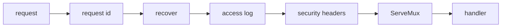
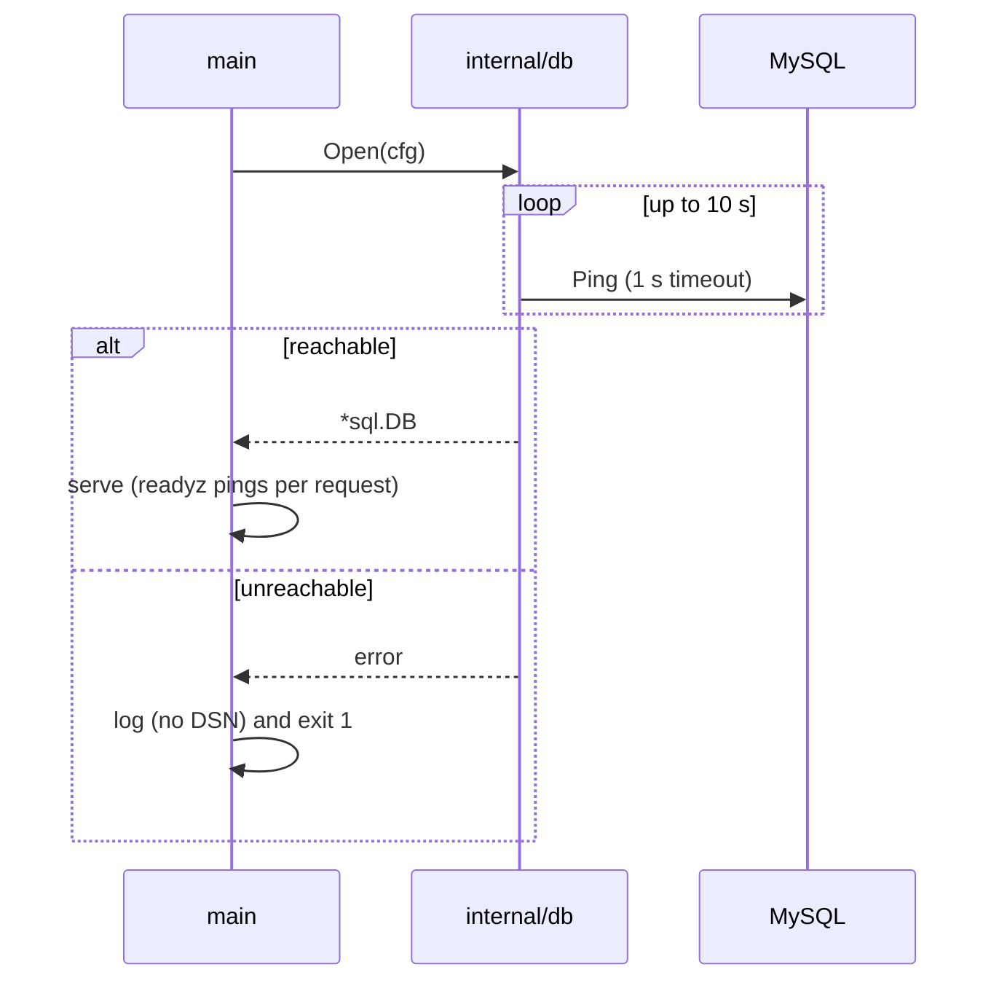
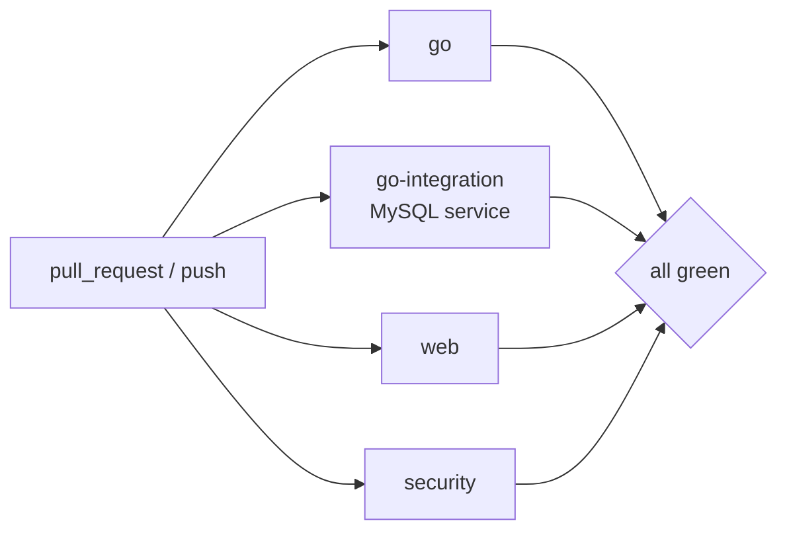
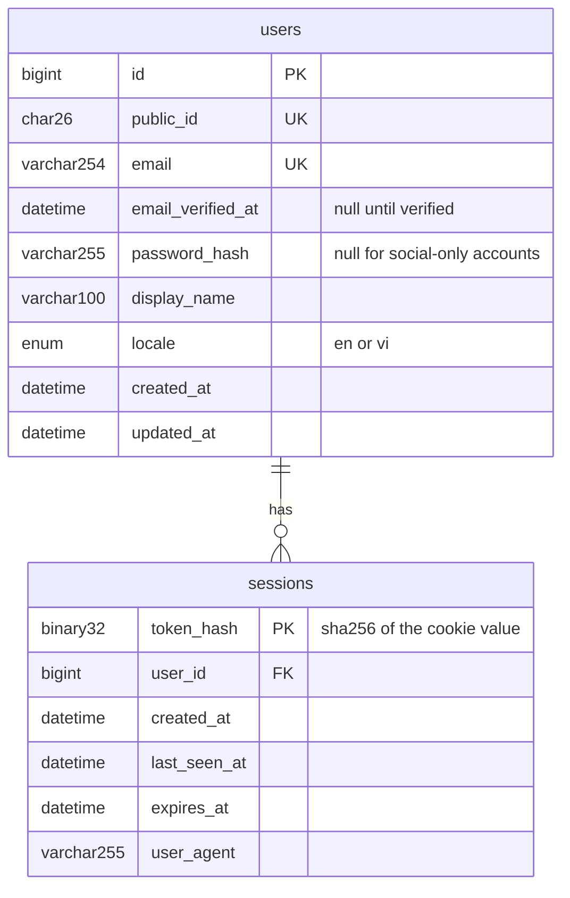
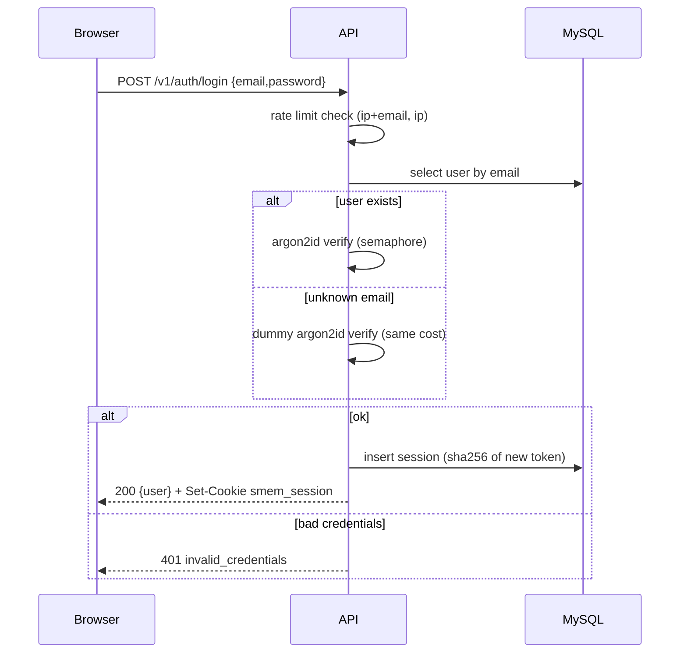
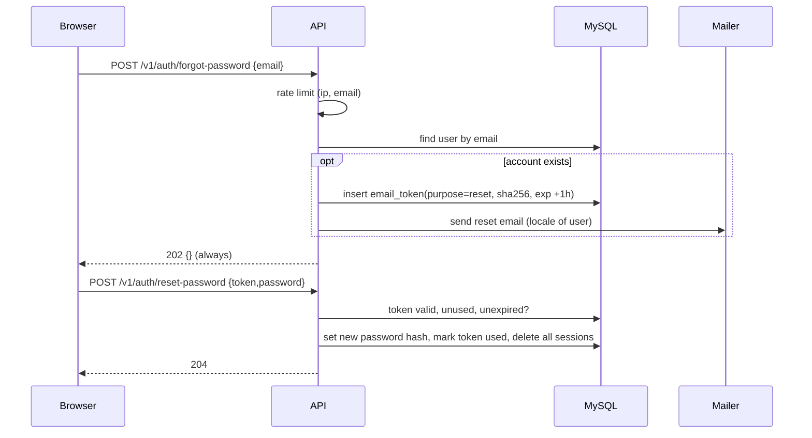
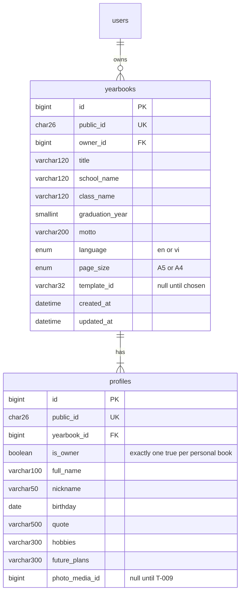
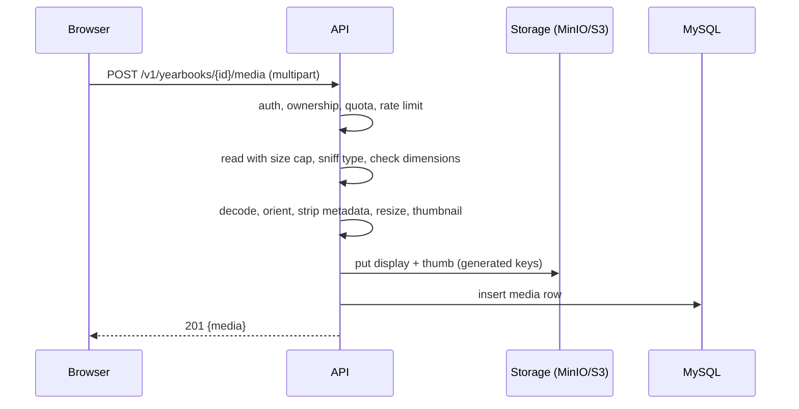
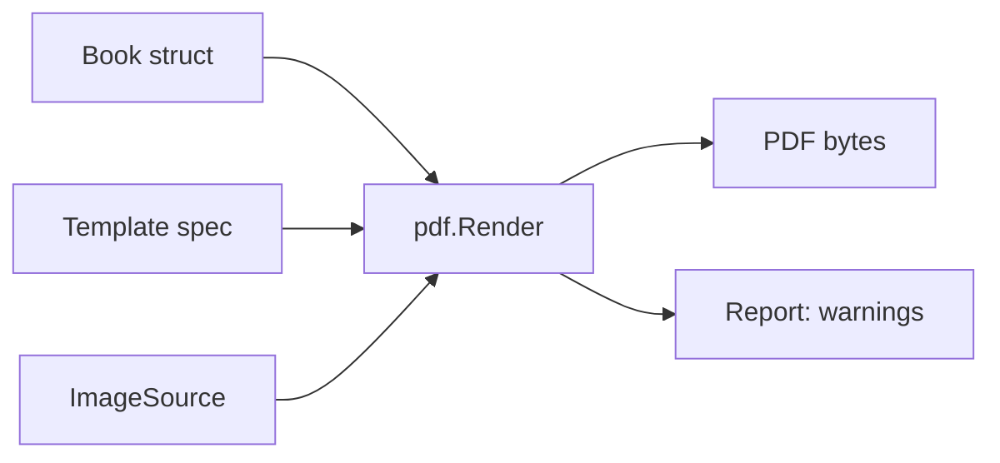

# Team Board — SMemories

> **Source of truth for the leader / dev / QA team.**
> **Leader** writes everything here. **Dev and QA** may only change a task's status and add comments (through `board.py`). **You** answer the questions in §3 — edit the `Answer` line in place or just tell the leader.
> Status flow: `BACKLOG → TODO → IN_PROGRESS → READY_FOR_QA → IN_QA → QA_PASS | QA_FAIL → (leader review) → MERGED → DONE`.
> `MERGED` = merged to `develop` and **waiting for your review**; tell the leader "accept T-007" (or `bin/team accept T-007`) to make it `DONE`.

## 0. At a glance

<!-- summary:start -->
| Status | # | Tasks |
|---|---:|---|
| BACKLOG | 20 | T-013, T-014, T-015, T-016, T-017, T-018, T-019, T-020, T-021, T-022, T-023, T-024, T-025, T-026, T-027, T-029, T-031, T-032, T-033, T-035 |
| TODO | 5 | T-007, T-009, T-011, T-012, T-034 |
| QA_PASS | 1 | T-010 |
| MERGED | 9 | T-001, T-002, T-003, T-004, T-005, T-006, T-008, T-028, T-030 |

**Awaiting your review (MERGED):** T-001 (Repo foundation and API skeleton); T-002 (Local stack (MySQL + MinIO), migrations and readiness); T-003 (Web scaffold: Vite + React + TypeScript + EN/VI i18n); T-004 (CI pipeline (Go, web, integration, security)); T-005 (Spike: choose the pure-Go PDF engine); T-006 (Email + password auth core (register, login, sessions)); T-008 (Yearbook CRUD and profile information); T-028 (T-001 follow-ups: log route not path, lint scope and findings, OpenAPI 404/405); T-030 (T-002 follow-ups: isolate compose stacks, fail fast on auth errors, test-DB grants)

**Open questions for you:** Q-005 (CAPTCHA on the public friends' note form?); Q-006 (Approve merge of T-010 (PDF renderer)?)

_Board last written 2026-10-07 11:44Z_
<!-- summary:end -->

## 1. Vision & orientation

**Product.** SMemories is a web app where students design, collect content for, and export their own yearbook. Friends leave messages and photos through a shareable link (no account needed), the owner picks a template and fills in the book's information, and the app exports a print-quality PDF. Class yearbooks (many students, one book) come after the personal flow works. Product description: [`/README.md`](../README.md).

**Users.** Primary: university/college students aged 18+ who own a yearbook. Contributors: friends, teachers, family — anonymous, link-based. Later: class admins (teacher or class monitor). School-age (under 18) account holders are a deliberate later milestone (consent, photo rules).

**Non-goals (until the owner says otherwise).** Ordering printed books in-app; payments; under-18 account holders; free-form drag-and-drop canvas editor; video/audio messages; native mobile apps; AI layout.

**Hard constraints.**
- Public GitHub repo (`danyaa666/smemories`): no secrets, ever. `.env*` is git-ignored; only `.env.example` with dev-only values is committed.
- UI in English and Vietnamese from the first screen (i18n from M0).
- Vietnamese diacritics and emoji must survive storage (MySQL `utf8mb4`) and PDF output.
- Dev and QA agents run and test everything **locally with no cloud credentials** (docker-compose MySQL + MinIO). Anything needing AWS or a third-party account is owner-assisted and lives in M2.

**Quality bar.**
- CI green on `develop` — Go: gofmt, `go vet`, golangci-lint, `go test -race`, govulncheck. Web: eslint, `tsc --noEmit` (strict), vitest, production build, i18n key parity.
- New or changed logic has tests that would catch a regression; service and handler packages ≥ 70 % line coverage (reported first, gating later).
- Every HTTP endpoint is in `api/openapi.yaml` and in a Postman collection; every error uses the shared envelope (§5).
- Public (unauthenticated) endpoints are rate-limited; uploads are validated; no personal data in logs.
- Performance: p95 for non-export API calls < 300 ms on the local stack. A 24-page A5 book with 30 photos exports end to end in ≤ 60 s using ≤ 512 MB peak memory.

## 2. Roadmap

| Horizon | Milestone | Goal | Exit criteria ("stable") | Status |
|---|---|---|---|---|
| Now | M0 Foundation | Repo skeleton, local stack, web scaffold, CI, PDF engine proven | see M0 exit below | in progress |
| Now | M1 Personal yearbook, end to end | One student creates a yearbook, collects friends' notes, picks a template, exports a PDF | see M1 exit below | planned (specified) |
| Next | M2 Go live on AWS and harden | Production environment, real email, observability, backups, privacy tooling | sketch only | BACKLOG |
| Next | M3 Class yearbook | Class space, invites, roles, assembling many students' pages into one book | sketch only | BACKLOG |
| Later | M4+ | Print-shop-ready PDF (bleed, CMYK note), under-18 support, more social providers, free-form editor, in-app print ordering | direction only | idea |

**Epics** (PRDs and task specs live in `.team/epics/`; status only on the board):

| Epic | PRD | Milestone | Goal | Status |
|---|---|---|---|---|
| E02-auth | [PRD](epics/E02-auth/PRD.md) | M1 | Accounts and sign-in: password, email verification, Google | active |
| E04-friends-notes | [PRD](epics/E04-friends-notes/PRD.md) | M1 | Collection links, public note submission, moderation | planned |

**M0 exit.** From a clean checkout: `make up && make migrate` starts MySQL and MinIO; `make build test lint` is green; `GET /healthz` is 200 and `GET /readyz` reflects the database; the web dev server shows the home page with a working EN/VI switcher and an API status badge; CI is green on a PR; the PDF engine ADR is merged with a go/no-go verdict backed by a Vietnamese-text sample, 300 DPI image test and a memory/time measurement; no secrets in the repo.

**M1 exit (what "stable" means for the first release).** On a clean local stack a new user can, in both English and Vietnamese: register and sign in (email+password; Google against a fake OIDC provider in tests); create a personal yearbook and fill in its information; upload photos; create a notes link and, **as an anonymous visitor**, submit a note with text, emoji and two photos; approve or hide notes; choose between at least two templates; export a PDF (A5, 24 pages, 30 photos) that renders Vietnamese text correctly (no missing glyphs) within the quality-bar budget; download it. An automated end-to-end smoke test of exactly this journey runs in CI. No open P0/P1 bugs, health checklist has no open high-severity item, and every `Risk: high` task is owner-approved.

## 3. Questions & decisions for you

<!-- questions:start -->

### Q-001 — IaC tool for AWS (OpenTofu/Terraform, CDK, or CloudFormation)
- **Status:** RESOLVED
- **Asked:** 2026-10-06 10:13Z
- **Blocks:** T-023
- **Recommendation:** A: OpenTofu / Terraform
- **Answer:** A

**Decision needed:** Which tool defines the AWS infrastructure (Fargate, RDS MySQL, S3, CloudFront) as code?
**Why now / what it blocks:** Only T-023 (AWS IaC and deploy pipeline, M2). M0 and M1 are unaffected, so there is no hurry; answer before M1 is nearly done.
**Constraints:** Solo owner plus AI agents; agents cannot hold long-lived AWS keys (deploys use GitHub OIDC); everything must be reviewable in a PR as a plan/diff; no extra paid service.

| Option | Pros | Cons | Cost / effort | Risk & lock-in | Reversibility |
|---|---|---|---|---|---|
| A (recommended) OpenTofu / Terraform (HCL) | Largest ecosystem and examples; explicit `plan` diff reviewed in PRs; strong module support for VPC, RDS, ECS, CloudFront; agents write HCL reliably | Separate language and state to manage (S3 backend + lock); Terraform itself is BSL-licensed, OpenTofu is the open fork | Free; about 1 task to set up state, 2 to 3 for the stack | Low; HCL is widely portable | Medium: migrating IaC later is real work but possible |
| B AWS CDK (TypeScript) | Same language as the frontend; loops and types; generates CloudFormation | CDK upgrades churn; harder to review the real change (synthesised template); heavier toolchain | Free; similar effort | AWS-only | Medium |
| C CloudFormation / SAM (YAML) | No extra tooling; native | Verbose; weak reuse; slow feedback | Free; more effort | AWS-only | Medium |

**Recommendation:** Option A, because the `plan` output gives you a readable review gate before anything changes in your AWS account, the module ecosystem removes most of the VPC/RDS/ECS boilerplate, and it keeps working if you ever leave AWS. Prefer OpenTofu unless you already use Terraform.
**If undecided:** T-022 (Dockerfile and production config) proceeds; T-023 stays in BACKLOG. Default assumed at the start of M2: Option A.
**Revisit when:** you adopt a platform team standard, or move off AWS.

### Q-002 — Roadmap order after M1: go-live (M2) before class yearbook (M3)?
- **Status:** RESOLVED
- **Asked:** 2026-10-06 10:13Z
- **Blocks:** —
- **Recommendation:** A: M2 go-live first, then M3 class
- **Answer:** A

**Decision needed:** After M1, build "go live on AWS" (M2) first, or the class yearbook (M3) first?
**Why now / what it blocks:** Only the order of M2 and M3. M0 and M1 are the same either way.
**Constraints:** Class yearbooks are your headline use case; a personal yearbook is already usable alone; real users need a production environment.

| Option | Pros | Cons | Cost / effort | Risk & lock-in | Reversibility |
|---|---|---|---|---|---|
| A (recommended) M2 go-live, then M3 class | Real users test the personal flow early; infra, email and backups are proven before you hold a whole class's data; M3 then ships onto a live system | Class mode (the headline feature) arrives later | M2 is mostly owner-assisted infra work | Low | High: roadmap order only |
| B M3 class first, then go-live | Headline feature sooner | You build a larger, privacy-heavy feature with no production feedback; go-live is delayed and riskier | Larger M3 before any users | Medium | High |

**Recommendation:** Option A, because class mode multiplies the personal data you hold (many students, many photos) and I would rather prove deployment, email, backups and deletion with a small user base first.
**If undecided:** Roadmap stays M2 then M3; tasks T-026 and T-027 remain in BACKLOG.
**Revisit when:** a school or class pilot gets a date.

### Q-003 — Approve merge of T-004 (CI pipeline)?
- **Status:** RESOLVED
- **Asked:** 2026-10-07 07:07Z
- **Blocks:** T-004
- **Recommendation:** approve
- **Answer:** _(pending)_

**Decision needed:** Approve the merge of T-004 (CI pipeline) into develop?
**Why now / what it blocks:** CI is Risk: high (workflow files run with repository permissions). It blocks nothing technically, but every later PR gets automatic checks only after it merges, and branch protection needs its check names.
**Evidence:** QA_PASS and my review at 0482b75. The PR's own run is green on GitHub (go, go-integration, web, security). QA proved each job fails on the right defect. No secrets, actions pinned by SHA, minimal permissions.
**Recommendation:** approve (`bin/team approve T-004`).
**After merge (you):** turn on branch protection for `develop` and `main`: require pull requests, no force-push, and the four checks go, go-integration, web, security. Dependabot starts only once this file reaches `main` (promote develop to main when you are ready).

### Q-004 — Approve merge of T-006 (email + password sign-in)?
- **Status:** RESOLVED
- **Asked:** 2026-10-07 07:07Z
- **Blocks:** T-006
- **Recommendation:** approve
- **Answer:** Owner ran bin/team approve T-006 (2026-10-07 07:45Z). Merge waits for the gosec fix, QA re-pass and green CI, per the comment on T-006.

**Decision needed:** Approve the merge of T-006 (email + password sign-in) into develop?
**Why now / what it blocks:** Authentication is Risk: high. It blocks T-007 (email verification and reset), T-008 (yearbook API), T-011 (Google sign-in) and everything user-owned in M1.
**Evidence:** QA_PASS twice (adversarial testing on a throwaway DB: timing, CSRF, rate limits, spoofed headers, parallel logins, injection, session replay, log search) and my own review of the full auth path at 77924c1: no vulnerability found. NFKC passwords and NFC emails and names are in (L-09), so Vietnamese users are not locked out by different devices.
**Known limits (acceptable now):** rate limits are per process (fine for one API task; M2 hardening T-031 moves them to the edge), registration reveals "email already registered" (a deliberate UX trade-off, bounded by the per-IP limit).
**Recommendation:** approve (`bin/team approve T-006`). I will merge T-004 first so this PR runs through the new CI before it lands.

### Q-005 — CAPTCHA on the public friends' note form?
- **Status:** OPEN
- **Asked:** 2026-10-07 11:28Z
- **Blocks:** —
- **Recommendation:** A: no CAPTCHA now, hook in place
- **Answer:** _(pending)_

**Decision needed:** Should the public note form (friends sending a message and photos through a link, no account) have a CAPTCHA?
**Why now / what it blocks:** It does not block T-012 or T-034: the endpoint ships with a no-op verifier hook either way. It decides whether the web form (T-018) shows a challenge.
**Constraints:** The form is used by friends on phones, often in a hurry; it accepts text and up to three photos; it is the only unauthenticated upload in the product. Protections already specified: unguessable link, per-IP and per-link rate limits, 300 notes per link, size caps, every note pending until the owner approves it, a honeypot field, a verified-email owner.

| Option | Pros | Cons | Cost / effort | Risk & lock-in | Reversibility |
|---|---|---|---|---|---|
| A (recommended) No CAPTCHA now, hook in place | No friction for friends; nothing extra to configure; the existing limits already bound the damage to one link | A leaked link could be spammed up to the caps (the owner only has to hide or revoke) | None now | Low: worst case is junk notes on one book | Easy: switch it on later without changing the API |
| B Cloudflare Turnstile from the start | Blocks most bots; free; mostly invisible to humans | Adds a third party that sees visitors; needs a site key and secret; can fail on some phones or privacy browsers | About one small task plus an owner setup step | Vendor dependency | Easy to remove |
| C hCaptcha / reCAPTCHA | Familiar | More friction, more tracking, privacy concerns for a student product | Same as B | Vendor dependency | Easy to remove |

**Recommendation:** Option A, because the damage from abuse is bounded (caps, pending-by-default moderation, revocable links) and friction on the contributor path is the larger product risk. Revisit with Option B the first time a link is actually spammed.
**If undecided:** Build with the hook and no CAPTCHA (Option A).
**Revisit when:** a collection receives spam, or the product opens to a public (non-link) submission form.

### Q-006 — Approve merge of T-010 (PDF renderer)?
- **Status:** OPEN
- **Asked:** 2026-10-07 11:38Z
- **Blocks:** T-010
- **Recommendation:** approve
- **Answer:** _(pending)_

**Decision needed:** Approve the merge of T-010 (template system and PDF page renderer) into develop?
**Why now / what it blocks:** Risk: high because it adds the core PDF dependency and handles untrusted text and photos. It blocks the export job (T-014) and the template picker (T-019), the last big pieces of the M1 journey.
**Evidence:** QA_PASS with 16 generated PDFs checked (pdfcpu strict, 300 dpi PNGs by eye, Vietnamese text exact, emoji drawn as outlines and never panic, cover photos full-bleed, pagination for 0/1/7/60 notes, hostile inputs bounded); my own read of the text, image and entry-point code found no defect; all four CI jobs passed on the previous head and are finishing on the current one (QA added one test-only commit).
**Known limits (accepted):** emoji print as monochrome outlines, not colour (ADR 0002); byte-identical output only when photo widths differ (documented); a book with no notes still gets one empty notes page. The export job must set a deadline because the renderer itself has no caps.
**Recommendation:** approve. I merge only after the CI jobs on the current head are green. Approve in a terminal: `cd /Users/unisoft/GolandProjects/awesomeProject1 && /Users/unisoft/.claude/plugins/cache/claude-agent-team/agent-team/0.3.0/bin/team approve T-010`

<!-- questions:end -->

## 4. Architecture & decision log

Owner decisions (2026-10-06, `/team-init` interview). "Rejected" lists the options the owner or leader declined.

| # | Decision | Rationale / consequences | Rejected | Revisit when |
|---|---|---|---|---|
| D-01 | **Audience: university/college (18+) first.** | Adults only, so no parental-consent flow in v1. Contributors may be anyone but the form collects the minimum (name, message, photos). | High school incl. minors; both from day one | A school pilot is planned (own milestone: consent, photo rules, teacher-gated accounts) |
| D-02 | **UI languages: English + Vietnamese, i18n from M0.** | All strings externalised (react-i18next); CI fails on key mismatch between locales. API error codes are stable; messages are localised on the client. | EN only; VI only | A third language is requested (just translation files) |
| D-03 | **M1 = personal yearbook end to end; class mode is M3.** | Proves the whole value chain without roles/invites. Class mode reuses the same book/page/notes engine. | Class first; both thin | Owner wants a class pilot sooner (see Q-002) |
| D-04 | **Print scope: PDF export only.** | Print-quality PDF (A5/A4, safe margins, 300 DPI images). User prints it anywhere. | PDF + print-shop spec (bleed/CMYK); in-app ordering | Users ask for print-shop acceptance (M4) |
| D-05 | **Stack: Go API + Vite + React + TypeScript SPA + MySQL 8.4.** | Matches the existing Go scaffold. MySQL chosen by the owner (leader had recommended PostgreSQL). Consequences: charset `utf8mb4`; no `RETURNING` (use `LastInsertId`); no Postgres-only features (RLS, partial indexes); RDS MySQL in M2. React chosen as the Vite framework (leader recommendation, owner said "Vite frontend"). | Next.js full-stack TS; Go + HTMX; Vue; Svelte | — |
| D-06 | **PDF engine: pure-Go PDF library.** | Owner chose this over the leader's recommendation (headless Chromium + HTML/CSS). Consequences: templates are a **declarative JSON spec rendered by Go**, not HTML/CSS; the M1 editor is **form/slot-based** (no free-form canvas); preview is the **real PDF shown with pdf.js**, so preview equals output; Vietnamese needs an embedded Unicode TTF and NFC-normalised text. Candidate libraries (MIT): `go-pdf/fpdf`, `signintech/gopdf`; chosen by spike **T-005**. `unipdf` is excluded unless the owner approves its commercial licence. | HTML→PDF via Chromium; hosted PDF API | T-005 finds no library meets the criteria (then Chromium returns to the table) |
| D-07 | **Auth: in-house in Go.** Email+password (argon2id) and Google sign-in (OIDC, PKCE); other social providers later. | Agents must test locally with no cloud credentials; no per-user fees; no vendor lock-in. Cost: we own the security details, so every auth task is `Risk: high` and needs `bin/team approve`. | Amazon Cognito; Clerk/Auth0/Supabase; email+password only | Compliance requires a managed IdP, or MAU grows large |
| D-08 | **Hosting: AWS (Fargate + RDS MySQL + S3 + CloudFront).** | Owner choice; provisioning is M2 and owner-assisted (account, billing, domain, Google OAuth client). Local dev is docker-compose either way. IaC tool undecided — see Q-001. | Container PaaS + R2; decide later | — |
| D-09 | **Repository: public `github.com/danyaa666/smemories`.** | Owner choice. The board (`.team/`) and all code are public — never commit secrets, real data, or student photos. Module path `github.com/danyaa666/smemories`. | Private; owner-created repo | — |
| D-10 | **IaC tool: OpenTofu / Terraform (HCL).** | Answered `A` on the board (2026-10-07, Q-001). State in an S3 backend with locking; deploys authenticate with GitHub OIDC (no long-lived AWS keys). Used by T-023 (M2). | AWS CDK; CloudFormation/SAM | A platform standard appears, or the project leaves AWS |
| D-11 | **Roadmap order: M2 go-live before M3 class yearbook.** | Answered `A` on the board (2026-10-07, Q-002). Prove deployment, email, backups and deletion with a small user base before holding a whole class's data. | M3 class first | A school or class pilot gets a date |
| D-12 | **PDF library: `codeberg.org/go-pdf/fpdf` v0.12.0** (spike T-005, ADR 0002). | Accepted by merging the ADR; `signintech/gopdf` is the fallback. Both libraries passed all criteria; fpdf wins on text wrapping and memory. Consequences: import the Codeberg path (the GitHub repo is archived); fpdf panics on runes above U+FFFF, handled with PUA aliases and a run splitter in T-010; **emoji print as monochrome outlines, colour emoji is out of scope**; small community (single-digit maintainers), so watch release health. | `gopdf`; `unipdf` (AGPL or commercial); Chromium | fpdf has no release for a year, or a template needs colour emoji, complex-script shaping or CMYK/bleed |

Leader decisions (low-risk, inside the approved stack):

| # | Decision | Why |
|---|---|---|
| L-01 | Go: stdlib `net/http` ServeMux (Go 1.22+ patterns) + small middleware; `database/sql` + `go-sql-driver/mysql`; `sqlc` (MySQL engine) for typed queries; `pressly/goose` migrations, embedded SQL; `log/slog` JSON logging; `aws-sdk-go-v2` for S3 (MinIO locally). | Fewest dependencies; each piece is boring and replaceable. |
| L-02 | API contract is a hand-written `api/openapi.yaml` (OpenAPI 3.1); TS types generated with `openapi-typescript`; Postman collection per epic in `postman/`. | One contract both sides read; keeps FE/BE from drifting. |
| L-03 | Web: react-router, TanStack Query, react-i18next, Vitest + Testing Library, `pdfjs-dist` for the preview; Playwright for the M1 E2E smoke; system font stack (handles Vietnamese). | Mainstream choices with the best agent support. pdf.js (not an `<iframe>`) because phone browsers do not show embedded PDFs. |
| L-04 | Repo layout: `cmd/<binary>/`, `internal/<domain>/`, `migrations/`, `api/`, `postman/`, `web/`, `docs/`, `docker-compose.yml`, `Makefile`. | One Go module at the root, one Vite app in `web/`. |
| L-05 | IDs: `BIGINT UNSIGNED AUTO_INCREMENT` primary keys internally; every externally visible id is an opaque ULID (`CHAR(26)`, unique). Timestamps are `DATETIME(6)` in UTC. | No enumerable ids in URLs; cheap joins. |
| L-06 | Risk calibration: **high** = auth, anything personal-data-bearing and public, file uploads, new core dependency, infra/CI/secrets, migrations that change existing data. Greenfield **additive** migrations before the first production deploy are **low** (no data to lose). | Keeps owner approvals for what can really hurt, not for every table. |
| L-07 | HTTP paths: infrastructure routes `/healthz` and `/readyz` at the root; business routes under `/v1/…`. The web app calls the API at `/api/*` on its own origin and the edge strips `/api` (Vite proxy in dev, CloudFront in M2). Same origin means a `SameSite=Lax` session cookie works and no CORS is needed. | Simplest secure cookie setup; one place (the edge) owns the prefix. |
| L-08 | Dev/CI object store: MinIO through the frozen image `bitnamilegacy/minio:2025.4.22-debian-12-r2`, loopback-only, no real data. | MinIO stopped publishing images on Docker Hub and Quay. The frozen image gets no security patches, which is acceptable for a dev-only, loopback-only store; it is also the last release with a working web console (T-002 AC8). The app uses only the S3 API via aws-sdk-go-v2, so the store is swappable. Replacement tracked in T-029. |
| L-09 | Auth dependencies and Unicode rule: `golang.org/x/crypto` (argon2id) and `golang.org/x/text` approved. Passwords are normalised to NFKC and display names to NFC before validation and hashing/verification. | The same Vietnamese password can arrive as NFC or NFD from different devices and keyboards; normalising once, before any user exists, prevents lock-outs. NIST SP 800-63B recommends NFKC/NFKD. Changing this after users exist would break their logins. |
| L-10 | Go toolchain: `go.mod` keeps `go 1.26.0` as the minimum, but CI and production images build with the newest 1.26 patch release. | At exactly go1.26.0 `govulncheck` reports 11 reachable standard-library vulnerabilities; the current patch has none. Raising the `go` directive would force every dev machine to download a newer toolchain for no benefit, while the vulnerable code only matters in what we ship. The Dockerfile (T-022) must follow the same rule. |
| L-11 | Persistence: plain `database/sql` with parameterised queries and hand-written SQL; `sqlc` (mentioned in L-01) is not adopted. | Auth and yearbooks already use plain SQL cleanly and there is no code generation step to maintain; revisit if the query surface grows. Migrations stay numbered and ordered: always take the next free number (goose rejects out-of-order versions). |

## 5. Engineering conventions

- **Build:** `make build` (Go build + web build). **Test:** `make test` (Go `-race` unit tests + vitest). **Integration:** `make test-integration` (needs `make up`). **Lint:** `make lint` (gofmt check, `go vet`, golangci-lint, eslint, `tsc --noEmit`, i18n parity). These targets are created by T-001, T-002, T-003 and mirrored in `.team/config.json`.
- **Branches:** `task/t-<id>-<slug>`, one per task, PR to `develop`, squash-merged by the leader; the owner promotes `develop` → `main` with `bin/team promote`.
- **API errors:** always `{"error":{"code":"snake_case_code","message":"English text for logs","request_id":"…"}}` with the right HTTP status. Codes are the contract; the client localises messages.
- **Data:** UTF-8 everywhere (`utf8mb4`), UTC timestamps, opaque ULIDs outside the database, no PII in logs, secrets only from environment variables.
- **i18n:** every user-visible string lives in `web/src/locales/{en,vi}.json`; both files get the key in the same PR.
- **Definition of done:** acceptance criteria met; tests written and green; build + lint green; `api/openapi.yaml` and the Postman collection updated for any HTTP change; PR open; QA_PASS; leader review passed.

## 6. Tasks

Task block anatomy (leader-written; dev/qa touch only `Status`, `Branch`, `PR`, and the Comments list):

```text
### T-007 — Short imperative title
- **Status:** TODO
- **Priority:** P1            (P0 urgent … P3 nice-to-have)
- **Type:** feature | bug | tech-debt | security | perf | docs | infra
- **Milestone:** M1
- **Depends-on:** T-003, T-004
- **Assignee:** —            (maintained automatically)
- **Branch:** —   **PR:** —
#### Description / Acceptance criteria / Design (mermaid) / Test plan
#### Comments                (one line per comment: timestamp · role · text)
```

<!-- tasks:start -->

### T-001 — Repo foundation and API skeleton
- **Status:** MERGED
- **Priority:** P1
- **Type:** infra
- **Milestone:** M0
- **Depends-on:** —
- **Risk:** low
- **Rework:** 0
- **Owner-approved:** —
- **Assignee:** —
- **Branch:** task/t-001-repo-foundation-and-api-skeleton
- **PR:** https://github.com/danyaa666/smemories/pull/1
- **Updated:** 2026-10-07 02:47Z by leader
- **Comments-seen:** 3

#### Description
Replace the GoLand "hello world" stub with the skeleton every other task builds on: module path, directory layout, an HTTP server with shared middleware and the shared error envelope, env-based config, the OpenAPI/Postman starting points and the Makefile. Nothing product-specific yet. Decisions: board §4 D-05, L-01, L-04, L-07; conventions §5.

#### Scope
- In: rename the module; remove root `main.go`; `cmd/smemories-api`; `internal/config`; `internal/httpx` (router, middleware, error and JSON helpers); `GET /healthz`; `api/openapi.yaml` (health + error schema); `postman/platform.postman_collection.json`; `Makefile`; `.env.example`; `.editorconfig`; README "Development" section.
- Out (do not do): database (T-002), web app (T-003), CI (T-004), Dockerfile (M2), any auth or business endpoint, any third-party router/framework.

#### Acceptance criteria
- [ ] AC1 — `go.mod` module is `github.com/danyaa666/smemories` (keep the `go` directive); the root `main.go` stub is gone; `go build ./...` succeeds.
- [ ] AC2 — `make build`, `make test`, `make lint`, `make run` exist and pass from a clean checkout. `lint` = `gofmt -l .` must print nothing + `go vet ./...` (golangci-lint arrives in T-004).
- [ ] AC3 — `GET /healthz` → `200 {"status":"ok"}`. Unknown path → `404 not_found`; wrong method → `405 method_not_allowed` with an `Allow` header; both use the error envelope `{"error":{"code","message","request_id"}}`.
- [ ] AC4 — Each request writes one JSON slog line with `request_id, method, path, status, duration_ms` (never bodies, `Cookie`, or `Authorization`). Response carries `X-Request-Id`: a client value is reused only if it matches `^[A-Za-z0-9-]{8,64}$`, otherwise a new id is generated. A handler panic returns `500 internal_error` in the envelope, logs the stack, and the server keeps serving.
- [ ] AC5 — Config reads env vars with prefix `SMEM_`: `SMEM_HTTP_ADDR` (default `:8080`), `SMEM_ENV` (`dev|test|prod`, default `dev`), `SMEM_LOG_LEVEL` (`debug|info|warn|error`, default `info`). An invalid value makes the process exit non-zero with a message that names the variable. `.env.example` lists every variable with dev-only values; no secrets.
- [ ] AC6 — SIGTERM/SIGINT: stop accepting, drain in-flight requests for up to 10 s, exit 0. Server sets `ReadHeaderTimeout` 5 s, `ReadTimeout` 15 s, `WriteTimeout` 30 s, `IdleTimeout` 60 s; request bodies are capped at 1 MiB by default (`413 payload_too_large`), overridable per route.
- [ ] AC7 — Every response carries `X-Content-Type-Options: nosniff`, `Referrer-Policy: no-referrer`, `X-Frame-Options: DENY`, `Cache-Control: no-store`.
- [ ] AC8 — `api/openapi.yaml` (OpenAPI 3.1) documents `/healthz` and the `Error` schema; `postman/platform.postman_collection.json` covers `/healthz`, the 404 and the 405 cases with assertions.
- [ ] AC9 — README gains a "Development" section: prerequisites (Go version from `go.mod`), the make targets, how to run the API locally.

#### Design
Files: `go.mod`, `Makefile`, `.env.example`, `.editorconfig`, `cmd/smemories-api/main.go`, `internal/config/config.go`, `internal/httpx/{router,middleware,errors,respond}.go`, `api/openapi.yaml`, `postman/platform.postman_collection.json`, tests next to the code.

Helpers every later task reuses: `httpx.WriteJSON(w, status, v)` and `httpx.WriteError(w, r, status, code, msg)`. Domain packages later expose `Routes(mux *http.ServeMux)`; `main` only wires config → router → server. Use Go 1.22+ method patterns (`mux.Handle("GET /healthz", ...)`). Infra routes (`/healthz`, `/readyz`) live at the root; business routes will live under `/v1/` (L-07).



#### Risk
`low`

#### Security & performance notes
No secrets in the repo (public). Do not log bodies, cookies or authorization headers. Timeouts and the body cap are slow-client and large-body protection. Do not trust `X-Request-Id` blindly (log injection).

#### Test plan
- Dev: table tests for config parsing (valid, invalid, defaults); `httptest` tests for AC3/AC4/AC6/AC7 (404/405 envelope, request-id reuse and regeneration, panic recovery, headers, body cap); a test that starts the server on `:0` and shuts it down on context cancel.
- QA should probe: `X-Request-Id` containing CR/LF or 10 kB; 2 MiB POST body; `kill -TERM` while a slow request is in flight; run `make` targets from a fresh clone; run the Postman collection twice back to back.

#### Comments
- 2026-10-07 02:37Z · leader · Board repair by leader: the dev's READY_FOR_QA transition (events.jsonl 02:20:20Z) and PR link were lost from the README (a stale overwrite); restored from the event log and `gh pr view 1` (task/t-001-repo-foundation-and-api-skeleton -> develop, open, mergeable, no CI yet). Dev hand-back, relayed and NOT yet verified (QA to confirm): all 9 AC covered by tests; `make lint build test` green; live binary checked /healthz, 404/405 envelopes, SIGTERM exit 0, invalid SMEM_ENV exits 1 naming the variable; Newman collection passed twice back to back (10/10). Deviation from the design diagram: the access log wraps recover, so a recovered panic logs as 500 and security headers also appear on 500s. No new dependencies. PR #1 and PR #2 will conflict trivially on go.mod and Makefile; dev rebases the second after the first merges.
- 2026-10-07 02:40Z · qa · QA_PASS at e19483a, verified myself from a fresh clone of the PR branch, not the dev's claims. AC1: go.mod module github.com/danyaa666/smemories, go 1.26 kept, no root main.go, go build ok. AC2: 'make lint build test' green on a fresh clone; go test -race -count=3 green; coverage config 100%, httpx 86%. AC3: live binary: /healthz 200 {status:ok}; /nope 404 not_found; POST and DELETE /healthz 405 method_not_allowed with Allow: GET, HEAD; all in envelope with request_id equal to X-Request-Id. AC4: one JSON log line per request with request_id,method,path,status,duration_ms; no query/cookie/auth in logs. X-Request-Id: valid reused; invalid or 10 kB id replaced with a fresh 32-hex id; CR injection attempt rejected by net/http with 400 before reaching our code. Panic recovery covered by unit test (logs stack, 500 envelope, keeps serving); not reachable on the live binary (no panicking route). AC5: SMEM_ENV=staging, SMEM_LOG_LEVEL=loud, SMEM_HTTP_ADDR=abc/:99999/:8080x each exit 1 naming the variable; defaults ok; .env.example has no secrets. AC6: SIGTERM and SIGINT exit 0 in 0.02 s idle; with a stalled half-sent request SIGTERM exits 0 in 4.8 s (ReadHeaderTimeout), new connections refused after SIGTERM; in-flight-handler drain covered by TestServeStartsAndShutsDownOnCancel (the real binary has no slow route to test it live); timeouts asserted by TestNewServerTimeouts; 2 MiB body cap covered by unit tests (413 payload_too_large, exact-cap OK, per-route override) because the live binary has no route that reads a body: first body-reading endpoint's task must add a live 413 case. AC7: all four headers present on 200/404/405 live and on 500 in unit test. AC8: openapi.yaml documents /healthz and Error (redocly lint: structurally valid, only style warnings); Newman run twice back to back on a fresh server: 5 requests/10 assertions, 0 failed both times. AC9: README Development section present and accurate; 'make run' starts the server (verified). make lint run on the PR: no CI exists yet (T-004), 'gh pr checks' reports none. Non-blocking: (a) golangci-lint v on this machine reports 2 findings that T-004 will hit: errcheck internal/httpx/server_test.go:46 (resp.Body.Close) and staticcheck ST1023 internal/httpx/router.go:23 ('var h http.Handler =' can drop the type); (b) openapi.yaml: 404 and 413 responses are not documented and no 'security: []'; (c) cmd/smemories-api has 0% coverage; (d) the 404 Newman test asserts the code twice. Dev deviation (access log wraps recover) confirmed and fine. PR #1 mergeable against develop on its own.
- 2026-10-07 02:47Z · leader · merged c4c25a8 (squash). Review: all 9 AC met by the diff, no new deps, middleware order differs from the diagram in a justified way (access log wraps recover, so panics log as 500 and 500s carry security headers). For owner to check: run make run and curl localhost:8080/healthz. Follow-ups in T-028.

### T-002 — Local stack (MySQL + MinIO), migrations and readiness
- **Status:** MERGED
- **Priority:** P1
- **Type:** infra
- **Milestone:** M0
- **Depends-on:** T-001
- **Risk:** low
- **Rework:** 0
- **Owner-approved:** —
- **Assignee:** —
- **Branch:** task/t-002-local-stack-mysql-minio-migrations-and-r
- **PR:** https://github.com/danyaa666/smemories/pull/3
- **Updated:** 2026-10-07 03:16Z by leader
- **Comments-seen:** 3

#### Description
Give every later task a database and object store that start locally with one command, a migration mechanism that can also run as a one-off task on ECS later, a readiness endpoint, and an integration-test harness. Decisions: D-05 (MySQL 8.4, `utf8mb4`), L-01, L-05, hard constraint "agents test locally with no cloud credentials".

#### Scope
- In: `docker-compose.yml` (MySQL 8.4 + MinIO + bucket init); `internal/db` (open, pool, ping); goose migrations with embedded SQL; `cmd/smemories-migrate`; `GET /readyz`; `internal/db/dbtest` harness; Makefile targets `up`, `down`, `migrate`, `migrate-down`, `test-integration`; `api/openapi.yaml` + Postman updated for `/readyz`.
- Out (do not do): any real tables (first migration is the harmless `app_meta`), S3 client code (T-009), app Dockerfile (M2), CI changes (T-004).

#### Acceptance criteria
- [ ] AC1 — `make up` copies `.env.example` to `.env` if missing, starts MySQL 8.4 and MinIO, and returns only when both are healthy; `make down` stops them. Published ports bind to `127.0.0.1` only. Credentials come from `.env` (dev-only values).
- [ ] AC2 — MySQL runs with `utf8mb4` / `utf8mb4_0900_ai_ci`, `STRICT_ALL_TABLES` in `sql_mode`, and time zone `+00:00`.
- [ ] AC3 — `smemories-migrate up|down|status` work against the compose DB; `make migrate` = `up`. Migrations are SQL files in `migrations/`, embedded in the binary. `0001_app_meta.sql` creates `app_meta(k VARCHAR(64) PRIMARY KEY, v VARCHAR(255) NOT NULL)` and inserts `('schema_epoch','1')`. An `up → down → up` cycle leaves a working schema.
- [ ] AC4 — `internal/db.Open(cfg)` builds the DSN with `parseTime=true&loc=UTC&charset=utf8mb4&collation=utf8mb4_0900_ai_ci`; pool settings from `SMEM_DB_MAX_OPEN` (20), `SMEM_DB_MAX_IDLE` (5), `SMEM_DB_CONN_MAX_LIFETIME` (5m). `SMEM_DB_DSN` is required outside `test`. The API retries the first ping for up to 10 s, then exits non-zero with a clear message. The DSN (with password) is never logged.
- [ ] AC5 — `GET /readyz` → `200 {"status":"ready"}` when a `PingContext` (1 s timeout) succeeds; otherwise `503 not_ready` in the error envelope, with no driver error text in the body (log it instead).
- [ ] AC6 — Round trip test: store and read back `Chúc mừng 🎓 Đặng Thị Hồng` byte-identically, and assert `character_set_client/connection/results` are `utf8mb4` on a pooled connection.
- [ ] AC7 — `dbtest.New(t)` creates a uniquely named database, applies all migrations, returns `*sql.DB`, and drops the database in `t.Cleanup`. Integration tests carry build tag `integration`; `make test-integration` runs them (`SMEM_TEST_DB_DSN` env, defaulting to the compose database).
- [ ] AC8 — MinIO bucket `smemories-dev` is created automatically by an init container; console reachable on `127.0.0.1:9001`.
- [ ] AC9 — `api/openapi.yaml` documents `/readyz`; Postman collection covers ready (200) and a documented way to see 503 (stop DB).

#### Design
Files: `docker-compose.yml`, `.env.example` (extend), `migrations/0001_app_meta.sql`, `internal/db/{db,migrate}.go`, `internal/db/dbtest/dbtest.go`, `cmd/smemories-migrate/main.go`, `internal/httpx` (readyz route registered from `main` with a `Pinger` interface so tests can fake it), `Makefile`.



#### Risk
`low` — greenfield, additive, no production data (board L-06). Compose credentials are dev-only and must not be reused anywhere real.

#### Security & performance notes
Bind services to loopback only. Never print the DSN. `readyz` must not leak driver errors. Pool limits must be configurable now because Fargate tasks multiply connections against RDS later.

#### Test plan
- Dev: unit tests for DSN building and config validation; integration tests for migrate cycle, utf8mb4 round trip, `readyz` 200 and 503 (use a closed `*sql.DB`).
- QA should probe: `make up` twice (idempotent); `make down` then `make up` keeps data volume; run `up→down→up` twice; kill MySQL while the API runs and watch `/readyz` flip to 503 and recover; confirm ports are not reachable on the LAN IP.

#### Comments
- 2026-10-07 03:07Z · dev · All 9 AC done, see PR #3. Test: docker running; make up migrate; make lint build test test-integration; make run then curl /readyz; docker compose stop mysql -> 503, start -> 200; newman run postman/platform.postman_collection.json --folder Health --folder 'Edge cases'. Leader FYI: MinIO no longer publishes images (Docker Hub/Quay pulls fail), so compose uses frozen bitnamilegacy/minio:2025.4.22-debian-12-r2 (last release with a working console, needed for AC8); dev-only, no security patches; swap later if desired. New deps goose v3.28 + mysql driver v1.10.1 (L-01); go directive 1.26.0 will conflict trivially with PR #2's go.mod.
- 2026-10-07 03:14Z · qa · Verified on a fresh clone of PR #3 head a35e918 (no CI checks on the branch). Isolated compose project 'smemqa' on ports 3406/9100/9101 because dev's 'smemories' stack was already holding 3306/9000. Evidence by AC: AC1 make up created .env from .env.example, both services healthy (~7 s), second make up idempotent, make down keeps volumes (row survived down/up), published ports are 127.0.0.1 only (docker compose config host_ip, lsof) and nc to LAN IP 192.168.1.11 on all three ports = closed, loopback open; on default ports with the other stack present make up fails with a clear 'port is already allocated'. AC2 SELECT @@: utf8mb4 / utf8mb4_0900_ai_ci / sql_mode has STRICT_ALL_TABLES / time_zone +00:00; strict mode rejects a 300-char value in VARCHAR(255) (Error 1406). AC3 smemories-migrate up|down|status work, make migrate = up; up->down->up run twice, table and ('schema_epoch','1') recreated each time, SHOW CREATE TABLE matches spec; embedded FS (migrations/embed.go). AC4 unit tests for Normalize/pool pass; API with MySQL stopped: 8 warn retries over 10.0 s then exit 1 'database at 127.0.0.1:3406 not reachable after 10s'; DB started 3 s into the window -> API comes up and /readyz 200; wrong password and malformed DSN never print the password (grep count 0 in API and migrate output and docker compose logs). AC5 /readyz 200 {"status":"ready"}; mysql stopped -> 503 error envelope code not_ready, body 'dependency not ready', driver text only in the log; docker pause mysql -> 503 after 1.00 s; start -> 200 again within 2 s; POST -> 405 envelope. AC6 TestUTF8MB4RoundTrip + TestSessionTimesAreUTC pass; own check via mysql client: 'Chúc mừng 🎓 Đặng Thị Hồng' stored and read back, hex 4368C3BA..F09F8E93.. (25 chars/38 bytes), character_set_client/connection/results = utf8mb4. AC7 make test-integration twice back to back green with -count=1 (TestMigrateCycle, TestReadyzAgainstRealDatabase etc. all ran), no smem_test_* database left behind; unit tests also pass with all SMEM_* env unset. AC8 bucket smemories-dev exists (mc ls), put/get/rm object works with the root creds, anonymous access 403 (private), console 127.0.0.1:9101 returns the 'MinIO Console' page, image is multi-arch (arm64 ran natively). AC9 openapi /readyz has 200/503/405; newman platform collection (--folder Health --folder 'Edge cases') run twice back to back: 7 requests, 13 assertions, 0 failed both times; the manual 'stop the database first' folder passes (503 not_ready, no driver details) with MySQL stopped. Also: make lint (gofmt, go vet, go vet -tags integration), make build, make test all green. go.mod conflict with PR #2 (not resolved by me): merging PR #2 into this branch conflicts in go.mod, go.sum (add/add) and Makefile (.PHONY and targets); whoever merges second resolves as the union of requires/targets and re-runs go mod tidy + make lint build test (+spike, +test-integration). Non-blocking observations: (1) MinIO image: bitnamilegacy/minio:2025.4.22-debian-12-r2 pulls fine (manifest lists amd64 and arm64, image labelled AGPL-3.0-only, built 2025-05-17 by Broadcom/Bitnami, source github.com/bitnami/containers); the bitnamilegacy namespace is Broadcom's unsupported archive that can be deleted without notice, receives no CVE fixes, and MinIO server is AGPL-3.0: acceptable for dev-only, loopback-only, no data, but pin by digest or replace before anything depends on it, and never ship this image beyond local dev. (2) Wrong DB password (Error 1045) is retried for the full 10 s like a transient error; harmless, could fail fast. (3) With SMEM_ENV=test and empty SMEM_DB_DSN the API still dials the driver default (127.0.0.1:3306, anonymous) and exits after 10 s: AC4 only says the DSN is optional in test, intent is unclear. (4) migrate down with nothing applied exits 1 'no next version found' (fine, just noting). (5) AC4 text says charset=utf8mb4 in the DSN; implementation deliberately sets only collation (driver derives the charset), outcome verified by the session-variable checks. (6) Process note: I first ran make up from my clone without the isolation env and docker compose recreated the dev's running 'smemories-mysql-1' container (same project name, named volumes kept, same config, healthy again); no data lost, flagging in case the dev sees a restart. (7) test grants for smem_test_% are created only when the MySQL volume is first created (init script), so a pre-existing volume needs make down + docker compose down -v once; worth a line in docs.
- 2026-10-07 03:16Z · leader · merged 61dba35 (squash). Review: all 9 AC met; ports loopback-only, DSN/password never in errors or logs, /readyz hides driver errors, migration reversible, strict sql_mode, utf8mb4. For owner to check: install Docker, run make up migrate run and curl localhost:8080/readyz. Follow-ups in T-030 (compose isolation, fail-fast on auth errors, test grants) and T-029 (frozen MinIO image).

### T-003 — Web scaffold: Vite + React + TypeScript + EN/VI i18n
- **Status:** MERGED
- **Priority:** P1
- **Type:** feature
- **Milestone:** M0
- **Depends-on:** T-001
- **Risk:** low
- **Rework:** 1
- **Owner-approved:** —
- **Assignee:** —
- **Branch:** task/t-003-web-scaffold-vite-react-typescript-en-vi
- **PR:** https://github.com/danyaa666/smemories/pull/4
- **Updated:** 2026-10-07 06:28Z by leader
- **Comments-seen:** 4

#### Description
Create the web app skeleton: Vite + React + TypeScript with English/Vietnamese i18n from the first screen, a typed API client generated from `api/openapi.yaml`, tests, and make targets. Decisions: D-02, D-05, L-02, L-03, L-07.

#### Scope
- In: `web/` app; i18n with `en.json`/`vi.json`; language switcher; i18n parity check; typed client + error mapping; home page with API status badge; not-found page; dev proxy; make targets.
- Out (do not do): auth pages, any product screen, state management beyond TanStack Query setup, CSS framework (plain CSS modules or one small global stylesheet), web fonts (use the system font stack, which covers Vietnamese), CI (T-004).

#### Acceptance criteria
- [ ] AC1 — `web/` is a Vite + React + TypeScript app (`strict`, `noUncheckedIndexedAccess`). `npm ci && npm run build` passes from a clean clone. Node version pinned in `web/.nvmrc` (22 LTS) and `engines`.
- [ ] AC2 — `npm run lint` (eslint, zero warnings), `npm run typecheck` (`tsc --noEmit`), `npm test` (vitest + Testing Library) pass; Prettier config committed.
- [ ] AC3 — i18n via react-i18next with `web/src/locales/en.json` and `vi.json`. A language switcher (EN | VI) is an accessible button group using `aria-pressed`. The choice persists in `localStorage` (reads and writes wrapped in try/catch; the app works without storage), default from `navigator.language` (`vi*` → `vi`, else `en`), and `<html lang>` follows the active language.
- [ ] AC4 — `npm run lint:i18n` exits non-zero and names the key when a key exists in only one locale or a value is empty; a unit test proves it fails on a fixture pair and passes on the real files.
- [ ] AC5 — Home route `/` shows the app name, a translated tagline, the language switcher and an API status badge that calls `GET /api/healthz` through the typed client: "API: ok" / "API: unreachable" (translated). An unknown route renders a translated not-found page.
- [ ] AC6 — `npm run gen:api` generates `web/src/api/schema.d.ts` from `../api/openapi.yaml` with `openapi-typescript`; the file is committed and `npm run check:api` fails if it is stale. A thin fetch wrapper sends/receives JSON and maps the error envelope to a typed `ApiError { status, code, message, requestId }`.
- [ ] AC7 — Vite dev server proxies `/api/*` to `http://localhost:8080/*` (prefix stripped, see L-07).
- [ ] AC8 — Makefile gains `web-install`, `web-build`, `web-test`, `web-lint`; `make build`, `make test`, `make lint` now include the web steps.
- [ ] AC9 — Accessibility basics: `header`/`main` landmarks, visible focus ring, text contrast ≥ 4.5:1, language switcher usable by keyboard; covered by role-based Testing Library queries.

#### Design
Files: `web/package.json`, `web/vite.config.ts`, `web/tsconfig*.json`, `web/eslint.config.js`, `web/src/{main.tsx,App.tsx,i18n.ts}`, `web/src/locales/{en,vi}.json`, `web/src/api/{client.ts,schema.d.ts}`, `web/src/pages/{Home,NotFound}.tsx`, `web/scripts/check-i18n.mjs`, tests next to the code. Query client and router are created in `main.tsx` so later tasks only add routes.

#### Risk
`low`

#### Security & performance notes
Never render API-supplied strings as HTML. Do not put tokens in `localStorage` (none exist yet; keep it that way — sessions will be HttpOnly cookies). Keep the initial bundle small: no UI kit.

#### Test plan
- Dev: tests for switcher behaviour (click, persistence, storage throwing, `lang` attribute), parity script (pass and fail fixtures), API badge (200, network error, 500 envelope), not-found page.
- QA should probe: delete a key from `vi.json` and confirm `lint:i18n` fails; browser language `vi-VN` on first load; block `localStorage` in a private window; keyboard-only use of the switcher; API down state.

#### Comments
- 2026-10-07 05:57Z · dev · Web scaffold in web/ (PR #4). Test: make lint build test (Node 22), cd web && npm ci && npm run build/lint/typecheck/test/lint:i18n/check:api; delete a key in vi.json and lint:i18n names it; cd web && npm run dev with API on :8080 shows API: ok. Deps flagged: typescript ~5.9 and eslint ^9 (peer limits of typescript-eslint/jsx-a11y). web/go.mod is deliberate (keeps Go tooling out of node_modules). Makefile will conflict trivially with T-005 (spike target, .PHONY). Not covered: real browser visual check, CI (T-004).
- 2026-10-07 06:08Z · qa · Verified on a fresh clone of PR #4 head 173af5d (no CI checks on the branch; node v22.17.0, npm 10.9.2). EVIDENCE BY AC. AC1: 'npm ci' (386 pkgs) then 'npm run build' rc 0 (tsc + vite build, 344 kB js / 109 kB gzip); tsconfig strict + noUncheckedIndexedAccess read; .nvmrc=22, engines >=22.12.0 <23. AC2: npm run lint (eslint --max-warnings 0 + prettier --check), typecheck, test (5 files / 25 tests) all rc 0; .prettierrc.json committed. AC3: switcher is role=group + native buttons with aria-pressed (tests assert true/false and group relabel EN/VI); persistence key smemories.lang; getItem and setItem each in try/catch (tests with Storage.prototype throwing: falls back to browser language / still switches, html lang follows); detectLanguage maps vi-VN, vi -> vi and en-US, fr-FR -> en; real headless Chrome: --lang=en-US gives html lang=en with EN pressed; --lang=vi-VN gives html lang=vi, VI pressed, group label in Vietnamese. AC4: lint:i18n rc 0 on the real files; deleting notFound.home from vi.json -> rc 1 'notFound.home: missing in vi.json'; emptying api.ok in vi.json -> rc 1 'api.ok: empty or non-string value in vi.json'; extra key only in en.json -> rc 1 'extra: missing in vi.json'; fixture-pair tests in scripts/check-i18n.test.ts pass; files restored (git status clean). AC5: real Chrome against vite dev + API on :8080: home shows SMemories, tagline, switcher and 'API: ok' (vi: 'API: hoạt động'); /nope renders 'Page not found' with a link home. AC6: check:api rc 0 on the commit; appending a line to schema.d.ts -> rc 1 'src/api/schema.d.ts is stale: run npm run gen:api'; renaming /healthz in openapi.yaml -> rc 1 as well; both restored, rc 0 again. client.ts maps the envelope to ApiError{status,code,message,requestId}; client.test.ts passes (envelope, non-JSON, network error status 0). AC7: dev server :5173 with the API running: curl localhost:5173/api/healthz -> 200 {status:ok} with the API's security headers and x-request-id; API access log shows /healthz, /nope, /readyz (prefix stripped). With the API stopped: curl -> 502 Bad Gateway and Chrome renders 'API: unreachable' (vi: 'API: không kết nối được'). AC8: make web-install/web-build/web-test/web-lint exist; 'make lint build test' from the clone rc 0 and runs the web steps (node_modules installed on demand from the lockfile). AC9: banner/main landmarks asserted in App.test, :focus-visible 3px outline #0b4fa8, contrast computed by me: body 17.4, link 7.78, ok badge 7.16, error badge 8.11, checking badge 14.73 (all >= 4.5); keyboard test Tab to EN, Tab, Enter -> VI pressed (native buttons so Enter and Space work). HYGIENE: no node_modules or dist tracked (0 matches in git ls-files web; .gitignore covers them); package-lock.json committed and 'npm ci' reproducible (git status clean afterwards); npm audit and npm audit --omit=dev: 0 vulnerabilities. DEV FLAGS: (1) web/go.mod is justified: with it, go build ./... && go vet ./... pass and go list ./... lists only the 7 repo packages (0 under web); with web/go.mod temporarily removed, go list picks up web/node_modules/flatted/golang/pkg/flatted, so it does what the dev says. (2) typescript ~5.9: typescript-eslint 8.71.1 peers typescript >=4.8.4 <6.1.0 (latest TS 7.0.2 is out of range), pin is correct (5.9 is conservative, 6.0.x would also be allowed). eslint ^9: eslint-plugin-jsx-a11y 6.10.2 (latest) peers eslint up to ^9, eslint latest is 10.12.0, pin is correct. MAKEFILE vs PR #2: 'git merge-tree pr4 pr2' conflicts in Makefile only (go.mod, go.sum and everything else merge cleanly); both changes are additive (PR #4 edits .PHONY and build/test/lint and adds web targets, PR #2 edits .PHONY and appends the spike block): resolve as the union; whoever merges second re-runs make lint build test (+spike). Not resolved by me (PR #2 is the one the leader will probably merge first). NON-BLOCKING: (a) npm ci prints 'eslint@9.39.5 deprecated: no longer supported' (npm dist-tag for 9.x is maintenance); held back by jsx-a11y, revisit when the plugin supports eslint 10; (b) licences: all prod packages are MIT or Apache-2.0 (react, react-dom, react-router-dom 7, i18next 26, react-i18next 17, @tanstack/react-query 5); the dev tree has MPL-2.0 (13 pkgs, build tooling), CC-BY-4.0 (1), Python-2.0 (argparse), no GPL/AGPL; every top-level dep was published within the last 4 months so all are actively maintained; (c) most deps are on very new majors (vite 8, vitest 5, jsdom 29), dependabot in T-004 will help with churn; (d) localStorage failure covered by unit tests only (headless Chrome --disable-local-storage gave no usable result); (e) no CI yet (T-004), so all checks above are local.
- 2026-10-07 06:10Z · leader · No code issues: QA_PASS and leader review OK. Conflict only. T-005 is merged (develop b1eaffa) and its spike target conflicts with this branch in the Makefile. 1) Merge origin/develop into the branch (no force-push). 2) Resolve the Makefile as the union: develop's targets (build/test/lint/run/up/down/migrate/test-integration, the .env include block, the spike target and its .PHONY entry) plus your web-* targets and the build/test/lint additions. 3) Re-run make lint build test from your task worktree. 4) Change nothing else, then READY_FOR_QA; QA only verifies the merge result. Heads-up: T-028 (PR #5) also edits the Makefile lint recipe, so the second of T-003/T-028 to merge will need one more conflict resolution; keep your lint recipe change minimal to make that easy.
- 2026-10-07 06:15Z · dev · Merged origin/develop (ff046a4) into the branch, no force-push. Makefile resolved as the union (spike target + .PHONY, develop's git-ls-files gofmt lint recipe + go vet integration tag, plus web-* targets and web steps in build/test/lint). README command table merged the same way. One extra change forced by the merge: T-028 changed api/openapi.yaml (404/405), so check:api reported stale types; regenerated web/src/api/schema.d.ts with npm run gen:api. make lint build test all green (25 web tests, go tests). QA: verify merge result only.
- 2026-10-07 06:20Z · qa · Merge-result verification, fresh clone of PR #4 head febf7c9 (develop ff046a4 is an ancestor; no CI checks exist on the branch). EVIDENCE. (1) 'git diff 173af5d febf7c9 --stat -- web' shows only web/src/api/schema.d.ts (+11/-1); everything else in the 173af5d..febf7c9 diff is develop's content (T-005 spike/ADR/fonts, T-028 httpx/db/cmd/openapi, .team, README). (2) The regenerated schema.d.ts matches the OpenAPI change: new responses.NotFound (404, Error schema), descriptions 'Error code not_found' / 'method_not_allowed', and 404 added to /healthz operation, exactly mirroring api/openapi.yaml diff. 'npm run check:api' -> 'api schema ok' rc 0; 'npm run gen:api' leaves git clean. (3) Makefile is the union: 'git diff origin/develop HEAD -- Makefile' shows only additions (web-* targets, .PHONY entries, go build -o bin/smemories-api ./cmd/smemories-api
  go build -o bin/smemories-migrate ./cmd/smemories-migrate web-build/web-test/web-lint in build/test/lint); develop's git ls-files gofmt recipe, vet + vet -tags integration, .env include block, spike target and its PDFCPU vars are intact. (4) make lint rc 0, make build rc 0, make test rc 0 (go test -race all ok; 5 web files / 25 tests passed). (5) go list ./... = 7 packages, 0 under web/. NON-BLOCKING / HEADS-UP FOR WHOEVER MERGES SECOND: 'git merge-tree' of PR #4 and PR #6 is textually clean (go.mod, go.sum, Makefile, openapi), BUT after merging PR #6 on top of PR #4, 'npm run check:api' fails ('src/api/schema.d.ts is stale') because PR #6 adds auth paths to api/openapi.yaml; the second merger must run 'cd web && npm run gen:api' and commit the regenerated schema.d.ts, then re-run make lint build test.
- 2026-10-07 06:28Z · leader · merged 91ec2b8 (squash). Review: strict TS, no raw-HTML rendering, storage failures caught, error envelope mapped to a typed ApiError, locale parity script correct; QA verified every AC and the merge result. I also ran the page myself with the API up: EN and VI render (diacritics fine), html lang follows, the choice persists, the API badge turns green, and the phone layout (375 px) has no horizontal scroll. For owner to check: cd web && npm run dev with the API on :8080, open http://localhost:5173. Small follow-ups parked in T-015.

### T-004 — CI pipeline (Go, web, integration, security)
- **Status:** MERGED
- **Priority:** P1
- **Type:** infra
- **Milestone:** M0
- **Depends-on:** T-001, T-002, T-003, T-028
- **Risk:** high
- **Rework:** 0
- **Owner-approved:** yes
- **Assignee:** —
- **Branch:** task/t-004-ci-pipeline-go-web-integration-security
- **PR:** https://github.com/danyaa666/smemories/pull/8
- **Updated:** 2026-10-07 07:34Z by leader
- **Comments-seen:** 4

#### Description
Continuous integration for the Go API and the web app so `develop` and `main` can be protected by required checks. Decisions: quality bar in board §1, risk rule L-06 (CI is high risk, owner approves the merge).

#### Scope
- In: `.github/workflows/ci.yml`; `.golangci.yml`; `.github/dependabot.yml`; `docs/ci.md`.
- Out (do not do): deployment, release or publishing workflows, any workflow that needs a repository secret, enabling branch protection (the owner does that; the leader recommends the exact settings).

#### Acceptance criteria
- [ ] AC1 — `ci.yml` runs on `pull_request` (any base) and on `push` to `develop` and `main`; superseded runs on the same ref are cancelled; top-level `permissions: contents: read`.
- [ ] AC2 — Job `go`: setup-go using the version in `go.mod`, module cache, `gofmt -l .` must print nothing, `go vet ./...`, golangci-lint (pinned version; config in `.golangci.yml` enabling at least `errcheck`, `govet`, `staticcheck`, `ineffassign`, `unused`, `gosec`, `bodyclose`), `go test -race -coverprofile=coverage.txt ./...` with the total coverage written to the job summary.
- [ ] AC3 — Job `go-integration`: MySQL 8.4 service container configured for `utf8mb4`; runs `make test-integration` against it.
- [ ] AC4 — Job `web`: Node from `web/.nvmrc`, `npm ci`, `lint`, `lint:i18n`, `typecheck`, `test`, `build`, `check:api`.
- [ ] AC5 — Job `security`: `govulncheck ./...` is blocking; `npm audit --audit-level=high --omit=dev` is reported but non-blocking, with a workflow comment explaining why and when to make it blocking.
- [ ] AC6 — Every third-party action is pinned to a full commit SHA with a version comment. `dependabot.yml` covers `gomod`, `npm` (directory `/web`) and `github-actions`, weekly, with grouped updates.
- [ ] AC7 — `docs/ci.md` lists the exact required check names (for branch protection on `develop` and `main`), what each job runs and the equivalent local `make` command.
- [ ] AC8 — The workflow is green on the PR that introduces it (link the run in the PR description); no secrets referenced anywhere.

#### Design
Files: `.github/workflows/ci.yml`, `.golangci.yml`, `.github/dependabot.yml`, `docs/ci.md`. Jobs named exactly `go`, `go-integration`, `web`, `security` so required-check names are stable. Reuse `make` targets from T-001..T-003 rather than duplicating commands where practical.



#### Risk
`high` — CI/infra change: the leader reviews and the owner approves the merge (`bin/team approve T-004`).

#### Security & performance notes
Least-privilege `GITHUB_TOKEN`; SHA-pinned actions (supply chain); no `pull_request_target`; no secrets. Keep total wall time under ~6 minutes with caching.

#### Test plan
- Dev: open the PR and show a green run; show cache hits on a second run.
- QA should probe: on a throwaway branch commit (a) an unformatted Go file, (b) a failing Go test, (c) a missing key in `vi.json`, (d) a stale `schema.d.ts`; confirm each is caught by the right job; delete the branch afterwards. Check that a PR from a fork would not receive secrets (none are referenced).

#### Comments
- 2026-10-07 02:47Z · leader · Leader note from the T-001 review: golangci-lint currently reports 2 findings on develop (errcheck at internal/httpx/server_test.go:46, ST1023 at internal/httpx/router.go:23). T-028 fixes them and now blocks this task, so the new CI starts green.
- 2026-10-07 06:41Z · dev · PR #8 green on its own run: https://github.com/danyaa666/smemories/actions/runs/37582588508 (go, go-integration, web, security all pass; no secrets referenced; actions pinned to full SHAs incl. golangci-lint-action v9.3.0 peeled commit). AC1-AC8 mapped in the PR body. LEADER DECISION NEEDED: go.mod says go 1.26.0, with which govulncheck (blocking) reports 11 reachable stdlib vulns (fixed in 1.26.2..1.26.6); CI therefore derives 1.26 from go.mod and uses check-latest (resolved go1.26.8). Alternative is raising the go directive in go.mod. Other deviations: MySQL started with docker run (compose flags) since a services: block cannot pass server args; golangci-lint built with install-mode goinstall because the v2.8.0 release binary is built with Go 1.25 and rejects a go 1.26 module; bodyclose (required linter) found 2 issues in internal/httpx/server_test.go, fixed; golangci-lint added to make lint. QA: do the planned throwaway-branch probes (unformatted file, failing test, vi.json key, stale schema.d.ts). Branch protection is for the owner; names in docs/ci.md.
- 2026-10-07 07:06Z · qa · Verified at PR #8 head 0482b75 (fresh clone). AC1: ci.yml read in full: on pull_request (no branch filter) + push [develop, main]; concurrency group ci-${{ github.ref }} cancel-in-progress true (proved: my earlier pushes to one probe branch left 2 runs 'cancelled'); top-level permissions contents: read; no pull_request_target/workflow_run/secrets/github.token (grep empty; only fake runner-only MySQL password). AC2: job go = gofmt -l, go vet (+ -tags integration), golangci-lint v2.8.0 action (.golangci.yml: standard = errcheck, govet, ineffassign, staticcheck, unused, + gosec, bodyclose, build-tags integration), go test -race -coverprofile, coverage written to GITHUB_STEP_SUMMARY; run log: golangci-lint '0 issues', coverage printed, setup-go cache hit. AC3: MySQL 8.4 via docker run with compose flags, step asserts utf8mb4/utf8mb4_0900_ai_ci, make test-integration ran against it (internal/db ok in 2.3 s, not skipped). AC4: web job: node-version-file web/.nvmrc, npm ci, lint, lint:i18n, typecheck, test, build, check:api. AC5: govulncheck blocking, npm audit continue-on-error with explanatory comment. AC6: all four third-party actions are full 40-char SHAs with version comments and each checked with git ls-remote: checkout v7.0.1 -> 3d3c42e5, setup-go v7.0.0 -> b7ad1dad, setup-node v7.0.0 -> 82076278 (all lightweight tags equal the SHA); golangci-lint-action v9.3.0 is an annotated tag, peeled commit refs/tags/v9.3.0^{} = ba0d7d2e matches (tag object d583c34f is not the pin, correct). dependabot.yml: gomod /, npm /web, github-actions /, weekly, grouped, target develop. AC7: docs/ci.md lists go, go-integration, web, security, what each runs and the local make/commands; matches the workflow. AC8: gh pr checks 8: go/go-integration/security/web all pass; run 37582588508 linked in the PR comment; read full logs: no ##[warning] annotations; only cosmetic notices (npm warn deprecated eslint 9.39.5, mysql password-on-CLI warning, git detached HEAD hint). Job names exactly go / go-integration / web / security. PROBES on throwaway branches qa/t004-* with draft PRs #9-#15 based on the task branch (no push to develop/main), all PRs closed and all 7 branches deleted (git ls-remote shows none): (a) unformatted internal/httpx/qa_fmt.go -> job go FAILS at step gofmt ('gofmt needed on: internal/httpx/qa_fmt.go'), other 3 pass; (b) failing test -> go FAILS in 'Unit tests with the race detector' and go-integration FAILS (make test-integration runs all tests), web/security pass; (c) vi.json without app.tagline -> web FAILS at lint:i18n ('app.tagline: missing in vi.json'), others pass; (d) stale schema.d.ts -> web FAILS at check:api ('schema.d.ts is stale'), others pass. Extra: (e) unhandled error + chmod 0777 -> go FAILS in golangci-lint (G104 gosec, '1 issues'); (f) old x/crypto (replace directive) with ssh.NewServerConn -> security FAILS in govulncheck listing GO-2026-6355 etc. with the call path from my file (blocking proven); (g) lodash 4.17.15 as prod dep -> npm audit prints the high-severity report but job security is green (non-blocking proven). TOOLCHAIN (L-10): setup-go resolves spec '1.26' with check-latest to go1.26.8 in every job; setup-go sets GOTOOLCHAIN=local, so govulncheck (go run ...@v1.8.0) is compiled and run by that same go1.26.8 and reports 'No vulnerabilities found'. Cross-check: on my local go1.26.1 the same govulncheck run on this code reports 11 stdlib vulnerabilities (crypto/tls, net/http, ...) - so the scan really evaluates the building toolchain, and the dev's claim holds. golangci-lint built via install-mode goinstall by the job's go (log shows go: downloading ... module builds); docker run MySQL justified (services cannot take server args) and verified by the charset assertion. NON-BLOCKING: (1) cancel-in-progress also applies to push runs on develop/main, so a quick second push can cancel the first run on that branch leaving no result for that commit; consider cancel-in-progress: ${{ github.event_name == 'pull_request' }}; (2) mysql:8.4 image is a floating tag (not digest-pinned); (3) dependabot.yml only takes effect from the default branch (main); it reaches main only on the next release merge, so Dependabot starts then (the dev noted this); (4) with go.mod still at 1.26.0, local developers on an older 1.26 patch see govulncheck findings that CI does not (documented in docs/ci.md); raising the go directive would remove the divergence; (5) make lint now requires golangci-lint v2 installed locally (documented in README). Owner action for the merge: set branch protection on develop and main with the four check names.
- 2026-10-07 07:07Z · leader · Leader review OK at 0482b75 (QA_PASS, same head). Read ci.yml, .golangci.yml, dependabot.yml and the Makefile change in full: least-privilege permissions, every action pinned to a full SHA (QA checked each against upstream), persist-credentials false, no secrets, no pull_request_target, fake throwaway DB credentials, govulncheck blocking against the toolchain that builds (L-10), npm audit reported but non-blocking, and QA proved each job fails on the right defect with throwaway PRs it then closed. Awaiting owner approval (Risk: high). Non-blocking, to fold into later work: cancel-in-progress also cancels push runs on develop (use github.event_name == 'pull_request'); mysql:8.4 is not digest-pinned; Dependabot is inactive until this file reaches main. After merge the owner sets branch protection on develop and main with the four check names in docs/ci.md.
- 2026-10-07 07:34Z · human · owner approved merge
- 2026-10-07 07:34Z · leader · merged 61439ff (squash), owner-approved. Review: least-privilege permissions, every action pinned to a verified SHA, no secrets, govulncheck blocking against the toolchain that builds (L-10), QA proved each job fails on the right defect. For owner to check: the Actions tab (first run on develop), then set branch protection on develop and main with the checks go, go-integration, web, security; promote develop to main so Dependabot starts. Follow-ups: cancel-in-progress only for pull requests, digest-pin the mysql image.

### T-005 — Spike: choose the pure-Go PDF engine
- **Status:** MERGED
- **Priority:** P1
- **Type:** feature
- **Milestone:** M0
- **Depends-on:** —
- **Risk:** low
- **Rework:** 2
- **Owner-approved:** —
- **Assignee:** —
- **Branch:** task/t-005-spike-choose-the-pure-go-pdf-engine
- **PR:** https://github.com/danyaa666/smemories/pull/2
- **Updated:** 2026-10-07 06:09Z by leader
- **Comments-seen:** 11

#### Description
Spike: decide which pure-Go PDF library SMemories uses (board D-06: the owner chose a pure-Go engine over headless Chromium). Everything in M1 depends on this verdict, so it runs first and ends with a written go/no-go backed by measurements. Candidates (both MIT): `github.com/go-pdf/fpdf` and `github.com/signintech/gopdf`. `unipdf` is excluded (AGPL/commercial licence) unless the owner approves a licence cost.

#### Scope
- In: prototype for each candidate under `internal/pdf/spike/` (throwaway, marked as such); measurements; `docs/adr/0002-pdf-engine.md`; font and licence files.
- Out (do not do): template spec (T-010), HTTP endpoints, database, S3, production-quality code, any real person's photo (the repo is public — generate synthetic gradient/noise images).

#### Acceptance criteria
- [ ] AC1 — `docs/adr/0002-pdf-engine.md` has a table scoring **both** libraries against C1–C7 below (pass/fail plus the measured value), a short rationale, and the verdict `GO <library>` or `NO-GO`.
- [ ] AC2 — C1 Vietnamese: with an embedded OFL TTF that has full Vietnamese coverage (for example Be Vietnam Pro or Noto Sans; commit font + licence, < 2 MB total), the string `Chúc mừng tốt nghiệp! Đặng Thị Hồng, Nguyễn Quỳnh Phương, Trần Văn Ưu` renders with every diacritic visible (PNG screenshot committed under `docs/adr/0002-assets/`, each < 300 KB) and text extracted from the PDF by a Go extractor in the test equals the NFC input.
- [ ] AC3 — C2 Fallback and emoji: demonstrate per-rune font fallback (primary Vietnamese/Latin font → monochrome emoji font such as Noto Emoji, OFL) rendering `🎓🎉❤` as outlines, or document the exact workaround and its cost. A rune present in no font must not panic: show how it is detected so it can be reported.
- [ ] AC4 — C3 Images: a 4000×3000 JPEG placed full-bleed on A5 (148×210 mm) with centred `cover` cropping reaches ≥ 300 effective DPI in the frame; when no crop is needed the JPEG bytes are not re-encoded (PDF size ≈ source size); a PNG with alpha renders correctly.
- [ ] AC5 — C4 Layout primitives needed by templates: page sizes A5 and A4, filled rectangles, rounded-rectangle or circular image clipping (or a documented alternative), rotation of an image and of text by an angle, text wrapping inside a box with left/centre alignment and line-height control, text colour and opacity.
- [ ] AC6 — C5 Performance: a 40-page A5 book with 40 photos (4000×3000) — report wall time and peak RSS for each library and the machine used (targets ≤ 10 s and ≤ 512 MB).
- [ ] AC7 — C6 Licence and health: licence of each library and font is MIT/BSD/Apache/OFL (no AGPL or commercial); latest release date and maintenance status noted; `THIRD_PARTY_NOTICES.md` created.
- [ ] AC8 — C7 Validity: every sample PDF opens in macOS Preview and Chrome and passes `pdfcpu validate` (or an equivalent validator) without warnings.
- [ ] AC9 — The verdict is also posted as a board comment. On `NO-GO`, list the failed criteria with the smallest workaround for each, or recommend reopening headless Chromium (D-06 revisit trigger); the leader then asks the owner.

#### Design
Files: `internal/pdf/spike/{fpdf,gopdf}_test.go` with build tag `spike`, `internal/pdf/spike/README.md` ("throwaway — replaced by T-010"), `make spike` target running them, `docs/adr/0002-pdf-engine.md`, `docs/adr/0002-assets/*.png`, `THIRD_PARTY_NOTICES.md`, font files under `internal/pdf/fonts/`.

Decision rule the ADR applies: a library passes if C1, C2 (or an acceptable workaround), C3, C4, C6, C7 pass and C5 is within 2× of target. If both pass, prefer the one with fewer dependencies and better text-wrapping support. Normalise all text to NFC before drawing.

#### Risk
`low` — throwaway prototype, no production dependency yet (the chosen library lands in T-010, which is `high`).

#### Security & performance notes
Only trusted synthetic fixtures. Photos for the benchmark must be generated, never real people. Measure on idle hardware and say so.

#### Test plan
- Dev: `make spike` runs both prototypes and prints the numbers that go into the ADR.
- QA should probe: re-run `make spike` on their machine and compare against the ADR within a reasonable margin; open each generated PDF and the PNGs and check diacritics and emoji by eye; check the licence claims against each repository.

#### Comments
- 2026-10-07 02:35Z · dev · VERDICT: GO codeberg.org/go-pdf/fpdf v0.12.0 (gopdf v0.38.1 close second). Both pass C1-C7; tie-break (text wrapping, memory 442 vs 539 MB) picks fpdf. Caveats: (1) github.com/go-pdf/fpdf is archived, the live repo is on Codeberg, go directive becomes 1.26.0; (2) fpdf panics on runes above U+FFFF, so emoji use PUA aliases in the emoji font + a rune-run splitter; see ADR 'What T-010 must do'. Full table: docs/adr/0002-pdf-engine.md, PR #2. Spike adds go.mod deps (fpdf, gopdf, x/image, x/text, go-pdfium); T-010 should delete internal/pdf/spike and tidy. PR #1 and #2 will conflict trivially on go.mod and Makefile; I can rebase the second one after the first merges.
- 2026-10-07 02:35Z · dev · Spike done, verdict GO fpdf (ADR docs/adr/0002-pdf-engine.md). QA: run make spike, compare numbers (wall/RSS within reason), eyeball docs/adr/0002-assets/*.png and out/*.pdf, check licence claims. All spike code behind the spike build tag. Known: first commit had a stray binary, removed in the second; squash-merge please.
- 2026-10-07 02:44Z · qa · QA, merge-conflict check (not resolved by me): merging PR #1 (T-001) into PR #2's branch gives 1 textual conflict, Makefile (add/add: T-001's build/test/lint/run vs T-005's spike target; union of both is the fix; both .PHONY lines must be merged). go.mod auto-merges to module github.com/danyaa666/smemories with go 1.26.0 (T-005 does not rename the module; its go directive 1.26.0 differs from T-001 AC1 'keep go 1.26', harmless since the library requires it). Root main.go: deleted by T-001, still present on PR #2, merges cleanly. Whoever merges second must rebase and re-run make lint build test spike.
- 2026-10-07 02:44Z · qa · QA_FAIL (1 major). Re-verified on a clean worktree at d721b3e: make spike green; numbers reproduce (fpdf 0.12-0.18 s, 436-442 MB; gopdf 0.10-0.14 s, 514-534 MB; ADR says 0.12 s/442 MB and 0.09 s/539 MB: OK); pdfcpu --mode strict 'validation ok' on all 10 PDFs; pdftotext of fpdf-text.pdf and gopdf-text.pdf contains the NFC Vietnamese sentence exactly; PNGs under 300 KB (max 286 KB), fonts total 1.04 MB; no 2.5 MB artefact in the final diff (the 'awesomeProject1' binary was added in 3dc2b81 and removed in d721b3e, so only squash-merge keeps it out of history, as the dev said; largest file in the tree is the 765 KB emoji font). Licence claims checked upstream: fpdf MIT (Codeberg LICENSE; GitHub copy archived, v0.12.0 tagged 2026-05-18, repo updated 2026-09-14, 29 stars, 36 open issues), gopdf MIT (2.9k stars, 123 issues, latest tag v0.38.1), go-pdfium MIT, wazero/pdfcpu Apache-2.0, gofpdi MIT, pkg/errors BSD-2; Be Vietnam Pro TTFs are byte-identical to google/fonts and the OFL texts are identical to upstream; Noto Emoji: OFL.txt identical to google/fonts, no Reserved Font Name is declared in it or in the font's name table, so the modification (static instance, subset, PUA cmap aliases) and redistribution under OFL-1.1 is permitted; the file keeps its copyright line and the OFL text is shipped beside it (name IDs 13/14 were stripped by the subsetter, fine because the licence file is bundled). Eyeballed all PNGs and a Quick Look (PDFKit) render: diacritics all present, emoji outlines (cap, popper, heart) render, '?' shown for the missing rune. ISSUE 1 (major, AC4 / C3 fpdf, evidence is wrong): the fpdf full-bleed cover is not full-bleed or centred. Repro: make spike, open internal/pdf/spike/out/fpdf-image.pdf page 1 (or docs/adr/0002-assets/fpdf-image-cover.png): a white strip about 10 mm wide on the left edge, the dark photo border visible on the left, and the crop is the left half of the photo, not the centre (gopdf's PNG is correct). Cause: coverRect gives x=-66 mm, but fpdf silently replaces a negative x with the current x (left margin 10 mm) unless fpdf.ImageOptions.AllowNegativePosition is true; the content stream is 'q 793.7 0 0 595.28 28.35 0 cm'. The test only checks the placement maths, never the rendered page, so ADR C3 'pass: 363 effective DPI, full-bleed' is not backed for fpdf. Expected: x=-66 in the PDF. Fix: fpdf_test.go:112 (and any other call where x can be negative, e.g. lines 149, 225) pass fpdf.ImageOptions{ImageType: "JPG", AllowNegativePosition: true}; I verified locally that this makes the page render full-bleed (JPEG still verbatim). Then regenerate fpdf-image-cover.png (keep under 300 KB), add the pitfall to ADR 'What T-010 must do' item 5 and the C3 row, and add TestQA_ to the Makefile spike pattern (it is not run by 'make spike' today). I committed 4940c72 on the branch: internal/pdf/spike/qa_cover_test.go, TestQA_CoverIsFullBleed, renders both *-image.pdf and fails if the page edge is white; today it fails for fpdf and passes for gopdf; it passes with the one-line fix. The GO fpdf verdict itself looks sound (one-option fix, no change to the ranking), but the leader should know the ADR evidence was wrong until fixed. Non-blocking: (a) ADR C2/C7: pdftotext drops the PUA emoji for fpdf rather than returning PUA code points as the ADR says, and Chrome/Preview were not opened (PDFium = Chrome's engine and Quick Look = Preview's renderer were; fine, wording only); (b) the 'x  x' line in fpdf-text.png is the unguarded CJK-rune demo (extracted as 'x中x', drawn blank) and is unexplained in the ADR, add one sentence so readers do not take it for a bug; (c) consider noting in fonts/README.md that the modified font keeps the name 'Noto Emoji' (allowed, no RFN) so nobody mistakes it for the upstream file; (d) the tree is rebased on the pre-T-001 go.mod (module awesomeProject1): see my merge-conflict comment.
- 2026-10-07 02:47Z · leader · Leader note after QA_FAIL: T-001 is merged (develop c4c25a8). Please (1) apply the AllowNegativePosition fix QA confirmed, regenerate fpdf-image-cover.png and update the ADR C3 row; (2) add qa_cover_test.go to the make spike pattern; (3) rebase onto develop: Makefile conflicts, resolve as the union of both (build/test/lint/run plus spike, merge the .PHONY lines), keep T-001's go module path and keep root main.go deleted; (4) re-run make lint build test spike and report the numbers. Do not commit build artefacts; the PR is squash-merged so the earlier stray binary stays out of develop.
- 2026-10-07 02:50Z · dev · Rework: ISSUE 1 fixed in 48a73f5 (AllowNegativePosition via jpgCover in fpdf_test.go; fpdf-image-cover.png regenerated 286 KB, now identical to gopdf's; covered by TestQA_CoverIsFullBleed, passing for both libs). ADR C3 row + T-010 item 5 carry the pitfall. Also: TestQA_ in make spike pattern; non-blocking (a) extraction wording, (b) 'x  x' CJK demo explained, (c) fonts/README note. Merged origin/develop instead of rebasing (no force-push allowed): Makefile = union (.PHONY build test lint run spike), module path kept, main.go stays deleted; merge-tree vs develop is clean. make lint build test spike green; numbers: fpdf 0.13 s / 441 MB, gopdf 0.09 s / 534 MB (Apple M3 Pro), pdfcpu strict ok on all 10 PDFs. Squash-merge.
- 2026-10-07 03:08Z · qa · Rework round 1 re-verified on a fresh clone of PR #2 head 48a73f5 (no CI checks configured on the branch). ISSUE 1 fixed: jpgCover passes AllowNegativePosition; TestQA_CoverIsFullBleed passes for fpdf and gopdf and now runs in make spike (pattern TestFpdf_|TestGopdf_|TestQA_); regenerated fpdf-image-cover.png (286 KB) viewed by eye: edge-to-edge, centre crop, no white strip (the dark bands top/bottom are the synthetic photo's own border); regeneration leaves git status clean (committed PNGs equal to fresh output). ADR C3 row and T-010 item 5 carry the pitfall. Makefile = union with develop (diff vs origin/develop only adds spike to .PHONY and the spike block; build/test/lint/run intact); go.mod module github.com/danyaa666/smemories, go 1.26.0; root main.go still deleted; no tracked bin/ or out/. make lint build test spike all green. Numbers re-measured (M3 Pro): fpdf 0.14 s / 437 MB, gopdf 0.10 s / 534 MB (ADR 0.13 s/441 MB and 0.09 s/534 MB: consistent, targets 10 s/512 MB: fpdf passes, gopdf RSS 534 MB is slightly over 512 MB which ADR already notes as within 2x). pdfcpu v0.16.1 --mode strict: validation ok on all 10 PDFs. AC1-AC9 evidence as in my first QA round (unchanged files). Non-blocking: PR is squash-merge only because an earlier commit contained a binary; go.mod will conflict with PR #3 (T-002 needs goose, go 1.26.0): whoever merges second must resolve go.mod/go.sum (union of requires, go mod tidy) and Makefile.
- 2026-10-07 03:16Z · leader · No code issues: QA_PASS and leader review OK. Conflict only. T-002 merged (develop 61dba35) and conflicts with this branch in go.mod, go.sum and Makefile. 1) Merge origin/develop into the branch (no force-push). 2) Resolve as the union: go.mod = both dependency sets (goose and mysql from develop plus fpdf, gopdf, x/image, x/text, go-pdfium from here; go directive 1.26.0), then go mod tidy; Makefile = develop's targets (build/test/lint/run/up/down/migrate/test-integration, the .env include block) plus spike, with the .PHONY lines merged. 3) Re-run make lint build test spike from your task worktree and report the numbers. 4) Change nothing else, then READY_FOR_QA; QA only needs to verify the merge result.
- 2026-10-07 05:53Z · dev · Conflict-only rework: merged origin/develop (61dba35..) into the branch (fe7f5d6, no force-push). go.mod/go.sum = develop's (goose, mysql) plus fpdf, gopdf, go-pdfium, x/image, x/text via go mod tidy (go 1.26.0; tidy also bumped x/sync to v0.23.0 as required by the spike deps). Makefile = develop's file with spike added to .PHONY and the spike block appended. Nothing else changed. From the task worktree: make lint build test spike all green; fpdf 0.15 s / 444 MB, gopdf 0.14 s / 534 MB (M3 Pro), pdfcpu strict ok on all 10 PDFs; committed PNGs unchanged. Squash-merge.
- 2026-10-07 05:59Z · qa · Conflict-only rework verified on a fresh clone of PR #2 head fe7f5d6 (no CI checks on the branch). Merge result: origin/develop 0e32db9 is an ancestor of the head; 'git diff 48a73f5 fe7f5d6' touches only develop's files (env, compose, db, migrations, httpx, config, postman, README, .team) and nothing under internal/pdf, docs/adr, fonts or THIRD_PARTY_NOTICES.md. go.mod: module github.com/danyaa666/smemories, go 1.26.0, requires = develop's (goose v3.28.0, mysql v1.10.1) + fpdf v0.12.0, gopdf v0.38.1, go-pdfium v1.21.1, x/image v0.46.0, x/text v0.42.0; x/sync bumped v0.22.0 -> v0.23.0 (indirect, required by spike deps; fine). 'go mod tidy' leaves git status clean. Makefile vs origin/develop: only adds spike to .PHONY and the spike block (build/test/lint/run/up/down/migrate/migrate-down/test-integration and .env include untouched). Commands: make lint build test = rc 0; make spike = rc 0 (TestFixtures, TestSplitRuns, TestFpdf_*, TestGopdf_*, TestQA_CoverIsFullBleed all PASS); go build ./... && go vet ./... ok; pdfcpu v0.16.1 strict: validation ok on all 10 PDFs; working tree clean after make spike (committed PNGs equal fresh output; no tracked bin/ or out/). Numbers (M3 Pro): fpdf 0.12 s / 438 MB, gopdf 0.11 s / 534 MB (ADR 0.15/444 and 0.14/534: consistent). AC1-AC9 unchanged since 48a73f5. Non-blocking: PR must stay squash-merge (earlier stray binary in history).
- 2026-10-07 06:09Z · leader · merged b1eaffa (squash). Review: ADR 0002 is thorough and honest about fpdf's quirks; verdict GO codeberg.org/go-pdf/fpdf v0.12.0 (gopdf the fallback); spike code is behind the spike build tag and excluded from default builds; licences checked by QA. For owner to check: docs/adr/0002-pdf-engine.md and the PNGs in docs/adr/0002-assets/ (note: emoji print as monochrome outlines, colour emoji is out of scope).

### T-006 — Email + password auth core (register, login, sessions)
- **Status:** MERGED
- **Priority:** P1
- **Type:** feature
- **Milestone:** M1
- **Depends-on:** T-001, T-002
- **Risk:** high
- **Rework:** 0
- **Owner-approved:** yes
- **Assignee:** —
- **Branch:** task/t-006-email-password-auth-core-register-login-
- **PR:** https://github.com/danyaa666/smemories/pull/6
- **Updated:** 2026-10-07 11:12Z by leader
- **Comments-seen:** 21

#### Description
The core of email+password authentication: register, login, logout, "who am I", cookie sessions, password hashing, rate limiting and CSRF protection. Everything user-owned in M1 hangs off this. Email verification and password reset are T-007; Google sign-in is T-011; the web pages are T-015. Decisions: D-07 (in-house auth, argon2id), L-05, L-06.

#### Scope
- In: `users` and `sessions` tables; endpoints below; argon2id hashing with concurrency cap; in-memory rate limiter; origin check; `auth.RequireUser` middleware other packages reuse.
- Out (do not do): email verification and reset (T-007), OAuth/Google (T-011), MFA, account deletion, roles beyond "user", any UI.

#### Acceptance criteria
- [ ] AC1 — `POST /v1/auth/register {email,password,display_name}` → `201 {"user":…}` and signs the user in (session cookie). Email is trimmed and lower-cased; a duplicate (case-insensitive) → `409 email_taken`. Validation errors → `400` with code `invalid_email`, `weak_password` or `invalid_display_name`. Rules: password 10–128 characters and not equal to the email; display name 1–100 characters, trimmed, no control characters; email ≤ 254 and syntactically valid (`net/mail` plus a domain with a dot).
- [ ] AC2 — Passwords are hashed with argon2id (m=19456 KiB, t=2, p=1, 16-byte salt, 32-byte key) and stored as a PHC string; parameters come from config so they can be tuned. At most `SMEM_AUTH_MAX_CONCURRENT_HASHES` (default 4) hashes run at once; a request that cannot get a slot within 2 s gets `503 busy`.
- [ ] AC3 — `POST /v1/auth/login {email,password}` valid → `200 {"user":…}` + cookie. Wrong password and unknown email are indistinguishable: same `401 invalid_credentials`, same body, and the unknown-email path performs a dummy hash verification so timing matches. Login issues a **new** session token (no fixation).
- [ ] AC4 — Session token = 32 random bytes, base64url; only its SHA-256 is stored. Cookie `smem_session`: `HttpOnly`, `SameSite=Lax`, `Path=/`, `Max-Age` 30 days, `Secure` unless `SMEM_ENV=dev`.
- [ ] AC5 — `GET /v1/me` → `200 {"user":…}` with a valid session; no/unknown/expired session → `401 unauthenticated`. Sliding expiry: when more than half of the TTL has elapsed the expiry is extended and the cookie re-sent. `POST /v1/auth/logout` → `204`, deletes the session row, clears the cookie; idempotent.
- [ ] AC6 — Rate limits (in-memory, per process): login 10 failures / 15 min per (IP + email) and 100 failures / 15 min per IP; register 5 / hour per IP. Exceeding → `429 rate_limited` with `Retry-After`. Client IP is `RemoteAddr` unless `SMEM_TRUST_PROXY=true`, then the last `X-Forwarded-For` hop.
- [ ] AC7 — CSRF: any `POST/PUT/PATCH/DELETE` that carries the session cookie must have an `Origin` (or `Referer`) whose origin is listed in `SMEM_ALLOWED_ORIGINS`, else `403 csrf_origin_mismatch`; JSON bodies only (`415 unsupported_media_type` otherwise).
- [ ] AC8 — Passwords, hashes and tokens never appear in logs or responses. The `user` object is exactly `{id (ULID), email, email_verified, display_name, locale, created_at}`. Passwords longer than 128 characters are rejected before hashing.
- [ ] AC9 — `api/openapi.yaml` and `postman/auth.postman_collection.json` cover every endpoint including the 4xx cases; the Postman run works twice back to back.

#### Design
Files: `migrations/0002_users_sessions.sql`, `internal/auth/{handler,service,store,password,session,csrf}.go`, `internal/ratelimit/ratelimit.go`, `internal/ulid` (or `oklog/ulid`), `api/openapi.yaml`, `postman/auth.postman_collection.json`.

Note on enumeration: `register` reveals `email_taken` (accepted for UX; the per-IP limit and later email verification bound the abuse). Login and password reset must not reveal account existence.





#### Risk
`high` — authentication: leader reviews, owner approves the merge (`bin/team approve T-006`).

#### Security & performance notes
Constant-time comparisons; no user enumeration on login; hash concurrency cap so a login flood cannot exhaust memory (19 MiB × concurrency); cookie flags as above; the rate limiter is process-local and has a known ceiling: with more than one Fargate task limits become per-task (mark with a `ponytail:` comment, shared store later). Never log `Set-Cookie` or request bodies.

#### Test plan
- Dev: unit tests for password hash/verify and PHC encoding, validators, rate limiter (clock injected), origin check. Integration tests (real MySQL): register → me → logout → me=401; duplicate email in different case; expired session; sliding expiry; wrong password vs unknown email return identical bodies; CSRF mismatch; 415 on form-encoded body.
- QA should probe: 50 parallel logins (no crash, hash concurrency respected, later ones get 503 or 429 rather than hanging); 1 MB password rejected without hashing; SQL-injection strings in email; cookie flags in prod mode; replay of an old cookie after logout; run the Postman collection twice.

#### Comments
- 2026-10-07 06:12Z · dev · AC1-9 done, PR #6 lists the test per AC. Test: make up; make test-integration; newman run postman/auth.postman_collection.json against SMEM_ENV=dev API (2 counted registers per run, 5/h limit: restart API after 2 runs). New dep: golang.org/x/crypto (argon2). Gaps: no Unicode normalisation of passwords (needs x/text, leader decision); limiter per process.
- 2026-10-07 06:12Z · dev · Leader FYI: new dependency golang.org/x/crypto (argon2id, unavoidable for AC2). Follow-up to decide: NFC/NFKC normalisation of passwords for Vietnamese diacritics needs golang.org/x/text/unicode/norm.
- 2026-10-07 06:13Z · leader · Review before QA (no defects found so far; two changes needed before QA tests it). 1) Unicode normalisation, decided now because it cannot change after users exist: normalise the password to NFKC before the length rules and before hashing AND before verifying at login; normalise the display name to NFC (then trim, then reject control characters). Use golang.org/x/text/unicode/norm (x/text is already in go.mod via the T-005 spike and stays). Length limits count characters after normalisation. Tests: register with an NFC Vietnamese password and log in with its NFD form (and the reverse), the 10-character minimum counts after normalisation, the display name is stored as NFC, a full-width-digit password logs in with its ASCII form (NFKC). Mention the rule in the OpenAPI field descriptions. 2) Merge origin/develop (T-028 merged, a0d9429): expect a textual conflict in TestMigrateCycle in internal/db/integration_test.go; keep your rollback change and T-028's Close() fixes; re-run make lint build test test-integration and the Postman collection twice. The golang.org/x/crypto dependency (argon2) is approved. Then READY_FOR_QA.
- 2026-10-07 06:13Z · leader · Leader FYI for QA later: the register rate limit is 5/hour per IP, and each Newman run makes 2 counted registers, so run the collection twice back to back at most, or restart the API or raise SMEM_RATE_REGISTER_PER_HOUR before a third run.
- 2026-10-07 06:18Z · dev · Rework 1. (1) L-09 normalisation: normalizePassword (NFKC, x/text/unicode/norm) runs before length rules, hashing and verifying in Register and Login (internal/auth/validate.go, service.go); display name NFC then trim then control check. Tests: unit TestNormalizePasswordNFKC, TestValidPasswordCountsAfterNormalisation, TestCleanDisplayNameIsNFC; integration TestUnicodeNormalisation (NFC register/NFD login and reverse, hash verifies over NFKC form, full-width digits, 10-char min after normalisation, display name NFC in response and DB). OpenAPI password/display_name descriptions state the rule. Postman step 5 logs in with the NFD form. (2) Merged origin/develop (T-028): go.mod/go.sum union (x/crypto added), openapi responses union; TestMigrateCycle auto-merged cleanly (rollback change + Close() fixes kept). make lint build test test-integration green; Newman x2 on a throwaway DB: 30 requests, 82 assertions, 0 failures each; throwaway DB dropped. PR body updated with per-AC mapping. QA: test normalisation with raw bytes via curl too.
- 2026-10-07 06:28Z · qa · Fresh clone of PR #6 head e9dc7c2 (no CI checks exist on the branch). Throwaway DB smem_test_qa_t006 (see ENV NOTE), migrated up, 8 API instances on 127.0.0.1:18081-18089 with different env, DB dropped and instances killed afterwards; 'smemories' DB never touched. EVIDENCE BY AC. AC1: register trims+lower-cases ('  Alice@Example.COM ' -> alice@example.com, name '  Alice  ' -> 'Alice'), 201 + cookie; duplicate 'ALICE@example.com' -> 409 email_taken; 40-case validation matrix: invalid_email for no-dot domain, trailing/leading-dot domain, 'Bob <x@y.com>', comment, 2 addresses, empty, spaces, quoted local, newline, NUL, 255 chars (254 ok); weak_password for 9 chars, pw==email (also upper-case), 9 emoji (10 emoji ok), 10 spaces ok; invalid_display_name for empty, spaces, 101 chars, tab, LF, NUL, DEL, C1, lone surrogate (100 chars/100 emoji ok). AC2: DB row is $argon2id$v=19$m=19456,t=2,p=1$<16B salt>$<32B key>; startup rejects SMEM_AUTH_MAX_CONCURRENT_HASHES=0, ARGON_MEMORY_KIB=4, bad TRUST_PROXY; 50 parallel logins (cap 4) -> 50x200 in 0.38 s, 50 unknown-email -> 50x401 0.40 s, RSS stable ~190 MB over 5 more bursts; cap=1 + 128 MiB/t=3: 50 parallel -> 9x401 + 41x503 (Retry-After: 2), max latency 2.29 s, no crash, healthz 200 after. AC3: wrong pw / unknown email / case-variant email give byte-identical responses (md5 equal after stripping request id); timing 20 each, sequential: wrong-pw median 37.0 ms (sd 8.6) vs unknown-email 35.9 ms (sd 8.2); login issues a fresh token every time (T1!=T2!=T3), an attacker-chosen cookie is never adopted, and logging in while holding an old cookie revokes it (200 -> 401). AC4: token base64url 43 chars; DB stores sha256 only (hex matches my own sha256 of the cookie); cookie 'Path=/; Max-Age=2592000; HttpOnly; SameSite=Lax', Secure present for SMEM_ENV=prod and test, absent for dev. AC5: /v1/me 200 / 401 without cookie, bogus cookie, expired session (DB expires_at set in the past); sliding: 20 days left -> no Set-Cookie, 10 days left -> Set-Cookie with same token and expiry moved to +30d; logout 204 + cleared cookie, replay of the old cookie after logout 401, second logout 204, logout with no cookie 204; each login sweeps the user's expired rows (1 -> 0). AC6: login: 10 failures per ip+email, 11th -> 429 rate_limited + Retry-After 900, correct password while locked also 429, other email still 401, case-variant email shares the bucket; per-IP: exactly 100th failure then 429; register: 5/h, 6th -> 429 Retry-After 3592 (invalid input does not consume); X-Forwarded-For rotated on every request is ignored with TRUST_PROXY off (still 429); with TRUST_PROXY=true the last hop is the key (rotating the first hop does not evade, a new last hop gets its own budget, garbage XFF falls back to RemoteAddr, IPv6 ok). AC7: with a session cookie: no Origin 403, evil 403, 'null' 403, other port/scheme 403, matching 401 (passes the guard), Referer-only matching passes, Referer prefix trick 'http://localhost:5173.evil.example' 403, userinfo trick 403, wrong Origin + matching Referer 403; in prod only https://app.example.com passes; a rejected logout leaves the session alive; 415 for form-encoded, text/plain, text/json, multipart, application/jsonx, missing Content-Type, chunked text; 'application/json; charset=utf-8' and 'APPLICATION/JSON' accepted; 413 for a 1 MiB+ body. AC8: grepped all server logs (about 1000 lines, plus a forced 500 by renaming the sessions table) for the passwords, argon2id, tokens, Set-Cookie, emails, injected strings: 0 hits, access log carries only method/route/status/duration; user object has exactly id,email,email_verified,display_name,locale,created_at; 1,000,000-char and 129-char passwords -> 400 weak_password in 5 ms (register) and 401 in 5 ms (login), no hashing; 128 ok. AC9: openapi-typescript parses api/openapi.yaml; newman run twice back to back on a fresh API: 30 requests / 82 assertions / 0 failures each time; third run would hit the 5/h limit as announced. OTHER: SQL-injection strings (9 variants) in email/password/display name/cookie/User-Agent: no 500, no match, tables intact; mass assignment (id, email_verified, locale, created_at in register body) ignored (DB: locale en, verified NULL, server ULID); new Unicode rules (L-09): NFC register / NFD login and reverse, full-width digits == ASCII, 9 NFC chars written in NFD (27 code points) rejected while 10 accepted, 128 chars as NFD accepted / 129 rejected, 5 ligatures count as 10, fw-form of email as password rejected, display name stored as NFC (hex E1BB85 for the e-circumflex-tilde), 100 NFD-expanded chars accepted / 101 rejected; wrong methods 405 with Allow; migration down/up round trip on the throwaway DB ok. Mechanical: make lint build test rc 0; make test-integration rc 0 and the verbose run showed 38 auth tests PASS 0 SKIP (run once, before the DB grant fault, see below); unit tests 3 more times with -race: green. READ-THROUGH of password.go, service.go, csrf.go, handler.go, store.go, ratelimit.go: no vulnerability found (parameterised SQL, constant-time compare, stored-hash parameters capped, ErrBusy refunds the budget, semaphore released on defer). NON-BLOCKING OBSERVATIONS, for the leader to weigh (1 and 2 cannot be changed cheaply once users exist): (1) email is not Unicode-normalised: 'nguyễn@example.com' in NFC and NFD (and a full-width 'ｅ' lookalike) register as separate accounts, and rate-limit keys differ; consider NFKC/NFC on the email like L-09 does for the password, before real users exist. (2) display name check is IsControl only: zero-width space U+200B, RLO U+202E and a name made only of U+200B are accepted (invisible/spoofable name); consider rejecting Unicode category Cf and requiring one visible character. (3) local part > 64 characters is accepted (spec only caps the whole address at 254). (4) Login CSRF: without a session cookie no Origin check applies (per AC7), so a cross-site form-less fetch cannot log a victim in only because of the 415 JSON rule; fine, noted. (5) Rate limiter keys IPv6 per /128; one /64 host can rotate addresses (per-process limiter ceiling is already documented). (6) A 10-failure lockout applies to the correct password too (ip+email scope, expected). (7) OpenAPI lists no 500 and /v1/me no 405; trivial. (8) HEADS-UP merge order with PR #4 (T-003): textually clean merge, but web 'npm run check:api' fails afterwards because web/src/api/schema.d.ts must be regenerated (cd web && npm run gen:api) by whoever merges second. ENV NOTE: creating smem_test_qa_t006 as user smemories failed with Error 1044 (no privilege on smem_test_%), and at the end 'make test-integration' failed the same way (create smem_test_<hex>: Access denied) while it had passed earlier in this run; so integration re-runs for flakiness could not be done. I did NOT touch the grant: I created my throwaway DB with the dev root account from .env.example (docker exec ... mysql -uroot), ran the API against it, and dropped it (also an accidental empty smem_test_qat006 created earlier) afterwards; remaining DBs are information_schema, mysql, performance_schema, smemories, sys.
- 2026-10-07 06:28Z · qa · ENV FAULT (non-blocking, not a T-006 defect, for the leader/owner): on smemories-mysql-1 the account smemories gets 'Error 1044 Access denied ... to database smem_test_*' on CREATE DATABASE (reproduced with mysql CLI and with make test-integration at ~13:30 local). It worked at ~13:21 (make test-integration green). SHOW GRANTS FOR smemories still lists `smem\\_test\\_%` (doubled backslashes) and mysql.db has that row, so the pattern looks mis-escaped or was re-granted differently; docker/mysql/init-test-grants.sh grants `smem\_test\_%`. I did not change grants or the container. Until fixed, make test-integration fails for every task.
- 2026-10-07 06:30Z · leader · My review found no vulnerability; QA_PASS at e9dc7c2 stands for what it covered. One required change and one bundled hardening, so the owner approves once. 1) Required: T-003 merged first, so web/src/api/schema.d.ts is stale against this PR's api/openapi.yaml and make lint (check:api) would fail on develop. Merge origin/develop, run cd web && npm run gen:api, commit the result, re-run make lint build test test-integration and both Postman runs. 2) Hardening, from QA's non-blocking notes, cheap now and expensive once users exist: (a) email: normalise to NFC, then lower-case and trim; reject an address whose local part exceeds 64 bytes and any address containing control or format characters (Unicode categories Cc, Cf); test that the NFC and NFD spellings of the same address cannot both register (second gets 409 email_taken) and that login works with either spelling. (b) display name: after NFC and trim, also reject format characters (category Cf: zero-width space, bidi overrides and isolates, LRM/RLM, BOM) except U+200D (ZWJ, used in emoji sequences), and line/paragraph separators (Zl, Zp); tests for each class including a Vietnamese name with a ZWJ emoji accepted and a bidi-override name rejected. Document both rules in the OpenAPI field descriptions. Keep the diff to these changes; this is the task's last allowed rework round.
- 2026-10-07 06:30Z · leader · Leader note on the environment: the smemories DB account currently lacks the smem_test_% grant on the shared compose MySQL (Error 1044 on CREATE DATABASE), so make test-integration fails with the default DSN. Do NOT change grants or touch the shared containers. To run the integration tests, point SMEM_TEST_DB_DSN at the dev root account (the dev-only value in .env.example), which can create the throwaway smem_test_* databases; drop what you create. The owner will restore the grant separately.
- 2026-10-07 06:33Z · dev · Rework 2 (head 77924c1). (1) Merged origin/develop, ran cd web && npm run gen:api, committed schema.d.ts (npm run check:api passes inside make lint). (2a) Email: NFC + lower + trim (validate.go normalizeEmail, also used by login); local part > 64 bytes and any Cc/Cf char -> invalid_email. Tests: unit TestNormalizeEmailNFC, TestValidEmail (64/65 bytes, 32/33 two-byte chars, U+200B, U+202E, BOM, C0, C1; the 254-char case now uses a 64-byte local part); integration TestEmailNFCvsNFD (NFD register after NFC -> 409 email_taken, 1 row, stored NFC, login with either spelling) and TestEmailAndDisplayNameHardening. (2b) Display name: also rejects Cf except U+200D, Zl, Zp. Tests: TestCleanDisplayName (ZWSP, only-ZWSP, RLO, isolates, LRM/RLM, BOM, U+2028, U+2029, C1 rejected; Vietnamese + ZWJ emoji accepted) and integration. OpenAPI: email/display_name descriptions on register, login email note. Also fixed a pre-existing data race in TestParallelLoginsRespectTheHashCap (maxInFlight read without the mutex; showed up once under -race). Ran with SMEM_TEST_DB_DSN=dev root (grant fault): make lint build test test-integration green; internal/auth integration x3 green; Newman x2 on a throwaway DB (SMEM_ENV=dev): 30 requests / 82 assertions / 0 failures each; DB dropped, API stopped. Known gap: a display name consisting only of ZWJ (U+200D) is still accepted (not in the spec; say if you want a visible-character rule).
- 2026-10-07 06:33Z · dev · Rework 2 pushed to PR #6 (77924c1); see status note. Heads-up: dev root DSN used for integration tests because of the smem_test_% grant fault; nothing left behind in MySQL.
- 2026-10-07 06:46Z · qa · Round 2 (head 77924c1, fresh clone). Delta e9dc7c2..77924c1 read: internal/auth/validate.go, validate_test.go, integration_test.go, api/openapi.yaml, Makefile, web (develop merge). EVIDENCE. (1) Merge: merging current origin/develop (5925b31) into the PR head is clean (only .team/README.md differs); PR vs develop diff contains no .team files. 'make lint build test' rc 0 (gofmt, vet, eslint, tsc, i18n, 'npm run check:api' = 'api schema ok' so schema.d.ts matches openapi.yaml; go test -race all ok; vitest 25/25). 'make test-integration' with SMEM_TEST_DB_DSN=dev root: all packages ok. (2) Live curl on binary vs throwaway DB smem_test_qa_t006b (root account, dropped afterwards; show databases = information_schema, mysql, performance_schema, smemories, sys; API processes killed). EMAIL: NFC 'nguyễn@example.com' 201; NFD spelling 409 email_taken; ' NGUYE+U0302+U0303N@Example.COM ' 409 email_taken; login 200 with NFC and with NFD; DB stores hex 6E677579E1BB856E = NFC, 1 row. Local part 64 bytes 201, 65 bytes 400 invalid_email; 32 x 2-byte chars 201, 33 x 2-byte 400; ZWSP, RLO, leading BOM, soft hyphen (Cf), ZWJ in email, SOH (Cc), U+0085 (Cc) all 400 invalid_email; total 254 chars 201, 255 400. DISPLAY NAME: accepted: Vietnamese (NFC and NFD input), woman-woman-girl ZWJ family emoji, man-technologist ZWJ. Rejected 400 invalid_display_name: ZWSP, name of only ZWSP, RLO, LRO, RLE, LRE, PDF, LRI, RLI, FSI, PDI, LRM, RLM, BOM, word joiner U+2060, soft hyphen, U+2028, U+2029, ALM U+061C, TAB, tag char U+E0041, ZWNJ U+200C. Tests: TestNormalizeEmailNFC, TestValidEmail (64/65 bytes, 32/33 two-byte, Cc/Cf cases), TestCleanDisplayName, integration TestEmailNFCvsNFD and TestEmailAndDisplayNameHardening: 'go test -race -tags integration -count=5' on those plus TestParallelLogins and TestUnicodeNormalisation all PASS 5/5. (3) NO REGRESSION, re-run live: wrong-password vs unknown-email identical response (headers+body, only request_id differs); timing 8 sequential each, two rounds on restarted instances: median 27.3/26.3 ms (known) vs 24.9/25.0 ms (unknown); password NFC register / NFD / NFKD login 200, wrong 401; prod cookie 'Path=/; Max-Age=2592000; HttpOnly; Secure; SameSite=Lax', dev without Secure; CSRF with session cookie: no origin 403, evil 403, 'null' 403, http vs https 403, other port 403, Referer prefix trick app.example.com.evil.example 403, allowed Origin 204, allowed Referer 204; 415 for form, text/plain, multipart, missing Content-Type; 1 MiB+ body 413; 129-char password 400 in 0.5 ms; register limit: 5x201 then 429 Retry-After 3600; login: 10 failures 401 then 429; server logs (121 lines across all instances) 0 hits for passwords, argon2, session token, Set-Cookie. Postman via newman 6.2.2 twice back to back on one API: 30 requests / 82 assertions / 0 failures both times. TestParallelLoginsRespectTheHashCap: diff only adds mu.Lock()/defer mu.Unlock() before the 'maxInFlight > 2' check (fixes a read race with the sampler); the 50 goroutines, cap=2, 503-required and 'maxInFlight > 2' assertions are unchanged, so the test is not weakened. NON-BLOCKING: (a) a display name consisting only of ZWJ U+200D is accepted (dev already flagged; invisible name, consider a visible-character rule later); (b) the Postman collection was not extended for the new rules (no NFD-email / ZWSP-name / 65-byte-local-part entries); the same endpoints and error codes are covered by Go tests, so I did not fail on it; (c) PR branch has no CI checks yet (T-004 pending). ENV: make test-integration needs SMEM_TEST_DB_DSN=root DSN until the smem_test_% grant is restored (not a T-006 defect).
- 2026-10-07 07:07Z · leader · Leader review OK at 77924c1 (QA_PASS, same head). Read the whole auth path and the rework delta: all queries parameterised, session tokens stored only as SHA-256, cookie flags correct, CSRF origin check and JSON-only bodies, password hashing with parameter caps and a concurrency cap, dummy verification keeps unknown-email and wrong-password logins indistinguishable, oversize passwords rejected before hashing, rate limits counted up front and refunded on success, NFKC passwords, NFC emails and names, Cc/Cf rejected. No vulnerability found. Awaiting owner approval (Risk: high). Merge plan: T-004 first so this PR gets real CI before it merges (close and reopen the PR to trigger the new workflow). Non-blocking: an all-ZWJ display name is still accepted (folded into T-031), and the Postman collection has no entries for the new email and name rules.
- 2026-10-07 07:37Z · leader · Not a QA or review defect: the base changed after QA. T-004 (CI, merged 61439ff) turned on gosec and bodyclose, and a simulated merge of develop plus this PR (clean textual merge) fails make lint with 6 gosec G115 findings (integer overflow conversion): internal/auth/password.go:107 uint32(len(want)); internal/auth/store.go:72 uint64(id) from LastInsertId; internal/config/config.go:117 uint32(n), :121 uint32(n), :125 uint8(n) for the argon parameters; internal/ulid/ulid.go:16 uint64(t.UnixMilli()). Merged as is, CI on develop would go red. Required: 1) merge origin/develop into the branch (no force-push); 2) fix each finding with an explicit range check before the conversion (return an error or clamp where the value is invalid: negative ids and timestamps, parameter values above the type's maximum, a stored key length above a sane bound) so the conversion is provably safe; where a check already exists, add the narrowest //nolint:gosec comment with the reason naming that check. Do NOT disable G115 or change .golangci.yml or the workflow. 3) make lint build test test-integration must be green with golangci-lint included (it is part of make lint now; install v2.8.0 as the README says), plus the Postman collection twice. 4) Change nothing else, then READY_FOR_QA; QA verifies the delta and runs the full suite.
- 2026-10-07 07:37Z · leader · Leader reset of the rework budget: this round comes from the new CI rules landing after QA, not from repeated defects. The branch, PR #6 and worktree are reused; claim it like a normal task. The owner's approval of the merge (Q-004) should wait until QA re-passes the new head.
- 2026-10-07 07:37Z · leader · Leader FYI for the dev: golangci-lint is on PATH at ~/go/bin/golangci-lint (v2.8.0) if it is not found; run make lint from your task worktree.
- 2026-10-07 07:45Z · human · owner approved merge
- 2026-10-07 07:45Z · leader · Leader: the owner approved this merge at 07:45Z (bin/team approve T-006), after the gosec findings were reported. I merge only when all of these hold: 1) the dev's fix lands (range checks for the six G115 findings, nothing else); 2) QA re-passes the new head; 3) the CI jobs go, go-integration, web and security are green on the PR (if GitHub does not start a run for the PR, I run the full make lint build test on a simulated merge of develop plus the PR instead); 4) my review of the delta finds nothing beyond range checks. If the fix changes any auth behaviour, I ask the owner again before merging.
- 2026-10-07 11:00Z · dev · Rework 3 (CI gosec only): merged origin/develop, fixed the 6 G115 findings and nothing else. password.go: key len > 1024 rejected, nolint names that check (test case in TestVerifyRejectsMalformedHashes); store.go: id<=0 -> error; config.go x3: nolint, ranges already checked; ulid.go: pre-1970 clamps to 0 (TestPreEpochTimeClampsToZero). make lint (golangci-lint v2.8.0) build test test-integration green (dev root DSN); Newman x2 30 req/82 assert/0 failures; throwaway DB dropped. PR body has an updated section. Delta is one commit on top of the merge.
- 2026-10-07 11:07Z · qa · Round 3 (delta 77924c1..06a970d, fresh clone of PR #6 head 06a970d, gosec G115 fixes). EVIDENCE. (1) DELTA: 'git diff 77924c1 06a970d -- internal/auth internal/config internal/ulid' = exactly 6 files, 23+/8-: password.go (maxStoredKeyLen=1024 bound added to the existing empty/decode check + one narrow nolint:gosec), password_test.go (one malformed-hash case), store.go (id<=0 -> error before uint64(id)), config.go (three narrow nolint:gosec, no logic change), ulid.go (ms<0 clamp to 0, then nolint on uint64), ulid_test.go (TestPreEpochTimeClampsToZero). Rest of the PR-vs-77924c1 diff is develop merged in: .github/dependabot.yml, ci.yml, .golangci.yml, docs/ci.md, Makefile (golangci-lint line), README.md, httpx/server_test.go (bodyclose fix), .team/README.md; 'git diff origin/develop pr6' outside auth/migrations/api/postman/web shows only T-006 feature files, nothing foreign. (2) NOLINT COMMENTS TRUE: config.go checks sit on the line directly above each conversion and return an error: MEMORY_KIB 'err!=nil || n>1<<20' with getInt min 8, TIME 'n>100' min 1, PARALLELISM 'n>255' min 1. I ran config.Load with each value via a scratch program (SMEM_ENV=dev, fake DSN). MEMORY_KIB: 0 REJECT, 1 REJECT, 7 REJECT, 8 ok, 100 ok, 101 ok, 255 ok, 256 ok, 1048576 ok, 1048577 REJECT; also -1, 4294967296, 99999999999999999999, abc all REJECT (message 'want an integer between 8 and 1048576'). TIME: 0 REJECT, 1 ok, 7 ok, 8 ok, 100 ok, 101 REJECT, 255 256 1048576 1048577 -1 4294967296 huge abc all REJECT. PARALLELISM: 0 REJECT, 1 7 8 100 101 255 ok (stored as 1,7,8,100,101,255), 256 REJECT, 1048576 1048577 -1 4294967296 huge abc REJECT. Empty = default (19456/2/1). password.go: len(want)==0 or >1024 returns 'auth: bad argon2 encoding' before uint32(len(want)); store.go: id<=0 returns an error before uint64(id); ulid: ms<0 clamped before uint64. (3) UNCHANGED BEHAVIOUR: golangci-lint v2.8.0 'make lint' rc 0 (gofmt, vet, vet -tags integration, golangci-lint '0 issues.', also 0 issues with --build-tags integration, web lint/check:api); 'make build' rc 0; 'make test' (go test -race ./..., vitest 25/25) green; 'make test-integration' with SMEM_TEST_DB_DSN=dev root DSN from .env.example: all packages ok (-race -count=1 -tags integration). Postman via newman 6.2.2 against the built API on throwaway DB smem_test_qa_t006c (SMEM_ENV=dev, 127.0.0.1:18090), twice back to back: 30 requests / 82 assertions / 0 failures both runs. Live curl: register 201 + cookie (HttpOnly, SameSite=Lax, Path=/, Max-Age 2592000, no Secure in dev) with email lower-cased; /v1/me 200; logout 204 + cookie cleared; /v1/me after logout 401; login with different-case email 200 and /v1/me 200; wrong password 401 invalid_credentials. API log (69 lines): 0 hits for the password, argon2id, smem_session. (4) CI: gh pr checks 6 = go, go-integration, security, web, dependabot all pass on the run for this head; the golangci-lint step in the go job: 'golangci-lint found no issues', '0 issues.', no warnings (only a git 'hint' line from checkout). (5) OVERSIZE KEY / PRE-1970: scratch tests (not committed, removed): Verify with stored key of 1,1023,1024 bytes proceeds to hashing (ok=false err=nil), 1025 and 1026 bytes -> 'auth: bad argon2 encoding' in about 20 microseconds; a 100000-char key string is rejected with 377 KiB total allocation (no spike, no panic), 5 KiB for the ~1 KB case. Note the column password_hash is varchar(255), so a >1024-byte key cannot even be stored via the app; a crafted DB row is therefore impossible, the guard is defence in depth and the unit case (strings.Repeat QQ x1025 -> 1537 bytes) is in TestVerifyRejectsMalformedHashes. ulid.New: time.Time{} (year 1), UnixMilli(-1), Unix(-2^40) all give timestamp prefix 0000000000 (random 16-char tail kept, so the ULID is the zero-TIME one, not an all-zero string), UnixMilli(0) prefix 0000000000, UnixMilli(1) prefix 0000000001. Cleanup: API stopped, smem_test_qa_t006c dropped (show databases = information_schema, mysql, performance_schema, smemories, sys). Nothing touched on the shared containers except the throwaway DB created/dropped via root. NON-BLOCKING: none new (earlier ones stand: all-ZWJ display name, Postman has no entries for NFD-email/ZWSP-name rules). No auth behaviour changed for valid data.
- 2026-10-07 11:12Z · leader · merged ff48f5b (squash), owner-approved at 07:45Z; merge conditions met: gosec fix landed with only the six changes, QA re-passed at 06a970d, CI green on the PR (go, go-integration, web, security), delta reviewed. For owner to check: with the stack up and make run, curl -i -X POST localhost:8080/v1/auth/register -H 'Content-Type: application/json' -d '{"email":"you@example.com","password":"a long test password","display_name":"Test"}' then GET /v1/me with the cookie. Follow-ups: T-031 (go-live hardening, incl. all-ZWJ display names).

### T-007 — Email verification and password reset
- **Status:** TODO
- **Priority:** P1
- **Type:** feature
- **Milestone:** M1
- **Depends-on:** T-006
- **Risk:** high
- **Rework:** 0
- **Owner-approved:** —
- **Assignee:** —
- **Branch:** —
- **PR:** —
- **Updated:** 2026-10-06 10:12Z by leader
- **Comments-seen:** 1

#### Description
Email verification and password reset for the in-house auth from T-006, plus the mailer abstraction they need. In M1 the only mailer is a development one that logs the message; a real provider is an M2 decision. Decisions: D-07, L-06.

#### Scope
- In: `email_tokens` table; `Mailer` interface and a development `LogMailer`; verify and reset endpoints; EN and VI email text; rate limits.
- Out (do not do): a real email provider (M2), HTML email design beyond a minimal template, changing email address, MFA.

#### Acceptance criteria
- [ ] AC1 — `Mailer.Send(ctx, Message{To,Subject,Text,HTML})` is an interface. `LogMailer` writes the full message (including links) to stdout and is allowed only when `SMEM_ENV` is `dev` or `test`; starting with `SMEM_ENV=prod` and no real mailer configured fails fast with a clear error.
- [ ] AC2 — Registering (T-006) now also sends a verification email. If the mailer fails, registration still succeeds, the failure is logged without the token, and the user can resend.
- [ ] AC3 — `POST /v1/auth/verify-email/resend` (authenticated) → `202`; at most 3 per hour per user (`429 rate_limited` after). Already-verified users get `200 {"already_verified":true}`.
- [ ] AC4 — `POST /v1/auth/verify-email {token}` → `204` and sets `email_verified_at`; unknown, expired, or used token → `400 invalid_token`. Tokens are 32 random bytes (base64url), stored only as SHA-256, valid 24 h, single use.
- [ ] AC5 — `POST /v1/auth/forgot-password {email}` → always `202` with the same body whether or not the account exists, with no meaningful latency difference; an email is sent only if the account exists. Limits: 5 / hour per IP and 3 / hour per email.
- [ ] AC6 — `POST /v1/auth/reset-password {token,password}` → `204`; token valid 1 h, single use; password rules from T-006 apply; on success **all** of the user's sessions are deleted. Reusing the token → `400 invalid_token`.
- [ ] AC7 — Emails are written in English or Vietnamese according to `users.locale`; links are built from `SMEM_PUBLIC_BASE_URL` (`/verify-email?token=…`, `/reset-password?token=…`); a test asserts both languages contain the link.
- [ ] AC8 — Expired and used tokens are removed by a cleanup that runs at startup and daily (simple goroutine ticker is fine).
- [ ] AC9 — `api/openapi.yaml` and `postman/auth.postman_collection.json` updated, including the 4xx cases.

#### Design
Files: `migrations/0003_email_tokens.sql`, `internal/mailer/{mailer,logmailer}.go`, `internal/auth/{tokens,verify,reset}.go`, `internal/auth/emails/{en,vi}.tmpl`.



Data: `email_tokens(token_hash BINARY(32) PK, user_id FK, purpose ENUM('verify','reset'), expires_at, used_at NULL, created_at)`.

#### Risk
`high` — authentication flows and tokens: owner approves the merge.

#### Security & performance notes
Tokens are bearer secrets: hash at rest, never log them, single use, short expiry. The `LogMailer` prints tokens, which is acceptable only outside prod — the startup guard enforces it. No account enumeration on forgot-password. Reset invalidates sessions (a stolen session must not survive a reset).

#### Test plan
- Dev: unit tests for token generation/expiry; integration tests for verify (success, expired, reused), forgot (known vs unknown email identical response), reset (all sessions gone, token single use), resend limits, locale selection; startup refusal in prod without a mailer.
- QA should probe: compare response bodies and rough timing for known vs unknown emails; use a verify token as a reset token (must fail); concurrent double-use of one token (only one wins); expired token via clock manipulation; run the Postman collection twice.

#### Comments
- 2026-10-07 11:38Z · leader · Leader note: migration numbering. T-008 (PR #17) uses migration 0004, so use the NEXT FREE number at the time you write yours (0005 if T-008 has merged), not the 0003 the spec mentions: goose refuses an out-of-order lower number on databases that already applied a higher one.

### T-008 — Yearbook CRUD and profile information
- **Status:** MERGED
- **Priority:** P1
- **Type:** feature
- **Milestone:** M1
- **Depends-on:** T-006
- **Risk:** low
- **Rework:** 0
- **Owner-approved:** —
- **Assignee:** —
- **Branch:** task/t-008-yearbook-crud-and-profile-information
- **PR:** https://github.com/danyaa666/smemories/pull/17
- **Updated:** 2026-10-07 11:44Z by leader
- **Comments-seen:** 3

#### Description
The yearbook itself: create, list, read, update and delete a user's yearbooks, plus the owner's profile page information. This is the data spine for notes, media, templates and export. The profile is modelled separately from the user so class yearbooks (M3) can later hold many student profiles without accounts. Decisions: D-03, L-05.

#### Scope
- In: `yearbooks` and `profiles` tables; CRUD endpoints; ownership checks; field validation; per-user limit.
- Out (do not do): photos (T-009), notes (T-012), templates and export (T-010, T-014), classes and multiple profiles per book (M3), sharing or public viewing, UI.

#### Acceptance criteria
- [ ] AC1 — `POST /v1/yearbooks {title, school_name?, class_name?, graduation_year?, motto?, language, page_size}` → `201 {"yearbook":…}` and auto-creates one owner profile whose `full_name` defaults to the user's display name. `language` ∈ `en|vi`; `page_size` ∈ `A5|A4` (default `A5`).
- [ ] AC2 — `GET /v1/yearbooks` returns only the caller's books, newest `updated_at` first, with `limit` (default 20, max 50) and an opaque `cursor`.
- [ ] AC3 — `GET /v1/yearbooks/{id}` returns the book with its profile. A book that does not exist **and** a book owned by someone else both return `404 not_found` (no existence leak). The same rule applies to every endpoint below.
- [ ] AC4 — `PATCH /v1/yearbooks/{id}` partially updates book fields; `PUT /v1/yearbooks/{id}/profile` replaces profile fields (`full_name`, `nickname?`, `birthday?`, `quote?`, `hobbies?`, `future_plans?`). Unknown JSON fields → `400 unknown_field`.
- [ ] AC5 — Limits (counted in characters, text trimmed, NFC-normalised, control characters rejected): title 1–120, school/class ≤ 120, motto ≤ 200, quote ≤ 500, hobbies ≤ 300, future plans ≤ 300, full name 1–100, nickname ≤ 50, graduation year 1950–2100, birthday a valid past date. Violations → `400 invalid_<field>`.
- [ ] AC6 — `DELETE /v1/yearbooks/{id}` → `204` and hard-deletes the book and its profile (foreign-key cascade). A user may own at most 20 books (`409 limit_reached`).
- [ ] AC7 — Every endpoint requires a session (`401 unauthenticated` otherwise) and uses `auth.RequireUser` from T-006. External ids are ULIDs; internal numeric ids never appear in responses.
- [ ] AC8 — `api/openapi.yaml` and `postman/yearbooks.postman_collection.json` updated; the Postman run covers the cross-user 404 case with two users and works twice back to back.

#### Design
Files: `migrations/0004_yearbooks_profiles.sql`, `internal/yearbook/{handler,service,store,validate}.go`, queries via sqlc (`internal/yearbook/queries.sql`), OpenAPI and Postman.



#### Risk
`low` — greenfield additive migration (L-06). Ownership checks are the main thing to get right; QA tests them as a matrix.

#### Security & performance notes
Every query is scoped by `owner_id` (never fetch by id alone, then compare). Index `yearbooks(owner_id, updated_at)`. Birthday is personal data: never logged, not exposed to contributors.

#### Test plan
- Dev: unit tests for validators (boundaries, NFC, control characters); integration tests for CRUD and the 20-book limit; an ownership matrix with two users across every endpoint.
- QA should probe: ids of the other user's book in every verb (all `404`); mass-assignment attempts (`owner_id`, `public_id`, `is_owner` in the body); emoji and long Vietnamese names at the length boundaries; pagination cursor tampering; delete then recreate.

#### Comments
- 2026-10-07 11:37Z · dev · Yearbook+profile CRUD done, CI green (go, go-integration, web, security). Test: make lint; make test; SMEM_TEST_DB_DSN=<dev root> go test -tags integration ./internal/yearbook; newman run postman/yearbooks.postman_collection.json (85 req, run twice OK). Notes: plain database/sql (no sqlc in repo); shared textx.Clean + httpx.DecodeJSON(strict); birthday >= 1900 and strictly past; migration 0004 vs T-007's planned 0003 -> goose out-of-order on dev DBs that already applied 0004 (merge T-007 first or reset dev DB).
- 2026-10-07 11:42Z · qa · QA_PASS on PR #17 head 0c252d8 (fresh worktree, up to date). Evidence I produced:
  MECHANICAL: make lint (gofmt, vet x2, golangci-lint v2.8.0, eslint, tsc, i18n, check:api) exit 0; make build OK; make test (go -race + vitest 25) green; make test-integration x2 green (dev root DSN); gh pr checks 17: go, go-integration, security, web all pass.
  POSTMAN (newman, live binary on throwaway DB smem_test_qa_t008): yearbooks 85 req / 172 assertions, 0 failed, run twice back to back; auth 30 req / 82 assertions 0 failed x2; platform only fails the documented manual 'stop the DB first' step.
  MIGRATION: up (0,1,2,4) -> down (yearbooks+profiles dropped, users/sessions/app_meta intact) -> up OK. No orphan profiles, owner_flag unique key holds. DB dropped afterwards; no smem_test_* leftovers on the shared MySQL (only information_schema, mysql, performance_schema, smemories, sys).
  AC1 create 201, profile auto-created with full_name = display name (also NFC for NFD display name, emoji ZWJ name), page_size default A5, language en|vi enforced, missing title/language -> invalid_title/invalid_language.
  AC2 list: own books only, updated_at desc (verified), default 20, limit 1..50 else 400 invalid_limit (0,-1,51,abc,1.5,huge), 3 pages of 7 = 20 unique and identical order to a one-shot list, no next_cursor at exactly 20. Cursor tampering (garbage, negative, huge, SQL text, std base64, 100KB) -> 400 invalid_cursor or an empty page; forged cursor holding Bob's book id used by Alice returns only Alice's rows; Alice's cursor used by Bob returns nothing of Alice's.
  AC3/AC7 authorization matrix (A vs B, valid and invalid bodies, GET/PATCH x4 bodies/PUT profile x3/DELETE): Bob's request on Alice's book returns byte-identical status+body (modulo request_id) to a nonexistent ULID, a non-ULID and '1' (SQLi-ish id too): 404 not_found. Alice's book unchanged afterwards. Wrong-verb routes give identical 405 for all ids. Unauthenticated and garbage-cookie: 401 unauthenticated on all 6 endpoints, identical bodies. Responses contain no numeric ids (only ULID id/profile.id).
  AC4/mass assignment: owner_id, id, public_id, is_owner, created_at, updated_at, template_id, profile, internal_id on create/PATCH/PUT -> 400 unknown_field; is_owner on PUT profile -> 400. PATCH null graduation_year clears it; PUT omits clear optional fields.
  AC5 boundaries (all pass at limit and fail at limit+1 with invalid_<field>): title 120/121 (ASCII, Vietnamese, emoji counted as characters), school/class 120, motto 200, quote 500, hobbies 300, future plans 300, full name 1/100/empty/missing, nickname 50, grad year 1949/1950/2100/2101/0/-5/65536, birthday 1900-01-01 ok, 1899-12-31, bad dates (2001-02-29, 0000, formats, datetime) rejected, today and tomorrow rejected, yesterday ok, leap day ok. Trim, NFD -> NFC stored, NUL/newline/tab/ZWSP/BOM/RLO/LS/lone surrogate/invalid UTF-8 rejected, ZWJ family emoji accepted. Vietnamese+emoji round trip identical.
  AC6: DELETE 204, book and profile gone from DB (cascade), second delete 404, recreate works. 30 parallel creates by one user: exactly 20 x 201 and 10 x 409 limit_reached, list shows 20; other user unaffected. 90 mixed concurrent PATCH/PUT/GET: all 200; delete vs patch race: 1x204 + 39x404; no 500s, zero ERROR lines in the server log.
  HTTP hygiene: wrong/missing Content-Type (text/plain, form, none, merge-patch+json) -> 415 (also on other user's book, so no leak); malformed/trailing data/array/empty -> 400 invalid_body; 1 MiB body -> 413 payload_too_large; foreign/missing/null Origin on POST/PUT/PATCH/DELETE with a cookie -> 403 csrf_origin_mismatch; GET unaffected. Server log has no field values (no birthday/names/quotes/passwords).
  AUTH REGRESSION (httpx.DecodeJSON strict=false, textx.Clean): NFD display name stored NFC, ZWSP/RLO/blank rejected invalid_display_name, ZWJ emoji accepted, 100/101 chars boundary, unknown extra field still accepted as before, trailing data 400 invalid_body, 1 MiB 413, malformed 400, text/plain 415; auth Postman 30/30 twice.
  AC8: openapi.yaml documents all 6 operations with the limits (check:api passes); Postman collection covers cross-user 404 for GET/PATCH/PUT/DELETE + list, 401s, boundaries, CSRF, limit 409, and runs twice.
  NON-BLOCKING observations: (1) PATCH with body 'null' or {} is a 200 no-op that still bumps updated_at (moves the book to the top of the list); harmless. (2) Duplicate JSON keys (last wins) and case-insensitive key matching ('TITLE' accepted) are standard encoding/json behaviour; unknown-field check still applies to differently named keys. (3) Migration number 0004 vs T-007's planned 0003: dev DBs that already applied 0004 will make goose reject an out-of-order 0003 (L-11); merge order or a DB reset needed. (4) Birthday 'strictly past' uses the UTC date, so a user ahead of UTC can't enter 'today' for a few hours; irrelevant for realistic birthdays. No test files added; dev's unit+integration tests (ownership matrix, limit, boundaries) already cover what I probed.
- 2026-10-07 11:44Z · leader · merged a6e621d (squash). Review: every read, update and delete scoped by owner_id and public_id; the 20-book limit takes a row lock on the user inside a transaction (held at exactly 20 under 30 parallel creates); QA's authorization matrix is byte-identical 404 for foreign, nonexistent and malformed ids. Shared helpers (textx.Clean, httpx.DecodeJSON) replaced auth's private copies with no auth regression. For owner to check: sign in, then POST /v1/yearbooks and GET /v1/yearbooks (see postman/yearbooks.postman_collection.json). Non-blocking: PATCH {} is a 200 no-op that still bumps updated_at; birthday 'strictly past' uses the UTC date.

### T-009 — Photo upload and storage (MinIO/S3)
- **Status:** TODO
- **Priority:** P1
- **Type:** feature
- **Milestone:** M1
- **Depends-on:** T-004, T-008
- **Risk:** high
- **Rework:** 0
- **Owner-approved:** —
- **Assignee:** —
- **Branch:** —
- **PR:** —
- **Updated:** 2026-10-06 10:12Z by leader
- **Comments-seen:** 1

#### Description
Photo upload and storage for yearbook owners. Photos come from untrusted users, end up in a printed PDF and contain personal data (faces, GPS in EXIF), so this task is about safe handling: validation, metadata stripping, size limits, quotas and non-guessable storage keys. The same service will later accept contributor photos (T-012). Storage is S3-compatible: MinIO locally, S3 in M2. Decisions: D-08, L-01, L-06.

#### Scope
- In: `media` table; `Storage` interface with an S3 implementation (aws-sdk-go-v2, endpoint and path-style configurable) and an in-memory fake; upload, content fetch and delete endpoints; image validation and normalisation; quotas; MinIO service in CI; deleting a yearbook removes its objects.
- Out (do not do): contributor uploads and moderation (T-012), CDN/presigned URLs (M2), HEIC support, video, cropping UI, face detection.

#### Acceptance criteria
- [ ] AC1 — `POST /v1/yearbooks/{id}/media` (multipart, field `file`) → `201 {"media":{id,width,height,bytes}}`. Only the book's owner may upload (`404` otherwise). Body capped at `SMEM_MEDIA_MAX_BYTES` (default 10 MiB) → `413 payload_too_large`.
- [ ] AC2 — Type is determined by sniffing content (JPEG, PNG, WebP), never by filename or `Content-Type`; anything else → `415 unsupported_media_type`. The image is decoded to verify it; decompression bombs are rejected by checking dimensions before full decode (max 12000 px per side and 50 megapixels) → `400 invalid_image`.
- [ ] AC3 — Stored output is normalised: EXIF orientation applied, **all metadata removed (EXIF/GPS/ICC comments)**, long edge resized to at most 3000 px (never upscaled), JPEG quality ≥ 90 (PNG with transparency stays PNG). A thumbnail with a 480 px long edge is also stored. A test uses a fixture JPEG with GPS EXIF and proves the stored bytes contain no EXIF segment.
- [ ] AC4 — Object keys are generated (`yearbooks/<yearbook_ulid>/<media_ulid>.<ext>` and `…-thumb.jpg`); user-supplied file names are never used in keys or headers.
- [ ] AC5 — `GET /v1/media/{id}/content?size=thumb|display` streams the object to the owner only (`404` for others) with the right `Content-Type`, `X-Content-Type-Options: nosniff`, `Cache-Control: private, max-age=3600`, and honours `Range` for display size. `DELETE /v1/media/{id}` → `204` removes the row and both objects (idempotent).
- [ ] AC6 — Quotas: 200 media per yearbook and 500 MiB stored per user (`409 quota_exceeded`); rate limit 60 uploads / 10 min per user (`429 rate_limited`).
- [ ] AC7 — `DELETE /v1/yearbooks/{id}` (T-008) removes the book's objects from storage before deleting rows; if storage deletion fails the request fails with `502 storage_error` and nothing is deleted.
- [ ] AC8 — `profiles.photo_media_id` and `yearbooks.cover_media_id` can be set to a media id owned by the same yearbook (`PUT …/profile`, `PATCH …/yearbooks/{id}` accept `*_media_id`); media from another book → `400 invalid_media`.
- [ ] AC9 — CI `go-integration` job gains a MinIO service container; storage integration tests run against MinIO locally (`make up`) and in CI. OpenAPI and `postman/media.postman_collection.json` updated (multipart cases included).

#### Design
Files: `migrations/0005_media.sql`, `internal/media/{handler,service,store,image,quota}.go`, `internal/storage/{storage,s3,memory}.go`, small edits in `internal/yearbook` and `.github/workflows/ci.yml`.

`media(id, public_id, yearbook_id FK, uploader_kind ENUM('owner','contributor'), object_key, thumb_key, content_type, bytes, width, height, sha256, created_at)`.

The same migration is additive on existing tables: it adds `yearbooks.cover_media_id` (nullable) and foreign keys from `profiles.photo_media_id` and `yearbooks.cover_media_id` to `media(id)` with `ON DELETE SET NULL`.



Streaming through the API is deliberate for M1 (simple and always authorised); add a `ponytail:` comment naming the ceiling (API bandwidth) and the upgrade (presigned URLs behind CloudFront, M2).

#### Risk
`high` — untrusted file upload handling and personal data: owner approves the merge. Also touches CI.

#### Security & performance notes
Decode-bomb protection before allocation; bounded memory per request (read with a limit, process one image at a time per request, cap concurrent processing at `SMEM_MEDIA_MAX_CONCURRENT` default 4); strip metadata always; never serve user content with a type the user chose; authorise on every fetch; no public bucket access — the bucket is private.

#### Test plan
- Dev: unit tests with fixtures — rotated JPEG, JPEG with GPS EXIF, PNG with alpha, WebP, a GIF (rejected), a 1×1 PNG that claims a huge size in its header, a polyglot (valid JPEG header + HTML body), a 0-byte file, a truncated JPEG. Integration tests against MinIO for put/get/range/delete, quota and cross-user access.
- QA should probe: upload a renamed `.exe`/`.svg`/`.html` as `.jpg`; 11 MiB file; 200 parallel uploads (memory stays bounded); another user's media id on every verb; delete a yearbook and list the bucket (no leftovers); stop MinIO mid-upload (no row without objects, no objects without a row after retry).

#### Comments
- 2026-10-07 02:47Z · leader · Leader note from the T-001 review: the server timeouts are ReadTimeout 15 s and WriteTimeout 30 s (global, from T-001). A 10 MiB upload over a slow phone connection, or a streamed download, can exceed them. Do not raise the global values; extend the deadline per route with http.NewResponseController(w).SetReadDeadline / SetWriteDeadline (the statusWriter already implements Unwrap) and add a test. Same applies to the PDF download in T-014.

### T-010 — Template spec and PDF page renderer
- **Status:** QA_PASS
- **Priority:** P1
- **Type:** feature
- **Milestone:** M1
- **Depends-on:** T-005
- **Risk:** high
- **Rework:** 0
- **Owner-approved:** —
- **Assignee:** leader
- **Branch:** task/t-010-template-spec-and-pdf-page-renderer
- **PR:** https://github.com/danyaa666/smemories/pull/16
- **Updated:** 2026-10-07 11:37Z by qa
- **Comments-seen:** 6

#### Description
The template system and the PDF page renderer, built on the library chosen in T-005. A template is a declarative JSON spec (pages, elements, slots bound to book data); the renderer turns a plain Go `Book` value into a PDF. No database or HTTP here, so it is fast to test. This is the heart of the product: it must print Vietnamese correctly and never overflow a box. Decisions: D-06 (pure-Go engine, spec-based templates, form-based editing, preview = real PDF), D-04, T-005 verdict.

#### Scope
- In: spec format and validator; two templates (`classic`, `modern`); renderer for page kinds `cover`, `profile`, `notes`, `back`; text fitting and pagination; font fallback for emoji; image placement with effective-DPI reporting; deterministic output option; `docs/templates.md`.
- Out (do not do): HTTP endpoints, the export job and S3 (T-014), the web UI (T-019), free-form editing, user-uploaded templates, CMYK/bleed (M4), removing the T-005 spike files other than what this task replaces.

#### Acceptance criteria
- [ ] AC1 — `internal/templates` loads embedded template JSON and validates it: unknown slot names, elements outside the page bounds, missing fonts and invalid units produce an error that names the template, page and element. `templates.List()` returns `classic` and `modern` with localised names (`en`, `vi`).
- [ ] AC2 — `pdf.Render(ctx, tmpl, book, images, w, opts) (Report, error)` produces a valid PDF for page sizes A5 and A4. `book` is a plain struct (title, school, class, year, motto, profile, notes); `images` is an interface for fetching photo bytes by id; `Report` lists warnings.
- [ ] AC3 — Page kinds: `cover` (title, school/class/year, optional cover photo), `profile` (photo, full name, nickname, quote, hobbies, plans), `notes` (a repeating block: each note shows author name/relationship, message and optional photos; notes flow across as many pages as needed), `back` (closing page with motto).
- [ ] AC4 — Vietnamese: text is NFC-normalised and rendered with the embedded OFL font; a test renders `Chúc mừng tốt nghiệp! Đặng Thị Hồng` and extracts exactly that text from the PDF.
- [ ] AC5 — Emoji and missing glyphs: emoji render through the bundled monochrome emoji fallback font; a rune present in no font is skipped and added to `Report.Warnings` (code `missing_glyph`, with the rune and location) — never a panic, never a failed render.
- [ ] AC6 — Text never overflows its box: wrap by words (and by character for very long tokens), shrink down to the element's `min_size`, then truncate with `…`; truncation adds a `text_truncated` warning. A test with a 3000-character message proves no text is drawn outside the box.
- [ ] AC7 — Images use `fit: cover` with centred crop; if effective resolution is below 300 DPI add a `low_resolution` warning with the media id; a missing or unreadable image renders a neutral placeholder and a `missing_image` warning.
- [ ] AC8 — `Options.Now` fixes the PDF creation date so identical input yields byte-identical output (a test asserts it).
- [ ] AC9 — Benchmark/test: a 24-page A5 book with 30 synthetic photos renders in ≤ 20 s and stays under 512 MB heap (sampled with `runtime.ReadMemStats`); numbers are logged.
- [ ] AC10 — `docs/templates.md` documents the spec (units are millimetres, element types, slot names, fonts, fitting rules) well enough to add a template without touching Go code.

#### Design
Files: `internal/templates/{spec,load,validate}.go`, `internal/templates/embed/{classic,modern}.json`, `internal/pdf/{render,text,image,fonts,report}.go`, `internal/pdf/fonts/` (from T-005), `docs/templates.md`; delete `internal/pdf/spike/` once its useful parts are moved.

```json
{
  "id": "classic",
  "name": {"en": "Classic", "vi": "Cổ điển"},
  "page_sizes": ["A5", "A4"],
  "theme": {"font": "BeVietnamPro", "colors": {"ink": "#1b1b1b", "accent": "#7a2e2e", "paper": "#fffdf8"}},
  "pages": [
    {"kind": "cover", "elements": [
      {"type": "image", "slot": "cover_photo", "x": 0, "y": 0, "w": 148, "h": 120, "fit": "cover"},
      {"type": "text", "slot": "title", "x": 14, "y": 130, "w": 120, "h": 30, "size": 28, "min_size": 18, "align": "center"}
    ]}
  ]
}
```

Coordinates are millimetres on an A5 reference page; the validator checks bounds and the renderer scales for A4. Slots are a closed set defined in code (documented in `docs/templates.md`).



#### Risk
`high` — introduces the core PDF dependency (and fonts): owner approves the merge.

#### Security & performance notes
Template JSON is trusted (embedded), but the validator still bounds element counts and sizes so a future user-supplied template cannot exhaust memory. Book text and images are untrusted: no format-string use, no path access, image decoding limits come from T-009 normalisation (re-check dimensions defensively). Load each image once, release it after placing it, and stream output to the writer.

#### Test plan
- Dev: validator tests (bad templates), text-fitting tests (short, exact fit, overflow, one 500-character word, emoji, ZWJ sequence, RTL text is out of scope), pagination of notes (0, 1, 7, 60 notes), deterministic-output test, text extraction tests, the benchmark. Commit one small sample PDF per template to `docs/templates/` for review (synthetic photos only).
- QA should probe: open both templates' PDFs in Preview and Chrome (glyphs, margins, images sharp); names with stacked diacritics; a note made of only emoji; missing/corrupt photos; A4 vs A5; run the render twice and diff the bytes.

#### Comments
- 2026-10-07 06:09Z · leader · Leader: ADR 0002 is accepted (board D-12) and its section 'What T-010 must do' (9 items) is binding for this task: import codeberg.org/go-pdf/fpdf (go 1.26.0); NFC-normalise all text; split runs with the splitRuns logic and never pass a rune above U+FFFF to fpdf (emoji via toPUA aliases); ship the prepared internal/pdf/fonts/NotoEmoji-Regular.ttf (do not swap in an unmodified one); keep spaces in the primary font; cover-cropped images always use ImageOptions.AllowNegativePosition=true, pinned by a rendered-page test like TestQA_CoverIsFullBleed; keep a test pinning the non-BMP panic (TestFpdf_NonBMPRunePanics); delete internal/pdf/spike and its dev-only deps (go-pdfium, wazero, gopdf) with go mod tidy, keeping x/image and x/text. Where the ADR differs from AC5 the ADR wins: a rune found in no font is drawn as '?' and reported in Report.Warnings (code missing_glyph). Emoji are monochrome outlines by design; colour emoji is out of scope.
- 2026-10-07 06:25Z · dev · Dev: I claimed this by mistake just before the second usage gate, which answered SLEEP (cache stale), so I did no work and stopped. Status is IN_PROGRESS but empty (a worktree exists, no commits). Leader: please reset to TODO (or reclaim). Nothing to review.
- 2026-10-07 06:27Z · leader · Reclaimed by leader: the dev claimed it, then its second usage-gate check answered SLEEP because the usage cache had gone stale (the 5-minute freshness guard), so no work was done. Worktree is empty and will be reused. Nothing lost.
- 2026-10-07 11:24Z · dev · All 10 ACs + ADR 0002 items 1-9. Test: go test -race ./..., make lint, samples docs/templates/*.pdf (pdfcpu strict ok). Known: (1) rendered-page cover test reads drawing commands since go-pdfium is gone, fails if AllowNegativePosition dropped; (2) fpdf orders equal-width images randomly, so byte-identical output needs distinct photo widths (docs/templates.md, ADR addendum), leader may want a follow-up; (3) extra warning code extra_photos. CI go, go-integration, web, security green.
- 2026-10-07 11:37Z · qa · QA_PASS on PR #16 head cdced0e (fresh clone). QA added one test-only commit 5d542cd (internal/pdf/hostile_test.go, passes -race, lint 0 issues); CI on cdced0e: go, go-integration, security, web all pass.
  EVIDENCE (AC -> how -> result)
  Mechanical: make lint build test (golangci-lint 2.8.0 incl gosec) green; go test -race -count=3 ./internal/pdf ./internal/templates green; go mod tidy leaves no diff; go.mod/go.sum have 0 hits for pdfium|wazero|gopdf|signintech, x/image v0.46.0 + x/text v0.42.0 + fpdf v0.12.0 present; internal/pdf/spike and Makefile spike target gone, git grep finds no dependants; THIRD_PARTY_NOTICES.md + fonts/README.md cover BeVietnamPro and the modified NotoEmoji, OFL texts present (no Reserved Font Name).
  AC1: scratch test with 19 bad variants of classic.json (unknown slot, slot on wrong page, image slot on text, x<0, w too wide, flow element outside item, bad unit, missing unit, unknown font, bad colour, unknown colour ref, min_size>size, negative size, item_h 0, A3, fit contain, unknown JSON field, huge h): all rejected; element-level errors read e.g. template "classic", page 1 (cover), element 3 (text "titel"): unknown slot ... ; templates.List() = classic{en Classic, vi Cổ điển}, modern{Hiện đại}. PASS.
  AC2: Render signature as specified; PDFs valid: pdfcpu v0.16.1 validate --mode strict ok on 16 generated PDFs + both committed docs/templates PDFs; pdfinfo A5 419.53x595.28, A4 595.28x841.89. PASS.
  AC3: both templates x A5/A4 rendered with sample and own book, cover/profile/notes/back inspected in PNGs (pdftoppm -r 100/300). Pagination 0/1/7/60 notes = 4/4/6/23 pages, no overflow, notes in order. PASS.
  AC4: pdftotext of own book (classic+modern, A5+A4): 'Nguyễn Quỳnh Phương' x4, 'Đặng Thị Hồng' x3, 'Trần Văn Ưu' x3, all NFC; PNG zoom at 300 dpi: stacked diacritics (ễ ỳ ặ ị ồ Ư) complete, nothing clipped; dev test checks exact 'Chúc mừng tốt nghiệp! Đặng Thị Hồng' for NFC and NFD input. PASS.
  AC5: emoji 🎓🎉❤️, emoji-only note, ZWJ family, flag: no panic, no warnings, drawn as outlines (PNG checked). CJK 你好, U+10FFFF, ᚠ, invalid UTF-8 bytes, lone-surrogate bytes -> '?' + missing_glyph with rune and page/slot/note. PASS.
  AC6: 6000-char note shrinks to min_size then ends with '…' + text_truncated, inside its box in the PNG (A5 and A4, both templates); 500-char single word wrapped by character; pdftotext -bbox over 8 PDFs: 0 words outside the page. PASS.
  AC7: missing id, 'not an image', truncated JPEG -> grey placeholder + missing_image (3 of 3); small photos -> low_resolution with media id and DPI; 4 photos on 3 slots -> extra_photos (4th dropped); cover is full-bleed and centred in the PNG. Mutation proof: in a scratch copy removing AllowNegativePosition makes TestCoverImageIsPlacedAtNegativeOffset FAIL ('x = 0.00: negative offset expected = true'); PR branch untouched. PASS.
  AC8: 40 renders each: distinct widths -> 1 distinct hash (also the 5-photo sample book on modern/A4); equal widths -> 3 distinct hashes. So the limitation in docs/templates.md and ADR addendum is accurate. Accepted limitation, non-blocking. PASS.
  AC9: TestBenchmarkBook: 24 pages, 30 photos, wall 0.02 s, peak heap 37 MB, PDF 15.4 MB; whole test binary 0.47 s real, 139 MB max RSS (/usr/bin/time -l, includes generating the photos). 30 distinct 12-MP PNGs: 5.8 s, 302 MB RSS incl. generation. PASS.
  AC10: followed docs/templates.md literally in a scratch copy: copied classic.json to tiny.json (new id/name, A5 only, other colours, moved title); it validates, renders (6 pages, pdfcpu strict ok), A4 correctly refused for an A5-only template. No renderer change needed. See non-blocking 1. PASS.
  SAFETY: 10,000 short notes -> 3337 pages in 0.2 s, 50 MB RSS; 50-megapixel JPEG -> embedded in 6 ms, 72 MB; 50-MP PNG -> placeholder + warning (cap 25 MP); 500 notes x 3 refs to a PNG header -> fine; 400 randomised renders (invalid UTF-8, lone surrogates, NUL, ESC, RTL override, BOM, all-plane runes, PUA, ids like '../../etc/passwd', 3000-char names, all 4 template/size combos): no panic, no error, no path access (photos only through ImageSource). Worst case 10,000 notes x three 100 KB fields: 87 s CPU, memory stays bounded (65 MB at 1k notes, 150 MB at 3k, input excluded); context deadline stops it (2 s deadline returned context deadline exceeded).
  NON-BLOCKING OBSERVATIONS
  1. Adding a template as docs/templates.md describes turns the suite red: TestListHasBuiltIns asserts exactly {classic, modern}, and step 3 of 'Adding a template' says to edit the loop in TestSamples (Go). Suggest follow-up: assert classic and modern are present and have en+vi names, and let TestSamples loop over templates.List().
  2. An empty book (0 notes) still gets one decoration-only notes page (4 pages); documented and pinned by TestNotesPagination, so I read it as intended.
  3. No cap on notes/pages/text inside Render (cost about 9 ms per 100 KB field, memory bounded). T-014 must pass a context deadline and the notes API must cap message length and note count.
  4. AC8: T-009-normalised photos will often share a width, so T-014 cannot assume byte-identical re-renders unless it caches the first output.
  5. Flag emoji (regional indicators) draw as two letter-like glyphs and ZWJ family splits into 4 emoji (documented); emoji do not appear in pdftotext output (outlines, expected).
  6. Missing-font and invalid-unit errors name only the template, which is correct because both are theme-level (no page or element exists).
- 2026-10-07 11:38Z · leader · Leader review OK at 5d542cd (QA_PASS; the only commit since the dev's cdced0e is QA's own test-only hostile_test.go). I read text.go, image.go and the render entry point in full plus the validator and ADR addendum summaries: wrapping always makes progress (no loop on a box narrower than a glyph), photo dimensions are checked before any allocation with no integer overflow, a bad photo costs only a placeholder, fpdf's sticky error is cleared, cover images use AllowNegativePosition, fpdf panics are recovered into an error. Awaiting owner approval (Risk: high) and green CI on this head. Accepted limits: byte-identical output only for distinct photo widths (documented); one empty notes page for a book with 0 notes (pinned by a test). Follow-ups: T-035 (template tests iterate List()); the export job T-014 MUST set a context deadline and use only approved notes (Render itself has no caps; T-034 caps notes at 300 and messages at 2000).

### T-011 — Google sign-in (OIDC + PKCE, account linking)
- **Status:** TODO
- **Priority:** P1
- **Type:** feature
- **Milestone:** M1
- **Depends-on:** T-006, T-007
- **Risk:** high
- **Rework:** 0
- **Owner-approved:** —
- **Assignee:** —
- **Branch:** —
- **PR:** —
- **Updated:** 2026-10-07 11:28Z by leader
- **Comments-seen:** 1

**Spec — read this first, it is the source of truth:** `.team/epics/E02-auth/01-google-sign-in.md`
(read it from the repo root, i.e. the main checkout, where the leader keeps it current; not from a task worktree).
**Epic:** E02-auth · **PRD:** `.team/epics/E02-auth/PRD.md`

Google sign-in with OIDC and PKCE and safe account linking (including the pre-hijacking defence).

#### Comments
- 2026-10-07 11:28Z · leader · Promoted: full spec written in .team/epics/E02-auth/01-google-sign-in.md (first task in the new epic-file layout).

### T-012 — Collection links (owner API and public lookup)
- **Status:** TODO
- **Priority:** P1
- **Type:** feature
- **Milestone:** M1
- **Depends-on:** T-007, T-008
- **Risk:** high
- **Rework:** 0
- **Owner-approved:** —
- **Assignee:** —
- **Branch:** —
- **PR:** —
- **Updated:** 2026-10-07 11:28Z by leader
- **Comments-seen:** 1

**Spec — read this first, it is the source of truth:** `.team/epics/E04-friends-notes/01-collection-links.md`
(read it from the repo root, i.e. the main checkout, where the leader keeps it current; not from a task worktree).
**Epic:** E04-friends-notes · **PRD:** `.team/epics/E04-friends-notes/PRD.md`

Owner-created private collection links (create, list, revoke) and the public lookup the contributor form needs.

#### Comments
- 2026-10-07 11:28Z · leader · Promoted: full spec written in .team/epics/E04-friends-notes/01-collection-links.md. Needs T-007 (verified-email check) and T-008 (yearbooks); public submission is the new T-034.

### T-013 — Notes moderation API (approve, hide, reorder, delete)
- **Status:** BACKLOG
- **Priority:** P2
- **Type:** feature
- **Milestone:** M1
- **Depends-on:** T-034
- **Risk:** low
- **Rework:** 0
- **Owner-approved:** —
- **Assignee:** —
- **Branch:** —
- **PR:** —
- **Updated:** 2026-10-06 10:13Z by leader
- **Comments-seen:** 0

#### Intent
Owner lists pending/approved/hidden notes per yearbook, approves or hides them, reorders approved notes, deletes a note (and its photos). Only approved notes are exported. Cross-user access returns 404.

_BACKLOG: needs a full spec (description, acceptance criteria, design, test plan) before it moves to TODO._

#### Comments

### T-014 — Export job: assemble book, render PDF, store, download
- **Status:** BACKLOG
- **Priority:** P1
- **Type:** feature
- **Milestone:** M1
- **Depends-on:** T-009, T-010, T-013
- **Risk:** low
- **Rework:** 0
- **Owner-approved:** —
- **Assignee:** —
- **Branch:** —
- **PR:** —
- **Updated:** 2026-10-06 10:13Z by leader
- **Comments-seen:** 1

#### Intent
Asynchronous export: POST creates a job (one active export per book), a bounded worker maps DB rows to the pdf.Book value, renders with T-010, writes the PDF to storage, and exposes status (queued, running, done, failed with a safe reason) and an authorised download. Budget: 24 pages / 30 photos within 60 s and 512 MB. Survives restart (job rows in MySQL, stale running jobs requeued).

_BACKLOG: needs a full spec (description, acceptance criteria, design, test plan) before it moves to TODO._

#### Comments
- 2026-10-07 11:38Z · leader · Leader note from the T-010 review: pdf.Render has no caps on notes or text length (10,000 notes with three 100 KB fields took 87 s of CPU in QA's adversarial test, memory bounded). The export job must (1) run Render under a context deadline (60 s, matching the quality bar), (2) pass only approved notes (T-034 already caps a collection at 300 notes and messages at 2000 characters), (3) report warnings (low_resolution, missing_glyph, missing_image, extra_photos, text_truncated) to the owner in plain language (T-019).

### T-015 — Web: auth pages and session handling
- **Status:** BACKLOG
- **Priority:** P1
- **Type:** feature
- **Milestone:** M1
- **Depends-on:** T-003, T-007
- **Risk:** low
- **Rework:** 0
- **Owner-approved:** —
- **Assignee:** —
- **Branch:** —
- **PR:** —
- **Updated:** 2026-10-06 10:13Z by leader
- **Comments-seen:** 1

#### Intent
Register, login, logout, verify-email, forgot/reset password pages; session bootstrap via GET /v1/me; protected-route wrapper; all strings in EN and VI; accessible forms with error messages mapped from API error codes.

_BACKLOG: needs a full spec (description, acceptance criteria, design, test plan) before it moves to TODO._

#### Comments
- 2026-10-07 06:10Z · leader · Leader note from the T-003 review (non-blocking, do with this task): the language buttons show only EN/VI. Give each an accessible name from the existing language.en / language.vi locale keys (aria-label), which are unused today; update the LanguageSwitcher test accordingly. Also pass Headers instances safely in api/client.ts (spreading a Headers object drops its entries).

### T-016 — Web: yearbook list, create/edit, profile and photo upload UI
- **Status:** BACKLOG
- **Priority:** P1
- **Type:** feature
- **Milestone:** M1
- **Depends-on:** T-009, T-015
- **Risk:** low
- **Rework:** 0
- **Owner-approved:** —
- **Assignee:** —
- **Branch:** —
- **PR:** —
- **Updated:** 2026-10-06 10:13Z by leader
- **Comments-seen:** 0

#### Intent
Dashboard of the user's yearbooks; create/edit form for book information and the owner profile; photo upload with progress, thumbnails and delete; set cover and profile photo. Slot/form based, no free-form canvas (D-06).

_BACKLOG: needs a full spec (description, acceptance criteria, design, test plan) before it moves to TODO._

#### Comments

### T-017 — Web: notes link management and moderation inbox
- **Status:** BACKLOG
- **Priority:** P2
- **Type:** feature
- **Milestone:** M1
- **Depends-on:** T-013, T-016
- **Risk:** low
- **Rework:** 0
- **Owner-approved:** —
- **Assignee:** —
- **Branch:** —
- **PR:** —
- **Updated:** 2026-10-06 10:13Z by leader
- **Comments-seen:** 0

#### Intent
Create/copy/revoke the collection link, set a deadline, see submissions grouped by status, approve/hide/reorder, preview the note as it will print.

_BACKLOG: needs a full spec (description, acceptance criteria, design, test plan) before it moves to TODO._

#### Comments

### T-018 — Web: public anonymous notes form
- **Status:** BACKLOG
- **Priority:** P1
- **Type:** feature
- **Milestone:** M1
- **Depends-on:** T-003, T-034
- **Risk:** low
- **Rework:** 0
- **Owner-approved:** —
- **Assignee:** —
- **Branch:** —
- **PR:** —
- **Updated:** 2026-10-06 10:13Z by leader
- **Comments-seen:** 0

#### Intent
Mobile-first public page opened from the shared link: name, relationship, message, photo picker; clear success and error states; EN and VI; works without an account or cookies; no personal data of the owner beyond the book title.

_BACKLOG: needs a full spec (description, acceptance criteria, design, test plan) before it moves to TODO._

#### Comments

### T-019 — Web: template picker, PDF preview (pdf.js) and export/download
- **Status:** BACKLOG
- **Priority:** P1
- **Type:** feature
- **Milestone:** M1
- **Depends-on:** T-014, T-016
- **Risk:** low
- **Rework:** 0
- **Owner-approved:** —
- **Assignee:** —
- **Branch:** —
- **PR:** —
- **Updated:** 2026-10-06 10:13Z by leader
- **Comments-seen:** 0

#### Intent
Choose a template (thumbnails from sample renders), trigger export, show progress, preview the real PDF with pdf.js (works on phones), download. Show renderer warnings (low resolution, truncated text, missing glyph) in plain language.

_BACKLOG: needs a full spec (description, acceptance criteria, design, test plan) before it moves to TODO._

#### Comments

### T-020 — End-to-end smoke test of the M1 journey in CI (Playwright)
- **Status:** BACKLOG
- **Priority:** P1
- **Type:** infra
- **Milestone:** M1
- **Depends-on:** T-017, T-018, T-019
- **Risk:** low
- **Rework:** 0
- **Owner-approved:** —
- **Assignee:** —
- **Branch:** —
- **PR:** —
- **Updated:** 2026-10-06 10:13Z by leader
- **Comments-seen:** 0

#### Intent
One Playwright test drives the full M1 journey on the compose stack in CI: register, create book, upload photo, create link, submit an anonymous note, approve it, export, download, verify the PDF text. This is the automated half of the M1 exit criteria.

_BACKLOG: needs a full spec (description, acceptance criteria, design, test plan) before it moves to TODO._

#### Comments

### T-021 — Transactional email provider and domain setup
- **Status:** BACKLOG
- **Priority:** P2
- **Type:** infra
- **Milestone:** M2
- **Depends-on:** T-007
- **Risk:** high
- **Rework:** 0
- **Owner-approved:** —
- **Assignee:** —
- **Branch:** —
- **PR:** —
- **Updated:** 2026-10-06 10:13Z by leader
- **Comments-seen:** 0

#### Intent
Replace LogMailer with a real provider (SES is the natural fit on AWS) including SPF/DKIM/DMARC runbook and bounce/complaint handling. Paid service: raise an owner question before specifying.

_BACKLOG: needs a full spec (description, acceptance criteria, design, test plan) before it moves to TODO._

#### Comments

### T-022 — Dockerfile, production config and migrations as a one-off task
- **Status:** BACKLOG
- **Priority:** P2
- **Type:** infra
- **Milestone:** M2
- **Depends-on:** T-004
- **Risk:** high
- **Rework:** 0
- **Owner-approved:** —
- **Assignee:** —
- **Branch:** —
- **PR:** —
- **Updated:** 2026-10-06 10:13Z by leader
- **Comments-seen:** 1

#### Intent
Multi-stage Dockerfile (distroless or alpine, non-root), production config validation, graceful shutdown, migrate-as-task entrypoint, image scan in CI.

_BACKLOG: needs a full spec (description, acceptance criteria, design, test plan) before it moves to TODO._

#### Comments
- 2026-10-07 06:42Z · leader · Leader note from the T-004 review: go.mod says go 1.26.0, and govulncheck reports 11 reachable standard-library vulnerabilities at that exact patch. CI therefore builds with the newest 1.26 patch (board L-10). The Dockerfile must do the same: base image on the newest golang:1.26 patch, never an old pinned patch, and rebuild regularly (Dependabot's docker ecosystem should watch it).

### T-023 — AWS infrastructure as code and deploy pipeline
- **Status:** BACKLOG
- **Priority:** P2
- **Type:** infra
- **Milestone:** M2
- **Depends-on:** T-022
- **Risk:** high
- **Rework:** 0
- **Owner-approved:** —
- **Assignee:** —
- **Branch:** —
- **PR:** —
- **Updated:** 2026-10-06 10:13Z by leader
- **Comments-seen:** 0

#### Intent
Fargate service, RDS MySQL (private subnets, encrypted, backups), S3 (private, encrypted, lifecycle), CloudFront with /api origin and prefix strip, ACM cert, secrets in Secrets Manager, deploy workflow with OIDC to AWS (no long-lived keys). Blocked on owner decision Q-001 (IaC tool) and the owner's AWS account.

_BACKLOG: needs a full spec (description, acceptance criteria, design, test plan) before it moves to TODO._

#### Comments

### T-024 — Observability: metrics, alarms, uptime check, log retention
- **Status:** BACKLOG
- **Priority:** P2
- **Type:** infra
- **Milestone:** M2
- **Depends-on:** T-023
- **Risk:** low
- **Rework:** 0
- **Owner-approved:** —
- **Assignee:** —
- **Branch:** —
- **PR:** —
- **Updated:** 2026-10-06 10:13Z by leader
- **Comments-seen:** 0

#### Intent
RED metrics and DB/pool/export-queue gauges, CloudWatch alarms (5xx rate, p95 latency, export failures, RDS CPU/storage), external uptime check on /readyz, log retention and PII-free log review.

_BACKLOG: needs a full spec (description, acceptance criteria, design, test plan) before it moves to TODO._

#### Comments

### T-025 — Backups, restore drill, and user data export/deletion
- **Status:** BACKLOG
- **Priority:** P2
- **Type:** security
- **Milestone:** M2
- **Depends-on:** T-023
- **Risk:** high
- **Rework:** 0
- **Owner-approved:** —
- **Assignee:** —
- **Branch:** —
- **PR:** —
- **Updated:** 2026-10-06 10:13Z by leader
- **Comments-seen:** 0

#### Intent
Automated RDS and S3 backups with a documented and tested restore drill; user-initiated export and deletion of account and yearbooks including media and contributor submissions; retention policy written down (owner decision on retention periods).

_BACKLOG: needs a full spec (description, acceptance criteria, design, test plan) before it moves to TODO._

#### Comments

### T-026 — Class yearbook: classes, memberships, roles and invites
- **Status:** BACKLOG
- **Priority:** P3
- **Type:** feature
- **Milestone:** M3
- **Depends-on:** —
- **Risk:** high
- **Rework:** 0
- **Owner-approved:** —
- **Assignee:** —
- **Branch:** —
- **PR:** —
- **Updated:** 2026-10-06 10:13Z by leader
- **Comments-seen:** 0

#### Intent
Class space owned by an admin (teacher or monitor), invite links/emails for students, roles (admin, student), permissions on who edits which profile page. Needs a full privacy review; owner question on whether students may be non-account profiles.

_BACKLOG: needs a full spec (description, acceptance criteria, design, test plan) before it moves to TODO._

#### Comments

### T-027 — Class book assembly: many profiles per book, class pages and templates
- **Status:** BACKLOG
- **Priority:** P3
- **Type:** feature
- **Milestone:** M3
- **Depends-on:** —
- **Risk:** low
- **Rework:** 0
- **Owner-approved:** —
- **Assignee:** —
- **Branch:** —
- **PR:** —
- **Updated:** 2026-10-06 10:13Z by leader
- **Comments-seen:** 0

#### Intent
Book with many student profiles in a chosen order, class-level pages (intro, teachers, events, superlatives), group photo layouts, per-student notes, template extensions in the spec; export budget scales to 120 pages.

_BACKLOG: needs a full spec (description, acceptance criteria, design, test plan) before it moves to TODO._

#### Comments

### T-028 — T-001 follow-ups: log route not path, lint scope and findings, OpenAPI 404/405
- **Status:** MERGED
- **Priority:** P2
- **Type:** tech-debt
- **Milestone:** M0
- **Depends-on:** T-001
- **Risk:** low
- **Rework:** 0
- **Owner-approved:** —
- **Assignee:** —
- **Branch:** task/t-028-t-001-follow-ups-log-route-not-path-lint
- **PR:** https://github.com/danyaa666/smemories/pull/5
- **Updated:** 2026-10-07 06:13Z by leader
- **Comments-seen:** 3

#### Description
Small follow-ups found in the T-001 review and QA. They should land before the CI task (T-004, which turns golangci-lint on) and before the notes-link API (T-012, whose collection token is a secret that appears in a URL path).

#### Scope
- In: access-log route pattern; `make lint` scope; the two golangci-lint findings; OpenAPI 404/405 documentation.
- Out (do not do): new endpoints, CI (T-004), changing the middleware order, new dependencies.

#### Acceptance criteria
- [ ] AC1 — The access log line carries `route` (the matched mux pattern, for example `GET /healthz`) and **no raw `path`**; an unmatched request logs `route` as `-`. A test registers `GET /v1/secret/{token}`, requests `/v1/secret/abc123secret`, and proves `abc123secret` appears nowhere in the log line.
- [ ] AC2 — `make lint` ignores hidden directories such as `.team/worktrees/*` (list files with `git ls-files '*.go'` or an equivalent) yet still fails with a non-zero exit and the file names when a tracked Go file is not gofmt-clean. Show both cases in the PR description.
- [ ] AC3 — `golangci-lint run` (v2, default linters) reports 0 issues, including `errcheck` at `internal/httpx/server_test.go:46` and `ST1023` at `internal/httpx/router.go:23`. The README "Development" section records the version used.
- [ ] AC4 — `api/openapi.yaml` documents the `404 not_found` and `405 method_not_allowed` responses (with the `Allow` header) for `/healthz` using the shared `Error` schema.
- [ ] AC5 — No other behaviour change: existing tests pass; the Postman collection passes twice back to back.

#### Design
Files: `internal/httpx/middleware.go`, `internal/httpx/router.go`, `internal/httpx/router_test.go`, `internal/httpx/server_test.go`, `Makefile`, `api/openapi.yaml`, `README.md`.

Gotcha for AC1: the mux sets `Request.Pattern` on the request value it dispatches, while `AccessLog` runs outside it and holds a different `*http.Request` (`RequestID` clones it with `WithContext`). Capture the pattern through a small holder stored in the request context (set by the router wrapper, read by `AccessLog` after `next` returns) instead of reading `r.Pattern` directly in the logger.

#### Risk
`low`

#### Security & performance notes
AC1 is a security fix in waiting: bearer tokens in URL paths must never reach logs. Keep logging the query string out as well (already the case).

#### Test plan
- Dev: the token-redaction test, a log-format test for matched and unmatched routes, a manual run of `make lint` in a checkout with an unformatted file under `.team/worktrees/`.
- QA should probe: 404/405/panic requests still log exactly one line with the right `route`; a path containing `%2F` or `..`; run Newman twice.

#### Comments
- 2026-10-07 06:01Z · dev · AC1-5 done; see PR #5. Test: make test, make lint, golangci-lint run (+ --build-tags integration), npx newman run postman/platform.postman_collection.json (skip the Manual folder). Gap: Newman collection has no new request (no HTTP change besides docs).
- 2026-10-07 06:12Z · qa · Tested PR #5 head ad6c5e0 in worktree (clean). No CI checks exist on the PR (CI is T-004); web/ absent on this branch, so no type-generation check.
  AC1 PASS: real binary run (SMEM_ENV dev, dev DSN, port 18281). Log lines: GET /healthz -> route 'GET /healthz'; GET /nope/abc123secret?token=abc123secret -> route '-' 404; POST /healthz -> route '-' 405 (Allow: GET, HEAD); /healthz/..%2Fx -> '-' 404; no 'path' key anywhere. Throwaway real-listener test (deleted, not committed) with GET /v1/secret/{token}, /boom/{token}, /files/{rest...}: token/%2F/../ variants and a ?token= query log route patterns only, 0 occurrences of abc123secret in any access line; panic -> one access line route 'GET /boom/{token}' status 500, plus the separate 'panic' line (request_id/panic/stack, no path); DELETE on registered route -> 405 route '-'. Committed test TestAccessLogRouteNeverLogsRawPath covers the same and asserts exactly 1 line (2 on panic).
  AC2 PASS: with an unformatted .team/worktrees/zz/bad.go (git-ignored) make lint rc=0; with an unformatted new internal/httpx/zz_bad.go, and with a tracked router.go made unformatted, make lint rc=2 printing 'gofmt needed on:' plus the file name. Temp files removed.
  AC3 PASS: golangci-lint 2.8.0: 'golangci-lint run' 0 issues; '--build-tags integration' 0 issues; README Development records 2.8.0.
  AC4 PASS: openapi.yaml parses (ruby YAML), /healthz get has 200/404/405; 404 -> components/responses/NotFound and 405 -> MethodNotAllowed (Allow header), both content application/json with schema #/components/schemas/Error. Live 405 response confirmed Allow header and error envelope.
  AC5 PASS: go build ./..., go test -race ./... all ok (httpx -count=3 ok); make lint ok; newman (npx) run twice back to back against the real binary, Health + Edge cases folders (Manual folder skipped): 7 requests, 13 assertions, 0 failures both runs.
  Non-blocking: (a) make lint uses 'xargs gofmt -l' with no -r: on GNU xargs an empty file list would make gofmt read stdin; irrelevant while the repo has Go files, and BSD xargs is fine. (b) filenames with spaces would break the xargs pipeline (use -print0/-0 if it ever matters). (c) a mux path-clean redirect (307, e.g. /v1/secret/../secret/x) logs the route pattern of the cleaned target; harmless, no leak. (d) a client-supplied X-Request-Id (8-64 alnum) is echoed into the log by design; pre-existing.
- 2026-10-07 06:13Z · leader · merged a0d9429 (squash). Review: route pattern passed to the outer logger via a context holder as designed, no raw path or query in logs, make lint scope fixed (verified in the main checkout), 9 golangci-lint findings fixed, OpenAPI documents 404/405. Non-blocking: the lint pipeline uses xargs without -r (GNU xargs on an empty file list) and git ls-files -c also lists tracked files deleted in the working tree. For owner to check: nothing user-visible.

### T-029 — Replace the frozen MinIO dev image with a maintained S3-compatible store
- **Status:** BACKLOG
- **Priority:** P3
- **Type:** tech-debt
- **Milestone:** M1
- **Depends-on:** T-002
- **Risk:** low
- **Rework:** 0
- **Owner-approved:** —
- **Assignee:** —
- **Branch:** —
- **PR:** —
- **Updated:** 2026-10-07 03:07Z by leader
- **Comments-seen:** 1

#### Intent
MinIO no longer publishes container images (Docker Hub and Quay pulls fail), so the local stack and CI (T-009) use the frozen bitnamilegacy/minio:2025.4.22-debian-12-r2, which receives no security patches. It is dev/CI-only, bound to loopback, with no real data, but should not stay forever. Evaluate maintained S3-compatible stores (for example SeaweedFS or Garage, or building MinIO from source) against what the app needs: the S3 API through aws-sdk-go-v2 with path-style addressing, bucket auto-creation, and a console or CLI to inspect objects. Swap the compose service and CI service container; no application code should change.

_BACKLOG: needs a full spec before it moves to TODO. Do it before M2 go-live, or earlier if the frozen image causes trouble._

#### Comments
- 2026-10-07 03:16Z · leader · QA note: bitnamilegacy/minio works (arm64 native) but is AGPL-3.0, unsupported by Broadcom, gets no CVE fixes, and the Docker Hub namespace can vanish. Fine for dev-only and loopback-only use. Until this task runs, pin the image by digest in docker-compose.yml and the T-009 CI service so a vanished tag cannot silently change what we run.

### T-030 — T-002 follow-ups: isolate compose stacks, fail fast on auth errors, test-DB grants
- **Status:** MERGED
- **Priority:** P2
- **Type:** tech-debt
- **Milestone:** M0
- **Depends-on:** T-002
- **Risk:** low
- **Rework:** 1
- **Owner-approved:** —
- **Assignee:** —
- **Branch:** task/t-030-t-002-follow-ups-isolate-compose-stacks-
- **PR:** https://github.com/danyaa666/smemories/pull/7
- **Updated:** 2026-10-07 11:12Z by leader
- **Comments-seen:** 6

#### Description
Findings from the T-002 QA run. The compose project name is fixed (`name: smemories`), so two checkouts on one machine share containers and volumes: QA's `make up` recreated the dev's running MySQL container. The other items are small reliability and dev-experience fixes in the same area.

#### Scope
- In: per-checkout compose isolation; fail-fast on permanent DB errors; test-DB grants on existing volumes; clear error for an empty DSN in the API binary; README.
- Out (do not do): replacing MinIO (T-029), new tables, CI (T-004).

#### Acceptance criteria
- [ ] AC1 — Two checkouts in different directories can run `make up` at the same time without touching each other's containers or volumes: `make up` sets `COMPOSE_PROJECT_NAME` from the checkout directory name when it is not already set (the environment variable overrides the compose file's `name:`), and the README explains how to choose free host ports (`MYSQL_PORT`, `MINIO_PORT`, `MINIO_CONSOLE_PORT`). Demonstrate by running two stacks and stopping one.
- [ ] AC2 — `db.Open` stops retrying at once on errors that cannot fix themselves (MySQL error 1045 access denied, 1049 unknown database) and reports them naming the address and user, never the password; connection refused and timeouts still retry for up to 10 s. Unit-tested with a fake `*mysql.MySQLError`.
- [ ] AC3 — `make test-integration` works on a MySQL volume created before the grants script existed: `make up` idempotently ensures the `smem_test_%` grants (for example with `docker compose exec mysql mysql ...`), instead of relying on first-init only.
- [ ] AC4 — `smemories-api` with an empty `SMEM_DB_DSN` fails at startup with a clear message in every `SMEM_ENV` (including `test`), instead of dialling the default `127.0.0.1:3306`.
- [ ] AC5 — The README "Development" section documents AC1 and AC3.

#### Design
Files: `Makefile`, `docker-compose.yml` (only if needed), `internal/db/db.go`, `internal/db/db_test.go`, `internal/config/config.go` (and its test), `README.md`.

#### Risk
`low`

#### Security & performance notes
Never print the DSN or password in new messages. Keep compose ports on loopback.

#### Test plan
- Dev: unit tests for AC2 and AC4; manual two-stack demonstration for AC1; a run of AC3 against a volume created from the pre-T-030 compose file.
- QA should probe: wrong password (fails in well under 10 s), nonexistent database, MySQL down at start (still retries 10 s), two checkouts side by side, `make down` in one leaving the other running.

#### Comments
- 2026-10-07 06:25Z · dev · PR #7. Tests: go test -race ./internal/db (new TestWaitReady*, TestOpenRejectsEmptyDSN); AC1/AC3 shown with isolated stacks. QA: set MYSQL_PORT etc in .env for a second checkout; main-checkout project name is now the dir name (the shared 'smemories' stack was started from other dirs, retire with COMPOSE_PROJECT_NAME=smemories docker compose down). NOTE: while testing I accidentally ran a REVOKE/GRANT of the smem_test_% grant on the shared smemories-mysql-1 (bare docker compose from my scratch dir resolved to the fixed name); last state seen: grant MISSING there. Restore: docker exec smemories-mysql-1 sh /docker-entrypoint-initdb.d/10-test-grants.sh (my attempt was denied by the permission classifier).
- 2026-10-07 06:42Z · leader · Conflict only, before QA: PR #7 conflicts with develop since T-003 (web targets in the Makefile and README) and T-006's neighbours landed. 1) Merge origin/develop into the branch (no force-push) and resolve the Makefile and README as the union; keep your COMPOSE_PROJECT_NAME and grants logic in make up. 2) Re-run make lint build test and test-integration (dev root DSN via SMEM_TEST_DB_DSN while the shared stack's smem_test_% grant is missing; do not touch the shared containers; your isolated two-stack check can be re-run quickly). 3) Change nothing else, then READY_FOR_QA.
- 2026-10-07 07:37Z · leader · Leader FYI: T-004 (CI) is merged, so make lint now runs golangci-lint v2.8.0 with gosec and bodyclose (see .golangci.yml; install per the README, binary at ~/go/bin if not on PATH). After you merge origin/develop, fix any findings in your own code with explicit range checks, never by disabling a linter or editing .golangci.yml, and make sure the CI jobs go, go-integration, web and security pass on the PR.
- 2026-10-07 11:03Z · dev · Conflict-only rework: merged origin/develop (Makefile conflict resolved as the union: COMPOSE_PROJECT_NAME block kept + web targets in .PHONY; README merged cleanly, both changes present). No other change. make lint (golangci-lint v2.8.0 clean) build test test-integration green (dev root DSN). Re-checked AC1/AC3 on an isolated stack (project t030chk, ports 23306/29000/29001): make up grants smem_test_% and smemories account runs the db integration tests there; stack removed with down -v. Shared smemories containers untouched. CI on the PR: go, go-integration, web, security all pass.
- 2026-10-07 11:10Z · qa · Fresh clone of PR #7 head 6c22600 (two clones in dirs qa-t030-a and qa-t030-b, isolated compose stacks on MYSQL_PORT 23306/24306, MINIO 29000/29100, console 29001/29101; shared smemories-mysql-1 and smemories-minio-1 never touched, still 'Up 8 hours' at the end, their grants and databases unchanged; all my stacks removed with down -v). CI: gh pr checks 7 = go, go-integration, security, web, dependabot all pass. EVIDENCE BY AC. AC1: no COMPOSE_PROJECT_NAME in the env; 'make up' in qa-t030-a and qa-t030-b both succeeded at the same time, containers qa-t030-a-{mysql,minio}-1 and qa-t030-b-*, separate volumes qa-t030-{a,b}_{mysql,minio}-data (the name comes from the directory); 'make down' in a removed only a's containers and network (volumes kept as documented), b stayed healthy (docker ps healthy, MinIO ready 200 on 29100, mysqladmin ping alive). Makefile logic read: COMPOSE_PROJECT_NAME is only derived when empty (shell or .env wins), the old name 'smemories' is kept for a checkout whose containers carry that name AND working_dir label equals CURDIR. For the MAIN checkout (/Users/unisoft/GolandProjects/awesomeProject1): I evaluated the Makefile shell expression read-only against the live labels: smemories-mysql-1 has working_dir .../scratchpad/t2 and smemories-minio-1 has .../.team/worktrees/T-002, neither equals the main checkout, so it would resolve to project 'awesomeproject1', i.e. a NEW project; it does not rename or recreate 'smemories' (it would fail on ports 3306/9000 while the shared stack holds them). A checkout whose dir matches a label (simulated with the T-002 worktree) keeps 'smemories'. AC2: unit tests TestWaitReadyFailsFastOnPermanentErrors (1045 and 1049, one attempt, <1 s, error names address and user), TestWaitReadyRetriesTransientErrors (1040 retried, ok on 3rd), run -race -count=3 green. Live with the built smemories-api against the isolated MySQL: wrong password (fake) -> rc 1 in 0.4 s 'database at 127.0.0.1:24306 refused user "smemories" ... Error 1045', the password string appears 0 times in the output; unknown database as root -> rc 1 in 0.0 s with Error 1049; connection refused (port 24399) -> retries and fails after 10.0 s 'not reachable after 10s'; MySQL stopped at start then started 3 s later -> /readyz 200 at about 4 s (retry works). AC3: on the isolated stack I ran REVOKE of the smem_test_% grant (SHOW GRANTS then lists only smemories.*), 'make test-integration' failed with Error 1044 on every CREATE DATABASE; 'make up' re-applied the grant (SHOW GRANTS lists it again), a second 'make up' is idempotent (still 4 lines), and 'make test-integration' with the smemories account (SMEM_TEST_DB_DSN smemories@...:24306) passed: config, db, httpx ok; no leftover smem_test_* databases. AC4: empty SMEM_DB_DSN, binary exits rc 1 immediately in SMEM_ENV=dev, prod, unset ('config error: SMEM_DB_DSN is required') and in SMEM_ENV=test ('SMEM_DB_DSN: DSN is empty'), never dials 3306; a whitespace-only DSN -> 'DSN is not valid'. AC5: README Development section documents the per-checkout project name, MYSQL_PORT/MINIO_PORT/MINIO_CONSOLE_PORT (and matching the port in SMEM_DB_DSN and SMEM_TEST_DB_DSN), the legacy 'smemories' name and how to retire it, and that 'make up' re-applies the smem_test_% grants; SMEM_DB_DSN doc updated. Mechanical: make lint (golangci-lint v2.8.0 '0 issues.') build test rc 0; make test-integration green on the isolated stack. NON-BLOCKING OBSERVATIONS: (1) a nonexistent database name as the NON-privileged smemories account returns MySQL Error 1044 (not 1049), because MySQL checks the privilege first (reproduced: DSN .../nosuchdb -> retries the full 10 s, then fails with the 1044 text). AC2 names only 1045 and 1049 so it is met; adding 1044 (access denied to database) to permanent() would make a typo in the database name, and the missing smem_test_% grant fault, fail at once too. (2) a bare 'docker compose ...' (outside make) in any checkout still resolves to the compose file's 'name: smemories' and therefore the SHARED project (I saw this with a read-only 'docker compose ps' from qa-t030-b, it listed smemories-*); only 'make' sets the derived name. A bare 'docker compose down -v' in a checkout would wipe the shared stack; consider mentioning in the README that compose commands must go through make or COMPOSE_PROJECT_NAME. (3) the grants in SHOW GRANTS appear as smem\\_test\\_% (doubled backslashes); that is only the display of the escaped pattern, the grant works (tests ran), so the earlier 'mis-escaped grant' suspicion on the shared MySQL was a false alarm: its real fault is the revoke the dev reported.
- 2026-10-07 11:12Z · leader · merged 7c8b302 (squash). Review: per-checkout compose project names, an existing smemories stack keeps its name, make up re-applies the test grants, permanent DB errors fail at once without leaking the password, empty DSN rejected everywhere. For owner to check: your running shared stack is still the old smemories project; see the note in the README before running make up from the main checkout (its default ports are taken by that stack). Follow-up in T-032.

### T-031 — Auth hardening for go-live: edge rate limits, shared limiter, session purge, stored-hash caps
- **Status:** BACKLOG
- **Priority:** P3
- **Type:** security
- **Milestone:** M2
- **Depends-on:** T-023
- **Risk:** high
- **Rework:** 0
- **Owner-approved:** —
- **Assignee:** —
- **Branch:** —
- **PR:** —
- **Updated:** 2026-10-07 06:30Z by leader
- **Comments-seen:** 1

#### Intent
Items from the T-006 review that only matter at scale or in production: (1) the in-memory rate limiter is per process and keyed by unbounded client-chosen values; put a coarse limit at the edge (CloudFront/WAF) and move the counters to a shared store when more than one API task runs; (2) purge expired sessions on a schedule (today only a user's own login sweeps their rows); (3) lower the stored-hash memory cap in password verification (1 GiB today, a corrupted row could make a login allocate that much) to a few hundred MiB; (4) revisit login-CSRF (the origin check applies only to requests that carry the session cookie).

_BACKLOG: needs a full spec before it moves to TODO._

#### Comments
- 2026-10-07 07:07Z · leader · From the T-006 review: also require at least one visible character in a display name (a name made only of U+200D passes today), preferably through one shared helper that T-008 and later text fields reuse.

### T-032 — db.Open: treat MySQL 1044 as permanent; README warning about bare docker compose
- **Status:** BACKLOG
- **Priority:** P3
- **Type:** tech-debt
- **Milestone:** M1
- **Depends-on:** T-030
- **Risk:** low
- **Rework:** 0
- **Owner-approved:** —
- **Assignee:** —
- **Branch:** —
- **PR:** —
- **Updated:** 2026-10-07 11:12Z by leader
- **Comments-seen:** 0

#### Intent
From the T-030 QA notes. (1) For an unprivileged account an unknown database (or a missing grant) answers MySQL error 1044, not 1049, so db.Open still retries for the full 10 s: add 1044 to permanent() with a test. (2) A bare 'docker compose' outside make still targets the old shared 'smemories' project and a bare 'down -v' would wipe its volumes: add a short warning to the README's compose section.

_BACKLOG: needs a full spec before it moves to TODO; tiny, can be bundled into the next db task._

#### Comments

### T-033 — CI: do not cancel in-progress runs on develop and main
- **Status:** BACKLOG
- **Priority:** P2
- **Type:** infra
- **Milestone:** M1
- **Depends-on:** T-004
- **Risk:** high
- **Rework:** 0
- **Owner-approved:** —
- **Assignee:** —
- **Branch:** —
- **PR:** —
- **Updated:** 2026-10-07 11:16Z by leader
- **Comments-seen:** 0

#### Intent
Evidence from the T-006/T-030 merges: the workflow's concurrency group has cancel-in-progress: true for every event, so a push to develop cancels the still-running CI of the previous push (the leader's board-sync commits do this right after each merge). The CI runs of ff48f5b and 7c8b302 were cancelled; only the later commit ran to the end. Cancelling superseded runs is right for pull requests but wrong for develop and main, where every merge commit should get a complete run.
Change: cancel-in-progress: ${{ github.event_name == 'pull_request' }} in .github/workflows/ci.yml, and one sentence in docs/ci.md. Also digest-pin the mysql:8.4 image in the go-integration job (QA note from T-004).
Risk high (CI): needs owner approval to merge. Tiny change.

_BACKLOG: needs a full spec before it moves to TODO (acceptance: a push to develop followed within a minute by a second push leaves both runs to finish; a superseded PR run is still cancelled)._

#### Comments

### T-034 — Public note submission (text and photos)
- **Status:** TODO
- **Priority:** P1
- **Type:** feature
- **Milestone:** M1
- **Depends-on:** T-012, T-009
- **Risk:** high
- **Rework:** 0
- **Owner-approved:** —
- **Assignee:** —
- **Branch:** —
- **PR:** —
- **Updated:** 2026-10-07 11:28Z by leader
- **Comments-seen:** 0

**Spec — read this first, it is the source of truth:** `.team/epics/E04-friends-notes/02-public-note-submission.md`
(read it from the repo root, i.e. the main checkout, where the leader keeps it current; not from a task worktree).
**Epic:** E04-friends-notes · **PRD:** `.team/epics/E04-friends-notes/PRD.md`

Public endpoint where a friend with a collection link submits a note with text, emoji and up to three photos; stored as pending.

#### Comments

### T-035 — T-010 follow-ups: template tests iterate templates.List()
- **Status:** BACKLOG
- **Priority:** P3
- **Type:** tech-debt
- **Milestone:** M1
- **Depends-on:** T-010
- **Risk:** low
- **Rework:** 0
- **Owner-approved:** —
- **Assignee:** —
- **Branch:** —
- **PR:** —
- **Updated:** 2026-10-07 11:38Z by leader
- **Comments-seen:** 0

#### Intent
From the T-010 QA notes: adding a template exactly as docs/templates.md describes fails TestListHasBuiltIns and needs a Go edit to TestSamples. Make both tests iterate templates.List() (and assert the built-in ids only as a minimum), so a new template needs no Go change, as the docs promise.

_BACKLOG: tiny; needs a one-paragraph spec before TODO._

#### Comments

<!-- tasks:end -->

## 7. Change log

- 2026-10-06 — Board initialised by `/team-init`. Owner decisions D-01…D-09 recorded; M0 and M1 specified; M2/M3 sketched in BACKLOG.
- 2026-10-07 — First dev run: T-001 and T-005 reached READY_FOR_QA (PRs #1, #2); T-005 verdict GO `codeberg.org/go-pdf/fpdf`. Q-001 and Q-002 answered `A` on the board, recorded as D-10 and D-11. T-001's READY_FOR_QA update had been lost from the board and was restored from the event log.
- 2026-10-07 — T-001 merged to develop (c4c25a8): module path, httpx router/middleware, config, /healthz, OpenAPI + Postman starters. QA found T-005 (PDF spike) needs one fix (fpdf cover image not full-bleed); sent back. Review follow-ups collected in T-028, which now blocks T-004 and T-012.
- 2026-10-07 — T-002 merged to develop (61dba35): docker-compose MySQL 8.4 + MinIO, goose migrations, /readyz, dbtest harness. T-005 (PDF spike, GO codeberg.org/go-pdf/fpdf) passed QA and my review but conflicts with T-002 on go.mod/go.sum/Makefile; sent back for a conflict-only merge. QA minor findings collected in T-030; frozen MinIO image tracked in T-029 (L-08).
- 2026-10-07 — T-005 merged to develop (b1eaffa): ADR 0002, verdict GO codeberg.org/go-pdf/fpdf, recorded as D-12; ADR rules made binding for T-010. QA passed T-003 (web scaffold, PR #4).
- 2026-10-07 — T-028 merged (a0d9429): access log uses the route pattern, make lint scope fixed. T-006 (auth core, PR #6) sent back before QA to add Unicode normalisation (L-09) and merge develop. T-003 (web scaffold) waits for a conflict-only merge.
- 2026-10-07 — T-010 (PDF renderer, PR #16) passed QA and my review and awaits owner approval; T-008 (yearbook API, PR #17) is in QA; T-007 starts next. L-11 records that sqlc is not used. QA and dev both worked within the usage gate; the freshness guard left T-007 unclaimed once more.
