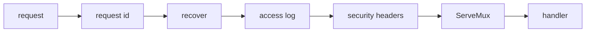
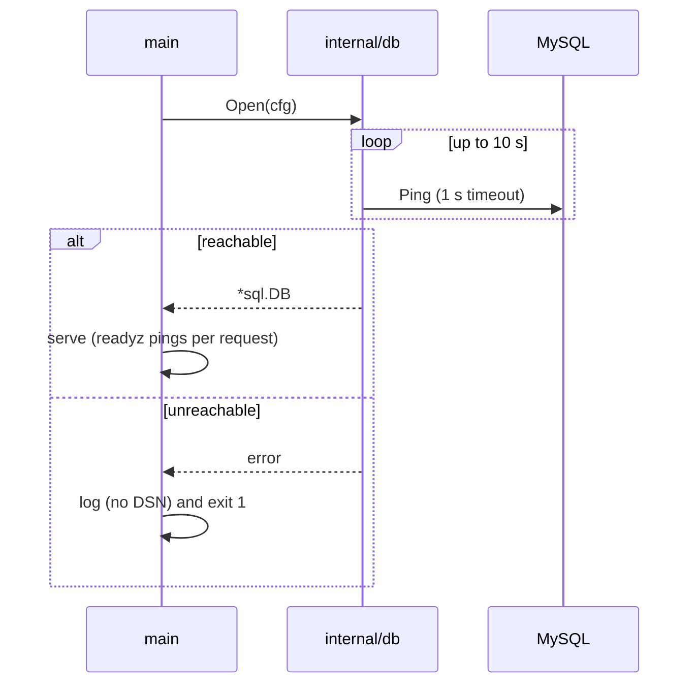
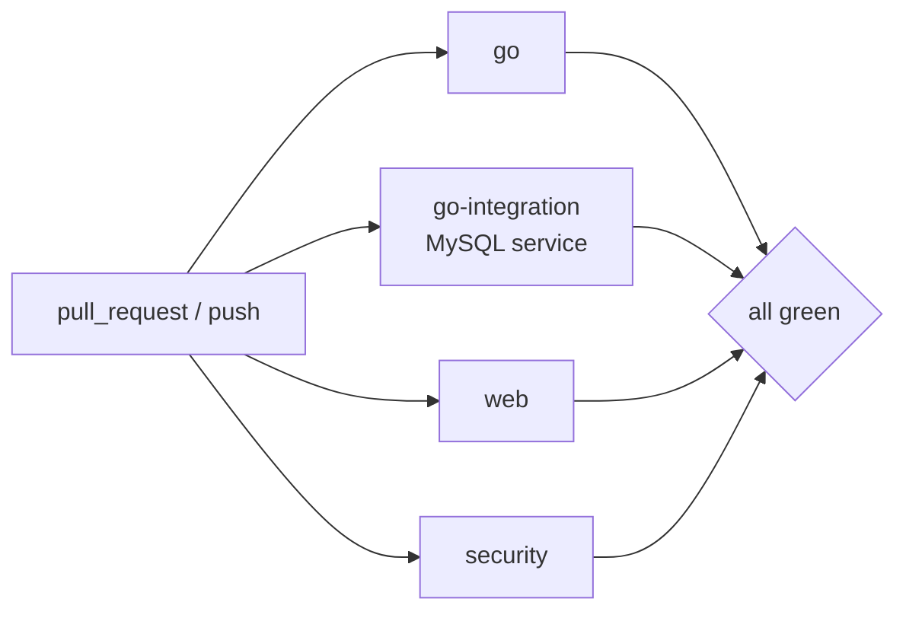
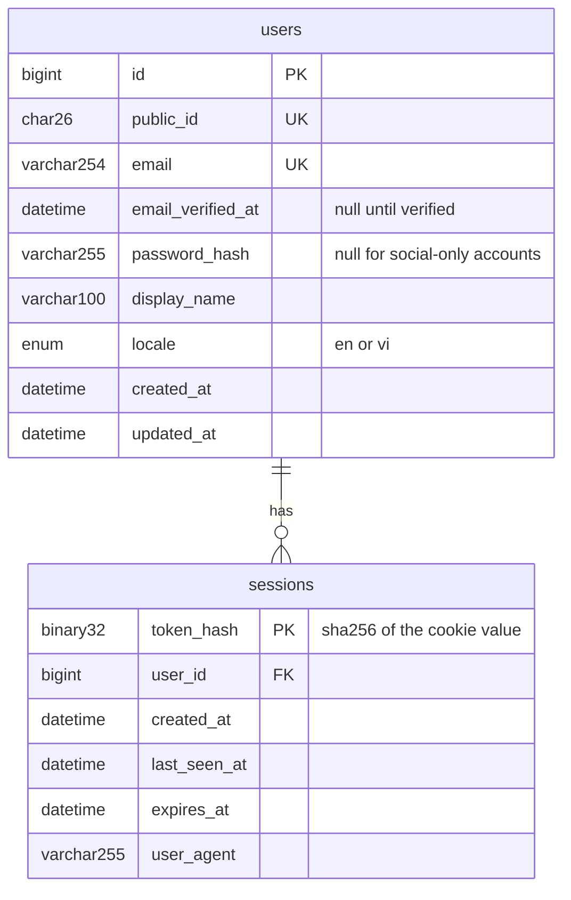
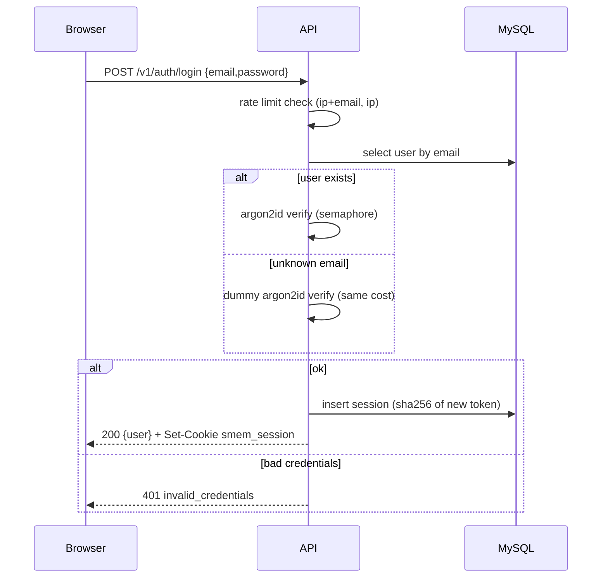
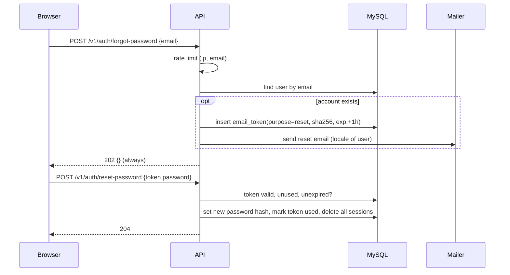
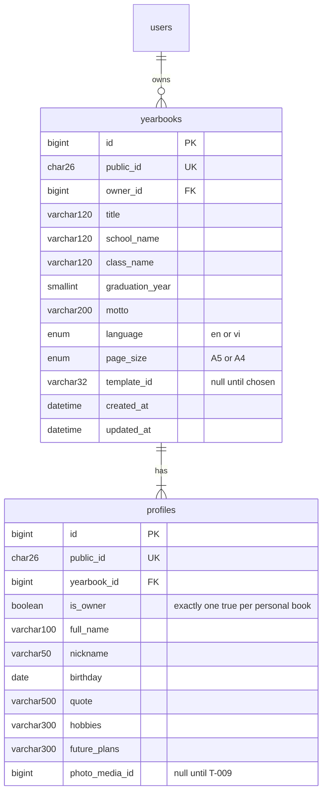
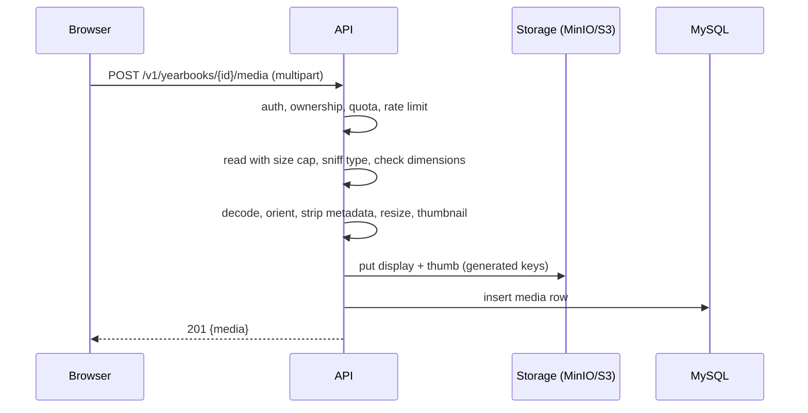
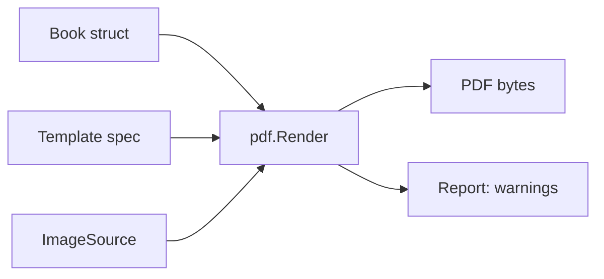

# Team Board — SMemories

> **Source of truth for the leader / dev / QA team.**
> **Leader** writes everything here. **Dev and QA** may only change a task's status and add comments (through `board.py`). **You** answer the questions in §3 — edit the `Answer` line in place or just tell the leader.
> Status flow: `BACKLOG → TODO → IN_PROGRESS → READY_FOR_QA → IN_QA → QA_PASS | QA_FAIL → (leader review) → MERGED → DONE`.
> `MERGED` = merged to `develop` and **waiting for your review**; tell the leader "accept T-007" (or `bin/team accept T-007`) to make it `DONE`.

## 0. At a glance

<!-- summary:start -->
| Status | # | Tasks |
|---|---:|---|
| BACKLOG | 17 | T-011, T-012, T-013, T-014, T-015, T-016, T-017, T-018, T-019, T-020, T-021, T-022, T-023, T-024, T-025, T-026, T-027 |
| TODO | 9 | T-002, T-003, T-004, T-006, T-007, T-008, T-009, T-010, T-028 |
| QA_FAIL | 1 | T-005 |
| MERGED | 1 | T-001 |

**Awaiting your review (MERGED):** T-001 (Repo foundation and API skeleton)

**Open questions for you:** none

_Board last written 2026-10-07 02:47Z_
<!-- summary:end -->

## 1. Vision & orientation

**Product.** SMemories is a web app where students design, collect content for, and export their own yearbook. Friends leave messages and photos through a shareable link (no account needed), the owner picks a template and fills in the book's information, and the app exports a print-quality PDF. Class yearbooks (many students, one book) come after the personal flow works. Product description: [`/README.md`](../README.md).

**Users.** Primary: university/college students aged 18+ who own a yearbook. Contributors: friends, teachers, family — anonymous, link-based. Later: class admins (teacher or class monitor). School-age (under 18) account holders are a deliberate later milestone (consent, photo rules).

**Non-goals (until the owner says otherwise).** Ordering printed books in-app; payments; under-18 account holders; free-form drag-and-drop canvas editor; video/audio messages; native mobile apps; AI layout.

**Hard constraints.**
- Public GitHub repo (`danyaa666/smemories`): no secrets, ever. `.env*` is git-ignored; only `.env.example` with dev-only values is committed.
- UI in English and Vietnamese from the first screen (i18n from M0).
- Vietnamese diacritics and emoji must survive storage (MySQL `utf8mb4`) and PDF output.
- Dev and QA agents run and test everything **locally with no cloud credentials** (docker-compose MySQL + MinIO). Anything needing AWS or a third-party account is owner-assisted and lives in M2.

**Quality bar.**
- CI green on `develop` — Go: gofmt, `go vet`, golangci-lint, `go test -race`, govulncheck. Web: eslint, `tsc --noEmit` (strict), vitest, production build, i18n key parity.
- New or changed logic has tests that would catch a regression; service and handler packages ≥ 70 % line coverage (reported first, gating later).
- Every HTTP endpoint is in `api/openapi.yaml` and in a Postman collection; every error uses the shared envelope (§5).
- Public (unauthenticated) endpoints are rate-limited; uploads are validated; no personal data in logs.
- Performance: p95 for non-export API calls < 300 ms on the local stack. A 24-page A5 book with 30 photos exports end to end in ≤ 60 s using ≤ 512 MB peak memory.

## 2. Roadmap

| Horizon | Milestone | Goal | Exit criteria ("stable") | Status |
|---|---|---|---|---|
| Now | M0 Foundation | Repo skeleton, local stack, web scaffold, CI, PDF engine proven | see M0 exit below | in progress |
| Now | M1 Personal yearbook, end to end | One student creates a yearbook, collects friends' notes, picks a template, exports a PDF | see M1 exit below | planned (specified) |
| Next | M2 Go live on AWS and harden | Production environment, real email, observability, backups, privacy tooling | sketch only | BACKLOG |
| Next | M3 Class yearbook | Class space, invites, roles, assembling many students' pages into one book | sketch only | BACKLOG |
| Later | M4+ | Print-shop-ready PDF (bleed, CMYK note), under-18 support, more social providers, free-form editor, in-app print ordering | direction only | idea |

**M0 exit.** From a clean checkout: `make up && make migrate` starts MySQL and MinIO; `make build test lint` is green; `GET /healthz` is 200 and `GET /readyz` reflects the database; the web dev server shows the home page with a working EN/VI switcher and an API status badge; CI is green on a PR; the PDF engine ADR is merged with a go/no-go verdict backed by a Vietnamese-text sample, 300 DPI image test and a memory/time measurement; no secrets in the repo.

**M1 exit (what "stable" means for the first release).** On a clean local stack a new user can, in both English and Vietnamese: register and sign in (email+password; Google against a fake OIDC provider in tests); create a personal yearbook and fill in its information; upload photos; create a notes link and, **as an anonymous visitor**, submit a note with text, emoji and two photos; approve or hide notes; choose between at least two templates; export a PDF (A5, 24 pages, 30 photos) that renders Vietnamese text correctly (no missing glyphs) within the quality-bar budget; download it. An automated end-to-end smoke test of exactly this journey runs in CI. No open P0/P1 bugs, health checklist has no open high-severity item, and every `Risk: high` task is owner-approved.

## 3. Questions & decisions for you

<!-- questions:start -->

### Q-001 — IaC tool for AWS (OpenTofu/Terraform, CDK, or CloudFormation)
- **Status:** RESOLVED
- **Asked:** 2026-10-06 10:13Z
- **Blocks:** T-023
- **Recommendation:** A: OpenTofu / Terraform
- **Answer:** A

**Decision needed:** Which tool defines the AWS infrastructure (Fargate, RDS MySQL, S3, CloudFront) as code?
**Why now / what it blocks:** Only T-023 (AWS IaC and deploy pipeline, M2). M0 and M1 are unaffected, so there is no hurry; answer before M1 is nearly done.
**Constraints:** Solo owner plus AI agents; agents cannot hold long-lived AWS keys (deploys use GitHub OIDC); everything must be reviewable in a PR as a plan/diff; no extra paid service.

| Option | Pros | Cons | Cost / effort | Risk & lock-in | Reversibility |
|---|---|---|---|---|---|
| A (recommended) OpenTofu / Terraform (HCL) | Largest ecosystem and examples; explicit `plan` diff reviewed in PRs; strong module support for VPC, RDS, ECS, CloudFront; agents write HCL reliably | Separate language and state to manage (S3 backend + lock); Terraform itself is BSL-licensed, OpenTofu is the open fork | Free; about 1 task to set up state, 2 to 3 for the stack | Low; HCL is widely portable | Medium: migrating IaC later is real work but possible |
| B AWS CDK (TypeScript) | Same language as the frontend; loops and types; generates CloudFormation | CDK upgrades churn; harder to review the real change (synthesised template); heavier toolchain | Free; similar effort | AWS-only | Medium |
| C CloudFormation / SAM (YAML) | No extra tooling; native | Verbose; weak reuse; slow feedback | Free; more effort | AWS-only | Medium |

**Recommendation:** Option A, because the `plan` output gives you a readable review gate before anything changes in your AWS account, the module ecosystem removes most of the VPC/RDS/ECS boilerplate, and it keeps working if you ever leave AWS. Prefer OpenTofu unless you already use Terraform.
**If undecided:** T-022 (Dockerfile and production config) proceeds; T-023 stays in BACKLOG. Default assumed at the start of M2: Option A.
**Revisit when:** you adopt a platform team standard, or move off AWS.

### Q-002 — Roadmap order after M1: go-live (M2) before class yearbook (M3)?
- **Status:** RESOLVED
- **Asked:** 2026-10-06 10:13Z
- **Blocks:** —
- **Recommendation:** A: M2 go-live first, then M3 class
- **Answer:** A

**Decision needed:** After M1, build "go live on AWS" (M2) first, or the class yearbook (M3) first?
**Why now / what it blocks:** Only the order of M2 and M3. M0 and M1 are the same either way.
**Constraints:** Class yearbooks are your headline use case; a personal yearbook is already usable alone; real users need a production environment.

| Option | Pros | Cons | Cost / effort | Risk & lock-in | Reversibility |
|---|---|---|---|---|---|
| A (recommended) M2 go-live, then M3 class | Real users test the personal flow early; infra, email and backups are proven before you hold a whole class's data; M3 then ships onto a live system | Class mode (the headline feature) arrives later | M2 is mostly owner-assisted infra work | Low | High: roadmap order only |
| B M3 class first, then go-live | Headline feature sooner | You build a larger, privacy-heavy feature with no production feedback; go-live is delayed and riskier | Larger M3 before any users | Medium | High |

**Recommendation:** Option A, because class mode multiplies the personal data you hold (many students, many photos) and I would rather prove deployment, email, backups and deletion with a small user base first.
**If undecided:** Roadmap stays M2 then M3; tasks T-026 and T-027 remain in BACKLOG.
**Revisit when:** a school or class pilot gets a date.

<!-- questions:end -->

## 4. Architecture & decision log

Owner decisions (2026-10-06, `/team-init` interview). "Rejected" lists the options the owner or leader declined.

| # | Decision | Rationale / consequences | Rejected | Revisit when |
|---|---|---|---|---|
| D-01 | **Audience: university/college (18+) first.** | Adults only, so no parental-consent flow in v1. Contributors may be anyone but the form collects the minimum (name, message, photos). | High school incl. minors; both from day one | A school pilot is planned (own milestone: consent, photo rules, teacher-gated accounts) |
| D-02 | **UI languages: English + Vietnamese, i18n from M0.** | All strings externalised (react-i18next); CI fails on key mismatch between locales. API error codes are stable; messages are localised on the client. | EN only; VI only | A third language is requested (just translation files) |
| D-03 | **M1 = personal yearbook end to end; class mode is M3.** | Proves the whole value chain without roles/invites. Class mode reuses the same book/page/notes engine. | Class first; both thin | Owner wants a class pilot sooner (see Q-002) |
| D-04 | **Print scope: PDF export only.** | Print-quality PDF (A5/A4, safe margins, 300 DPI images). User prints it anywhere. | PDF + print-shop spec (bleed/CMYK); in-app ordering | Users ask for print-shop acceptance (M4) |
| D-05 | **Stack: Go API + Vite + React + TypeScript SPA + MySQL 8.4.** | Matches the existing Go scaffold. MySQL chosen by the owner (leader had recommended PostgreSQL). Consequences: charset `utf8mb4`; no `RETURNING` (use `LastInsertId`); no Postgres-only features (RLS, partial indexes); RDS MySQL in M2. React chosen as the Vite framework (leader recommendation, owner said "Vite frontend"). | Next.js full-stack TS; Go + HTMX; Vue; Svelte | — |
| D-06 | **PDF engine: pure-Go PDF library.** | Owner chose this over the leader's recommendation (headless Chromium + HTML/CSS). Consequences: templates are a **declarative JSON spec rendered by Go**, not HTML/CSS; the M1 editor is **form/slot-based** (no free-form canvas); preview is the **real PDF shown with pdf.js**, so preview equals output; Vietnamese needs an embedded Unicode TTF and NFC-normalised text. Candidate libraries (MIT): `go-pdf/fpdf`, `signintech/gopdf`; chosen by spike **T-005**. `unipdf` is excluded unless the owner approves its commercial licence. | HTML→PDF via Chromium; hosted PDF API | T-005 finds no library meets the criteria (then Chromium returns to the table) |
| D-07 | **Auth: in-house in Go.** Email+password (argon2id) and Google sign-in (OIDC, PKCE); other social providers later. | Agents must test locally with no cloud credentials; no per-user fees; no vendor lock-in. Cost: we own the security details, so every auth task is `Risk: high` and needs `bin/team approve`. | Amazon Cognito; Clerk/Auth0/Supabase; email+password only | Compliance requires a managed IdP, or MAU grows large |
| D-08 | **Hosting: AWS (Fargate + RDS MySQL + S3 + CloudFront).** | Owner choice; provisioning is M2 and owner-assisted (account, billing, domain, Google OAuth client). Local dev is docker-compose either way. IaC tool undecided — see Q-001. | Container PaaS + R2; decide later | — |
| D-09 | **Repository: public `github.com/danyaa666/smemories`.** | Owner choice. The board (`.team/`) and all code are public — never commit secrets, real data, or student photos. Module path `github.com/danyaa666/smemories`. | Private; owner-created repo | — |
| D-10 | **IaC tool: OpenTofu / Terraform (HCL).** | Answered `A` on the board (2026-10-07, Q-001). State in an S3 backend with locking; deploys authenticate with GitHub OIDC (no long-lived AWS keys). Used by T-023 (M2). | AWS CDK; CloudFormation/SAM | A platform standard appears, or the project leaves AWS |
| D-11 | **Roadmap order: M2 go-live before M3 class yearbook.** | Answered `A` on the board (2026-10-07, Q-002). Prove deployment, email, backups and deletion with a small user base before holding a whole class's data. | M3 class first | A school or class pilot gets a date |

Leader decisions (low-risk, inside the approved stack):

| # | Decision | Why |
|---|---|---|
| L-01 | Go: stdlib `net/http` ServeMux (Go 1.22+ patterns) + small middleware; `database/sql` + `go-sql-driver/mysql`; `sqlc` (MySQL engine) for typed queries; `pressly/goose` migrations, embedded SQL; `log/slog` JSON logging; `aws-sdk-go-v2` for S3 (MinIO locally). | Fewest dependencies; each piece is boring and replaceable. |
| L-02 | API contract is a hand-written `api/openapi.yaml` (OpenAPI 3.1); TS types generated with `openapi-typescript`; Postman collection per epic in `postman/`. | One contract both sides read; keeps FE/BE from drifting. |
| L-03 | Web: react-router, TanStack Query, react-i18next, Vitest + Testing Library, `pdfjs-dist` for the preview; Playwright for the M1 E2E smoke; system font stack (handles Vietnamese). | Mainstream choices with the best agent support. pdf.js (not an `<iframe>`) because phone browsers do not show embedded PDFs. |
| L-04 | Repo layout: `cmd/<binary>/`, `internal/<domain>/`, `migrations/`, `api/`, `postman/`, `web/`, `docs/`, `docker-compose.yml`, `Makefile`. | One Go module at the root, one Vite app in `web/`. |
| L-05 | IDs: `BIGINT UNSIGNED AUTO_INCREMENT` primary keys internally; every externally visible id is an opaque ULID (`CHAR(26)`, unique). Timestamps are `DATETIME(6)` in UTC. | No enumerable ids in URLs; cheap joins. |
| L-06 | Risk calibration: **high** = auth, anything personal-data-bearing and public, file uploads, new core dependency, infra/CI/secrets, migrations that change existing data. Greenfield **additive** migrations before the first production deploy are **low** (no data to lose). | Keeps owner approvals for what can really hurt, not for every table. |
| L-07 | HTTP paths: infrastructure routes `/healthz` and `/readyz` at the root; business routes under `/v1/…`. The web app calls the API at `/api/*` on its own origin and the edge strips `/api` (Vite proxy in dev, CloudFront in M2). Same origin means a `SameSite=Lax` session cookie works and no CORS is needed. | Simplest secure cookie setup; one place (the edge) owns the prefix. |

## 5. Engineering conventions

- **Build:** `make build` (Go build + web build). **Test:** `make test` (Go `-race` unit tests + vitest). **Integration:** `make test-integration` (needs `make up`). **Lint:** `make lint` (gofmt check, `go vet`, golangci-lint, eslint, `tsc --noEmit`, i18n parity). These targets are created by T-001, T-002, T-003 and mirrored in `.team/config.json`.
- **Branches:** `task/t-<id>-<slug>`, one per task, PR to `develop`, squash-merged by the leader; the owner promotes `develop` → `main` with `bin/team promote`.
- **API errors:** always `{"error":{"code":"snake_case_code","message":"English text for logs","request_id":"…"}}` with the right HTTP status. Codes are the contract; the client localises messages.
- **Data:** UTF-8 everywhere (`utf8mb4`), UTC timestamps, opaque ULIDs outside the database, no PII in logs, secrets only from environment variables.
- **i18n:** every user-visible string lives in `web/src/locales/{en,vi}.json`; both files get the key in the same PR.
- **Definition of done:** acceptance criteria met; tests written and green; build + lint green; `api/openapi.yaml` and the Postman collection updated for any HTTP change; PR open; QA_PASS; leader review passed.

## 6. Tasks

Task block anatomy (leader-written; dev/qa touch only `Status`, `Branch`, `PR`, and the Comments list):

```text
### T-007 — Short imperative title
- **Status:** TODO
- **Priority:** P1            (P0 urgent … P3 nice-to-have)
- **Type:** feature | bug | tech-debt | security | perf | docs | infra
- **Milestone:** M1
- **Depends-on:** T-003, T-004
- **Assignee:** —            (maintained automatically)
- **Branch:** —   **PR:** —
#### Description / Acceptance criteria / Design (mermaid) / Test plan
#### Comments                (one line per comment: timestamp · role · text)
```

<!-- tasks:start -->

### T-001 — Repo foundation and API skeleton
- **Status:** MERGED
- **Priority:** P1
- **Type:** infra
- **Milestone:** M0
- **Depends-on:** —
- **Risk:** low
- **Rework:** 0
- **Owner-approved:** —
- **Assignee:** —
- **Branch:** task/t-001-repo-foundation-and-api-skeleton
- **PR:** https://github.com/danyaa666/smemories/pull/1
- **Updated:** 2026-10-07 02:47Z by leader
- **Comments-seen:** 3

#### Description
Replace the GoLand "hello world" stub with the skeleton every other task builds on: module path, directory layout, an HTTP server with shared middleware and the shared error envelope, env-based config, the OpenAPI/Postman starting points and the Makefile. Nothing product-specific yet. Decisions: board §4 D-05, L-01, L-04, L-07; conventions §5.

#### Scope
- In: rename the module; remove root `main.go`; `cmd/smemories-api`; `internal/config`; `internal/httpx` (router, middleware, error and JSON helpers); `GET /healthz`; `api/openapi.yaml` (health + error schema); `postman/platform.postman_collection.json`; `Makefile`; `.env.example`; `.editorconfig`; README "Development" section.
- Out (do not do): database (T-002), web app (T-003), CI (T-004), Dockerfile (M2), any auth or business endpoint, any third-party router/framework.

#### Acceptance criteria
- [ ] AC1 — `go.mod` module is `github.com/danyaa666/smemories` (keep the `go` directive); the root `main.go` stub is gone; `go build ./...` succeeds.
- [ ] AC2 — `make build`, `make test`, `make lint`, `make run` exist and pass from a clean checkout. `lint` = `gofmt -l .` must print nothing + `go vet ./...` (golangci-lint arrives in T-004).
- [ ] AC3 — `GET /healthz` → `200 {"status":"ok"}`. Unknown path → `404 not_found`; wrong method → `405 method_not_allowed` with an `Allow` header; both use the error envelope `{"error":{"code","message","request_id"}}`.
- [ ] AC4 — Each request writes one JSON slog line with `request_id, method, path, status, duration_ms` (never bodies, `Cookie`, or `Authorization`). Response carries `X-Request-Id`: a client value is reused only if it matches `^[A-Za-z0-9-]{8,64}$`, otherwise a new id is generated. A handler panic returns `500 internal_error` in the envelope, logs the stack, and the server keeps serving.
- [ ] AC5 — Config reads env vars with prefix `SMEM_`: `SMEM_HTTP_ADDR` (default `:8080`), `SMEM_ENV` (`dev|test|prod`, default `dev`), `SMEM_LOG_LEVEL` (`debug|info|warn|error`, default `info`). An invalid value makes the process exit non-zero with a message that names the variable. `.env.example` lists every variable with dev-only values; no secrets.
- [ ] AC6 — SIGTERM/SIGINT: stop accepting, drain in-flight requests for up to 10 s, exit 0. Server sets `ReadHeaderTimeout` 5 s, `ReadTimeout` 15 s, `WriteTimeout` 30 s, `IdleTimeout` 60 s; request bodies are capped at 1 MiB by default (`413 payload_too_large`), overridable per route.
- [ ] AC7 — Every response carries `X-Content-Type-Options: nosniff`, `Referrer-Policy: no-referrer`, `X-Frame-Options: DENY`, `Cache-Control: no-store`.
- [ ] AC8 — `api/openapi.yaml` (OpenAPI 3.1) documents `/healthz` and the `Error` schema; `postman/platform.postman_collection.json` covers `/healthz`, the 404 and the 405 cases with assertions.
- [ ] AC9 — README gains a "Development" section: prerequisites (Go version from `go.mod`), the make targets, how to run the API locally.

#### Design
Files: `go.mod`, `Makefile`, `.env.example`, `.editorconfig`, `cmd/smemories-api/main.go`, `internal/config/config.go`, `internal/httpx/{router,middleware,errors,respond}.go`, `api/openapi.yaml`, `postman/platform.postman_collection.json`, tests next to the code.

Helpers every later task reuses: `httpx.WriteJSON(w, status, v)` and `httpx.WriteError(w, r, status, code, msg)`. Domain packages later expose `Routes(mux *http.ServeMux)`; `main` only wires config → router → server. Use Go 1.22+ method patterns (`mux.Handle("GET /healthz", ...)`). Infra routes (`/healthz`, `/readyz`) live at the root; business routes will live under `/v1/` (L-07).



#### Risk
`low`

#### Security & performance notes
No secrets in the repo (public). Do not log bodies, cookies or authorization headers. Timeouts and the body cap are slow-client and large-body protection. Do not trust `X-Request-Id` blindly (log injection).

#### Test plan
- Dev: table tests for config parsing (valid, invalid, defaults); `httptest` tests for AC3/AC4/AC6/AC7 (404/405 envelope, request-id reuse and regeneration, panic recovery, headers, body cap); a test that starts the server on `:0` and shuts it down on context cancel.
- QA should probe: `X-Request-Id` containing CR/LF or 10 kB; 2 MiB POST body; `kill -TERM` while a slow request is in flight; run `make` targets from a fresh clone; run the Postman collection twice back to back.

#### Comments
- 2026-10-07 02:37Z · leader · Board repair by leader: the dev's READY_FOR_QA transition (events.jsonl 02:20:20Z) and PR link were lost from the README (a stale overwrite); restored from the event log and `gh pr view 1` (task/t-001-repo-foundation-and-api-skeleton -> develop, open, mergeable, no CI yet). Dev hand-back, relayed and NOT yet verified (QA to confirm): all 9 AC covered by tests; `make lint build test` green; live binary checked /healthz, 404/405 envelopes, SIGTERM exit 0, invalid SMEM_ENV exits 1 naming the variable; Newman collection passed twice back to back (10/10). Deviation from the design diagram: the access log wraps recover, so a recovered panic logs as 500 and security headers also appear on 500s. No new dependencies. PR #1 and PR #2 will conflict trivially on go.mod and Makefile; dev rebases the second after the first merges.
- 2026-10-07 02:40Z · qa · QA_PASS at e19483a, verified myself from a fresh clone of the PR branch, not the dev's claims. AC1: go.mod module github.com/danyaa666/smemories, go 1.26 kept, no root main.go, go build ok. AC2: 'make lint build test' green on a fresh clone; go test -race -count=3 green; coverage config 100%, httpx 86%. AC3: live binary: /healthz 200 {status:ok}; /nope 404 not_found; POST and DELETE /healthz 405 method_not_allowed with Allow: GET, HEAD; all in envelope with request_id equal to X-Request-Id. AC4: one JSON log line per request with request_id,method,path,status,duration_ms; no query/cookie/auth in logs. X-Request-Id: valid reused; invalid or 10 kB id replaced with a fresh 32-hex id; CR injection attempt rejected by net/http with 400 before reaching our code. Panic recovery covered by unit test (logs stack, 500 envelope, keeps serving); not reachable on the live binary (no panicking route). AC5: SMEM_ENV=staging, SMEM_LOG_LEVEL=loud, SMEM_HTTP_ADDR=abc/:99999/:8080x each exit 1 naming the variable; defaults ok; .env.example has no secrets. AC6: SIGTERM and SIGINT exit 0 in 0.02 s idle; with a stalled half-sent request SIGTERM exits 0 in 4.8 s (ReadHeaderTimeout), new connections refused after SIGTERM; in-flight-handler drain covered by TestServeStartsAndShutsDownOnCancel (the real binary has no slow route to test it live); timeouts asserted by TestNewServerTimeouts; 2 MiB body cap covered by unit tests (413 payload_too_large, exact-cap OK, per-route override) because the live binary has no route that reads a body: first body-reading endpoint's task must add a live 413 case. AC7: all four headers present on 200/404/405 live and on 500 in unit test. AC8: openapi.yaml documents /healthz and Error (redocly lint: structurally valid, only style warnings); Newman run twice back to back on a fresh server: 5 requests/10 assertions, 0 failed both times. AC9: README Development section present and accurate; 'make run' starts the server (verified). make lint run on the PR: no CI exists yet (T-004), 'gh pr checks' reports none. Non-blocking: (a) golangci-lint v on this machine reports 2 findings that T-004 will hit: errcheck internal/httpx/server_test.go:46 (resp.Body.Close) and staticcheck ST1023 internal/httpx/router.go:23 ('var h http.Handler =' can drop the type); (b) openapi.yaml: 404 and 413 responses are not documented and no 'security: []'; (c) cmd/smemories-api has 0% coverage; (d) the 404 Newman test asserts the code twice. Dev deviation (access log wraps recover) confirmed and fine. PR #1 mergeable against develop on its own.
- 2026-10-07 02:47Z · leader · merged c4c25a8 (squash). Review: all 9 AC met by the diff, no new deps, middleware order differs from the diagram in a justified way (access log wraps recover, so panics log as 500 and 500s carry security headers). For owner to check: run make run and curl localhost:8080/healthz. Follow-ups in T-028.

### T-002 — Local stack (MySQL + MinIO), migrations and readiness
- **Status:** TODO
- **Priority:** P1
- **Type:** infra
- **Milestone:** M0
- **Depends-on:** T-001
- **Risk:** low
- **Rework:** 0
- **Owner-approved:** —
- **Assignee:** —
- **Branch:** —
- **PR:** —
- **Updated:** 2026-10-06 10:11Z by leader
- **Comments-seen:** 0

#### Description
Give every later task a database and object store that start locally with one command, a migration mechanism that can also run as a one-off task on ECS later, a readiness endpoint, and an integration-test harness. Decisions: D-05 (MySQL 8.4, `utf8mb4`), L-01, L-05, hard constraint "agents test locally with no cloud credentials".

#### Scope
- In: `docker-compose.yml` (MySQL 8.4 + MinIO + bucket init); `internal/db` (open, pool, ping); goose migrations with embedded SQL; `cmd/smemories-migrate`; `GET /readyz`; `internal/db/dbtest` harness; Makefile targets `up`, `down`, `migrate`, `migrate-down`, `test-integration`; `api/openapi.yaml` + Postman updated for `/readyz`.
- Out (do not do): any real tables (first migration is the harmless `app_meta`), S3 client code (T-009), app Dockerfile (M2), CI changes (T-004).

#### Acceptance criteria
- [ ] AC1 — `make up` copies `.env.example` to `.env` if missing, starts MySQL 8.4 and MinIO, and returns only when both are healthy; `make down` stops them. Published ports bind to `127.0.0.1` only. Credentials come from `.env` (dev-only values).
- [ ] AC2 — MySQL runs with `utf8mb4` / `utf8mb4_0900_ai_ci`, `STRICT_ALL_TABLES` in `sql_mode`, and time zone `+00:00`.
- [ ] AC3 — `smemories-migrate up|down|status` work against the compose DB; `make migrate` = `up`. Migrations are SQL files in `migrations/`, embedded in the binary. `0001_app_meta.sql` creates `app_meta(k VARCHAR(64) PRIMARY KEY, v VARCHAR(255) NOT NULL)` and inserts `('schema_epoch','1')`. An `up → down → up` cycle leaves a working schema.
- [ ] AC4 — `internal/db.Open(cfg)` builds the DSN with `parseTime=true&loc=UTC&charset=utf8mb4&collation=utf8mb4_0900_ai_ci`; pool settings from `SMEM_DB_MAX_OPEN` (20), `SMEM_DB_MAX_IDLE` (5), `SMEM_DB_CONN_MAX_LIFETIME` (5m). `SMEM_DB_DSN` is required outside `test`. The API retries the first ping for up to 10 s, then exits non-zero with a clear message. The DSN (with password) is never logged.
- [ ] AC5 — `GET /readyz` → `200 {"status":"ready"}` when a `PingContext` (1 s timeout) succeeds; otherwise `503 not_ready` in the error envelope, with no driver error text in the body (log it instead).
- [ ] AC6 — Round trip test: store and read back `Chúc mừng 🎓 Đặng Thị Hồng` byte-identically, and assert `character_set_client/connection/results` are `utf8mb4` on a pooled connection.
- [ ] AC7 — `dbtest.New(t)` creates a uniquely named database, applies all migrations, returns `*sql.DB`, and drops the database in `t.Cleanup`. Integration tests carry build tag `integration`; `make test-integration` runs them (`SMEM_TEST_DB_DSN` env, defaulting to the compose database).
- [ ] AC8 — MinIO bucket `smemories-dev` is created automatically by an init container; console reachable on `127.0.0.1:9001`.
- [ ] AC9 — `api/openapi.yaml` documents `/readyz`; Postman collection covers ready (200) and a documented way to see 503 (stop DB).

#### Design
Files: `docker-compose.yml`, `.env.example` (extend), `migrations/0001_app_meta.sql`, `internal/db/{db,migrate}.go`, `internal/db/dbtest/dbtest.go`, `cmd/smemories-migrate/main.go`, `internal/httpx` (readyz route registered from `main` with a `Pinger` interface so tests can fake it), `Makefile`.



#### Risk
`low` — greenfield, additive, no production data (board L-06). Compose credentials are dev-only and must not be reused anywhere real.

#### Security & performance notes
Bind services to loopback only. Never print the DSN. `readyz` must not leak driver errors. Pool limits must be configurable now because Fargate tasks multiply connections against RDS later.

#### Test plan
- Dev: unit tests for DSN building and config validation; integration tests for migrate cycle, utf8mb4 round trip, `readyz` 200 and 503 (use a closed `*sql.DB`).
- QA should probe: `make up` twice (idempotent); `make down` then `make up` keeps data volume; run `up→down→up` twice; kill MySQL while the API runs and watch `/readyz` flip to 503 and recover; confirm ports are not reachable on the LAN IP.

#### Comments

### T-003 — Web scaffold: Vite + React + TypeScript + EN/VI i18n
- **Status:** TODO
- **Priority:** P1
- **Type:** feature
- **Milestone:** M0
- **Depends-on:** T-001
- **Risk:** low
- **Rework:** 0
- **Owner-approved:** —
- **Assignee:** —
- **Branch:** —
- **PR:** —
- **Updated:** 2026-10-06 10:11Z by leader
- **Comments-seen:** 0

#### Description
Create the web app skeleton: Vite + React + TypeScript with English/Vietnamese i18n from the first screen, a typed API client generated from `api/openapi.yaml`, tests, and make targets. Decisions: D-02, D-05, L-02, L-03, L-07.

#### Scope
- In: `web/` app; i18n with `en.json`/`vi.json`; language switcher; i18n parity check; typed client + error mapping; home page with API status badge; not-found page; dev proxy; make targets.
- Out (do not do): auth pages, any product screen, state management beyond TanStack Query setup, CSS framework (plain CSS modules or one small global stylesheet), web fonts (use the system font stack, which covers Vietnamese), CI (T-004).

#### Acceptance criteria
- [ ] AC1 — `web/` is a Vite + React + TypeScript app (`strict`, `noUncheckedIndexedAccess`). `npm ci && npm run build` passes from a clean clone. Node version pinned in `web/.nvmrc` (22 LTS) and `engines`.
- [ ] AC2 — `npm run lint` (eslint, zero warnings), `npm run typecheck` (`tsc --noEmit`), `npm test` (vitest + Testing Library) pass; Prettier config committed.
- [ ] AC3 — i18n via react-i18next with `web/src/locales/en.json` and `vi.json`. A language switcher (EN | VI) is an accessible button group using `aria-pressed`. The choice persists in `localStorage` (reads and writes wrapped in try/catch; the app works without storage), default from `navigator.language` (`vi*` → `vi`, else `en`), and `<html lang>` follows the active language.
- [ ] AC4 — `npm run lint:i18n` exits non-zero and names the key when a key exists in only one locale or a value is empty; a unit test proves it fails on a fixture pair and passes on the real files.
- [ ] AC5 — Home route `/` shows the app name, a translated tagline, the language switcher and an API status badge that calls `GET /api/healthz` through the typed client: "API: ok" / "API: unreachable" (translated). An unknown route renders a translated not-found page.
- [ ] AC6 — `npm run gen:api` generates `web/src/api/schema.d.ts` from `../api/openapi.yaml` with `openapi-typescript`; the file is committed and `npm run check:api` fails if it is stale. A thin fetch wrapper sends/receives JSON and maps the error envelope to a typed `ApiError { status, code, message, requestId }`.
- [ ] AC7 — Vite dev server proxies `/api/*` to `http://localhost:8080/*` (prefix stripped, see L-07).
- [ ] AC8 — Makefile gains `web-install`, `web-build`, `web-test`, `web-lint`; `make build`, `make test`, `make lint` now include the web steps.
- [ ] AC9 — Accessibility basics: `header`/`main` landmarks, visible focus ring, text contrast ≥ 4.5:1, language switcher usable by keyboard; covered by role-based Testing Library queries.

#### Design
Files: `web/package.json`, `web/vite.config.ts`, `web/tsconfig*.json`, `web/eslint.config.js`, `web/src/{main.tsx,App.tsx,i18n.ts}`, `web/src/locales/{en,vi}.json`, `web/src/api/{client.ts,schema.d.ts}`, `web/src/pages/{Home,NotFound}.tsx`, `web/scripts/check-i18n.mjs`, tests next to the code. Query client and router are created in `main.tsx` so later tasks only add routes.

#### Risk
`low`

#### Security & performance notes
Never render API-supplied strings as HTML. Do not put tokens in `localStorage` (none exist yet; keep it that way — sessions will be HttpOnly cookies). Keep the initial bundle small: no UI kit.

#### Test plan
- Dev: tests for switcher behaviour (click, persistence, storage throwing, `lang` attribute), parity script (pass and fail fixtures), API badge (200, network error, 500 envelope), not-found page.
- QA should probe: delete a key from `vi.json` and confirm `lint:i18n` fails; browser language `vi-VN` on first load; block `localStorage` in a private window; keyboard-only use of the switcher; API down state.

#### Comments

### T-004 — CI pipeline (Go, web, integration, security)
- **Status:** TODO
- **Priority:** P1
- **Type:** infra
- **Milestone:** M0
- **Depends-on:** T-001, T-002, T-003, T-028
- **Risk:** high
- **Rework:** 0
- **Owner-approved:** —
- **Assignee:** —
- **Branch:** —
- **PR:** —
- **Updated:** 2026-10-07 02:47Z by leader
- **Comments-seen:** 1

#### Description
Continuous integration for the Go API and the web app so `develop` and `main` can be protected by required checks. Decisions: quality bar in board §1, risk rule L-06 (CI is high risk, owner approves the merge).

#### Scope
- In: `.github/workflows/ci.yml`; `.golangci.yml`; `.github/dependabot.yml`; `docs/ci.md`.
- Out (do not do): deployment, release or publishing workflows, any workflow that needs a repository secret, enabling branch protection (the owner does that; the leader recommends the exact settings).

#### Acceptance criteria
- [ ] AC1 — `ci.yml` runs on `pull_request` (any base) and on `push` to `develop` and `main`; superseded runs on the same ref are cancelled; top-level `permissions: contents: read`.
- [ ] AC2 — Job `go`: setup-go using the version in `go.mod`, module cache, `gofmt -l .` must print nothing, `go vet ./...`, golangci-lint (pinned version; config in `.golangci.yml` enabling at least `errcheck`, `govet`, `staticcheck`, `ineffassign`, `unused`, `gosec`, `bodyclose`), `go test -race -coverprofile=coverage.txt ./...` with the total coverage written to the job summary.
- [ ] AC3 — Job `go-integration`: MySQL 8.4 service container configured for `utf8mb4`; runs `make test-integration` against it.
- [ ] AC4 — Job `web`: Node from `web/.nvmrc`, `npm ci`, `lint`, `lint:i18n`, `typecheck`, `test`, `build`, `check:api`.
- [ ] AC5 — Job `security`: `govulncheck ./...` is blocking; `npm audit --audit-level=high --omit=dev` is reported but non-blocking, with a workflow comment explaining why and when to make it blocking.
- [ ] AC6 — Every third-party action is pinned to a full commit SHA with a version comment. `dependabot.yml` covers `gomod`, `npm` (directory `/web`) and `github-actions`, weekly, with grouped updates.
- [ ] AC7 — `docs/ci.md` lists the exact required check names (for branch protection on `develop` and `main`), what each job runs and the equivalent local `make` command.
- [ ] AC8 — The workflow is green on the PR that introduces it (link the run in the PR description); no secrets referenced anywhere.

#### Design
Files: `.github/workflows/ci.yml`, `.golangci.yml`, `.github/dependabot.yml`, `docs/ci.md`. Jobs named exactly `go`, `go-integration`, `web`, `security` so required-check names are stable. Reuse `make` targets from T-001..T-003 rather than duplicating commands where practical.



#### Risk
`high` — CI/infra change: the leader reviews and the owner approves the merge (`bin/team approve T-004`).

#### Security & performance notes
Least-privilege `GITHUB_TOKEN`; SHA-pinned actions (supply chain); no `pull_request_target`; no secrets. Keep total wall time under ~6 minutes with caching.

#### Test plan
- Dev: open the PR and show a green run; show cache hits on a second run.
- QA should probe: on a throwaway branch commit (a) an unformatted Go file, (b) a failing Go test, (c) a missing key in `vi.json`, (d) a stale `schema.d.ts`; confirm each is caught by the right job; delete the branch afterwards. Check that a PR from a fork would not receive secrets (none are referenced).

#### Comments
- 2026-10-07 02:47Z · leader · Leader note from the T-001 review: golangci-lint currently reports 2 findings on develop (errcheck at internal/httpx/server_test.go:46, ST1023 at internal/httpx/router.go:23). T-028 fixes them and now blocks this task, so the new CI starts green.

### T-005 — Spike: choose the pure-Go PDF engine
- **Status:** QA_FAIL
- **Priority:** P1
- **Type:** feature
- **Milestone:** M0
- **Depends-on:** —
- **Risk:** low
- **Rework:** 1
- **Owner-approved:** —
- **Assignee:** —
- **Branch:** task/t-005-spike-choose-the-pure-go-pdf-engine
- **PR:** https://github.com/danyaa666/smemories/pull/2
- **Updated:** 2026-10-07 02:44Z by qa
- **Comments-seen:** 5

#### Description
Spike: decide which pure-Go PDF library SMemories uses (board D-06: the owner chose a pure-Go engine over headless Chromium). Everything in M1 depends on this verdict, so it runs first and ends with a written go/no-go backed by measurements. Candidates (both MIT): `github.com/go-pdf/fpdf` and `github.com/signintech/gopdf`. `unipdf` is excluded (AGPL/commercial licence) unless the owner approves a licence cost.

#### Scope
- In: prototype for each candidate under `internal/pdf/spike/` (throwaway, marked as such); measurements; `docs/adr/0002-pdf-engine.md`; font and licence files.
- Out (do not do): template spec (T-010), HTTP endpoints, database, S3, production-quality code, any real person's photo (the repo is public — generate synthetic gradient/noise images).

#### Acceptance criteria
- [ ] AC1 — `docs/adr/0002-pdf-engine.md` has a table scoring **both** libraries against C1–C7 below (pass/fail plus the measured value), a short rationale, and the verdict `GO <library>` or `NO-GO`.
- [ ] AC2 — C1 Vietnamese: with an embedded OFL TTF that has full Vietnamese coverage (for example Be Vietnam Pro or Noto Sans; commit font + licence, < 2 MB total), the string `Chúc mừng tốt nghiệp! Đặng Thị Hồng, Nguyễn Quỳnh Phương, Trần Văn Ưu` renders with every diacritic visible (PNG screenshot committed under `docs/adr/0002-assets/`, each < 300 KB) and text extracted from the PDF by a Go extractor in the test equals the NFC input.
- [ ] AC3 — C2 Fallback and emoji: demonstrate per-rune font fallback (primary Vietnamese/Latin font → monochrome emoji font such as Noto Emoji, OFL) rendering `🎓🎉❤` as outlines, or document the exact workaround and its cost. A rune present in no font must not panic: show how it is detected so it can be reported.
- [ ] AC4 — C3 Images: a 4000×3000 JPEG placed full-bleed on A5 (148×210 mm) with centred `cover` cropping reaches ≥ 300 effective DPI in the frame; when no crop is needed the JPEG bytes are not re-encoded (PDF size ≈ source size); a PNG with alpha renders correctly.
- [ ] AC5 — C4 Layout primitives needed by templates: page sizes A5 and A4, filled rectangles, rounded-rectangle or circular image clipping (or a documented alternative), rotation of an image and of text by an angle, text wrapping inside a box with left/centre alignment and line-height control, text colour and opacity.
- [ ] AC6 — C5 Performance: a 40-page A5 book with 40 photos (4000×3000) — report wall time and peak RSS for each library and the machine used (targets ≤ 10 s and ≤ 512 MB).
- [ ] AC7 — C6 Licence and health: licence of each library and font is MIT/BSD/Apache/OFL (no AGPL or commercial); latest release date and maintenance status noted; `THIRD_PARTY_NOTICES.md` created.
- [ ] AC8 — C7 Validity: every sample PDF opens in macOS Preview and Chrome and passes `pdfcpu validate` (or an equivalent validator) without warnings.
- [ ] AC9 — The verdict is also posted as a board comment. On `NO-GO`, list the failed criteria with the smallest workaround for each, or recommend reopening headless Chromium (D-06 revisit trigger); the leader then asks the owner.

#### Design
Files: `internal/pdf/spike/{fpdf,gopdf}_test.go` with build tag `spike`, `internal/pdf/spike/README.md` ("throwaway — replaced by T-010"), `make spike` target running them, `docs/adr/0002-pdf-engine.md`, `docs/adr/0002-assets/*.png`, `THIRD_PARTY_NOTICES.md`, font files under `internal/pdf/fonts/`.

Decision rule the ADR applies: a library passes if C1, C2 (or an acceptable workaround), C3, C4, C6, C7 pass and C5 is within 2× of target. If both pass, prefer the one with fewer dependencies and better text-wrapping support. Normalise all text to NFC before drawing.

#### Risk
`low` — throwaway prototype, no production dependency yet (the chosen library lands in T-010, which is `high`).

#### Security & performance notes
Only trusted synthetic fixtures. Photos for the benchmark must be generated, never real people. Measure on idle hardware and say so.

#### Test plan
- Dev: `make spike` runs both prototypes and prints the numbers that go into the ADR.
- QA should probe: re-run `make spike` on their machine and compare against the ADR within a reasonable margin; open each generated PDF and the PNGs and check diacritics and emoji by eye; check the licence claims against each repository.

#### Comments
- 2026-10-07 02:35Z · dev · VERDICT: GO codeberg.org/go-pdf/fpdf v0.12.0 (gopdf v0.38.1 close second). Both pass C1-C7; tie-break (text wrapping, memory 442 vs 539 MB) picks fpdf. Caveats: (1) github.com/go-pdf/fpdf is archived, the live repo is on Codeberg, go directive becomes 1.26.0; (2) fpdf panics on runes above U+FFFF, so emoji use PUA aliases in the emoji font + a rune-run splitter; see ADR 'What T-010 must do'. Full table: docs/adr/0002-pdf-engine.md, PR #2. Spike adds go.mod deps (fpdf, gopdf, x/image, x/text, go-pdfium); T-010 should delete internal/pdf/spike and tidy. PR #1 and #2 will conflict trivially on go.mod and Makefile; I can rebase the second one after the first merges.
- 2026-10-07 02:35Z · dev · Spike done, verdict GO fpdf (ADR docs/adr/0002-pdf-engine.md). QA: run make spike, compare numbers (wall/RSS within reason), eyeball docs/adr/0002-assets/*.png and out/*.pdf, check licence claims. All spike code behind the spike build tag. Known: first commit had a stray binary, removed in the second; squash-merge please.
- 2026-10-07 02:44Z · qa · QA, merge-conflict check (not resolved by me): merging PR #1 (T-001) into PR #2's branch gives 1 textual conflict, Makefile (add/add: T-001's build/test/lint/run vs T-005's spike target; union of both is the fix; both .PHONY lines must be merged). go.mod auto-merges to module github.com/danyaa666/smemories with go 1.26.0 (T-005 does not rename the module; its go directive 1.26.0 differs from T-001 AC1 'keep go 1.26', harmless since the library requires it). Root main.go: deleted by T-001, still present on PR #2, merges cleanly. Whoever merges second must rebase and re-run make lint build test spike.
- 2026-10-07 02:44Z · qa · QA_FAIL (1 major). Re-verified on a clean worktree at d721b3e: make spike green; numbers reproduce (fpdf 0.12-0.18 s, 436-442 MB; gopdf 0.10-0.14 s, 514-534 MB; ADR says 0.12 s/442 MB and 0.09 s/539 MB: OK); pdfcpu --mode strict 'validation ok' on all 10 PDFs; pdftotext of fpdf-text.pdf and gopdf-text.pdf contains the NFC Vietnamese sentence exactly; PNGs under 300 KB (max 286 KB), fonts total 1.04 MB; no 2.5 MB artefact in the final diff (the 'awesomeProject1' binary was added in 3dc2b81 and removed in d721b3e, so only squash-merge keeps it out of history, as the dev said; largest file in the tree is the 765 KB emoji font). Licence claims checked upstream: fpdf MIT (Codeberg LICENSE; GitHub copy archived, v0.12.0 tagged 2026-05-18, repo updated 2026-09-14, 29 stars, 36 open issues), gopdf MIT (2.9k stars, 123 issues, latest tag v0.38.1), go-pdfium MIT, wazero/pdfcpu Apache-2.0, gofpdi MIT, pkg/errors BSD-2; Be Vietnam Pro TTFs are byte-identical to google/fonts and the OFL texts are identical to upstream; Noto Emoji: OFL.txt identical to google/fonts, no Reserved Font Name is declared in it or in the font's name table, so the modification (static instance, subset, PUA cmap aliases) and redistribution under OFL-1.1 is permitted; the file keeps its copyright line and the OFL text is shipped beside it (name IDs 13/14 were stripped by the subsetter, fine because the licence file is bundled). Eyeballed all PNGs and a Quick Look (PDFKit) render: diacritics all present, emoji outlines (cap, popper, heart) render, '?' shown for the missing rune. ISSUE 1 (major, AC4 / C3 fpdf, evidence is wrong): the fpdf full-bleed cover is not full-bleed or centred. Repro: make spike, open internal/pdf/spike/out/fpdf-image.pdf page 1 (or docs/adr/0002-assets/fpdf-image-cover.png): a white strip about 10 mm wide on the left edge, the dark photo border visible on the left, and the crop is the left half of the photo, not the centre (gopdf's PNG is correct). Cause: coverRect gives x=-66 mm, but fpdf silently replaces a negative x with the current x (left margin 10 mm) unless fpdf.ImageOptions.AllowNegativePosition is true; the content stream is 'q 793.7 0 0 595.28 28.35 0 cm'. The test only checks the placement maths, never the rendered page, so ADR C3 'pass: 363 effective DPI, full-bleed' is not backed for fpdf. Expected: x=-66 in the PDF. Fix: fpdf_test.go:112 (and any other call where x can be negative, e.g. lines 149, 225) pass fpdf.ImageOptions{ImageType: "JPG", AllowNegativePosition: true}; I verified locally that this makes the page render full-bleed (JPEG still verbatim). Then regenerate fpdf-image-cover.png (keep under 300 KB), add the pitfall to ADR 'What T-010 must do' item 5 and the C3 row, and add TestQA_ to the Makefile spike pattern (it is not run by 'make spike' today). I committed 4940c72 on the branch: internal/pdf/spike/qa_cover_test.go, TestQA_CoverIsFullBleed, renders both *-image.pdf and fails if the page edge is white; today it fails for fpdf and passes for gopdf; it passes with the one-line fix. The GO fpdf verdict itself looks sound (one-option fix, no change to the ranking), but the leader should know the ADR evidence was wrong until fixed. Non-blocking: (a) ADR C2/C7: pdftotext drops the PUA emoji for fpdf rather than returning PUA code points as the ADR says, and Chrome/Preview were not opened (PDFium = Chrome's engine and Quick Look = Preview's renderer were; fine, wording only); (b) the 'x  x' line in fpdf-text.png is the unguarded CJK-rune demo (extracted as 'x中x', drawn blank) and is unexplained in the ADR, add one sentence so readers do not take it for a bug; (c) consider noting in fonts/README.md that the modified font keeps the name 'Noto Emoji' (allowed, no RFN) so nobody mistakes it for the upstream file; (d) the tree is rebased on the pre-T-001 go.mod (module awesomeProject1): see my merge-conflict comment.
- 2026-10-07 02:47Z · leader · Leader note after QA_FAIL: T-001 is merged (develop c4c25a8). Please (1) apply the AllowNegativePosition fix QA confirmed, regenerate fpdf-image-cover.png and update the ADR C3 row; (2) add qa_cover_test.go to the make spike pattern; (3) rebase onto develop: Makefile conflicts, resolve as the union of both (build/test/lint/run plus spike, merge the .PHONY lines), keep T-001's go module path and keep root main.go deleted; (4) re-run make lint build test spike and report the numbers. Do not commit build artefacts; the PR is squash-merged so the earlier stray binary stays out of develop.

### T-006 — Email + password auth core (register, login, sessions)
- **Status:** TODO
- **Priority:** P1
- **Type:** feature
- **Milestone:** M1
- **Depends-on:** T-001, T-002
- **Risk:** high
- **Rework:** 0
- **Owner-approved:** —
- **Assignee:** —
- **Branch:** —
- **PR:** —
- **Updated:** 2026-10-06 10:12Z by leader
- **Comments-seen:** 0

#### Description
The core of email+password authentication: register, login, logout, "who am I", cookie sessions, password hashing, rate limiting and CSRF protection. Everything user-owned in M1 hangs off this. Email verification and password reset are T-007; Google sign-in is T-011; the web pages are T-015. Decisions: D-07 (in-house auth, argon2id), L-05, L-06.

#### Scope
- In: `users` and `sessions` tables; endpoints below; argon2id hashing with concurrency cap; in-memory rate limiter; origin check; `auth.RequireUser` middleware other packages reuse.
- Out (do not do): email verification and reset (T-007), OAuth/Google (T-011), MFA, account deletion, roles beyond "user", any UI.

#### Acceptance criteria
- [ ] AC1 — `POST /v1/auth/register {email,password,display_name}` → `201 {"user":…}` and signs the user in (session cookie). Email is trimmed and lower-cased; a duplicate (case-insensitive) → `409 email_taken`. Validation errors → `400` with code `invalid_email`, `weak_password` or `invalid_display_name`. Rules: password 10–128 characters and not equal to the email; display name 1–100 characters, trimmed, no control characters; email ≤ 254 and syntactically valid (`net/mail` plus a domain with a dot).
- [ ] AC2 — Passwords are hashed with argon2id (m=19456 KiB, t=2, p=1, 16-byte salt, 32-byte key) and stored as a PHC string; parameters come from config so they can be tuned. At most `SMEM_AUTH_MAX_CONCURRENT_HASHES` (default 4) hashes run at once; a request that cannot get a slot within 2 s gets `503 busy`.
- [ ] AC3 — `POST /v1/auth/login {email,password}` valid → `200 {"user":…}` + cookie. Wrong password and unknown email are indistinguishable: same `401 invalid_credentials`, same body, and the unknown-email path performs a dummy hash verification so timing matches. Login issues a **new** session token (no fixation).
- [ ] AC4 — Session token = 32 random bytes, base64url; only its SHA-256 is stored. Cookie `smem_session`: `HttpOnly`, `SameSite=Lax`, `Path=/`, `Max-Age` 30 days, `Secure` unless `SMEM_ENV=dev`.
- [ ] AC5 — `GET /v1/me` → `200 {"user":…}` with a valid session; no/unknown/expired session → `401 unauthenticated`. Sliding expiry: when more than half of the TTL has elapsed the expiry is extended and the cookie re-sent. `POST /v1/auth/logout` → `204`, deletes the session row, clears the cookie; idempotent.
- [ ] AC6 — Rate limits (in-memory, per process): login 10 failures / 15 min per (IP + email) and 100 failures / 15 min per IP; register 5 / hour per IP. Exceeding → `429 rate_limited` with `Retry-After`. Client IP is `RemoteAddr` unless `SMEM_TRUST_PROXY=true`, then the last `X-Forwarded-For` hop.
- [ ] AC7 — CSRF: any `POST/PUT/PATCH/DELETE` that carries the session cookie must have an `Origin` (or `Referer`) whose origin is listed in `SMEM_ALLOWED_ORIGINS`, else `403 csrf_origin_mismatch`; JSON bodies only (`415 unsupported_media_type` otherwise).
- [ ] AC8 — Passwords, hashes and tokens never appear in logs or responses. The `user` object is exactly `{id (ULID), email, email_verified, display_name, locale, created_at}`. Passwords longer than 128 characters are rejected before hashing.
- [ ] AC9 — `api/openapi.yaml` and `postman/auth.postman_collection.json` cover every endpoint including the 4xx cases; the Postman run works twice back to back.

#### Design
Files: `migrations/0002_users_sessions.sql`, `internal/auth/{handler,service,store,password,session,csrf}.go`, `internal/ratelimit/ratelimit.go`, `internal/ulid` (or `oklog/ulid`), `api/openapi.yaml`, `postman/auth.postman_collection.json`.

Note on enumeration: `register` reveals `email_taken` (accepted for UX; the per-IP limit and later email verification bound the abuse). Login and password reset must not reveal account existence.





#### Risk
`high` — authentication: leader reviews, owner approves the merge (`bin/team approve T-006`).

#### Security & performance notes
Constant-time comparisons; no user enumeration on login; hash concurrency cap so a login flood cannot exhaust memory (19 MiB × concurrency); cookie flags as above; the rate limiter is process-local and has a known ceiling: with more than one Fargate task limits become per-task (mark with a `ponytail:` comment, shared store later). Never log `Set-Cookie` or request bodies.

#### Test plan
- Dev: unit tests for password hash/verify and PHC encoding, validators, rate limiter (clock injected), origin check. Integration tests (real MySQL): register → me → logout → me=401; duplicate email in different case; expired session; sliding expiry; wrong password vs unknown email return identical bodies; CSRF mismatch; 415 on form-encoded body.
- QA should probe: 50 parallel logins (no crash, hash concurrency respected, later ones get 503 or 429 rather than hanging); 1 MB password rejected without hashing; SQL-injection strings in email; cookie flags in prod mode; replay of an old cookie after logout; run the Postman collection twice.

#### Comments

### T-007 — Email verification and password reset
- **Status:** TODO
- **Priority:** P1
- **Type:** feature
- **Milestone:** M1
- **Depends-on:** T-006
- **Risk:** high
- **Rework:** 0
- **Owner-approved:** —
- **Assignee:** —
- **Branch:** —
- **PR:** —
- **Updated:** 2026-10-06 10:12Z by leader
- **Comments-seen:** 0

#### Description
Email verification and password reset for the in-house auth from T-006, plus the mailer abstraction they need. In M1 the only mailer is a development one that logs the message; a real provider is an M2 decision. Decisions: D-07, L-06.

#### Scope
- In: `email_tokens` table; `Mailer` interface and a development `LogMailer`; verify and reset endpoints; EN and VI email text; rate limits.
- Out (do not do): a real email provider (M2), HTML email design beyond a minimal template, changing email address, MFA.

#### Acceptance criteria
- [ ] AC1 — `Mailer.Send(ctx, Message{To,Subject,Text,HTML})` is an interface. `LogMailer` writes the full message (including links) to stdout and is allowed only when `SMEM_ENV` is `dev` or `test`; starting with `SMEM_ENV=prod` and no real mailer configured fails fast with a clear error.
- [ ] AC2 — Registering (T-006) now also sends a verification email. If the mailer fails, registration still succeeds, the failure is logged without the token, and the user can resend.
- [ ] AC3 — `POST /v1/auth/verify-email/resend` (authenticated) → `202`; at most 3 per hour per user (`429 rate_limited` after). Already-verified users get `200 {"already_verified":true}`.
- [ ] AC4 — `POST /v1/auth/verify-email {token}` → `204` and sets `email_verified_at`; unknown, expired, or used token → `400 invalid_token`. Tokens are 32 random bytes (base64url), stored only as SHA-256, valid 24 h, single use.
- [ ] AC5 — `POST /v1/auth/forgot-password {email}` → always `202` with the same body whether or not the account exists, with no meaningful latency difference; an email is sent only if the account exists. Limits: 5 / hour per IP and 3 / hour per email.
- [ ] AC6 — `POST /v1/auth/reset-password {token,password}` → `204`; token valid 1 h, single use; password rules from T-006 apply; on success **all** of the user's sessions are deleted. Reusing the token → `400 invalid_token`.
- [ ] AC7 — Emails are written in English or Vietnamese according to `users.locale`; links are built from `SMEM_PUBLIC_BASE_URL` (`/verify-email?token=…`, `/reset-password?token=…`); a test asserts both languages contain the link.
- [ ] AC8 — Expired and used tokens are removed by a cleanup that runs at startup and daily (simple goroutine ticker is fine).
- [ ] AC9 — `api/openapi.yaml` and `postman/auth.postman_collection.json` updated, including the 4xx cases.

#### Design
Files: `migrations/0003_email_tokens.sql`, `internal/mailer/{mailer,logmailer}.go`, `internal/auth/{tokens,verify,reset}.go`, `internal/auth/emails/{en,vi}.tmpl`.



Data: `email_tokens(token_hash BINARY(32) PK, user_id FK, purpose ENUM('verify','reset'), expires_at, used_at NULL, created_at)`.

#### Risk
`high` — authentication flows and tokens: owner approves the merge.

#### Security & performance notes
Tokens are bearer secrets: hash at rest, never log them, single use, short expiry. The `LogMailer` prints tokens, which is acceptable only outside prod — the startup guard enforces it. No account enumeration on forgot-password. Reset invalidates sessions (a stolen session must not survive a reset).

#### Test plan
- Dev: unit tests for token generation/expiry; integration tests for verify (success, expired, reused), forgot (known vs unknown email identical response), reset (all sessions gone, token single use), resend limits, locale selection; startup refusal in prod without a mailer.
- QA should probe: compare response bodies and rough timing for known vs unknown emails; use a verify token as a reset token (must fail); concurrent double-use of one token (only one wins); expired token via clock manipulation; run the Postman collection twice.

#### Comments

### T-008 — Yearbook CRUD and profile information
- **Status:** TODO
- **Priority:** P1
- **Type:** feature
- **Milestone:** M1
- **Depends-on:** T-006
- **Risk:** low
- **Rework:** 0
- **Owner-approved:** —
- **Assignee:** —
- **Branch:** —
- **PR:** —
- **Updated:** 2026-10-06 10:12Z by leader
- **Comments-seen:** 0

#### Description
The yearbook itself: create, list, read, update and delete a user's yearbooks, plus the owner's profile page information. This is the data spine for notes, media, templates and export. The profile is modelled separately from the user so class yearbooks (M3) can later hold many student profiles without accounts. Decisions: D-03, L-05.

#### Scope
- In: `yearbooks` and `profiles` tables; CRUD endpoints; ownership checks; field validation; per-user limit.
- Out (do not do): photos (T-009), notes (T-012), templates and export (T-010, T-014), classes and multiple profiles per book (M3), sharing or public viewing, UI.

#### Acceptance criteria
- [ ] AC1 — `POST /v1/yearbooks {title, school_name?, class_name?, graduation_year?, motto?, language, page_size}` → `201 {"yearbook":…}` and auto-creates one owner profile whose `full_name` defaults to the user's display name. `language` ∈ `en|vi`; `page_size` ∈ `A5|A4` (default `A5`).
- [ ] AC2 — `GET /v1/yearbooks` returns only the caller's books, newest `updated_at` first, with `limit` (default 20, max 50) and an opaque `cursor`.
- [ ] AC3 — `GET /v1/yearbooks/{id}` returns the book with its profile. A book that does not exist **and** a book owned by someone else both return `404 not_found` (no existence leak). The same rule applies to every endpoint below.
- [ ] AC4 — `PATCH /v1/yearbooks/{id}` partially updates book fields; `PUT /v1/yearbooks/{id}/profile` replaces profile fields (`full_name`, `nickname?`, `birthday?`, `quote?`, `hobbies?`, `future_plans?`). Unknown JSON fields → `400 unknown_field`.
- [ ] AC5 — Limits (counted in characters, text trimmed, NFC-normalised, control characters rejected): title 1–120, school/class ≤ 120, motto ≤ 200, quote ≤ 500, hobbies ≤ 300, future plans ≤ 300, full name 1–100, nickname ≤ 50, graduation year 1950–2100, birthday a valid past date. Violations → `400 invalid_<field>`.
- [ ] AC6 — `DELETE /v1/yearbooks/{id}` → `204` and hard-deletes the book and its profile (foreign-key cascade). A user may own at most 20 books (`409 limit_reached`).
- [ ] AC7 — Every endpoint requires a session (`401 unauthenticated` otherwise) and uses `auth.RequireUser` from T-006. External ids are ULIDs; internal numeric ids never appear in responses.
- [ ] AC8 — `api/openapi.yaml` and `postman/yearbooks.postman_collection.json` updated; the Postman run covers the cross-user 404 case with two users and works twice back to back.

#### Design
Files: `migrations/0004_yearbooks_profiles.sql`, `internal/yearbook/{handler,service,store,validate}.go`, queries via sqlc (`internal/yearbook/queries.sql`), OpenAPI and Postman.



#### Risk
`low` — greenfield additive migration (L-06). Ownership checks are the main thing to get right; QA tests them as a matrix.

#### Security & performance notes
Every query is scoped by `owner_id` (never fetch by id alone, then compare). Index `yearbooks(owner_id, updated_at)`. Birthday is personal data: never logged, not exposed to contributors.

#### Test plan
- Dev: unit tests for validators (boundaries, NFC, control characters); integration tests for CRUD and the 20-book limit; an ownership matrix with two users across every endpoint.
- QA should probe: ids of the other user's book in every verb (all `404`); mass-assignment attempts (`owner_id`, `public_id`, `is_owner` in the body); emoji and long Vietnamese names at the length boundaries; pagination cursor tampering; delete then recreate.

#### Comments

### T-009 — Photo upload and storage (MinIO/S3)
- **Status:** TODO
- **Priority:** P1
- **Type:** feature
- **Milestone:** M1
- **Depends-on:** T-004, T-008
- **Risk:** high
- **Rework:** 0
- **Owner-approved:** —
- **Assignee:** —
- **Branch:** —
- **PR:** —
- **Updated:** 2026-10-06 10:12Z by leader
- **Comments-seen:** 1

#### Description
Photo upload and storage for yearbook owners. Photos come from untrusted users, end up in a printed PDF and contain personal data (faces, GPS in EXIF), so this task is about safe handling: validation, metadata stripping, size limits, quotas and non-guessable storage keys. The same service will later accept contributor photos (T-012). Storage is S3-compatible: MinIO locally, S3 in M2. Decisions: D-08, L-01, L-06.

#### Scope
- In: `media` table; `Storage` interface with an S3 implementation (aws-sdk-go-v2, endpoint and path-style configurable) and an in-memory fake; upload, content fetch and delete endpoints; image validation and normalisation; quotas; MinIO service in CI; deleting a yearbook removes its objects.
- Out (do not do): contributor uploads and moderation (T-012), CDN/presigned URLs (M2), HEIC support, video, cropping UI, face detection.

#### Acceptance criteria
- [ ] AC1 — `POST /v1/yearbooks/{id}/media` (multipart, field `file`) → `201 {"media":{id,width,height,bytes}}`. Only the book's owner may upload (`404` otherwise). Body capped at `SMEM_MEDIA_MAX_BYTES` (default 10 MiB) → `413 payload_too_large`.
- [ ] AC2 — Type is determined by sniffing content (JPEG, PNG, WebP), never by filename or `Content-Type`; anything else → `415 unsupported_media_type`. The image is decoded to verify it; decompression bombs are rejected by checking dimensions before full decode (max 12000 px per side and 50 megapixels) → `400 invalid_image`.
- [ ] AC3 — Stored output is normalised: EXIF orientation applied, **all metadata removed (EXIF/GPS/ICC comments)**, long edge resized to at most 3000 px (never upscaled), JPEG quality ≥ 90 (PNG with transparency stays PNG). A thumbnail with a 480 px long edge is also stored. A test uses a fixture JPEG with GPS EXIF and proves the stored bytes contain no EXIF segment.
- [ ] AC4 — Object keys are generated (`yearbooks/<yearbook_ulid>/<media_ulid>.<ext>` and `…-thumb.jpg`); user-supplied file names are never used in keys or headers.
- [ ] AC5 — `GET /v1/media/{id}/content?size=thumb|display` streams the object to the owner only (`404` for others) with the right `Content-Type`, `X-Content-Type-Options: nosniff`, `Cache-Control: private, max-age=3600`, and honours `Range` for display size. `DELETE /v1/media/{id}` → `204` removes the row and both objects (idempotent).
- [ ] AC6 — Quotas: 200 media per yearbook and 500 MiB stored per user (`409 quota_exceeded`); rate limit 60 uploads / 10 min per user (`429 rate_limited`).
- [ ] AC7 — `DELETE /v1/yearbooks/{id}` (T-008) removes the book's objects from storage before deleting rows; if storage deletion fails the request fails with `502 storage_error` and nothing is deleted.
- [ ] AC8 — `profiles.photo_media_id` and `yearbooks.cover_media_id` can be set to a media id owned by the same yearbook (`PUT …/profile`, `PATCH …/yearbooks/{id}` accept `*_media_id`); media from another book → `400 invalid_media`.
- [ ] AC9 — CI `go-integration` job gains a MinIO service container; storage integration tests run against MinIO locally (`make up`) and in CI. OpenAPI and `postman/media.postman_collection.json` updated (multipart cases included).

#### Design
Files: `migrations/0005_media.sql`, `internal/media/{handler,service,store,image,quota}.go`, `internal/storage/{storage,s3,memory}.go`, small edits in `internal/yearbook` and `.github/workflows/ci.yml`.

`media(id, public_id, yearbook_id FK, uploader_kind ENUM('owner','contributor'), object_key, thumb_key, content_type, bytes, width, height, sha256, created_at)`.

The same migration is additive on existing tables: it adds `yearbooks.cover_media_id` (nullable) and foreign keys from `profiles.photo_media_id` and `yearbooks.cover_media_id` to `media(id)` with `ON DELETE SET NULL`.



Streaming through the API is deliberate for M1 (simple and always authorised); add a `ponytail:` comment naming the ceiling (API bandwidth) and the upgrade (presigned URLs behind CloudFront, M2).

#### Risk
`high` — untrusted file upload handling and personal data: owner approves the merge. Also touches CI.

#### Security & performance notes
Decode-bomb protection before allocation; bounded memory per request (read with a limit, process one image at a time per request, cap concurrent processing at `SMEM_MEDIA_MAX_CONCURRENT` default 4); strip metadata always; never serve user content with a type the user chose; authorise on every fetch; no public bucket access — the bucket is private.

#### Test plan
- Dev: unit tests with fixtures — rotated JPEG, JPEG with GPS EXIF, PNG with alpha, WebP, a GIF (rejected), a 1×1 PNG that claims a huge size in its header, a polyglot (valid JPEG header + HTML body), a 0-byte file, a truncated JPEG. Integration tests against MinIO for put/get/range/delete, quota and cross-user access.
- QA should probe: upload a renamed `.exe`/`.svg`/`.html` as `.jpg`; 11 MiB file; 200 parallel uploads (memory stays bounded); another user's media id on every verb; delete a yearbook and list the bucket (no leftovers); stop MinIO mid-upload (no row without objects, no objects without a row after retry).

#### Comments
- 2026-10-07 02:47Z · leader · Leader note from the T-001 review: the server timeouts are ReadTimeout 15 s and WriteTimeout 30 s (global, from T-001). A 10 MiB upload over a slow phone connection, or a streamed download, can exceed them. Do not raise the global values; extend the deadline per route with http.NewResponseController(w).SetReadDeadline / SetWriteDeadline (the statusWriter already implements Unwrap) and add a test. Same applies to the PDF download in T-014.

### T-010 — Template spec and PDF page renderer
- **Status:** TODO
- **Priority:** P1
- **Type:** feature
- **Milestone:** M1
- **Depends-on:** T-005
- **Risk:** high
- **Rework:** 0
- **Owner-approved:** —
- **Assignee:** —
- **Branch:** —
- **PR:** —
- **Updated:** 2026-10-06 10:12Z by leader
- **Comments-seen:** 0

#### Description
The template system and the PDF page renderer, built on the library chosen in T-005. A template is a declarative JSON spec (pages, elements, slots bound to book data); the renderer turns a plain Go `Book` value into a PDF. No database or HTTP here, so it is fast to test. This is the heart of the product: it must print Vietnamese correctly and never overflow a box. Decisions: D-06 (pure-Go engine, spec-based templates, form-based editing, preview = real PDF), D-04, T-005 verdict.

#### Scope
- In: spec format and validator; two templates (`classic`, `modern`); renderer for page kinds `cover`, `profile`, `notes`, `back`; text fitting and pagination; font fallback for emoji; image placement with effective-DPI reporting; deterministic output option; `docs/templates.md`.
- Out (do not do): HTTP endpoints, the export job and S3 (T-014), the web UI (T-019), free-form editing, user-uploaded templates, CMYK/bleed (M4), removing the T-005 spike files other than what this task replaces.

#### Acceptance criteria
- [ ] AC1 — `internal/templates` loads embedded template JSON and validates it: unknown slot names, elements outside the page bounds, missing fonts and invalid units produce an error that names the template, page and element. `templates.List()` returns `classic` and `modern` with localised names (`en`, `vi`).
- [ ] AC2 — `pdf.Render(ctx, tmpl, book, images, w, opts) (Report, error)` produces a valid PDF for page sizes A5 and A4. `book` is a plain struct (title, school, class, year, motto, profile, notes); `images` is an interface for fetching photo bytes by id; `Report` lists warnings.
- [ ] AC3 — Page kinds: `cover` (title, school/class/year, optional cover photo), `profile` (photo, full name, nickname, quote, hobbies, plans), `notes` (a repeating block: each note shows author name/relationship, message and optional photos; notes flow across as many pages as needed), `back` (closing page with motto).
- [ ] AC4 — Vietnamese: text is NFC-normalised and rendered with the embedded OFL font; a test renders `Chúc mừng tốt nghiệp! Đặng Thị Hồng` and extracts exactly that text from the PDF.
- [ ] AC5 — Emoji and missing glyphs: emoji render through the bundled monochrome emoji fallback font; a rune present in no font is skipped and added to `Report.Warnings` (code `missing_glyph`, with the rune and location) — never a panic, never a failed render.
- [ ] AC6 — Text never overflows its box: wrap by words (and by character for very long tokens), shrink down to the element's `min_size`, then truncate with `…`; truncation adds a `text_truncated` warning. A test with a 3000-character message proves no text is drawn outside the box.
- [ ] AC7 — Images use `fit: cover` with centred crop; if effective resolution is below 300 DPI add a `low_resolution` warning with the media id; a missing or unreadable image renders a neutral placeholder and a `missing_image` warning.
- [ ] AC8 — `Options.Now` fixes the PDF creation date so identical input yields byte-identical output (a test asserts it).
- [ ] AC9 — Benchmark/test: a 24-page A5 book with 30 synthetic photos renders in ≤ 20 s and stays under 512 MB heap (sampled with `runtime.ReadMemStats`); numbers are logged.
- [ ] AC10 — `docs/templates.md` documents the spec (units are millimetres, element types, slot names, fonts, fitting rules) well enough to add a template without touching Go code.

#### Design
Files: `internal/templates/{spec,load,validate}.go`, `internal/templates/embed/{classic,modern}.json`, `internal/pdf/{render,text,image,fonts,report}.go`, `internal/pdf/fonts/` (from T-005), `docs/templates.md`; delete `internal/pdf/spike/` once its useful parts are moved.

```json
{
  "id": "classic",
  "name": {"en": "Classic", "vi": "Cổ điển"},
  "page_sizes": ["A5", "A4"],
  "theme": {"font": "BeVietnamPro", "colors": {"ink": "#1b1b1b", "accent": "#7a2e2e", "paper": "#fffdf8"}},
  "pages": [
    {"kind": "cover", "elements": [
      {"type": "image", "slot": "cover_photo", "x": 0, "y": 0, "w": 148, "h": 120, "fit": "cover"},
      {"type": "text", "slot": "title", "x": 14, "y": 130, "w": 120, "h": 30, "size": 28, "min_size": 18, "align": "center"}
    ]}
  ]
}
```

Coordinates are millimetres on an A5 reference page; the validator checks bounds and the renderer scales for A4. Slots are a closed set defined in code (documented in `docs/templates.md`).



#### Risk
`high` — introduces the core PDF dependency (and fonts): owner approves the merge.

#### Security & performance notes
Template JSON is trusted (embedded), but the validator still bounds element counts and sizes so a future user-supplied template cannot exhaust memory. Book text and images are untrusted: no format-string use, no path access, image decoding limits come from T-009 normalisation (re-check dimensions defensively). Load each image once, release it after placing it, and stream output to the writer.

#### Test plan
- Dev: validator tests (bad templates), text-fitting tests (short, exact fit, overflow, one 500-character word, emoji, ZWJ sequence, RTL text is out of scope), pagination of notes (0, 1, 7, 60 notes), deterministic-output test, text extraction tests, the benchmark. Commit one small sample PDF per template to `docs/templates/` for review (synthetic photos only).
- QA should probe: open both templates' PDFs in Preview and Chrome (glyphs, margins, images sharp); names with stacked diacritics; a note made of only emoji; missing/corrupt photos; A4 vs A5; run the render twice and diff the bytes.

#### Comments

### T-011 — Google sign-in (OIDC + PKCE, account linking)
- **Status:** BACKLOG
- **Priority:** P1
- **Type:** feature
- **Milestone:** M1
- **Depends-on:** T-006
- **Risk:** high
- **Rework:** 0
- **Owner-approved:** —
- **Assignee:** —
- **Branch:** —
- **PR:** —
- **Updated:** 2026-10-06 10:13Z by leader
- **Comments-seen:** 0

#### Intent
Sign in with Google via OIDC authorization-code flow with PKCE and state/nonce checks. Link to an existing account only when Google reports a verified email matching the account; otherwise create a social-only account (password_hash NULL). Tests run against a fake in-process OIDC provider so no Google credentials are needed. Owner must create the Google OAuth client for real use (M2).

_BACKLOG: needs a full spec (description, acceptance criteria, design, test plan) before it moves to TODO._

#### Comments

### T-012 — Notes collection links and public submit API
- **Status:** BACKLOG
- **Priority:** P1
- **Type:** feature
- **Milestone:** M1
- **Depends-on:** T-008, T-009, T-028
- **Risk:** high
- **Rework:** 0
- **Owner-approved:** —
- **Assignee:** —
- **Branch:** —
- **PR:** —
- **Updated:** 2026-10-07 02:47Z by leader
- **Comments-seen:** 0

#### Intent
Owner creates, lists, revokes and sets a deadline on an unguessable collection link (long random token, stored hashed). Anonymous visitors submit name, relationship, message (emoji allowed, length-capped) and up to 3 photos through the T-009 pipeline; submissions start as pending. Requires a verified owner email to create a link. Abuse control: strict per-IP and per-link rate limits, size caps; decide at spec time whether to add a free CAPTCHA (for example Cloudflare Turnstile) - owner question then. Public-endpoint security review required.

_BACKLOG: needs a full spec (description, acceptance criteria, design, test plan) before it moves to TODO._

#### Comments

### T-013 — Notes moderation API (approve, hide, reorder, delete)
- **Status:** BACKLOG
- **Priority:** P2
- **Type:** feature
- **Milestone:** M1
- **Depends-on:** T-012
- **Risk:** low
- **Rework:** 0
- **Owner-approved:** —
- **Assignee:** —
- **Branch:** —
- **PR:** —
- **Updated:** 2026-10-06 10:13Z by leader
- **Comments-seen:** 0

#### Intent
Owner lists pending/approved/hidden notes per yearbook, approves or hides them, reorders approved notes, deletes a note (and its photos). Only approved notes are exported. Cross-user access returns 404.

_BACKLOG: needs a full spec (description, acceptance criteria, design, test plan) before it moves to TODO._

#### Comments

### T-014 — Export job: assemble book, render PDF, store, download
- **Status:** BACKLOG
- **Priority:** P1
- **Type:** feature
- **Milestone:** M1
- **Depends-on:** T-009, T-010, T-013
- **Risk:** low
- **Rework:** 0
- **Owner-approved:** —
- **Assignee:** —
- **Branch:** —
- **PR:** —
- **Updated:** 2026-10-06 10:13Z by leader
- **Comments-seen:** 0

#### Intent
Asynchronous export: POST creates a job (one active export per book), a bounded worker maps DB rows to the pdf.Book value, renders with T-010, writes the PDF to storage, and exposes status (queued, running, done, failed with a safe reason) and an authorised download. Budget: 24 pages / 30 photos within 60 s and 512 MB. Survives restart (job rows in MySQL, stale running jobs requeued).

_BACKLOG: needs a full spec (description, acceptance criteria, design, test plan) before it moves to TODO._

#### Comments

### T-015 — Web: auth pages and session handling
- **Status:** BACKLOG
- **Priority:** P1
- **Type:** feature
- **Milestone:** M1
- **Depends-on:** T-003, T-007
- **Risk:** low
- **Rework:** 0
- **Owner-approved:** —
- **Assignee:** —
- **Branch:** —
- **PR:** —
- **Updated:** 2026-10-06 10:13Z by leader
- **Comments-seen:** 0

#### Intent
Register, login, logout, verify-email, forgot/reset password pages; session bootstrap via GET /v1/me; protected-route wrapper; all strings in EN and VI; accessible forms with error messages mapped from API error codes.

_BACKLOG: needs a full spec (description, acceptance criteria, design, test plan) before it moves to TODO._

#### Comments

### T-016 — Web: yearbook list, create/edit, profile and photo upload UI
- **Status:** BACKLOG
- **Priority:** P1
- **Type:** feature
- **Milestone:** M1
- **Depends-on:** T-009, T-015
- **Risk:** low
- **Rework:** 0
- **Owner-approved:** —
- **Assignee:** —
- **Branch:** —
- **PR:** —
- **Updated:** 2026-10-06 10:13Z by leader
- **Comments-seen:** 0

#### Intent
Dashboard of the user's yearbooks; create/edit form for book information and the owner profile; photo upload with progress, thumbnails and delete; set cover and profile photo. Slot/form based, no free-form canvas (D-06).

_BACKLOG: needs a full spec (description, acceptance criteria, design, test plan) before it moves to TODO._

#### Comments

### T-017 — Web: notes link management and moderation inbox
- **Status:** BACKLOG
- **Priority:** P2
- **Type:** feature
- **Milestone:** M1
- **Depends-on:** T-013, T-016
- **Risk:** low
- **Rework:** 0
- **Owner-approved:** —
- **Assignee:** —
- **Branch:** —
- **PR:** —
- **Updated:** 2026-10-06 10:13Z by leader
- **Comments-seen:** 0

#### Intent
Create/copy/revoke the collection link, set a deadline, see submissions grouped by status, approve/hide/reorder, preview the note as it will print.

_BACKLOG: needs a full spec (description, acceptance criteria, design, test plan) before it moves to TODO._

#### Comments

### T-018 — Web: public anonymous notes form
- **Status:** BACKLOG
- **Priority:** P1
- **Type:** feature
- **Milestone:** M1
- **Depends-on:** T-003, T-012
- **Risk:** low
- **Rework:** 0
- **Owner-approved:** —
- **Assignee:** —
- **Branch:** —
- **PR:** —
- **Updated:** 2026-10-06 10:13Z by leader
- **Comments-seen:** 0

#### Intent
Mobile-first public page opened from the shared link: name, relationship, message, photo picker; clear success and error states; EN and VI; works without an account or cookies; no personal data of the owner beyond the book title.

_BACKLOG: needs a full spec (description, acceptance criteria, design, test plan) before it moves to TODO._

#### Comments

### T-019 — Web: template picker, PDF preview (pdf.js) and export/download
- **Status:** BACKLOG
- **Priority:** P1
- **Type:** feature
- **Milestone:** M1
- **Depends-on:** T-014, T-016
- **Risk:** low
- **Rework:** 0
- **Owner-approved:** —
- **Assignee:** —
- **Branch:** —
- **PR:** —
- **Updated:** 2026-10-06 10:13Z by leader
- **Comments-seen:** 0

#### Intent
Choose a template (thumbnails from sample renders), trigger export, show progress, preview the real PDF with pdf.js (works on phones), download. Show renderer warnings (low resolution, truncated text, missing glyph) in plain language.

_BACKLOG: needs a full spec (description, acceptance criteria, design, test plan) before it moves to TODO._

#### Comments

### T-020 — End-to-end smoke test of the M1 journey in CI (Playwright)
- **Status:** BACKLOG
- **Priority:** P1
- **Type:** infra
- **Milestone:** M1
- **Depends-on:** T-017, T-018, T-019
- **Risk:** low
- **Rework:** 0
- **Owner-approved:** —
- **Assignee:** —
- **Branch:** —
- **PR:** —
- **Updated:** 2026-10-06 10:13Z by leader
- **Comments-seen:** 0

#### Intent
One Playwright test drives the full M1 journey on the compose stack in CI: register, create book, upload photo, create link, submit an anonymous note, approve it, export, download, verify the PDF text. This is the automated half of the M1 exit criteria.

_BACKLOG: needs a full spec (description, acceptance criteria, design, test plan) before it moves to TODO._

#### Comments

### T-021 — Transactional email provider and domain setup
- **Status:** BACKLOG
- **Priority:** P2
- **Type:** infra
- **Milestone:** M2
- **Depends-on:** T-007
- **Risk:** high
- **Rework:** 0
- **Owner-approved:** —
- **Assignee:** —
- **Branch:** —
- **PR:** —
- **Updated:** 2026-10-06 10:13Z by leader
- **Comments-seen:** 0

#### Intent
Replace LogMailer with a real provider (SES is the natural fit on AWS) including SPF/DKIM/DMARC runbook and bounce/complaint handling. Paid service: raise an owner question before specifying.

_BACKLOG: needs a full spec (description, acceptance criteria, design, test plan) before it moves to TODO._

#### Comments

### T-022 — Dockerfile, production config and migrations as a one-off task
- **Status:** BACKLOG
- **Priority:** P2
- **Type:** infra
- **Milestone:** M2
- **Depends-on:** T-004
- **Risk:** high
- **Rework:** 0
- **Owner-approved:** —
- **Assignee:** —
- **Branch:** —
- **PR:** —
- **Updated:** 2026-10-06 10:13Z by leader
- **Comments-seen:** 0

#### Intent
Multi-stage Dockerfile (distroless or alpine, non-root), production config validation, graceful shutdown, migrate-as-task entrypoint, image scan in CI.

_BACKLOG: needs a full spec (description, acceptance criteria, design, test plan) before it moves to TODO._

#### Comments

### T-023 — AWS infrastructure as code and deploy pipeline
- **Status:** BACKLOG
- **Priority:** P2
- **Type:** infra
- **Milestone:** M2
- **Depends-on:** T-022
- **Risk:** high
- **Rework:** 0
- **Owner-approved:** —
- **Assignee:** —
- **Branch:** —
- **PR:** —
- **Updated:** 2026-10-06 10:13Z by leader
- **Comments-seen:** 0

#### Intent
Fargate service, RDS MySQL (private subnets, encrypted, backups), S3 (private, encrypted, lifecycle), CloudFront with /api origin and prefix strip, ACM cert, secrets in Secrets Manager, deploy workflow with OIDC to AWS (no long-lived keys). Blocked on owner decision Q-001 (IaC tool) and the owner's AWS account.

_BACKLOG: needs a full spec (description, acceptance criteria, design, test plan) before it moves to TODO._

#### Comments

### T-024 — Observability: metrics, alarms, uptime check, log retention
- **Status:** BACKLOG
- **Priority:** P2
- **Type:** infra
- **Milestone:** M2
- **Depends-on:** T-023
- **Risk:** low
- **Rework:** 0
- **Owner-approved:** —
- **Assignee:** —
- **Branch:** —
- **PR:** —
- **Updated:** 2026-10-06 10:13Z by leader
- **Comments-seen:** 0

#### Intent
RED metrics and DB/pool/export-queue gauges, CloudWatch alarms (5xx rate, p95 latency, export failures, RDS CPU/storage), external uptime check on /readyz, log retention and PII-free log review.

_BACKLOG: needs a full spec (description, acceptance criteria, design, test plan) before it moves to TODO._

#### Comments

### T-025 — Backups, restore drill, and user data export/deletion
- **Status:** BACKLOG
- **Priority:** P2
- **Type:** security
- **Milestone:** M2
- **Depends-on:** T-023
- **Risk:** high
- **Rework:** 0
- **Owner-approved:** —
- **Assignee:** —
- **Branch:** —
- **PR:** —
- **Updated:** 2026-10-06 10:13Z by leader
- **Comments-seen:** 0

#### Intent
Automated RDS and S3 backups with a documented and tested restore drill; user-initiated export and deletion of account and yearbooks including media and contributor submissions; retention policy written down (owner decision on retention periods).

_BACKLOG: needs a full spec (description, acceptance criteria, design, test plan) before it moves to TODO._

#### Comments

### T-026 — Class yearbook: classes, memberships, roles and invites
- **Status:** BACKLOG
- **Priority:** P3
- **Type:** feature
- **Milestone:** M3
- **Depends-on:** —
- **Risk:** high
- **Rework:** 0
- **Owner-approved:** —
- **Assignee:** —
- **Branch:** —
- **PR:** —
- **Updated:** 2026-10-06 10:13Z by leader
- **Comments-seen:** 0

#### Intent
Class space owned by an admin (teacher or monitor), invite links/emails for students, roles (admin, student), permissions on who edits which profile page. Needs a full privacy review; owner question on whether students may be non-account profiles.

_BACKLOG: needs a full spec (description, acceptance criteria, design, test plan) before it moves to TODO._

#### Comments

### T-027 — Class book assembly: many profiles per book, class pages and templates
- **Status:** BACKLOG
- **Priority:** P3
- **Type:** feature
- **Milestone:** M3
- **Depends-on:** —
- **Risk:** low
- **Rework:** 0
- **Owner-approved:** —
- **Assignee:** —
- **Branch:** —
- **PR:** —
- **Updated:** 2026-10-06 10:13Z by leader
- **Comments-seen:** 0

#### Intent
Book with many student profiles in a chosen order, class-level pages (intro, teachers, events, superlatives), group photo layouts, per-student notes, template extensions in the spec; export budget scales to 120 pages.

_BACKLOG: needs a full spec (description, acceptance criteria, design, test plan) before it moves to TODO._

#### Comments

### T-028 — T-001 follow-ups: log route not path, lint scope and findings, OpenAPI 404/405
- **Status:** TODO
- **Priority:** P2
- **Type:** tech-debt
- **Milestone:** M0
- **Depends-on:** T-001
- **Risk:** low
- **Rework:** 0
- **Owner-approved:** —
- **Assignee:** —
- **Branch:** —
- **PR:** —
- **Updated:** 2026-10-07 02:47Z by leader
- **Comments-seen:** 0

#### Description
Small follow-ups found in the T-001 review and QA. They should land before the CI task (T-004, which turns golangci-lint on) and before the notes-link API (T-012, whose collection token is a secret that appears in a URL path).

#### Scope
- In: access-log route pattern; `make lint` scope; the two golangci-lint findings; OpenAPI 404/405 documentation.
- Out (do not do): new endpoints, CI (T-004), changing the middleware order, new dependencies.

#### Acceptance criteria
- [ ] AC1 — The access log line carries `route` (the matched mux pattern, for example `GET /healthz`) and **no raw `path`**; an unmatched request logs `route` as `-`. A test registers `GET /v1/secret/{token}`, requests `/v1/secret/abc123secret`, and proves `abc123secret` appears nowhere in the log line.
- [ ] AC2 — `make lint` ignores hidden directories such as `.team/worktrees/*` (list files with `git ls-files '*.go'` or an equivalent) yet still fails with a non-zero exit and the file names when a tracked Go file is not gofmt-clean. Show both cases in the PR description.
- [ ] AC3 — `golangci-lint run` (v2, default linters) reports 0 issues, including `errcheck` at `internal/httpx/server_test.go:46` and `ST1023` at `internal/httpx/router.go:23`. The README "Development" section records the version used.
- [ ] AC4 — `api/openapi.yaml` documents the `404 not_found` and `405 method_not_allowed` responses (with the `Allow` header) for `/healthz` using the shared `Error` schema.
- [ ] AC5 — No other behaviour change: existing tests pass; the Postman collection passes twice back to back.

#### Design
Files: `internal/httpx/middleware.go`, `internal/httpx/router.go`, `internal/httpx/router_test.go`, `internal/httpx/server_test.go`, `Makefile`, `api/openapi.yaml`, `README.md`.

Gotcha for AC1: the mux sets `Request.Pattern` on the request value it dispatches, while `AccessLog` runs outside it and holds a different `*http.Request` (`RequestID` clones it with `WithContext`). Capture the pattern through a small holder stored in the request context (set by the router wrapper, read by `AccessLog` after `next` returns) instead of reading `r.Pattern` directly in the logger.

#### Risk
`low`

#### Security & performance notes
AC1 is a security fix in waiting: bearer tokens in URL paths must never reach logs. Keep logging the query string out as well (already the case).

#### Test plan
- Dev: the token-redaction test, a log-format test for matched and unmatched routes, a manual run of `make lint` in a checkout with an unformatted file under `.team/worktrees/`.
- QA should probe: 404/405/panic requests still log exactly one line with the right `route`; a path containing `%2F` or `..`; run Newman twice.

#### Comments

<!-- tasks:end -->

## 7. Change log

- 2026-10-06 — Board initialised by `/team-init`. Owner decisions D-01…D-09 recorded; M0 and M1 specified; M2/M3 sketched in BACKLOG.
- 2026-10-07 — First dev run: T-001 and T-005 reached READY_FOR_QA (PRs #1, #2); T-005 verdict GO `codeberg.org/go-pdf/fpdf`. Q-001 and Q-002 answered `A` on the board, recorded as D-10 and D-11. T-001's READY_FOR_QA update had been lost from the board and was restored from the event log.
- 2026-10-07 — T-001 merged to develop (c4c25a8): module path, httpx router/middleware, config, /healthz, OpenAPI + Postman starters. QA found T-005 (PDF spike) needs one fix (fpdf cover image not full-bleed); sent back. Review follow-ups collected in T-028, which now blocks T-004 and T-012.
