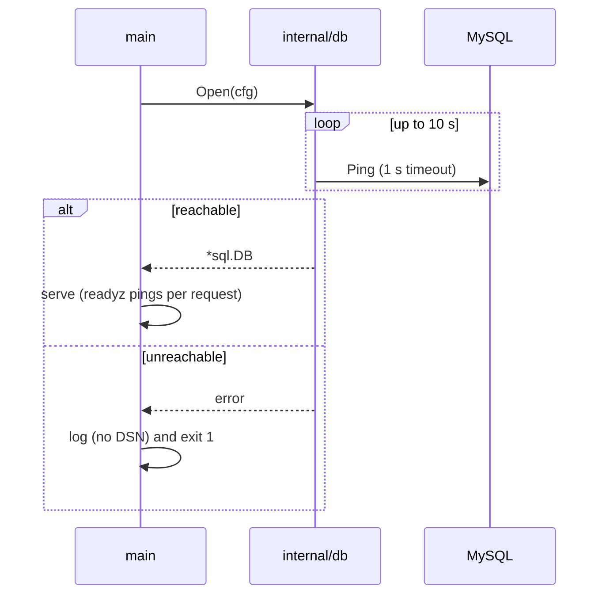

# E01_T-002 — Local stack (MySQL + MinIO), migrations and readiness

**Epic:** E01-foundation · **PRD:** [PRD.md](PRD.md) · **Milestone:** M0 · **Risk:** low · **Priority:** P1 · **Type:** infra

<!-- Migrated from the board block on 2026-10-07; the text below is unchanged. The board keeps status, dependencies and comments only. -->

#### Description
Give every later task a database and object store that start locally with one command, a migration mechanism that can also run as a one-off task on ECS later, a readiness endpoint, and an integration-test harness. Decisions: D-05 (MySQL 8.4, `utf8mb4`), L-01, L-05, hard constraint "agents test locally with no cloud credentials".

#### Scope
- In: `docker-compose.yml` (MySQL 8.4 + MinIO + bucket init); `internal/db` (open, pool, ping); goose migrations with embedded SQL; `cmd/smemories-migrate`; `GET /readyz`; `internal/db/dbtest` harness; Makefile targets `up`, `down`, `migrate`, `migrate-down`, `test-integration`; `api/openapi.yaml` + Postman updated for `/readyz`.
- Out (do not do): any real tables (first migration is the harmless `app_meta`), S3 client code (T-009), app Dockerfile (M2), CI changes (T-004).

#### Acceptance criteria
- [ ] AC1 — `make up` copies `.env.example` to `.env` if missing, starts MySQL 8.4 and MinIO, and returns only when both are healthy; `make down` stops them. Published ports bind to `127.0.0.1` only. Credentials come from `.env` (dev-only values).
- [ ] AC2 — MySQL runs with `utf8mb4` / `utf8mb4_0900_ai_ci`, `STRICT_ALL_TABLES` in `sql_mode`, and time zone `+00:00`.
- [ ] AC3 — `smemories-migrate up|down|status` work against the compose DB; `make migrate` = `up`. Migrations are SQL files in `migrations/`, embedded in the binary. `0001_app_meta.sql` creates `app_meta(k VARCHAR(64) PRIMARY KEY, v VARCHAR(255) NOT NULL)` and inserts `('schema_epoch','1')`. An `up → down → up` cycle leaves a working schema.
- [ ] AC4 — `internal/db.Open(cfg)` builds the DSN with `parseTime=true&loc=UTC&charset=utf8mb4&collation=utf8mb4_0900_ai_ci`; pool settings from `SMEM_DB_MAX_OPEN` (20), `SMEM_DB_MAX_IDLE` (5), `SMEM_DB_CONN_MAX_LIFETIME` (5m). `SMEM_DB_DSN` is required outside `test`. The API retries the first ping for up to 10 s, then exits non-zero with a clear message. The DSN (with password) is never logged.
- [ ] AC5 — `GET /readyz` → `200 {"status":"ready"}` when a `PingContext` (1 s timeout) succeeds; otherwise `503 not_ready` in the error envelope, with no driver error text in the body (log it instead).
- [ ] AC6 — Round trip test: store and read back `Chúc mừng 🎓 Đặng Thị Hồng` byte-identically, and assert `character_set_client/connection/results` are `utf8mb4` on a pooled connection.
- [ ] AC7 — `dbtest.New(t)` creates a uniquely named database, applies all migrations, returns `*sql.DB`, and drops the database in `t.Cleanup`. Integration tests carry build tag `integration`; `make test-integration` runs them (`SMEM_TEST_DB_DSN` env, defaulting to the compose database).
- [ ] AC8 — MinIO bucket `smemories-dev` is created automatically by an init container; console reachable on `127.0.0.1:9001`.
- [ ] AC9 — `api/openapi.yaml` documents `/readyz`; Postman collection covers ready (200) and a documented way to see 503 (stop DB).

#### Design
Files: `docker-compose.yml`, `.env.example` (extend), `migrations/0001_app_meta.sql`, `internal/db/{db,migrate}.go`, `internal/db/dbtest/dbtest.go`, `cmd/smemories-migrate/main.go`, `internal/httpx` (readyz route registered from `main` with a `Pinger` interface so tests can fake it), `Makefile`.

#### Risk
`low` — greenfield, additive, no production data (board L-06). Compose credentials are dev-only and must not be reused anywhere real.

#### Security & performance notes
Bind services to loopback only. Never print the DSN. `readyz` must not leak driver errors. Pool limits must be configurable now because Fargate tasks multiply connections against RDS later.

#### Test plan
- Dev: unit tests for DSN building and config validation; integration tests for migrate cycle, utf8mb4 round trip, `readyz` 200 and 503 (use a closed `*sql.DB`).
- QA should probe: `make up` twice (idempotent); `make down` then `make up` keeps data volume; run `up→down→up` twice; kill MySQL while the API runs and watch `/readyz` flip to 503 and recover; confirm ports are not reachable on the LAN IP.
