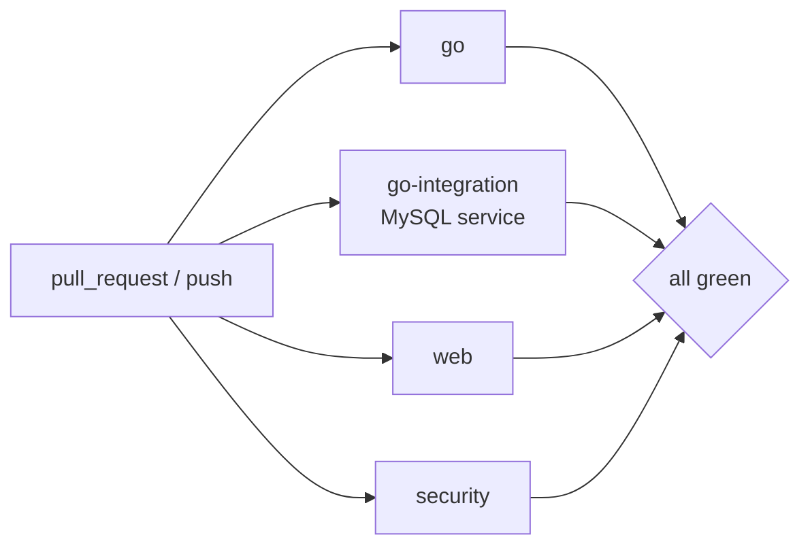

# E01_T-004 — CI pipeline (Go, web, integration, security)

**Epic:** E01-foundation · **PRD:** [PRD.md](PRD.md) · **Milestone:** M0 · **Risk:** high · **Priority:** P1 · **Type:** infra

<!-- Migrated from the board block on 2026-10-07; the text below is unchanged. The board keeps status, dependencies and comments only. -->

#### Description
Continuous integration for the Go API and the web app so `develop` and `main` can be protected by required checks. Decisions: quality bar in board §1, risk rule L-06 (CI is high risk, owner approves the merge).

#### Scope
- In: `.github/workflows/ci.yml`; `.golangci.yml`; `.github/dependabot.yml`; `docs/ci.md`.
- Out (do not do): deployment, release or publishing workflows, any workflow that needs a repository secret, enabling branch protection (the owner does that; the leader recommends the exact settings).

#### Acceptance criteria
- [ ] AC1 — `ci.yml` runs on `pull_request` (any base) and on `push` to `develop` and `main`; superseded runs on the same ref are cancelled; top-level `permissions: contents: read`.
- [ ] AC2 — Job `go`: setup-go using the version in `go.mod`, module cache, `gofmt -l .` must print nothing, `go vet ./...`, golangci-lint (pinned version; config in `.golangci.yml` enabling at least `errcheck`, `govet`, `staticcheck`, `ineffassign`, `unused`, `gosec`, `bodyclose`), `go test -race -coverprofile=coverage.txt ./...` with the total coverage written to the job summary.
- [ ] AC3 — Job `go-integration`: MySQL 8.4 service container configured for `utf8mb4`; runs `make test-integration` against it.
- [ ] AC4 — Job `web`: Node from `web/.nvmrc`, `npm ci`, `lint`, `lint:i18n`, `typecheck`, `test`, `build`, `check:api`.
- [ ] AC5 — Job `security`: `govulncheck ./...` is blocking; `npm audit --audit-level=high --omit=dev` is reported but non-blocking, with a workflow comment explaining why and when to make it blocking.
- [ ] AC6 — Every third-party action is pinned to a full commit SHA with a version comment. `dependabot.yml` covers `gomod`, `npm` (directory `/web`) and `github-actions`, weekly, with grouped updates.
- [ ] AC7 — `docs/ci.md` lists the exact required check names (for branch protection on `develop` and `main`), what each job runs and the equivalent local `make` command.
- [ ] AC8 — The workflow is green on the PR that introduces it (link the run in the PR description); no secrets referenced anywhere.

#### Design
Files: `.github/workflows/ci.yml`, `.golangci.yml`, `.github/dependabot.yml`, `docs/ci.md`. Jobs named exactly `go`, `go-integration`, `web`, `security` so required-check names are stable. Reuse `make` targets from T-001..T-003 rather than duplicating commands where practical.

#### Risk
`high` — CI/infra change: the leader reviews and the owner approves the merge (`bin/team approve T-004`).

#### Security & performance notes
Least-privilege `GITHUB_TOKEN`; SHA-pinned actions (supply chain); no `pull_request_target`; no secrets. Keep total wall time under ~6 minutes with caching.

#### Test plan
- Dev: open the PR and show a green run; show cache hits on a second run.
- QA should probe: on a throwaway branch commit (a) an unformatted Go file, (b) a failing Go test, (c) a missing key in `vi.json`, (d) a stale `schema.d.ts`; confirm each is caught by the right job; delete the branch afterwards. Check that a PR from a fork would not receive secrets (none are referenced).
