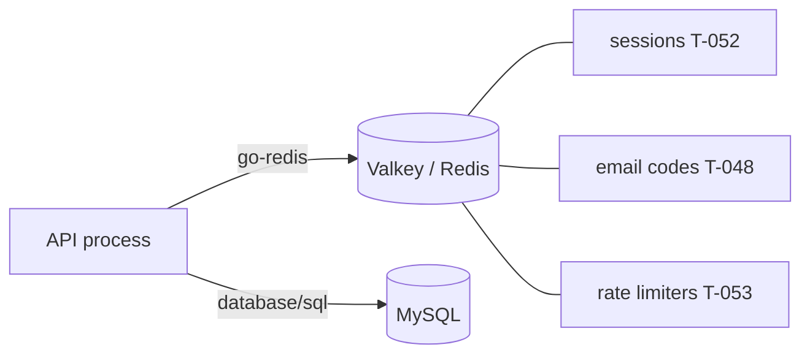

# T-051 — Redis foundation: local stack, client, config, readiness, CI

**Epic:** E01-foundation · **PRD:** [PRD.md](PRD.md) · **Milestone:** M1 · **Risk:** high · **Priority:** P1 · **Type:** infra

#### Description
Owner request (2026-10-08, D-23): all time-limited data moves to Redis: login sessions, the 6-digit email codes with their attempt counters, and the rate limiters. This task adds Redis itself and changes no behaviour: a container in the local stack, a client with configuration and health, test helpers, and CI. T-052 (sessions), T-053 (rate limiters) and T-048 (codes, written straight onto Redis) build on it.

#### Scope
- In: a Redis-compatible service in `docker-compose.yml`; `SMEM_REDIS_URL` and its validation; the client wrapper in a new package `internal/redis`; `/readyz` includes Redis; integration-test helpers; CI service; docs.
- Out (do not do): moving any data (T-052, T-053, T-048), AWS provisioning (T-023), clustering, pub/sub, any cache of business data.

#### Acceptance criteria
- [ ] AC1 — `docker-compose.yml` runs Valkey 8 (Redis-protocol compatible, BSD licence; the code uses only the Redis protocol so Redis or ElastiCache work too), image pinned by digest, bound to `127.0.0.1:${REDIS_PORT:-6379}`, `--appendonly yes --appendfsync everysec` with a named volume (sessions survive a restart in dev), `--save ""` off, a `maxmemory 256mb` with `noeviction` (a full Redis must fail writes loudly, never silently drop sessions), a healthcheck, and `make up` waits for it. The per-checkout isolation rules of T-030 apply (ports in `.env`).
- [ ] AC2 — Config: `SMEM_REDIS_URL` (`redis://[:password@]host:port/db`, also `rediss://` for TLS), required in every environment (the API exits with a message naming the variable), default in `.env.example` for the local stack; `SMEM_REDIS_PASSWORD` may be given separately; timeouts (dial 2 s, read and write 1 s) and pool size configurable with documented defaults; invalid values fail at startup naming the variable.
- [ ] AC3 — `internal/redis`: a thin wrapper around `github.com/redis/go-redis/v9` (BSD-2, new dependency, approved here) that exposes the client, `Ping`, key-prefix helper (`smem:<env>:`), and script loading helper; no business logic. Errors are classified (`ErrUnavailable` for network and timeout, others returned as is) so callers can apply their fail-open or fail-closed policy.
- [ ] AC4 — `/readyz` reports Redis (503 `not_ready` when Redis is down, as for MySQL); `/healthz` is unchanged. The startup log states the Redis address without the password.
- [ ] AC5 — Test helpers: `redistest.New(t)` returns a client on a unique key prefix per test (and a unique DB number or prefix cleanup), skipping or failing clearly like the MySQL helper when `SMEM_TEST_REDIS_URL` is not set (integration tag). CI `go-integration` starts the same pinned Valkey image as a service container, with `SMEM_TEST_REDIS_URL` set; the `go` unit job needs no Redis.
- [ ] AC6 — README, `docs/redis.md` (what lives in Redis and under which key prefixes, the failure policy summarised from D-23, how to inspect keys locally: `docker compose exec redis valkey-cli`), `.env.example`; `docs/ci.md` mentions the new service.

#### Design

Key prefix `smem:<SMEM_ENV>:<area>:` so several environments or checkouts can share one Redis in an emergency without colliding. Files: `internal/redis/*`, `internal/config/config.go`, `cmd/smemories-api/main.go`, `internal/httpx` (readiness), `docker-compose.yml`, `Makefile`, `.env.example`, `.github/workflows/ci.yml`, docs.

#### Risk
`high`: new infrastructure and dependency, CI change. The owner approves the merge.

#### Security & performance notes
Redis binds to localhost only in dev; production uses a private subnet, TLS and an auth token (T-022/T-023). No Redis command is built from user input except through keys derived from hashes or numeric ids. Pool and timeouts bound the damage of a slow Redis.

#### Test plan
- Dev: config table tests, readiness with Redis stopped, the helper isolation (two tests in parallel never see each other's keys), a latency sanity check (Ping under 5 ms locally).
- QA should probe: `make up` twice, Redis restart (AOF keeps data), wrong password, `rediss://` URL with TLS refused locally (clear error), Redis stopped while the API runs (`/readyz` 503, `/healthz` 200), CI job logs.
