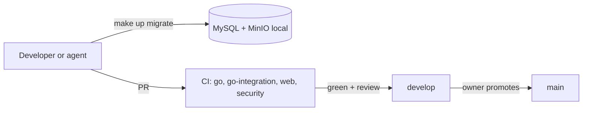

# E01 — Foundation and engineering platform

**Status:** active (M0 done, follow-ups open)   **Milestone(s):** M0, M1   **Owner decisions:** D-05, D-08, D-09, D-14, L-01, L-02, L-04, L-07, L-08, L-10, L-11 (README §4)

## Problem and users
A small team of one owner plus AI agents (leader, dev, QA) builds SMemories. Without a safe, repeatable engineering base every task pays for
the same setup and every merge risks the main branch. The users of this epic are the developers and agents: they need to clone, run the
whole stack locally with no cloud credentials, test, lint and merge through CI.

## Goal and non-goals
- Goal: from a clean checkout, `make up migrate`, `make build test lint` and `make run` work; every pull request runs the same checks in CI;
  the shared conventions (error envelope, config, logging, API contract) exist once and are reused.
- Non-goals: production deployment and infrastructure as code (E06), product features.

## User stories
- As a developer I can start MySQL and MinIO locally with one command and run the API and the web app against them.
- As a developer I get the same lint, test and security checks locally as in CI.
- As the owner I know `develop` and `main` only accept changes that passed CI.
- As QA I can run isolated stacks next to a developer's without touching their data.

## Scope and requirements
- Functional: repo layout and Makefile, Go API skeleton (router, middleware, error envelope, config, `/healthz`, `/readyz`), MySQL 8.4 `utf8mb4`
  with goose migrations, MinIO bucket, Vite + React + TypeScript web app with EN/VI i18n and a typed API client, CI (go, go-integration, web,
  security), per-checkout compose isolation, end-to-end smoke test of the M1 journey.
- Non-functional: no secrets in the public repo; secrets and URL tokens never reach logs (route pattern logging); dependency and licence hygiene
  (govulncheck blocking, Dependabot); reproducible toolchain rules (L-10).
- Constraints: Go API + Vite/React + MySQL (D-05); public repository (D-09).

## Flow and data

## Risks and open questions
- The MinIO image is frozen and unpatched (dev only): T-029 replaces it.
- CI cancels in-progress runs on develop, so merge commits can miss a complete run: T-033.
- The shared-stack incidents show agents must use isolated compose projects (done in T-030).

## Exit criteria ("stable" for this epic)
- M0 exit criteria (README §2) met; CI green on `develop`; branch protection on `develop` and `main` (D-14).
- The M1 journey has an automated end-to-end smoke test in CI (T-020).

## Task index
Specs live next to this file; **status lives only on the board** (`L list`), never here, so it cannot drift.
| Task | Spec file | Depends on |
|---|---|---|
| T-001 Repo foundation and API skeleton | `01-repo-foundation-and-api-skeleton.md` | — |
| T-002 Local stack (MySQL + MinIO), migrations and readiness | `02-local-stack-mysql-minio-migrations-and.md` | T-001 |
| T-003 Web scaffold: Vite + React + TypeScript + EN/VI i18n | `03-web-scaffold-vite-react-typescript-en-vi-i18n.md` | T-001 |
| T-004 CI pipeline (Go, web, integration, security) | `04-ci-pipeline-go-web-integration-security.md` | T-001, T-002, T-003, T-028 |
| T-028 T-001 follow-ups: log route not path, lint scope and findings, OpenAPI 404/405 | `05-t-001-follow-ups-log-route-not-path-lint.md` | T-001 |
| T-030 T-002 follow-ups: isolate compose stacks, fail fast on auth errors, test-DB grants | `06-t-002-follow-ups-isolate-compose-stacks-fail.md` | T-002 |
| T-029 Replace the frozen MinIO dev image with a maintained S3-compatible store | `07-replace-the-frozen-minio-dev-image-with-a.md` | T-002 |
| T-032 db.Open: treat MySQL 1044 as permanent; README warning about bare docker compose | `08-db-open-treat-mysql-1044-as-permanent-readme.md` | T-030 |
| T-033 CI: do not cancel in-progress runs on develop and main | `09-ci-do-not-cancel-in-progress-runs-on-develop.md` | T-004 |
| T-020 End-to-end smoke test of the M1 journey in CI (Playwright) | `10-end-to-end-smoke-test-of-the-m1-journey-in.md` | T-017, T-018, T-019 |
