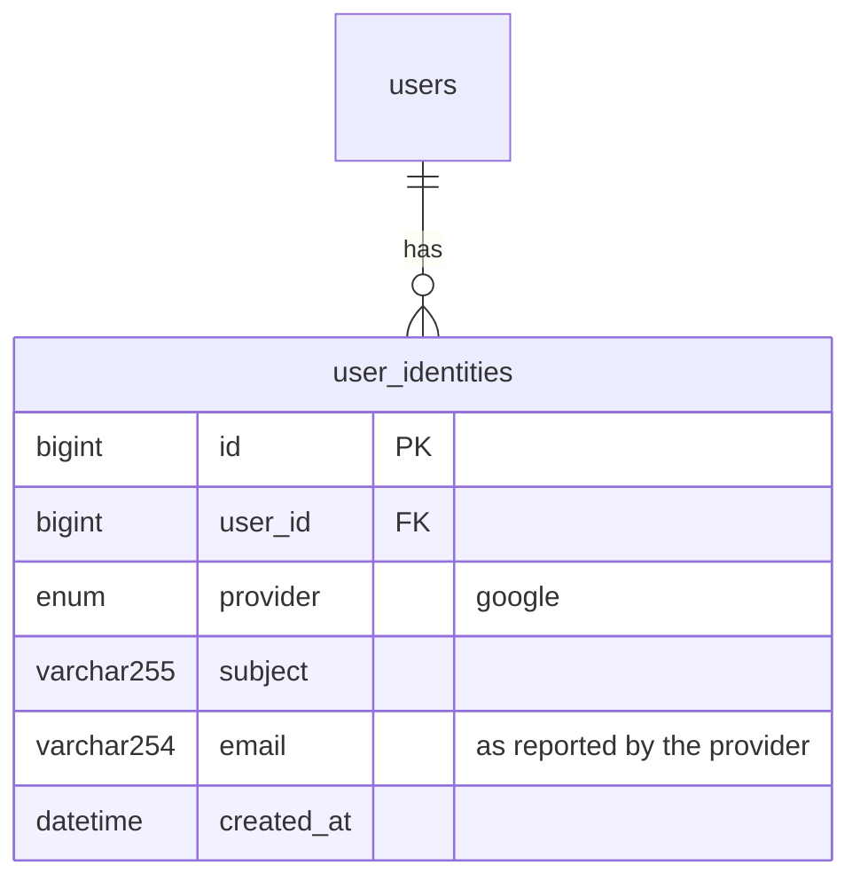

# T-011 — Google sign-in (OIDC + PKCE, account linking)

**Epic:** E02-auth · **PRD:** [PRD.md](PRD.md) · **Milestone:** M1 · **Risk:** high · **Priority:** P1

#### Description
Let a student sign in with Google using the OpenID Connect authorization-code flow with PKCE, in the Go API. A Google identity is linked to
an existing account when the verified email matches, otherwise it creates a social-only account (no password). Everything is testable
without Google credentials against an in-process fake OIDC provider. Decisions: D-07, L-09; PRD stories 3 and 4.

#### Scope
- In: `user_identities` table; `GET /v1/auth/google/start`, `GET /v1/auth/google/callback`; state, nonce and PKCE; ID-token verification;
  linking rules incl. the pre-hijacking defence; `return_to` validation; config; fake OIDC provider for tests; README setup section.
- Out (do not do): the "Sign in with Google" button and pages (T-015), other providers, unlinking, setting a password for a social-only
  account (password reset from T-007 already covers it), real Google credentials (owner step in M2).

#### Acceptance criteria
- [ ] AC1 — `GET /v1/auth/google/start?return_to=/path` answers `302` to the provider's authorization endpoint with `response_type=code`, `scope=openid email profile`, `state`, `nonce`, `code_challenge` (S256) and `redirect_uri`, and sets a short-lived (10 min) cookie `smem_oidc` carrying state, nonce, the PKCE verifier and `return_to`, HttpOnly, SameSite=Lax, Secure unless `SMEM_ENV=dev`, signed so it cannot be altered (HMAC with `SMEM_OIDC_COOKIE_KEY`, at least 32 bytes, required when Google is enabled).
- [ ] AC2 — `GET /v1/auth/google/callback?code&state` rejects, redirecting to `/login?error=<code>` and creating no user or session, when: the cookie is missing, tampered or expired (`oidc_state`); `state` differs (`oidc_state`); the provider returns an error (`oidc_denied`); the code exchange fails (`oidc_failed`); the ID token has a bad signature, issuer, audience, expiry or nonce (`oidc_failed`); or the `email_verified` claim is not `true` (`email_unverified`). Error details are logged, never put in the redirect.
- [ ] AC3 — A valid callback for a `sub` already in `user_identities` signs that user in (new session cookie exactly as in T-006, any previous session cookie revoked) and redirects to `return_to`.
- [ ] AC4 — A valid callback for a new `sub` whose verified email matches an existing account **with a verified email** links the identity and signs in; no second account is created.
- [ ] AC5 — Pre-hijacking defence: a valid callback whose email matches a local account that is **not** email-verified first clears that account's `password_hash`, deletes all its sessions and marks the email verified, then links and signs in. A test registers `victim@example.com` with a password, then signs in via the fake Google for the same address, and proves the old password no longer logs in and the old session is dead.
- [ ] AC6 — A valid callback for an unknown email creates a user with `password_hash` NULL, `email_verified_at` now, display name from the `name` claim cleaned with the auth display-name rules (fallback: local part of the email), locale `vi` if the `locale` claim starts with `vi`, else `en`; then signs in.
- [ ] AC7 — `return_to` must be a relative path starting with a single `/` (not `//`, not `/\`, no scheme, no control characters, at most 200 characters); anything else is replaced by `/`. Tests include `//evil.example`, `https://evil.example`, `/\evil.example` and `javascript:alert(1)`.
- [ ] AC8 — Both endpoints are rate-limited per client IP (30 per 15 minutes; `429 rate_limited` with `Retry-After`), the authorization code and tokens are never logged, and the callback ignores any existing session cookie except to revoke it on success.
- [ ] AC9 — Google is optional: with `SMEM_GOOGLE_CLIENT_ID` unset the two endpoints answer `404 not_found` and the API starts normally. With it set, `SMEM_GOOGLE_CLIENT_SECRET`, `SMEM_PUBLIC_BASE_URL` and `SMEM_OIDC_COOKIE_KEY` are required (startup error naming the missing variable); `SMEM_GOOGLE_ISSUER` defaults to `https://accounts.google.com`.
- [ ] AC10 — `api/openapi.yaml` documents both endpoints (redirect responses), `postman/auth.postman_collection.json` covers the start redirect and the error paths that need no provider, and the README has a "Google sign-in setup" section (create the OAuth client in Google Cloud Console; authorised redirect URI `<public base URL>/api/v1/auth/google/callback`, for local development `http://localhost:5173/api/v1/auth/google/callback`; the variables above).

#### Design
Files: `migrations/0003_user_identities.sql` (number after the latest), `internal/auth/google.go`, `internal/auth/google_test.go`, `internal/auth/oidctest/provider.go` (the fake provider), `internal/config/config.go`, `cmd/smemories-api/main.go`, `api/openapi.yaml`, `postman/auth.postman_collection.json`, `README.md`.

New dependencies (approved here, Risk: high): `github.com/coreos/go-oidc/v3` (discovery, JWKS, ID-token verification) and `golang.org/x/oauth2` (code exchange with PKCE). Do not hand-roll token verification.

```mermaid
sequenceDiagram
    participant B as Browser
    participant A as API
    participant G as Google
    participant D as MySQL
    B->>A: GET /v1/auth/google/start?return_to=/
    A->>A: random state, nonce, PKCE verifier; sign smem_oidc cookie
    A-->>B: 302 to Google + Set-Cookie smem_oidc
    B->>G: authorize (user signs in)
    G-->>B: 302 to /api/v1/auth/google/callback?code&state
    B->>A: GET callback (+ smem_oidc cookie)
    A->>A: verify cookie signature, state
    A->>G: exchange code + PKCE verifier
    G-->>A: id_token
    A->>A: verify signature, iss, aud, exp, nonce, email_verified
    A->>D: find identity by sub, else user by email, else create
    A-->>B: 302 return_to + Set-Cookie smem_session
```


Unique key `(provider, subject)`. `ON DELETE CASCADE` from users.

Linking decision table: identity known -> sign in; else email matches a verified local user -> link; else email matches an unverified local user -> clear password and sessions, verify, link; else create.

#### Risk
`high`: authentication, account linking, two new dependencies. The owner approves the merge.

#### Security & performance notes
State, nonce and PKCE are all required; the state cookie must be bound to the browser that started the flow (login CSRF). Trust only ID tokens verified by `go-oidc` against the issuer's JWKS. Only an address Google marks `email_verified` may be linked. Never put provider errors, codes or tokens into redirects or logs. Cache the provider discovery document; one outbound call per callback for the token exchange, with a 5 s timeout.

#### Test plan
- Dev: unit and integration tests against the fake provider (success for new, linked and known users; every rejection in AC2; the pre-hijacking test of AC5; the `return_to` table of AC7; rate limit; Google disabled gives 404), plus config tests. Tests must fail if a control is removed (for example skip the nonce check and watch AC2 fail).
- QA should probe: replay of a used code and of a used state; a callback arriving in a different browser (no cookie); tampering with each part of the cookie; an ID token for another audience or issuer; `email_verified` as the string "true" instead of a boolean; two quick callbacks for one new user (one account only, no 500 from the unique key); a user whose Google email changes case; a social-only account trying the password login (must fail like an unknown account); no secrets in logs.
