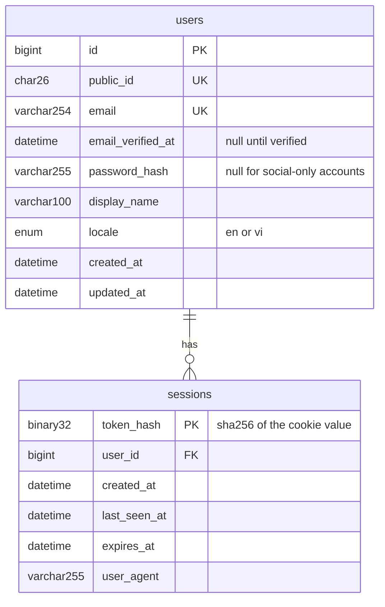
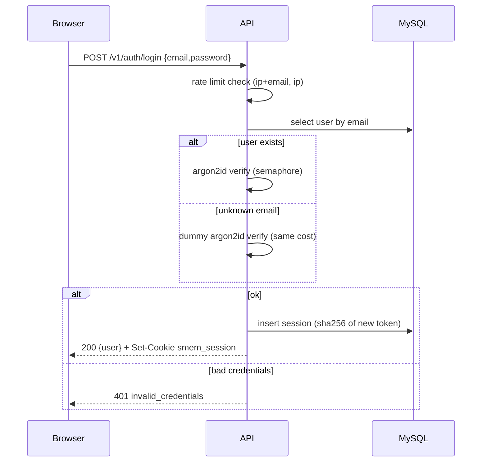

# T-006 — Email + password auth core (register, login, sessions)

**Epic:** E02-auth · **PRD:** [PRD.md](PRD.md) · **Milestone:** M1 · **Risk:** high · **Priority:** P1 · **Type:** feature

<!-- Migrated from the board block on 2026-10-07; the text below is unchanged. The board keeps status, dependencies and comments only. -->

#### Description
The core of email+password authentication: register, login, logout, "who am I", cookie sessions, password hashing, rate limiting and CSRF protection. Everything user-owned in M1 hangs off this. Email verification and password reset are T-007; Google sign-in is T-011; the web pages are T-015. Decisions: D-07 (in-house auth, argon2id), L-05, L-06.

#### Scope
- In: `users` and `sessions` tables; endpoints below; argon2id hashing with concurrency cap; in-memory rate limiter; origin check; `auth.RequireUser` middleware other packages reuse.
- Out (do not do): email verification and reset (T-007), OAuth/Google (T-011), MFA, account deletion, roles beyond "user", any UI.

#### Acceptance criteria
- [ ] AC1 — `POST /v1/auth/register {email,password,display_name}` → `201 {"user":…}` and signs the user in (session cookie). Email is trimmed and lower-cased; a duplicate (case-insensitive) → `409 email_taken`. Validation errors → `400` with code `invalid_email`, `weak_password` or `invalid_display_name`. Rules: password 10–128 characters and not equal to the email; display name 1–100 characters, trimmed, no control characters; email ≤ 254 and syntactically valid (`net/mail` plus a domain with a dot).
- [ ] AC2 — Passwords are hashed with argon2id (m=19456 KiB, t=2, p=1, 16-byte salt, 32-byte key) and stored as a PHC string; parameters come from config so they can be tuned. At most `SMEM_AUTH_MAX_CONCURRENT_HASHES` (default 4) hashes run at once; a request that cannot get a slot within 2 s gets `503 busy`.
- [ ] AC3 — `POST /v1/auth/login {email,password}` valid → `200 {"user":…}` + cookie. Wrong password and unknown email are indistinguishable: same `401 invalid_credentials`, same body, and the unknown-email path performs a dummy hash verification so timing matches. Login issues a **new** session token (no fixation).
- [ ] AC4 — Session token = 32 random bytes, base64url; only its SHA-256 is stored. Cookie `smem_session`: `HttpOnly`, `SameSite=Lax`, `Path=/`, `Max-Age` 30 days, `Secure` unless `SMEM_ENV=dev`.
- [ ] AC5 — `GET /v1/me` → `200 {"user":…}` with a valid session; no/unknown/expired session → `401 unauthenticated`. Sliding expiry: when more than half of the TTL has elapsed the expiry is extended and the cookie re-sent. `POST /v1/auth/logout` → `204`, deletes the session row, clears the cookie; idempotent.
- [ ] AC6 — Rate limits (in-memory, per process): login 10 failures / 15 min per (IP + email) and 100 failures / 15 min per IP; register 5 / hour per IP. Exceeding → `429 rate_limited` with `Retry-After`. Client IP is `RemoteAddr` unless `SMEM_TRUST_PROXY=true`, then the last `X-Forwarded-For` hop.
- [ ] AC7 — CSRF: any `POST/PUT/PATCH/DELETE` that carries the session cookie must have an `Origin` (or `Referer`) whose origin is listed in `SMEM_ALLOWED_ORIGINS`, else `403 csrf_origin_mismatch`; JSON bodies only (`415 unsupported_media_type` otherwise).
- [ ] AC8 — Passwords, hashes and tokens never appear in logs or responses. The `user` object is exactly `{id (ULID), email, email_verified, display_name, locale, created_at}`. Passwords longer than 128 characters are rejected before hashing.
- [ ] AC9 — `api/openapi.yaml` and `postman/auth.postman_collection.json` cover every endpoint including the 4xx cases; the Postman run works twice back to back.

#### Design
Files: `migrations/0002_users_sessions.sql`, `internal/auth/{handler,service,store,password,session,csrf}.go`, `internal/ratelimit/ratelimit.go`, `internal/ulid` (or `oklog/ulid`), `api/openapi.yaml`, `postman/auth.postman_collection.json`.

Note on enumeration: `register` reveals `email_taken` (accepted for UX; the per-IP limit and later email verification bound the abuse). Login and password reset must not reveal account existence.

#### Risk
`high` — authentication: leader reviews, owner approves the merge (`bin/team approve T-006`).

#### Security & performance notes
Constant-time comparisons; no user enumeration on login; hash concurrency cap so a login flood cannot exhaust memory (19 MiB × concurrency); cookie flags as above; the rate limiter is process-local and has a known ceiling: with more than one Fargate task limits become per-task (mark with a `ponytail:` comment, shared store later). Never log `Set-Cookie` or request bodies.

#### Test plan
- Dev: unit tests for password hash/verify and PHC encoding, validators, rate limiter (clock injected), origin check. Integration tests (real MySQL): register → me → logout → me=401; duplicate email in different case; expired session; sliding expiry; wrong password vs unknown email return identical bodies; CSRF mismatch; 415 on form-encoded body.
- QA should probe: 50 parallel logins (no crash, hash concurrency respected, later ones get 503 or 429 rather than hanging); 1 MB password rejected without hashing; SQL-injection strings in email; cookie flags in prod mode; replay of an old cookie after logout; run the Postman collection twice.
