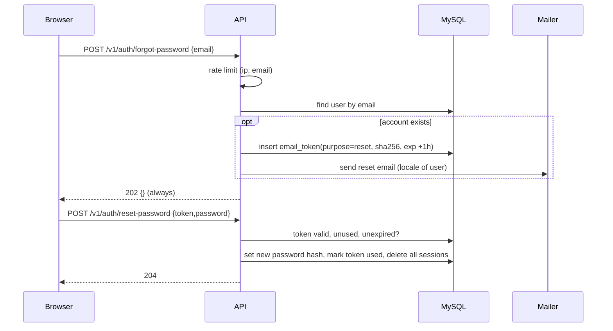

# T-007 — Email verification and password reset

**Epic:** E02-auth · **PRD:** [PRD.md](PRD.md) · **Milestone:** M1 · **Risk:** high · **Priority:** P1 · **Type:** feature

<!-- Migrated from the board block on 2026-10-07; the text below is unchanged. The board keeps status, dependencies and comments only. -->

> **Migration numbering (leader, 2026-10-07):** always take the next free number at the time you write the migration (`ls migrations/`); goose rejects out-of-order versions on databases that already applied a higher one.

#### Description
Email verification and password reset for the in-house auth from T-006, plus the mailer abstraction they need. In M1 the only mailer is a development one that logs the message; a real provider is an M2 decision. Decisions: D-07, L-06.

#### Scope
- In: `email_tokens` table; `Mailer` interface and a development `LogMailer`; verify and reset endpoints; EN and VI email text; rate limits.
- Out (do not do): a real email provider (M2), HTML email design beyond a minimal template, changing email address, MFA.

#### Acceptance criteria
- [ ] AC1 — `Mailer.Send(ctx, Message{To,Subject,Text,HTML})` is an interface. `LogMailer` writes the full message (including links) to stdout and is allowed only when `SMEM_ENV` is `dev` or `test`; starting with `SMEM_ENV=prod` and no real mailer configured fails fast with a clear error.
- [ ] AC2 — Registering (T-006) now also sends a verification email. If the mailer fails, registration still succeeds, the failure is logged without the token, and the user can resend.
- [ ] AC3 — `POST /v1/auth/verify-email/resend` (authenticated) → `202`; at most 3 per hour per user (`429 rate_limited` after). Already-verified users get `200 {"already_verified":true}`.
- [ ] AC4 — `POST /v1/auth/verify-email {token}` → `204` and sets `email_verified_at`; unknown, expired, or used token → `400 invalid_token`. Tokens are 32 random bytes (base64url), stored only as SHA-256, valid 24 h, single use.
- [ ] AC5 — `POST /v1/auth/forgot-password {email}` → always `202` with the same body whether or not the account exists, with no meaningful latency difference; an email is sent only if the account exists. Limits: 5 / hour per IP and 3 / hour per email.
- [ ] AC6 — `POST /v1/auth/reset-password {token,password}` → `204`; token valid 1 h, single use; password rules from T-006 apply; on success **all** of the user's sessions are deleted. Reusing the token → `400 invalid_token`.
- [ ] AC7 — Emails are written in English or Vietnamese according to `users.locale`; links are built from `SMEM_PUBLIC_BASE_URL` (`/verify-email?token=…`, `/reset-password?token=…`); a test asserts both languages contain the link.
- [ ] AC8 — Expired and used tokens are removed by a cleanup that runs at startup and daily (simple goroutine ticker is fine).
- [ ] AC9 — `api/openapi.yaml` and `postman/auth.postman_collection.json` updated, including the 4xx cases.

#### Design
Files: `migrations/<next free number>_email_tokens.sql`, `internal/mailer/{mailer,logmailer}.go`, `internal/auth/{tokens,verify,reset}.go`, `internal/auth/emails/{en,vi}.tmpl`.

Data: `email_tokens(token_hash BINARY(32) PK, user_id FK, purpose ENUM('verify','reset'), expires_at, used_at NULL, created_at)`.

#### Risk
`high` — authentication flows and tokens: owner approves the merge.

#### Security & performance notes
Tokens are bearer secrets: hash at rest, never log them, single use, short expiry. The `LogMailer` prints tokens, which is acceptable only outside prod — the startup guard enforces it. No account enumeration on forgot-password. Reset invalidates sessions (a stolen session must not survive a reset).

#### Test plan
- Dev: unit tests for token generation/expiry; integration tests for verify (success, expired, reused), forgot (known vs unknown email identical response), reset (all sessions gone, token single use), resend limits, locale selection; startup refusal in prod without a mailer.
- QA should probe: compare response bodies and rough timing for known vs unknown emails; use a verify token as a reset token (must fail); concurrent double-use of one token (only one wins); expired token via clock manipulation; run the Postman collection twice.
