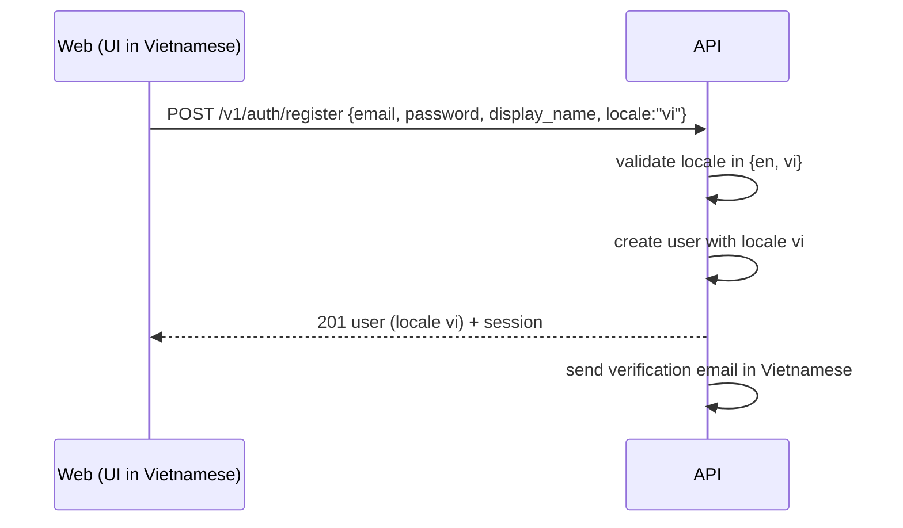

# T-045 — Register accepts a locale; verification email in the student's language

**Epic:** E02-auth · **PRD:** [PRD.md](PRD.md) · **Milestone:** M1 · **Risk:** high · **Priority:** P1 · **Type:** feature

#### Description
`POST /v1/auth/register` always stores `locale: "en"` (`internal/auth/service.go`), so a student who registers in the Vietnamese UI gets the English verification email and keeps `users.locale = en`. QA found it while testing T-015. The email templates, the reset email and the PDF defaults all follow `users.locale`.
This task lets the client say which language the student is using. Changing the language later in an account page is out of scope.

#### Scope
- In: optional `locale` in the register body (`en` or `vi`); the stored locale; the verification email in that language; the web register form sending the current UI language; OpenAPI, schema, Postman, tests.
- Out (do not do): a `PATCH /v1/me` to change the locale later, locale detection from `Accept-Language`, other languages, changes to Google sign-in (it already sets locale from the Google claim).

#### Acceptance criteria
- [ ] AC1 — `POST /v1/auth/register` accepts an optional string `locale`, `"en"` or `"vi"`; absent or `null` means `"en"`; any other value is `400 invalid_locale` and nothing is created. The response user and `GET /v1/me` show the stored value.
- [ ] AC2 — The verification email sent at registration uses the stored locale (the Vietnamese template for `vi`); a test registers with `vi` and asserts the Vietnamese subject and the link.
- [ ] AC3 — The web register form (T-015) sends the active UI language (`i18n.resolvedLanguage` limited to `en`/`vi`) as `locale`; a Vitest test proves the request body for both languages. The forgot-password email already follows `users.locale`; no web change there.
- [ ] AC4 — `api/openapi.yaml`, `web/src/api/schema.d.ts` (`npm run gen:api`) and `postman/auth.postman_collection.json` are updated (register with `vi`, with `fr` rejected); the collection runs twice back to back.

#### Design
Files: `internal/auth/{handler,service}.go`, `internal/auth/*_test.go`, `web/src/pages/` register page and its test, `api/openapi.yaml`, `web/src/api/schema.d.ts`, `postman/auth.postman_collection.json`.

#### Risk
`high`: it changes the authentication endpoint's contract (additive and optional). The owner approves the merge.

#### Security & performance notes
A fixed two-value enum from the client; no new input surface. The register rate limit and CSRF checks stay as they are.

#### Test plan
- Dev: unit and integration tests for absent, `en`, `vi`, empty string, `fr`, number, `null`; email language test; Vitest request-body test.
- QA should probe: register in each language and read the logged email; a locale in different case (`VI`) is rejected; Google sign-in users are unaffected.
