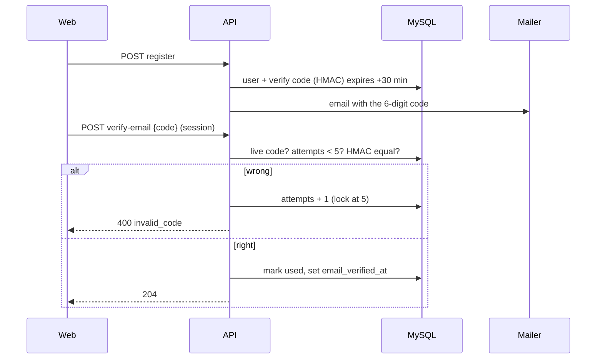

# T-048 — Email one-time codes replace verification and reset links (API)

**Epic:** E02-auth · **PRD:** [PRD.md](PRD.md) · **Milestone:** M1 · **Risk:** high · **Priority:** P1 · **Type:** feature

#### Description
Owner decision D-22 (2026-10-08): email verification and password reset use a 6-digit one-time code that the student types, not a link (friendlier on phones: no link opening in another in-app browser, no token in a URL). This replaces the link design of T-007 (nothing is in production, so the API contract may change). It also gives the team a dev-only fixed code, `123123`, so flows can be tested without reading the log, under strict guards (D-22).

#### Scope
- In: new code storage (migration), code generation and verification with attempt limits, the changed endpoints, EN/VI code emails, the dev-only fixed code with its guards and registry, removal of the link tokens, OpenAPI, Postman, tests.
- Out (do not do): the web screens (T-049), SMS or other channels, changing Google sign-in, a real mail provider (T-021), magic links.

#### Acceptance criteria
- [ ] AC1 — Codes: 6 decimal digits drawn uniformly with `crypto/rand` (rejection sampling, leading zeros kept). **Stored in Redis (D-23, T-051), not MySQL**: key `smem:<env>:otp:<purpose>:<user id>` is a hash `{h: HMAC-SHA256(key = SMEM_OTP_KEY, message = purpose | user id | code), a: attempts}` with a native expiry (verify codes 30 minutes, reset codes 15). One live code per (user, purpose): issuing a new code overwrites the key. Verification and the attempt counter are one Lua script (compare in constant time on the hashes, `HINCRBY` attempts on a wrong guess, delete the key on success or at 5 wrong attempts), so parallel guesses can never exceed 5. No migration creates a code table, and the `email_tokens` table of T-007 is dropped by a migration (next free number; Down recreates it empty).
- [ ] AC2 — `SMEM_OTP_KEY`: at least 32 random bytes, required when `SMEM_ENV` is not `dev` or `test` (startup error naming the variable); in dev and test a fixed development key is used. Documented in `.env.example` and the README.
- [ ] AC3 — `POST /v1/auth/verify-email {code}` (session required, origin check) verifies the signed-in user's email: `204`, `email_verified_at` set, the code used. Wrong code `400 invalid_code`; expired `400 code_expired`; no live code `400 invalid_code`; after 5 wrong attempts on one code it is locked (`400 code_locked`, the student must request a new code). Already verified: `204`. Verify attempts are also limited to 20 per hour per user (`429 rate_limited` + `Retry-After`).
- [ ] AC4 — `POST /v1/auth/verify-email/resend` (session) keeps its limit of 3 per hour per user and sends a new code (the old one dies). Registration sends the first code as today (a mailer failure never fails registration).
- [ ] AC5 — `POST /v1/auth/forgot-password {email}` is unchanged in behaviour (always `202`, same work on the request path, limits 5 per hour per IP and 3 per hour per email) but sends a reset code. `POST /v1/auth/reset-password {email, code, password}`: the password rules of T-006 are checked first (`400 weak_password`, the code is untouched, so the answer cannot confirm a code), then the code; unknown email, wrong code and no live code all answer `400 invalid_code` after similar work (a dummy HMAC compare for unknown emails); `code_expired` and `code_locked` as in AC3 only for an existing account with such a code. Success: `204`, new password stored, all sessions of the user deleted, the code used. Reset attempts are limited to 20 per hour per IP.
- [ ] AC6 — Emails: the code email in English or Vietnamese by `users.locale`, with the code, its lifetime and "do not share this code"; the link text is gone. The code is never logged by the API (the LogMailer prints the mail in dev as before, which is why it refuses to exist outside dev and test). A test asserts both languages contain the code.
- [ ] AC7 — Dev-only fixed code. `SMEM_DEV_FIXED_OTP` (exactly 6 digits) makes that code valid for every verify and reset check **when `SMEM_ENV` is `dev` or `test`**: for verify it verifies the session's user (no outstanding code needed); for reset it works for any existing account named by `email` (no prior forgot-password needed). It does not consume attempts. Guards: the API **refuses to start** if the variable is set and `SMEM_ENV` is anything else (including empty); it logs `WARN dev fixed otp active` once at startup; `.env.example` sets `SMEM_DEV_FIXED_OTP=123123`. Every line of this bypass carries the comment tag `DEV-SHORTCUT(otp)`, and it is listed in `docs/dev-shortcuts.md` (what, where, guard, how to remove). Tests: the startup refusal in prod and with an empty env, acceptance in dev and test, rejection when the variable is unset, and that a wrong 6-digit code is still rejected while it is set.
- [ ] AC8 — No cleanup job is needed for codes (Redis expires them); remove the T-007 token cleanup job. `api/openapi.yaml`, `web/src/api/schema.d.ts` (`npm run gen:api`) and `postman/auth.postman_collection.json` are updated: the full flow uses `123123` (so Newman no longer needs the log or `make verify-newman-users`; keep that target working or remove it with its docs, dev decides), plus edge cases for wrong, expired (move `expires_at` by SQL or a test hook), locked, and weak password with a right code. The collection runs twice back to back.

#### Design

Brute force: a 6-digit code has 10^6 values; 5 attempts per code and 3 codes per hour give 15 guesses per hour per account (about 1.5e-5 chance per hour), plus the per-user and per-IP attempt limits. State this calculation in `docs/auth-otp.md` together with the flows.
Files: `migrations/NNNN_drop_email_tokens.sql`, `internal/auth/{codes,verify,reset}.go` (replace `tokens.go` link logic), `internal/auth/emails/{en,vi}.tmpl`, `internal/config/config.go`, `cmd/smemories-api/main.go`, `api/openapi.yaml`, `postman/auth.postman_collection.json`, `docs/dev-shortcuts.md`, `docs/auth-otp.md`, `.env.example`, README.

#### Risk
`high`: authentication flows, a migration, a deliberate test-only bypass. The owner approves the merge.

#### Security & performance notes
The bypass must be impossible to enable by accident in production: refusal at startup is the first guard, the `DEV-SHORTCUT` tag plus the go-live task T-050 (removal and a pipeline check) are the second. Attempts are counted atomically (one `UPDATE … SET attempts = attempts + 1 … WHERE attempts < 5` per wrong guess) so parallel guesses cannot exceed 5. Compare HMACs in constant time. Responses for unknown emails and wrong codes must not differ in body and should not differ meaningfully in time.

#### Test plan
- Dev: unit tests for generation (uniform digits, leading zero), HMAC, attempt lock under 20 parallel wrong guesses (never more than 5 counted), expiry, single live code, every error code, startup guards (prod with the fixed code set, prod without OTP key), both mail languages, the dev code in dev/test only, session deletion after reset; integration tests on MySQL; Postman twice.
- QA should probe: guessing 6 wrong codes (locked, the right code then fails until a new code), a code from another user, a reset code used for verify, parallel resets with one code, a reset with a weak password and the right code (code still usable), timing of unknown vs known email, `SMEM_ENV=prod` with the fixed code set (must not start), `SMEM_ENV=production`, empty `SMEM_ENV`, the dev code with the variable unset.

#### Leader changes from decision D-23 (2026-10-08, Redis for time-limited data)
This task depends on T-051 (Redis foundation) and keeps the codes and their attempt counters in Redis from the start, so the table described in the first draft of AC1 does not exist. Failure policy: when Redis is unavailable, the verify, resend and reset endpoints answer `503 code_store_unavailable` (fail closed; never accept a code without checking its attempts). Tests use `redistest` (T-051). The attempt limits per user and per IP use the Redis limiter of T-053 once it lands; until then they use the existing in-memory limiter behind the same interface.
