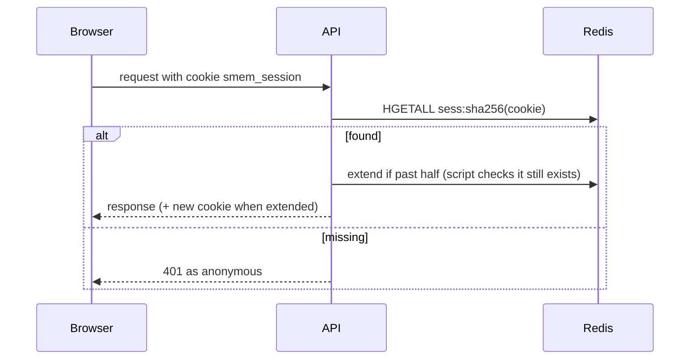

# T-052 — Login sessions move to Redis

**Epic:** E02-auth · **PRD:** [PRD.md](PRD.md) · **Milestone:** M1 · **Risk:** high · **Priority:** P1 · **Type:** tech-debt

#### Description
Sessions have a fixed lifetime (30 days, sliding), so they belong in Redis with native expiry instead of a MySQL table that needs purging (D-23). Behaviour for the user is unchanged: the same cookie, the same lifetime, the same revocations. Nothing is in production, so there is no data to migrate: the `sessions` table is dropped.

#### Scope
- In: a session store on Redis behind the existing `Service` API; the per-user index for "delete all sessions"; dropping the table; tests; docs.
- Out (do not do): changing the cookie, the TTL rules, CSRF, device lists or a "sign out everywhere" button (later), Google flow logic.

#### Acceptance criteria
- [ ] AC1 — Key layout: `smem:<env>:sess:<hex sha256 of the cookie value>` is a hash `{user_id, created_at, last_seen_at, user_agent}` with `EXPIRE` equal to the remaining lifetime; `smem:<env>:usess:<user id>` is a set of that user's session hashes whose own expiry is pushed to the latest session expiry. The raw token never reaches Redis.
- [ ] AC2 — Behaviour preserved: login and register create a session (30 days); `Authenticate` resolves a cookie, and when more than half the lifetime has passed it extends the session and re-issues the cookie as today; logout deletes the key and its index entry; an expired or unknown token is simply not found.
- [ ] AC3 — Delete-all: password reset (T-048), the Google pre-hijacking defence (T-011) and any other "delete every session of the user" call remove all of the user's sessions atomically (one Lua script or `MULTI`), including sessions whose index entry outlived them; a test creates 3 sessions, resets, and none authenticates.
- [ ] AC4 — Failure policy: when Redis is unavailable, endpoints that need a session answer `503 session_store_unavailable` (never treat the user as anonymous and never create a fake session); login and register fail the same way after the account rules ran; public endpoints without a session keep working; the error is logged once per interval, not per request.
- [ ] AC5 — Migration (next free number): drops table `sessions` (Down recreates it empty). The purge job and the `users`-side purge code are removed; no code reads the table afterwards.
- [ ] AC6 — Race safety: two requests refreshing the same session at once, and a logout racing a refresh, never resurrect a deleted session (use the script to check existence before extending).
- [ ] AC7 — Existing auth integration tests, the auth Postman collection (twice) and the web tests pass unchanged; new tests run against real Redis through `redistest`.

#### Design
Files: `internal/auth/{service,store,session}.go` (a `SessionStore` interface with the Redis implementation; MySQL implementation deleted), `internal/auth/*_test.go`, `migrations/NNNN_drop_sessions.sql`, `docs/redis.md`, `docs/auth-otp.md` if present.

#### Risk
`high`: authentication session storage.

#### Security & performance notes
Same secrecy as before: only the SHA-256 is a key. One round trip per authenticated request (HGETALL), plus one script call at most every 15 days per session. `noeviction` in Redis (T-051) so memory pressure fails writes instead of silently logging users out.

#### Test plan
- Dev: store tests on real Redis (create, authenticate, extend, expire with a small TTL, delete-all, race), the failure policy with Redis stopped, full auth suite.
- QA should probe: Redis restart (AOF) keeps users logged in; flush Redis (everyone logged out, no 500); two browsers; logout in one; reset password logs out all; a 1000-session user delete-all time; cookie replay after logout.
