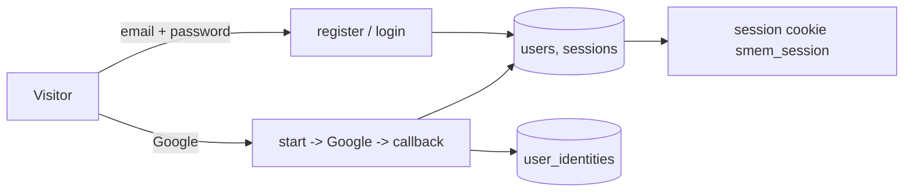

# E02 — Accounts and sign-in

**Status:** active   **Milestone(s):** M1   **Owner decisions:** D-02, D-07, L-09 (README §4)

## Problem and users
Students need an account to own a yearbook, and most of them already have a Google account. They sign in on their phone or laptop,
sometimes on several devices. Contributors (friends who leave notes) never need an account; this epic is only about owners.

## Goal and non-goals
- Goal: an owner can register and sign in with email + password or with Google, safely, in English or Vietnamese.
- Non-goals: other social providers (later), multi-factor authentication, account deletion and data export (M2, T-025), roles beyond
  "user" (class admins are M3), changing the email address.

## User stories
- As a student I can register with an email and a password so that I own a yearbook.
- As a student I can verify my email and reset a forgotten password so that I do not lose my account.
- As a student I can sign in with Google so that I do not need another password.
- As a student who registered with a password and later uses Google with the same address, I land in one account, not two.

## Scope and requirements
- Functional: register, login, logout, session cookie, email verification, password reset, Google sign-in with account linking.
- Non-functional: no account enumeration on login/forgot-password; passwords hashed with argon2id (NFKC-normalised); emails NFC and
  lower-case; sessions stored only as SHA-256; per-IP and per-account rate limits; origin check on every state-changing request.
- Constraints: in-house implementation (D-07); local test runs need no cloud credentials, so Google is tested against an in-process
  fake OIDC provider; real Google credentials are an owner-assisted step in M2.

## Flow and data

Entities: `users`, `sessions` (T-006), `email_tokens` (T-007), `user_identities` (T-011: provider, subject, user).

## Risks and open questions
- Pre-hijacking: someone registers a victim's email with a password before the victim signs in with Google. Mitigation in T-011: a
  Google sign-in with a verified address neutralises an unverified local account (clears its password and sessions) before linking.
- The Google OAuth client (Cloud Console) must be created by the owner before real use; blocked item in M2, not in M1.

## Exit criteria ("stable" for this epic)
- All flows above work end to end on the local stack and in CI, with the Postman collection and an automated Google flow against the
  fake provider; every security acceptance criterion has a test that fails when the control is removed.
- No open P0/P1 auth bug; every `Risk: high` task in the epic is owner-approved.

## Task index
Specs live next to this file; **status lives only on the board** (`L list`), never here, so it cannot drift.
| Task | Spec file | Depends on |
|---|---|---|
| T-011 Google sign-in (OIDC + PKCE, account linking) | `01-google-sign-in.md` | T-006, T-007 |
| T-006 Email + password auth core (register, login, sessions) | `02-email-password-auth-core-register-login.md` | T-001, T-002 |
| T-007 Email verification and password reset | `03-email-verification-and-password-reset.md` | T-006 |
| T-015 Web: auth pages and session handling | `04-web-auth-pages-and-session-handling.md` | T-003, T-007 |
| T-031 Auth hardening for go-live: edge rate limits, shared limiter, session purge, stored-hash caps | `05-auth-hardening-for-go-live-edge-rate-limits.md` | T-023 |
| T-045 Register accepts a locale; verification email in the student's language | `06-register-accepts-locale.md` | T-015 |
| T-047 Fix the flaky concurrent Google callback (retry with backoff) | `07-fix-flaky-google-concurrent-callback-test.md` | T-011 |
| T-048 Email one-time codes replace verification and reset links (API) | `08-email-otp-codes-replace-links-api.md` | T-045 |
| T-049 Web: code entry screens for verification and reset | `09-web-email-code-screens.md` | T-048 |
| T-052 Login sessions move to Redis | `10-sessions-in-redis.md` | T-051 |
| T-053 Rate limiters move to Redis (shared limiter) | `11-rate-limiters-in-redis.md` | T-051 |
