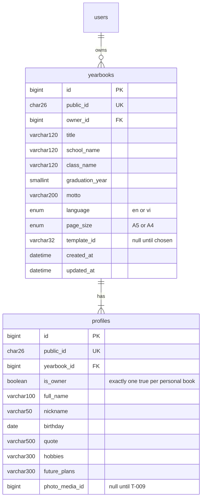

# T-008 — Yearbook CRUD and profile information

**Epic:** E03-yearbooks · **PRD:** [PRD.md](PRD.md) · **Milestone:** M1 · **Risk:** low · **Priority:** P1 · **Type:** feature

<!-- Migrated from the board block on 2026-10-07; the text below is unchanged. The board keeps status, dependencies and comments only. -->

#### Description
The yearbook itself: create, list, read, update and delete a user's yearbooks, plus the owner's profile page information. This is the data spine for notes, media, templates and export. The profile is modelled separately from the user so class yearbooks (M3) can later hold many student profiles without accounts. Decisions: D-03, L-05.

#### Scope
- In: `yearbooks` and `profiles` tables; CRUD endpoints; ownership checks; field validation; per-user limit.
- Out (do not do): photos (T-009), notes (T-012), templates and export (T-010, T-014), classes and multiple profiles per book (M3), sharing or public viewing, UI.

#### Acceptance criteria
- [ ] AC1 — `POST /v1/yearbooks {title, school_name?, class_name?, graduation_year?, motto?, language, page_size}` → `201 {"yearbook":…}` and auto-creates one owner profile whose `full_name` defaults to the user's display name. `language` ∈ `en|vi`; `page_size` ∈ `A5|A4` (default `A5`).
- [ ] AC2 — `GET /v1/yearbooks` returns only the caller's books, newest `updated_at` first, with `limit` (default 20, max 50) and an opaque `cursor`.
- [ ] AC3 — `GET /v1/yearbooks/{id}` returns the book with its profile. A book that does not exist **and** a book owned by someone else both return `404 not_found` (no existence leak). The same rule applies to every endpoint below.
- [ ] AC4 — `PATCH /v1/yearbooks/{id}` partially updates book fields; `PUT /v1/yearbooks/{id}/profile` replaces profile fields (`full_name`, `nickname?`, `birthday?`, `quote?`, `hobbies?`, `future_plans?`). Unknown JSON fields → `400 unknown_field`.
- [ ] AC5 — Limits (counted in characters, text trimmed, NFC-normalised, control characters rejected): title 1–120, school/class ≤ 120, motto ≤ 200, quote ≤ 500, hobbies ≤ 300, future plans ≤ 300, full name 1–100, nickname ≤ 50, graduation year 1950–2100, birthday a valid past date. Violations → `400 invalid_<field>`.
- [ ] AC6 — `DELETE /v1/yearbooks/{id}` → `204` and hard-deletes the book and its profile (foreign-key cascade). A user may own at most 20 books (`409 limit_reached`).
- [ ] AC7 — Every endpoint requires a session (`401 unauthenticated` otherwise) and uses `auth.RequireUser` from T-006. External ids are ULIDs; internal numeric ids never appear in responses.
- [ ] AC8 — `api/openapi.yaml` and `postman/yearbooks.postman_collection.json` updated; the Postman run covers the cross-user 404 case with two users and works twice back to back.

#### Design
Files: `migrations/0004_yearbooks_profiles.sql`, `internal/yearbook/{handler,service,store,validate}.go`, queries via sqlc (`internal/yearbook/queries.sql`), OpenAPI and Postman.

#### Risk
`low` — greenfield additive migration (L-06). Ownership checks are the main thing to get right; QA tests them as a matrix.

#### Security & performance notes
Every query is scoped by `owner_id` (never fetch by id alone, then compare). Index `yearbooks(owner_id, updated_at)`. Birthday is personal data: never logged, not exposed to contributors.

#### Test plan
- Dev: unit tests for validators (boundaries, NFC, control characters); integration tests for CRUD and the 20-book limit; an ownership matrix with two users across every endpoint.
- QA should probe: ids of the other user's book in every verb (all `404`); mass-assignment attempts (`owner_id`, `public_id`, `is_owner` in the body); emoji and long Vietnamese names at the length boundaries; pagination cursor tampering; delete then recreate.
