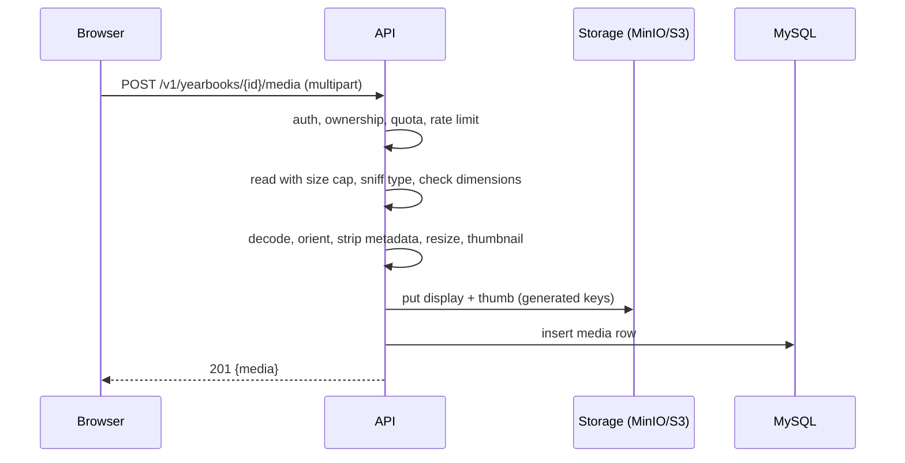

# T-009 — Photo upload and storage (MinIO/S3)

**Epic:** E03-yearbooks · **PRD:** [PRD.md](PRD.md) · **Milestone:** M1 · **Risk:** high · **Priority:** P1 · **Type:** feature

<!-- Migrated from the board block on 2026-10-07; the text below is unchanged. The board keeps status, dependencies and comments only. -->

> **Migration numbering (leader, 2026-10-07):** always take the next free number at the time you write the migration (`ls migrations/`); goose rejects out-of-order versions on databases that already applied a higher one.

#### Description
Photo upload and storage for yearbook owners. Photos come from untrusted users, end up in a printed PDF and contain personal data (faces, GPS in EXIF), so this task is about safe handling: validation, metadata stripping, size limits, quotas and non-guessable storage keys. The same service will later accept contributor photos (T-012). Storage is S3-compatible: MinIO locally, S3 in M2. Decisions: D-08, L-01, L-06.

#### Scope
- In: `media` table; `Storage` interface with an S3 implementation (aws-sdk-go-v2, endpoint and path-style configurable) and an in-memory fake; upload, content fetch and delete endpoints; image validation and normalisation; quotas; MinIO service in CI; deleting a yearbook removes its objects.
- Out (do not do): contributor uploads and moderation (T-012), CDN/presigned URLs (M2), HEIC support, video, cropping UI, face detection.

#### Acceptance criteria
- [ ] AC1 — `POST /v1/yearbooks/{id}/media` (multipart, field `file`) → `201 {"media":{id,width,height,bytes}}`. Only the book's owner may upload (`404` otherwise). Body capped at `SMEM_MEDIA_MAX_BYTES` (default 10 MiB) → `413 payload_too_large`.
- [ ] AC2 — Type is determined by sniffing content (JPEG, PNG, WebP), never by filename or `Content-Type`; anything else → `415 unsupported_media_type`. The image is decoded to verify it; decompression bombs are rejected by checking dimensions before full decode (max 12000 px per side and 50 megapixels) → `400 invalid_image`.
- [ ] AC3 — Stored output is normalised: EXIF orientation applied, **all metadata removed (EXIF/GPS/ICC comments)**, long edge resized to at most 3000 px (never upscaled), JPEG quality ≥ 90 (PNG with transparency stays PNG). A thumbnail with a 480 px long edge is also stored. A test uses a fixture JPEG with GPS EXIF and proves the stored bytes contain no EXIF segment.
- [ ] AC4 — Object keys are generated (`yearbooks/<yearbook_ulid>/<media_ulid>.<ext>` and `…-thumb.jpg`); user-supplied file names are never used in keys or headers.
- [ ] AC5 — `GET /v1/media/{id}/content?size=thumb|display` streams the object to the owner only (`404` for others) with the right `Content-Type`, `X-Content-Type-Options: nosniff`, `Cache-Control: private, max-age=3600`, and honours `Range` for display size. `DELETE /v1/media/{id}` → `204` removes the row and both objects (idempotent).
- [ ] AC6 — Quotas: 200 media per yearbook and 500 MiB stored per user (`409 quota_exceeded`); rate limit 60 uploads / 10 min per user (`429 rate_limited`).
- [ ] AC7 — `DELETE /v1/yearbooks/{id}` (T-008) removes the book's objects from storage before deleting rows; if storage deletion fails the request fails with `502 storage_error` and nothing is deleted.
- [ ] AC8 — `profiles.photo_media_id` and `yearbooks.cover_media_id` can be set to a media id owned by the same yearbook (`PUT …/profile`, `PATCH …/yearbooks/{id}` accept `*_media_id`); media from another book → `400 invalid_media`.
- [ ] AC9 — CI `go-integration` job gains a MinIO service container; storage integration tests run against MinIO locally (`make up`) and in CI. OpenAPI and `postman/media.postman_collection.json` updated (multipart cases included).

#### Design
Files: `migrations/<next free number>_media.sql`, `internal/media/{handler,service,store,image,quota}.go`, `internal/storage/{storage,s3,memory}.go`, small edits in `internal/yearbook` and `.github/workflows/ci.yml`.

`media(id, public_id, yearbook_id FK, uploader_kind ENUM('owner','contributor'), object_key, thumb_key, content_type, bytes, width, height, sha256, created_at)`.

The same migration is additive on existing tables: it adds `yearbooks.cover_media_id` (nullable) and foreign keys from `profiles.photo_media_id` and `yearbooks.cover_media_id` to `media(id)` with `ON DELETE SET NULL`.

Streaming through the API is deliberate for M1 (simple and always authorised); add a `ponytail:` comment naming the ceiling (API bandwidth) and the upgrade (presigned URLs behind CloudFront, M2).

#### Risk
`high` — untrusted file upload handling and personal data: owner approves the merge. Also touches CI.

#### Security & performance notes
Decode-bomb protection before allocation; bounded memory per request (read with a limit, process one image at a time per request, cap concurrent processing at `SMEM_MEDIA_MAX_CONCURRENT` default 4); strip metadata always; never serve user content with a type the user chose; authorise on every fetch; no public bucket access — the bucket is private.

#### Test plan
- Dev: unit tests with fixtures — rotated JPEG, JPEG with GPS EXIF, PNG with alpha, WebP, a GIF (rejected), a 1×1 PNG that claims a huge size in its header, a polyglot (valid JPEG header + HTML body), a 0-byte file, a truncated JPEG. Integration tests against MinIO for put/get/range/delete, quota and cross-user access.
- QA should probe: upload a renamed `.exe`/`.svg`/`.html` as `.jpg`; 11 MiB file; 200 parallel uploads (memory stays bounded); another user's media id on every verb; delete a yearbook and list the bucket (no leftovers); stop MinIO mid-upload (no row without objects, no objects without a row after retry).
