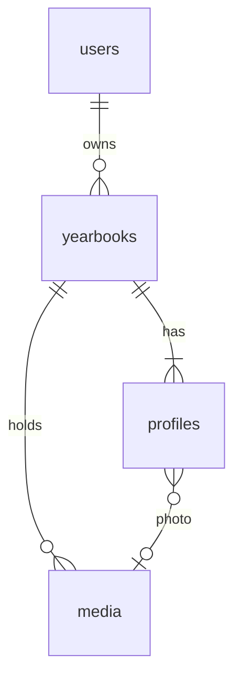

# E03 — Yearbooks and photos

**Status:** active   **Milestone(s):** M1   **Owner decisions:** D-01, D-02, D-03, L-05, L-09 (README §4)

## Problem and users
A student (18+, D-01) wants to create their own yearbook: give it a title, school, class and year, fill in a profile page about themselves
and add their best photos. They do this on a phone or laptop, in English or Vietnamese, and expect their photos to stay private.

## Goal and non-goals
- Goal: a signed-in owner creates, edits and deletes personal yearbooks, fills in the profile, and uploads and manages photos.
- Non-goals: class yearbooks with many student profiles (E07), sharing or public viewing of a yearbook, photo editing or cropping UI,
  HEIC support, video.

## User stories
- As a student I can create a yearbook and see only my own.
- As a student I can fill in my profile (name, nickname, birthday, quote, hobbies, plans) with Vietnamese diacritics and emoji.
- As a student I can upload photos, see thumbnails, choose a cover and a profile photo, and delete photos.
- As a student I can delete a yearbook and know its photos are deleted too.

## Scope and requirements
- Functional: yearbook and profile CRUD; photo upload with validation, orientation fix, metadata stripping, display and thumbnail versions;
  authorised photo streaming; quotas; web screens for all of it.
- Non-functional: every query is scoped to the owner and another user's book answers exactly like a missing one; at most 20 books per user,
  200 photos per book, 500 MiB per user; photos are untrusted input (content sniffing, decode limits, no EXIF/GPS kept); bucket private;
  text uses the shared NFC and control/format rules (L-09).
- Constraints: MinIO locally, S3 later (D-08); streaming through the API in M1 (CDN and presigned URLs are E06).

## Flow and data

## Risks and open questions
- Photo handling is the largest attack surface in the epic (decompression bombs, polyglot files): the spec lists the fixtures to test.
- Storage cost grows with photos: quotas and display-size re-encoding (3000 px) bound it.

## Exit criteria ("stable" for this epic)
- Owner creates a yearbook, fills the profile, uploads at least five photos, sets cover and profile photo, deletes a photo and then the book
  (objects removed from storage); the authorization matrix and every upload fixture pass in CI.

## Task index
Specs live next to this file; **status lives only on the board** (`L list`), never here, so it cannot drift.
| Task | Spec file | Depends on |
|---|---|---|
| T-008 Yearbook CRUD and profile information | `01-yearbook-crud-and-profile-information.md` | T-006 |
| T-009 Photo upload and storage (MinIO/S3) | `02-photo-upload-and-storage-minio-s3.md` | T-004, T-008 |
| T-016 Web: yearbook list, create/edit, profile and photo upload UI | `03-web-yearbook-list-create-edit-profile-and.md` | T-009, T-015 |
| T-036 Bound the memory of image processing (caps, concurrency, memory limit) | `04-bound-the-memory-of-image-processing.md` | T-009 |
| T-046 List a yearbook's photos (API and photo library) | `05-list-a-yearbooks-photos.md` | T-016 |
| T-055 Opaque list cursors (do not expose internal ids) | `06-opaque-list-cursors.md` | T-046 |
