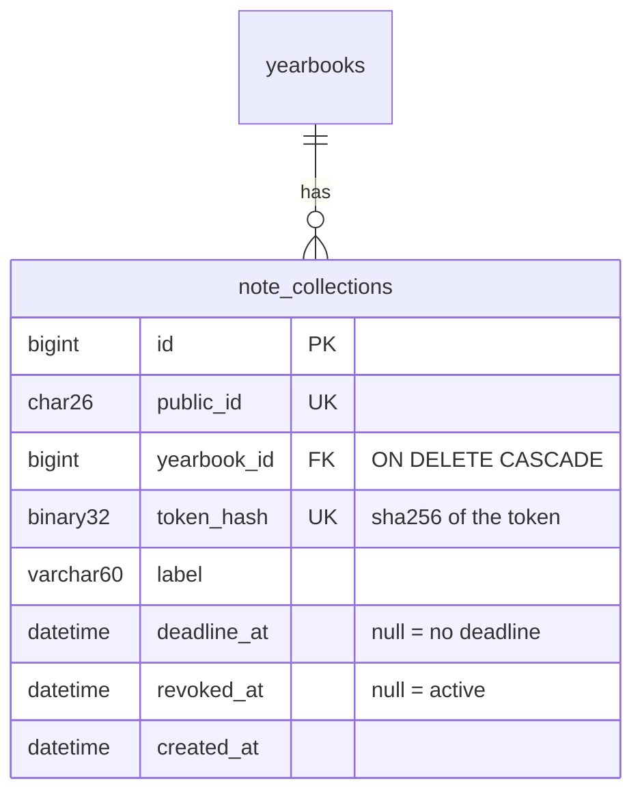

# T-012 — Collection links (owner API and public lookup)

**Epic:** E04-friends-notes · **PRD:** [PRD.md](PRD.md) · **Milestone:** M1 · **Risk:** high · **Priority:** P1

#### Description
An owner creates private, revocable links for a yearbook; a visitor with a link can look up the minimal public facts the contributor form
needs. This task is the link lifecycle and the public lookup only; submitting notes is T-034. The link token is a bearer secret.
Decisions: L-05 (opaque ids), L-07 (paths), T-028 (route-pattern logging); PRD stories 1, 2, 3.

#### Scope
- In: `note_collections` table; owner endpoints (create, list, revoke); public lookup; token generation and hashing; verified-email
  requirement; limits; OpenAPI and Postman.
- Out (do not do): submitting notes (T-034), moderation (T-013), any web page, email sending, a way to re-display an existing token
  (the owner revokes and creates a new link instead).

#### Acceptance criteria
- [ ] AC1 — `POST /v1/yearbooks/{id}/collections {label?, deadline_at?}` (session + origin check) → `201 {"collection":{id,label,deadline_at,created_at,token}}`. `token` is returned **only in this response**; it has at least 128 random bits, base64url (use 24 random bytes), and only its SHA-256 is stored. `label` is optional, at most 60 characters, NFC, trimmed, no control or format characters. `deadline_at` is optional, RFC 3339, must be in the future and at most 1 year ahead (else `400 invalid_deadline`).
- [ ] AC2 — Only the owner of the yearbook may create, list or revoke; a yearbook that does not exist and one owned by someone else both answer `404 not_found`. An owner whose email is not verified gets `403 email_not_verified`. At most 5 active (not revoked) collections per yearbook (`409 limit_reached`).
- [ ] AC3 — `GET /v1/yearbooks/{id}/collections` lists the yearbook's collections (id, label, deadline_at, created_at, revoked_at, `note_count` of notes in any status) newest first; it never returns a token or a token hash.
- [ ] AC4 — `DELETE /v1/collections/{id}` revokes (sets `revoked_at`) and answers `204`; repeating it is `204` as well; another user's collection is `404`. A revoked collection never becomes active again.
- [ ] AC5 — `GET /v1/public/collect/{token}` (no cookie needed, none read) → `200 {"yearbook":{"title"},"owner":{"display_name"},"deadline_at","open":true}` for an active collection; `404 not_found` for an unknown, malformed or revoked token (identical response, so a revoked link cannot be told from a never-valid one); `410 collection_closed` when the deadline has passed. It never returns ids, emails, or other notes.
- [ ] AC6 — The public lookup does not read or set any cookie, sends no CORS headers, and is rate-limited per client IP (60 per 15 minutes, `429 rate_limited` with `Retry-After`); the token never appears in any log line (the access log records the route pattern) or error message.
- [ ] AC7 — Deleting a yearbook (T-008) deletes its collections (foreign key cascade).
- [ ] AC8 — `api/openapi.yaml` documents all four endpoints and `postman/notes.postman_collection.json` covers create, list, revoke, public lookup (active, revoked, expired, garbage token) and the cross-user 404 with two users; it runs twice back to back.

#### Design
Files: `migrations/<next>_note_collections.sql`, `internal/notes/{collections,store,handler,token}.go` (package `notes`, shared with T-034/T-013), `internal/notes/*_test.go`, `internal/auth` (reuse `RequireUser`, `Guard`, `ratelimit`), `cmd/smemories-api/main.go` (register routes), `api/openapi.yaml`, `postman/notes.postman_collection.json`.

Route patterns for owner endpoints: `POST /v1/yearbooks/{id}/collections`, `GET /v1/yearbooks/{id}/collections`, `DELETE /v1/collections/{id}`; public: `GET /v1/public/collect/{token}`. Look the collection up by `token_hash` (equality on a unique index; no timing comparison of the secret itself is needed). Scope every owner query by `owner_id` through the yearbook, never fetch by id then compare.

#### Risk
`high`: a public, unauthenticated endpoint backed by a bearer secret. The owner approves the merge.

#### Security & performance notes
The token is a capability: random, long, hashed at rest, shown once, never logged. A flood of lookups with random tokens must be cheap (one indexed query) and rate-limited. Public responses carry no data beyond the book title, the owner's display name and the deadline.

#### Test plan
- Dev: unit tests for token generation (length, uniqueness, hash), validators (label, deadline); integration tests for each AC; an ownership matrix with two users across every owner endpoint; revoked and expired lookups; a test proving no token or hash in any list response and no token in captured logs.
- QA should probe: token brute-force rate (limit holds), a token with unusual characters or 10 KB long, the same token against the owner endpoints (must not authenticate anything), a session cookie sent to the public endpoint (ignored), deadline edges (now, one second ahead, year 2100), five active collections then a sixth, revoke then create (new token differs), concurrent create calls at the limit.
