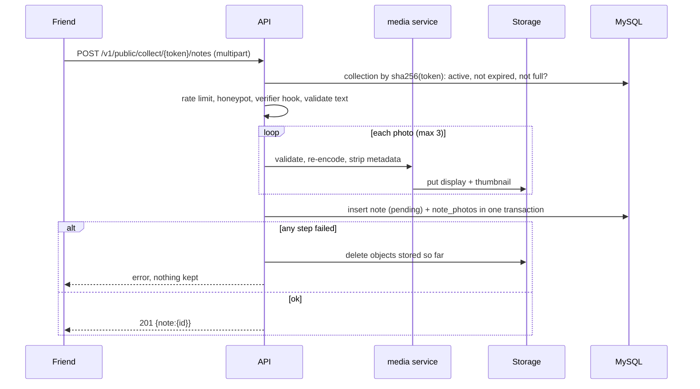
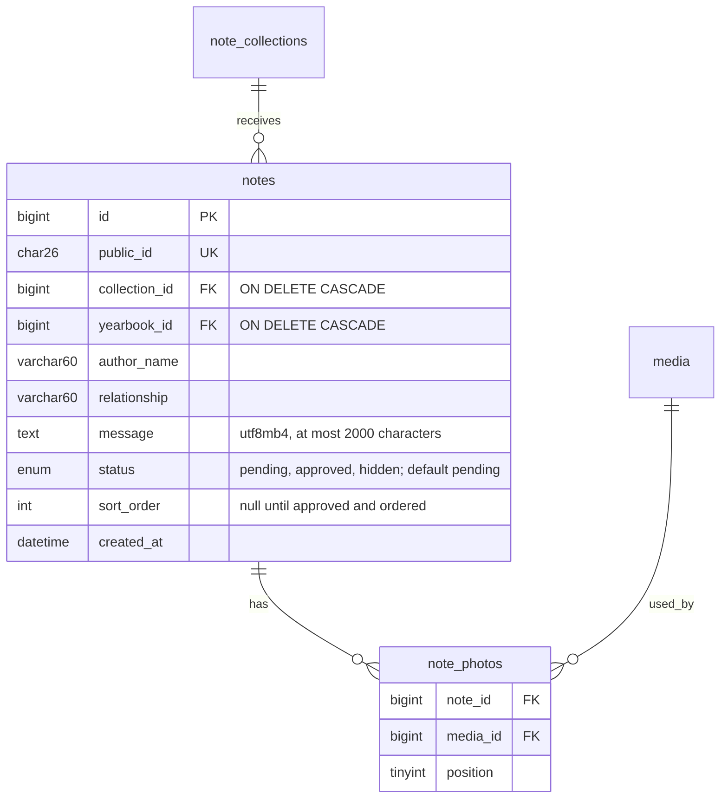

# T-034 — Public note submission (text and photos)

**Epic:** E04-friends-notes · **PRD:** [PRD.md](PRD.md) · **Milestone:** M1 · **Risk:** high · **Priority:** P1

#### Description
A friend with a collection link submits a note: name, optional relationship, a message with emoji, and up to three photos, without an
account. The note is stored as `pending` for the owner to moderate (T-013). This is the first unauthenticated endpoint that accepts files,
so limits and failure handling matter more than features. Uses the collections from T-012 and the photo pipeline from T-009.
Decisions: L-09 (text rules), D-12/E05 (only approved notes print); PRD story 3.

#### Scope
- In: `notes` and `note_photos` tables; `POST /v1/public/collect/{token}/notes`; text validation; photos through the T-009 pipeline as
  contributor uploads; rate limits and caps; a no-op abuse-verifier hook; honeypot field; OpenAPI and Postman.
- Out (do not do): listing or approving notes (T-013), CAPTCHA (hook only, Q-005), web form (T-018), email to the owner, editing or
  deleting a note by its author, returning any note data to the contributor.

#### Acceptance criteria
- [ ] AC1 — `POST /v1/public/collect/{token}/notes` (`multipart/form-data`) with `author_name` (1-60 characters), optional `relationship` (at most 60), `message` (1-2000 characters) and 0-3 files in field `photos` answers `201 {"note":{"id"}}` and stores the note with status `pending`. Any other Content-Type is `415 unsupported_media_type`; more than 3 photos is `400 too_many_photos`.
- [ ] AC2 — Text rules (reuse the shared helper from auth, board L-09): NFC, trimmed, counted in characters after normalisation. Control characters other than `\n` and `\t` are rejected, as are format characters except U+200D (ZWJ) and the variation selectors; `\r\n` becomes `\n`. Errors: `invalid_author_name`, `invalid_relationship`, `invalid_message` (`400`). Emoji, including non-BMP emoji and ZWJ sequences, and Vietnamese diacritics are stored and returned byte-identical (integration test on the real MySQL `utf8mb4`).
- [ ] AC3 — Each photo goes through the T-009 pipeline unchanged (content sniffing, decode limits, metadata stripping, display and thumbnail versions), stored as a contributor upload of the collection's yearbook. A rejected photo rejects the whole submission (`400 invalid_image` or `415 unsupported_media_type`) and nothing is stored.
- [ ] AC4 — All-or-nothing: if storing a photo or inserting the note fails after other objects were stored, those objects are deleted (compensation) and the response is `500 internal_error` or `502 storage_error`; a test injects a failing store and a failing insert and proves no row and no object is left behind.
- [ ] AC5 — Closed links: an unknown, malformed or revoked token answers `404 not_found`, an expired one `410 collection_closed`, identical to the lookup in T-012; nothing is stored and no photo is processed (the token is checked before the body is read beyond headers wherever possible).
- [ ] AC6 — Limits: the whole request body is capped at 32 MiB (`413 payload_too_large`), each photo at `SMEM_MEDIA_MAX_BYTES` (default 10 MiB); a collection holds at most 300 notes in any status (`409 collection_full`); contributor photos count toward the yearbook's media quota from T-009 (`409 quota_exceeded`). The route extends its own read deadline for slow phone uploads with `http.NewResponseController` (120 s) instead of raising the global timeouts.
- [ ] AC7 — Rate limits (in memory, per process): 10 submissions per client IP per hour and 40 per day, and 60 per collection per hour (`429 rate_limited` with `Retry-After`). Only requests that pass validation count; the client IP follows the same rule as auth (`SMEM_TRUST_PROXY`).
- [ ] AC8 — Honeypot: a non-empty form field `website` makes the request answer `201` exactly like a real submission but store nothing. A `Verifier` interface (`Verify(ctx, r) error`) is called before any file is processed; the default implementation always passes (a CAPTCHA can be plugged in later without touching the handler).
- [ ] AC9 — The endpoint never reads or sets a cookie, sends no CORS headers, ignores a session cookie, and logs no token, message text or file name (the access log records the route pattern, T-028). It stores no IP address and no user agent with the note.
- [ ] AC10 — `api/openapi.yaml` documents the endpoint (multipart schema, all error codes) and `postman/notes.postman_collection.json` covers: a text-only note, a note with two synthetic photos, emoji and Vietnamese text, each error path that needs no special setup, and the honeypot; it runs twice back to back.

#### Design
Files: `migrations/<next>_notes.sql`, `internal/notes/{submit,store,validate}.go`, `internal/notes/verifier.go`, `internal/media` (call the existing service with `uploader_kind=contributor`; add a function only if T-009 did not expose one), `internal/httpx` (per-route body limit and deadline helpers), `cmd/smemories-api/main.go`, `api/openapi.yaml`, `postman/notes.postman_collection.json`.

Index `notes(yearbook_id, status, sort_order)` for the export and moderation queries.

#### Risk
`high`: unauthenticated file upload and personal data of third parties. The owner approves the merge.

#### Security & performance notes
Everything a contributor sends is hostile: validate before processing files, process files one at a time with the T-009 concurrency cap, keep memory bounded (stream to the media service, never buffer 32 MiB per request twice), and cap what one link can store. Never trust the multipart file name, Content-Type or part order. Compensating deletes must run even when the client disconnects (use a detached context with a short timeout for cleanup).

#### Test plan
- Dev: validator tests (every character class of AC2, boundaries 1/60/2000), integration tests on MySQL and MinIO for every AC including the failure-injection test of AC4, the emoji round trip, limits, rate limits, honeypot, closed/expired/revoked links; a test that no cookie, CORS header, IP or user agent is involved.
- QA should probe: a 40 MiB body, 4 photos, a renamed `.html` as `.jpg`, a decompression bomb, an empty file, a zero-photo note, the same note posted 11 times (limit), 301 notes into one collection, a revoked link mid-flight, a client that disconnects during the upload (no orphan objects), parallel submissions racing the 300-note cap, injection strings and bidi/zero-width characters in every field, and storage down.

#### Leader notes from the T-009 review (2026-10-08)
This task now depends on T-036 (memory bound of the image pipeline). A submission carries up to three photos and 32 MiB: decode them one at a time through the shared processing slots
(`media.Service` semaphore), never in parallel inside one request, and reject the whole submission with `503 busy` + `Retry-After` when no slot frees up within a few seconds, instead of queueing unbounded.

#### Leader notes from the T-012 review (2026-10-08)
Rate limits on the public routes must work for a whole class behind one campus network address. T-012's public lookup counts **every** request per IP (60 per 15 minutes), so about 60 students opening
the same link in a quarter of an hour would lock the rest out. In this task, change the lookup so that only **misses** (unknown, malformed or revoked token) count against the IP limit
(`Take` first, `Refund` on a hit, the pattern the login limiter already uses) and keep a much higher cap for all requests (for example 600 per 15 minutes per IP) as a cost guard. Size the submission limits the same way
(per collection and per IP, with the per-collection cap as the real brake) and test "40 different students from one IP each submit once".
