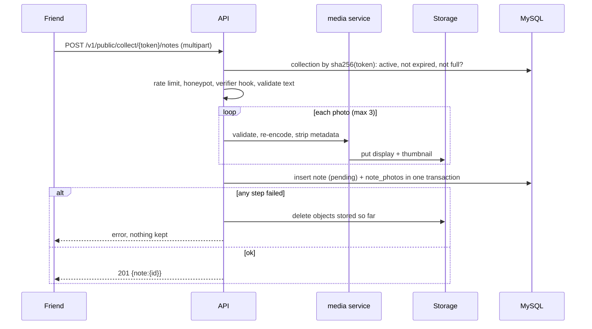
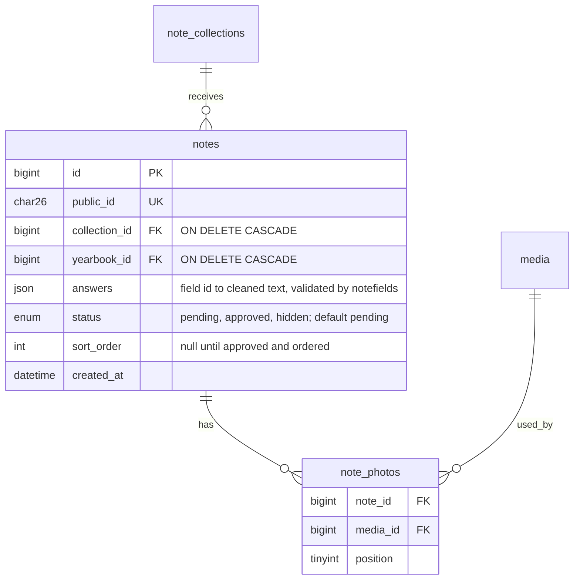

# T-034 — Public note submission (text and photos)

**Epic:** E04-friends-notes · **PRD:** [PRD.md](PRD.md) · **Milestone:** M1 · **Risk:** high · **Priority:** P1

#### Description
A friend with a collection link submits a note: answers to the fields of the form (by default name, optional relationship and message; a template can ask for more, D-21) with emoji, and up to three photos, without an
account. The note is stored as `pending` for the owner to moderate (T-013). This is the first unauthenticated endpoint that accepts files,
so limits and failure handling matter more than features. Uses the collections from T-012, the photo pipeline from T-009 and the field catalogue from T-043.
Decisions: L-09 (text rules), D-12/E05 (only approved notes print), D-21 (template-driven fields); PRD story 3.

#### Scope
- In: `notes` (answers as JSON) and `note_photos` tables; `POST /v1/public/collect/{token}/notes`; validation of answers through `internal/notefields` (T-043); the public lookup of T-012 now also returns the form's fields; photos through the T-009 pipeline as
  contributor uploads; rate limits and caps; a no-op abuse-verifier hook; honeypot field; OpenAPI and Postman.
- Out (do not do): listing or approving notes (T-013), CAPTCHA (hook only, Q-005), web form (T-018), email to the owner, editing or
  deleting a note by its author, returning any note data to the contributor.

#### Acceptance criteria
- [ ] AC1 — `POST /v1/public/collect/{token}/notes` (`multipart/form-data`) with a text part `answers` holding a JSON object `{"<field id>":"<text>"}` and 0-3 files in field `photos` answers `201 {"note":{"id"}}` and stores the note with status `pending`. The accepted fields are the form's fields (AC11): an id outside them is `400 unknown_field`, a missing required one `400 missing_answer`, an invalid one `400 invalid_answer` (the error message names the field id, never the value). `answers` over 16 KiB or not a JSON object of strings is `400 invalid_body`. Any other Content-Type is `415 unsupported_media_type`; more than 3 photos is `400 too_many_photos`.
- [ ] AC2 — Text rules come from `notefields.Validate` (T-043, board L-09): NFC, trimmed, counted in characters after normalisation, control and format characters rejected as specified there. Emoji, including non-BMP emoji and ZWJ sequences, and Vietnamese diacritics are stored and returned byte-identical (integration test on the real MySQL `utf8mb4`, through the JSON column).
- [ ] AC3 — Each photo goes through the T-009 pipeline unchanged (content sniffing, decode limits, metadata stripping, display and thumbnail versions), stored as a contributor upload of the collection's yearbook. A rejected photo rejects the whole submission (`400 invalid_image` or `415 unsupported_media_type`) and nothing is stored.
- [ ] AC4 — All-or-nothing: if storing a photo or inserting the note fails after other objects were stored, those objects are deleted (compensation) and the response is `500 internal_error` or `502 storage_error`; a test injects a failing store and a failing insert and proves no row and no object is left behind.
- [ ] AC5 — Closed links: an unknown, malformed or revoked token answers `404 not_found`, an expired one `410 collection_closed`, identical to the lookup in T-012; nothing is stored and no photo is processed (the token is checked before the body is read beyond headers wherever possible).
- [ ] AC6 — Limits: the whole request body is capped at 32 MiB (`413 payload_too_large`), each photo at `SMEM_MEDIA_MAX_BYTES` (default 10 MiB); a collection holds at most 300 notes in any status (`409 collection_full`); contributor photos count toward the yearbook's media quota from T-009 (`409 quota_exceeded`). The route extends its own read deadline for slow phone uploads with `http.NewResponseController` (120 s) instead of raising the global timeouts.
- [ ] AC7 — Rate limits (in memory, per process): 10 submissions per client IP per hour and 40 per day, and 60 per collection per hour (`429 rate_limited` with `Retry-After`). Only requests that pass validation count; the client IP follows the same rule as auth (`SMEM_TRUST_PROXY`).
- [ ] AC8 — Honeypot: a non-empty form field `website` makes the request answer `201` exactly like a real submission but store nothing. A `Verifier` interface (`Verify(ctx, r) error`) is called before any file is processed; the default implementation always passes (a CAPTCHA can be plugged in later without touching the handler).
- [ ] AC9 — The endpoint never reads or sets a cookie, sends no CORS headers, ignores a session cookie, and logs no token, message text or file name (the access log records the route pattern, T-028). It stores no IP address and no user agent with the note.
- [ ] AC10 — `api/openapi.yaml` documents the endpoint (multipart schema, all error codes) and `postman/notes.postman_collection.json` covers: a text-only note, a note with two synthetic photos, emoji and Vietnamese text, an unknown field, a missing required field, each error path that needs no special setup, and the honeypot; it runs twice back to back.
- [ ] AC11 — Form fields: `GET /v1/public/collect/{token}` (T-012) additionally returns `"fields":[…]` in the shape of `notefields.Info` (id, kind, label, hint, required, max_length) for the collection's yearbook. The set comes from one function `notes.FieldsFor(ctx, yearbookID)`: it returns the default set (`notefields.Default()`) now; T-044 makes it return the fields of the book's template (`templates.NoteFields`). A note is validated against the set in force at submission time; answers are stored by field id, so later changing the template loses nothing. OpenAPI, the web schema and the Postman collection are updated for the additive change.

#### Design
Files: `migrations/<next>_notes.sql` (next free number at the time), `internal/notes/{submit,store,fields}.go`, `internal/notefields` (T-043, read-only here), `internal/notes/verifier.go`, `internal/media` (call the existing service with `uploader_kind=contributor`; add a function only if T-009 did not expose one), `internal/httpx` (per-route body limit and deadline helpers), `cmd/smemories-api/main.go`, `api/openapi.yaml`, `postman/notes.postman_collection.json`.

Index `notes(yearbook_id, status, sort_order)` for the export and moderation queries.

#### Risk
`high`: unauthenticated file upload and personal data of third parties. The owner approves the merge.

#### Security & performance notes
Everything a contributor sends is hostile: validate before processing files, process files one at a time with the T-009 concurrency cap, keep memory bounded (stream to the media service, never buffer 32 MiB per request twice), and cap what one link can store. Never trust the multipart file name, Content-Type or part order. Compensating deletes must run even when the client disconnects (use a detached context with a short timeout for cleanup).

#### Test plan
- Dev: validator tests (every character class of AC2, boundaries 1/60/2000), integration tests on MySQL and MinIO for every AC including the failure-injection test of AC4, the emoji round trip, limits, rate limits, honeypot, closed/expired/revoked links; a test that no cookie, CORS header, IP or user agent is involved.
- QA should probe: a 40 MiB body, 4 photos, a renamed `.html` as `.jpg`, a decompression bomb, an empty file, a zero-photo note, the same note posted 11 times (limit), 301 notes into one collection, a revoked link mid-flight, a client that disconnects during the upload (no orphan objects), parallel submissions racing the 300-note cap, injection strings and bidi/zero-width characters in every field, and storage down.

#### Leader notes from the T-009 review (2026-10-08)
This task now depends on T-036 (memory bound of the image pipeline). A submission carries up to three photos and 32 MiB: decode them one at a time through the shared processing slots
(`media.Service` semaphore), never in parallel inside one request, and reject the whole submission with `503 busy` + `Retry-After` when no slot frees up within a few seconds, instead of queueing unbounded.

#### Leader notes from the T-012 review (2026-10-08)
Rate limits on the public routes must work for a whole class behind one campus network address. T-012's public lookup counts **every** request per IP (60 per 15 minutes), so about 60 students opening
the same link in a quarter of an hour would lock the rest out. In this task, change the lookup so that only **misses** (unknown, malformed or revoked token) count against the IP limit
(`Take` first, `Refund` on a hit, the pattern the login limiter already uses) and keep a much higher cap for all requests (for example 600 per 15 minutes per IP) as a cost guard. Size the submission limits the same way
(per collection and per IP, with the per-collection cap as the real brake) and test "40 different students from one IP each submit once".

#### Leader notes from decision D-21 (2026-10-08)
Notes are template-driven from the start: do not add `author_name`, `relationship` or `message` columns; the moderation list reads the display name from `answers.name` (the default set always has it; if a template drops `name`, show "Anonymous" or the first answer).
Keep the JSON column small and bounded: AC1 caps the request part at 16 KiB and each field is limited by the catalogue. T-013 (moderation), T-014 (export), T-017 and T-018 (web) read and show answers by field id; their specs carry the matching notes.

#### Leader note from the T-036 review (2026-10-08)
`api/openapi.yaml` still says `invalid_image` means "over 50 megapixels" (media upload, `POST /v1/yearbooks/{id}/media`). After T-036 the rule is: 12000 px per side, JPEG up to 50 MP, PNG and WebP up to 25 MP, and an estimated decoded size of at most 128 MiB (docs/media.md). While you edit the OpenAPI file in this task, correct that description for both upload endpoints and regenerate the web schema.

#### Leader notes from the T-034 QA failure (2026-10-08): slow-upload denial of service
QA showed that four connections which send a partial `photos` part and then go silent hold all in-flight upload slots (`4 x SMEM_MEDIA_MAX_CONCURRENT`) until the 120 s read deadline, so every other photo submission, for every yearbook, answers 503. Anyone can create their own collection link, so this is reachable by any registered user. Required changes, with tests:
1. **Rolling idle deadline.** The route's read deadline must move with progress: abort the request (`408` or close, no note, no objects) when no body bytes arrive for 10 s; keep 120 s as the total cap. Implement it as a reader wrapper that sets `http.NewResponseController(w).SetReadDeadline(now + 10s)` before each read (the server allows repeated calls).
2. **Per-IP cap on concurrent photo-bearing submissions**, default 8 (config `SMEM_PUBLIC_UPLOAD_CONCURRENT_PER_IP`, validated at startup, documented in `.env.example` and README); above it `503 busy` with `Retry-After`. Sized so a class behind one campus address (40 students at once) still gets through, because each upload now frees its slot within seconds. Text-only submissions need no slot.
3. **Validate before holding a slot.** The `answers` part comes first in the multipart body: validate it (and the token, link state and note cap) before reading any photo bytes, so a request that will be rejected never occupies a slot.
4. Tests: the stalled-connection scenario from QA (4 half-open uploads, then a normal 3-photo submission must still succeed within the idle window), idle deadline abort leaves no row and no object, per-IP cap, the 40-students case still passes.
5. Small: the OpenAPI text for the busy 503 must say it answers immediately with `Retry-After` (not "within a few seconds"); a client disconnect during processing must not be logged at ERROR (log at INFO or not at all) and must not be counted as a server error.
Edge protection against many-source floods stays with T-031 (WAF and load balancer limits).

#### Leader notes, round 2 (2026-10-08): decouple the network phase from the processing slots
QA found the root problem of the first design (mine): a scarce processing slot is held while a slow phone sends its body, so (a) a class behind one address is limited to 2 concurrent uploads and its 503 retries count against the per-IP request cap (at 1 MB/s per student, 14 of 40 were locked out for 14 minutes), and (b) two addresses can hold the whole pool, even with one byte every 7 seconds. Redesign, keeping the earlier requirements (idle deadline, validate answers first):
1. **Spool the body to disk, then process.** Read the multipart body (bounded, 32 MiB) into a temporary file (`SMEM_UPLOAD_TMP_DIR`, default the OS temp dir, files `0600`, always removed, also on error, panic and client disconnect). The network phase holds no memory slot and no processing slot. Only after the whole body is on disk, process the photos one at a time under the existing media processing semaphore (`SMEM_MEDIA_MAX_CONCURRENT`), waiting up to 10 s for a slot (processing a photo takes well under a second) and answering `503 busy` + `Retry-After` only when that wait expires.
2. **Two cheap limits for the network phase** (they cost a socket and disk, not RAM): at most `SMEM_PUBLIC_UPLOAD_MAX_CONNS` concurrent submissions with a body (default 48) and `SMEM_PUBLIC_UPLOAD_CONCURRENT_PER_IP` per client IP (default 8; remove the `min(configured, pool/2)` rule). Above them `503 busy` with a jittered `Retry-After` (random 2 to 6 s). A `503 busy` must **not** count against the per-IP request caps (`Refund` it, as the login limiter does for successes), so retries cannot lock a class out.
3. **Minimum throughput** against slow-drip: after a 15 s grace period the average rate of the request body must stay at or above 16 KiB/s, otherwise drop it with `408` and clean up; the 10 s idle deadline and the 120 s total cap stay.
4. **Early rejections must be readable by a browser.** When the answers part is invalid or the link is closed, drain the rest of the body (discard, bounded by the same limits and deadlines) before writing the error response, so the browser shows the JSON error and not a connection reset; tests use a real socket and a client that keeps sending.
5. **Tests (real sockets where timing matters):** 40 students at 1 MB/s each, with the client retrying like the web form: all 40 get `201` and none gets `429`; one byte every 7 s is dropped by the throughput rule; 8 stalled uploads from each of 2 IPs do not stop a third IP's normal submission; 49 concurrent uploads: the 49th gets `503` while memory stays flat (spooled, assert RSS or heap growth under a bound); temp files are gone after success, error, disconnect and a panic in the handler; the Postman notes collection gains the edge case 'answers after photos gives 400 invalid_body'.
6. Docs: README, `.env.example`, `docs/media.md` describe the three settings and the disk use (worst case 48 x 32 MiB). Production sizing note for T-022: ephemeral storage of the task must exceed that.
Flood protection from many addresses stays with T-031 (WAF and load balancer limits).
