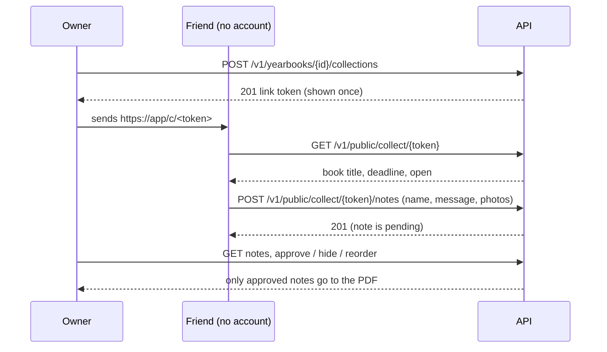
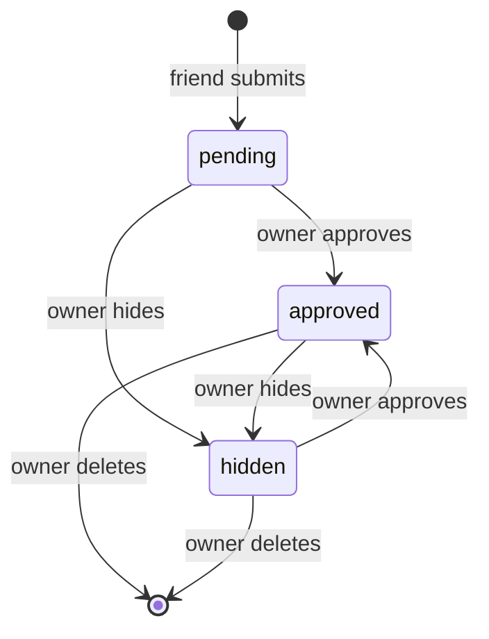

# E04 — Friends' notes

**Status:** planned   **Milestone(s):** M1   **Owner decisions:** D-01, D-04, L-05, L-09 (README §4); abuse protection: Q-005

## Problem and users
A yearbook is mostly what friends write in it. Today students chase messages and photos through chat groups and screenshots. The owner
(a student with an account) needs one link to send to friends, teachers and family; the contributor (anyone with the link, no account,
often on a phone) leaves a message and a few photos in a minute. The owner decides what goes into the book.

## Goal and non-goals
- Goal: an owner creates a private collection link for a yearbook, shares it, receives notes (text, emoji, up to three photos each),
  and approves or hides every note before it can be printed.
- Non-goals: contributors seeing each other's notes, contributor accounts, replying to notes, email notifications to the owner (later),
  free-form editing of a note by the owner, video or audio, notes from under-18 contributors being treated differently (D-01 limits the
  *owner* audience to 18+; contributors are collected minimally: a name, a relationship, a message, photos).

## User stories
- As an owner I can create a link for my yearbook, optionally with a deadline, so that friends can contribute.
- As an owner I can revoke a link and create a new one, so that a leaked link stops working.
- As a friend I open the link on my phone and leave my name, a message with emoji and up to three photos, without signing up.
- As an owner I see every submitted note as pending and approve or hide it, and reorder the approved ones.
- As an owner I know that only approved notes are printed.

## Scope and requirements
- Functional: collection links (create, list, revoke, deadline); public lookup and public submission; moderation (approve, hide, reorder,
  delete); only approved notes reach the PDF (E05).
- Non-functional:
  - the link token is an unguessable bearer secret: at least 128 random bits, stored only as a SHA-256, shown once, never logged
    (access log records the route pattern, T-028);
  - the public endpoints are unauthenticated and accept files: strict size and count limits, per-IP and per-link rate limits, photos pass
    the same validation and re-encoding as owner photos (T-009: type sniffing, decode limits, metadata stripped);
  - a contributor's request never sets or uses a session cookie (nothing to protect against CSRF, nothing to leak);
  - personal data minimised: no IP address or user agent stored with a note; contributors' text is NFC, trimmed, free of control and
    format characters (L-09 rules).
- Constraints: a verified owner email is required to create a link (T-007), which limits throw-away accounts abusing the feature.

## Flow and data

## Risks and open questions
- Abuse of the public upload form (spam, junk files, storage cost). Mitigations in the tasks: rate limits, size caps, pending-by-default
  moderation, a per-collection cap. Open: whether to add a CAPTCHA (Q-005). Recommendation: ship without, keep a verifier hook, enable
  Cloudflare Turnstile (free) when abuse appears.
- Contributor photos contain faces of third parties; the owner's moderation is the control, deletion of a yearbook deletes all its notes
  and photos (T-008/T-009).

## Exit criteria ("stable" for this epic)
- Owner creates, revokes and rotates links; an anonymous client submits a note with emoji and two photos; the owner approves and hides;
  a revoked or expired link refuses submissions; only approved notes are returned for export.
- Every limit in the specs is covered by a test that fails when the limit is removed; the Postman collection runs twice back to back.

## Task index
Specs live next to this file; **status lives only on the board** (`L list`), never here, so it cannot drift.
| Task | Spec file | Depends on |
|---|---|---|
| T-012 Collection links (owner API and public lookup) | `01-collection-links.md` | T-007, T-008 |
| T-034 Public note submission (text and photos) | `02-public-note-submission.md` | T-012, T-009 |
| T-013 Notes moderation API (approve, hide, reorder, delete) | `03-notes-moderation-api-approve-hide-reorder.md` | T-034 |
| T-017 Web: notes link management and moderation inbox | `04-web-notes-link-management-and-moderation.md` | T-013, T-016 |
| T-018 Web: public anonymous notes form | `05-web-public-anonymous-notes-form.md` | T-003, T-034 |
