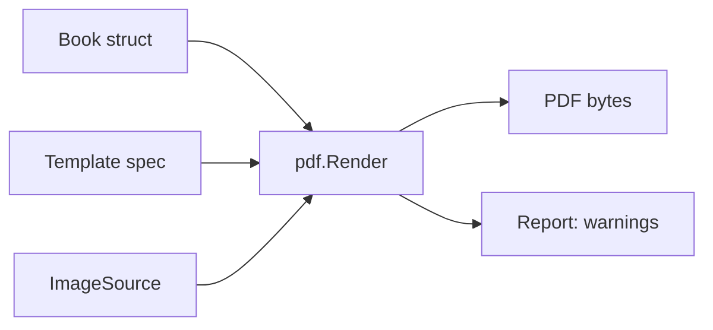

# E05_T-010 — Template spec and PDF page renderer

**Epic:** E05-templates-export · **PRD:** [PRD.md](PRD.md) · **Milestone:** M1 · **Risk:** high · **Priority:** P1 · **Type:** feature

<!-- Migrated from the board block on 2026-10-07; the text below is unchanged. The board keeps status, dependencies and comments only. -->

#### Description
The template system and the PDF page renderer, built on the library chosen in T-005. A template is a declarative JSON spec (pages, elements, slots bound to book data); the renderer turns a plain Go `Book` value into a PDF. No database or HTTP here, so it is fast to test. This is the heart of the product: it must print Vietnamese correctly and never overflow a box. Decisions: D-06 (pure-Go engine, spec-based templates, form-based editing, preview = real PDF), D-04, T-005 verdict.

#### Scope
- In: spec format and validator; two templates (`classic`, `modern`); renderer for page kinds `cover`, `profile`, `notes`, `back`; text fitting and pagination; font fallback for emoji; image placement with effective-DPI reporting; deterministic output option; `docs/templates.md`.
- Out (do not do): HTTP endpoints, the export job and S3 (T-014), the web UI (T-019), free-form editing, user-uploaded templates, CMYK/bleed (M4), removing the T-005 spike files other than what this task replaces.

#### Acceptance criteria
- [ ] AC1 — `internal/templates` loads embedded template JSON and validates it: unknown slot names, elements outside the page bounds, missing fonts and invalid units produce an error that names the template, page and element. `templates.List()` returns `classic` and `modern` with localised names (`en`, `vi`).
- [ ] AC2 — `pdf.Render(ctx, tmpl, book, images, w, opts) (Report, error)` produces a valid PDF for page sizes A5 and A4. `book` is a plain struct (title, school, class, year, motto, profile, notes); `images` is an interface for fetching photo bytes by id; `Report` lists warnings.
- [ ] AC3 — Page kinds: `cover` (title, school/class/year, optional cover photo), `profile` (photo, full name, nickname, quote, hobbies, plans), `notes` (a repeating block: each note shows author name/relationship, message and optional photos; notes flow across as many pages as needed), `back` (closing page with motto).
- [ ] AC4 — Vietnamese: text is NFC-normalised and rendered with the embedded OFL font; a test renders `Chúc mừng tốt nghiệp! Đặng Thị Hồng` and extracts exactly that text from the PDF.
- [ ] AC5 — Emoji and missing glyphs: emoji render through the bundled monochrome emoji fallback font; a rune present in no font is skipped and added to `Report.Warnings` (code `missing_glyph`, with the rune and location) — never a panic, never a failed render.
- [ ] AC6 — Text never overflows its box: wrap by words (and by character for very long tokens), shrink down to the element's `min_size`, then truncate with `…`; truncation adds a `text_truncated` warning. A test with a 3000-character message proves no text is drawn outside the box.
- [ ] AC7 — Images use `fit: cover` with centred crop; if effective resolution is below 300 DPI add a `low_resolution` warning with the media id; a missing or unreadable image renders a neutral placeholder and a `missing_image` warning.
- [ ] AC8 — `Options.Now` fixes the PDF creation date so identical input yields byte-identical output (a test asserts it).
- [ ] AC9 — Benchmark/test: a 24-page A5 book with 30 synthetic photos renders in ≤ 20 s and stays under 512 MB heap (sampled with `runtime.ReadMemStats`); numbers are logged.
- [ ] AC10 — `docs/templates.md` documents the spec (units are millimetres, element types, slot names, fonts, fitting rules) well enough to add a template without touching Go code.

#### Design
Files: `internal/templates/{spec,load,validate}.go`, `internal/templates/embed/{classic,modern}.json`, `internal/pdf/{render,text,image,fonts,report}.go`, `internal/pdf/fonts/` (from T-005), `docs/templates.md`; delete `internal/pdf/spike/` once its useful parts are moved.

```json
{
  "id": "classic",
  "name": {"en": "Classic", "vi": "Cổ điển"},
  "page_sizes": ["A5", "A4"],
  "theme": {"font": "BeVietnamPro", "colors": {"ink": "#1b1b1b", "accent": "#7a2e2e", "paper": "#fffdf8"}},
  "pages": [
    {"kind": "cover", "elements": [
      {"type": "image", "slot": "cover_photo", "x": 0, "y": 0, "w": 148, "h": 120, "fit": "cover"},
      {"type": "text", "slot": "title", "x": 14, "y": 130, "w": 120, "h": 30, "size": 28, "min_size": 18, "align": "center"}
    ]}
  ]
}
```

Coordinates are millimetres on an A5 reference page; the validator checks bounds and the renderer scales for A4. Slots are a closed set defined in code (documented in `docs/templates.md`).



#### Risk
`high` — introduces the core PDF dependency (and fonts): owner approves the merge.

#### Security & performance notes
Template JSON is trusted (embedded), but the validator still bounds element counts and sizes so a future user-supplied template cannot exhaust memory. Book text and images are untrusted: no format-string use, no path access, image decoding limits come from T-009 normalisation (re-check dimensions defensively). Load each image once, release it after placing it, and stream output to the writer.

#### Test plan
- Dev: validator tests (bad templates), text-fitting tests (short, exact fit, overflow, one 500-character word, emoji, ZWJ sequence, RTL text is out of scope), pagination of notes (0, 1, 7, 60 notes), deterministic-output test, text extraction tests, the benchmark. Commit one small sample PDF per template to `docs/templates/` for review (synthetic photos only).
- QA should probe: open both templates' PDFs in Preview and Chrome (glyphs, margins, images sharp); names with stacked diacritics; a note made of only emoji; missing/corrupt photos; A4 vs A5; run the render twice and diff the bytes.
