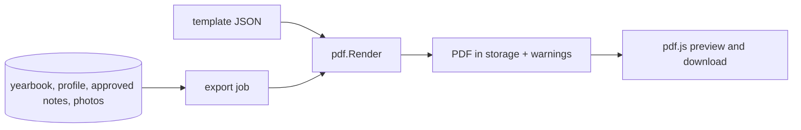

# E05 — Templates and PDF export

**Status:** active   **Milestone(s):** M0 (spike), M1   **Owner decisions:** D-04, D-06, D-12 (README §4)

## Problem and users
The owner wants a finished book: pick a look, see exactly what will print, and download a print-quality PDF to take to any print shop.
Printing is outside the app in v1 (D-04). Vietnamese names and friends' emoji must come out right, and photos must stay sharp.

## Goal and non-goals
- Goal: the owner chooses between at least two templates, previews the real PDF, exports it (A5 or A4) and downloads it, with plain-language
  warnings for anything that did not print as intended.
- Non-goals: free-form drag-and-drop layout, bleed and CMYK (M4), colour emoji, ordering printed books, user-uploaded templates.

## User stories
- As an owner I choose a template and see a preview that equals the output.
- As an owner I export my book as a PDF and download it, even for a 24-page book with 30 photos.
- As an owner I am told when a photo is low resolution, a note was shortened, or a character could not be printed.
- As a developer I can add a template by writing JSON, without changing Go code.

## Scope and requirements
- Functional: declarative JSON template spec with validator; `classic` and `modern`; page kinds cover, profile, notes, back; text fitting and
  pagination; export job (asynchronous, status, authorised download); web picker, pdf.js preview, export and download.
- Non-functional: pure-Go engine `codeberg.org/go-pdf/fpdf` (D-06, D-12); Vietnamese NFC text; emoji as monochrome outlines via a fallback font;
  24 pages with 30 photos in at most 60 s and 512 MB; only approved notes are printed; the renderer runs under a context deadline.
- Constraints: ADR 0002 rules are binding (docs/adr/0002-pdf-engine.md).

## Flow and data

## Risks and open questions
- Byte-identical output only holds for distinct photo widths (fpdf ordering): documented, not needed by the product.
- The renderer has no built-in caps: the export job must enforce the deadline and use only approved notes.

## Exit criteria ("stable" for this epic)
- The M1 export criteria (README §2) pass in an automated test: a 24-page A5 book with 30 photos, Vietnamese text and emoji notes, within budget.

## Task index
Specs live next to this file; **status lives only on the board** (`L list`), never here, so it cannot drift.
| Task | Spec file | Depends on |
|---|---|---|
| T-005 Spike: choose the pure-Go PDF engine | `01-spike-choose-the-pure-go-pdf-engine.md` | — |
| T-010 Template spec and PDF page renderer | `02-template-spec-and-pdf-page-renderer.md` | T-005 |
| T-014 Export job: assemble book, render PDF, store, download | `03-export-job-assemble-book-render-pdf-store.md` | T-009, T-010, T-013 |
| T-019 Web: template picker, PDF preview (pdf.js) and export/download | `04-web-template-picker-pdf-preview-pdf-js-and.md` | T-014, T-016 |
| T-035 T-010 follow-ups: template tests iterate templates.List() | `05-t-010-follow-ups-template-tests-iterate.md` | T-010 |
| T-054 Spike: HTML templates and browser print-to-PDF | `06-spike-browser-print-to-pdf.md` | — |
