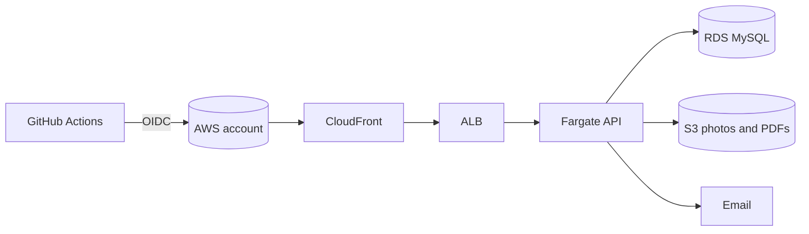

# E06 — Go live on AWS and harden

**Status:** planned   **Milestone(s):** M2   **Owner decisions:** D-08, D-10, D-11, L-10 (README §4)

## Problem and users
Everything built so far runs on a laptop. Real students need a public, reliable, backed-up service that sends real email, and the owner needs to
know when it breaks. This epic is mostly owner-assisted: it needs an AWS account, a domain, a verified email domain and a Google OAuth client.

## Goal and non-goals
- Goal: SMemories runs at a public URL on AWS (Fargate, RDS MySQL, S3, CloudFront), deploys from CI without long-lived keys, sends verification
  and reset emails, is observable, and can be restored from backups; users can export and delete their data.
- Non-goals: multi-region, autoscaling tuning, class yearbooks (E07), under-18 users.

## User stories
- As a student I use the app at a stable HTTPS address and receive my verification email within a minute.
- As the owner I get an alarm when the site is down or erroring and I can restore the data after a mistake.
- As a student I can download or delete my data.

## Scope and requirements
- Functional: production Dockerfile and configuration, infrastructure as code (OpenTofu, D-10), deploy pipeline with GitHub OIDC, email provider with SPF/DKIM/DMARC,
  metrics and alarms, backups with a tested restore drill, data export and deletion.
- Non-functional: build with the newest Go 1.26 patch (L-10); secrets in AWS Secrets Manager; private subnets and encryption at rest; cost estimate agreed with the
  owner before provisioning; migrations run as a one-off task.
- Constraints: owner provides the AWS account, domain and OAuth client; paid services need a recorded decision first.

## Flow and data

## Risks and open questions
- Cost surprises: agree a monthly budget and alarms before provisioning.
- Email deliverability needs domain setup the owner must do.
- Questions to raise when this epic starts: email provider choice (SES vs other), domain name, data-retention periods, backup retention.

## Exit criteria ("stable" for this epic)
- Public URL serves the M1 journey end to end; a restore drill from backup succeeded and is documented; alarms fire in a test; SPF/DKIM pass;
  export and deletion of a user's data work.

## Task index
Specs live next to this file; **status lives only on the board** (`L list`), never here, so it cannot drift.
| Task | Spec file | Depends on |
|---|---|---|
| T-021 Transactional email provider and domain setup | `01-transactional-email-provider-and-domain-setup.md` | T-007 |
| T-022 Dockerfile, production config and migrations as a one-off task | `02-dockerfile-production-config-and-migrations.md` | T-004 |
| T-023 AWS infrastructure as code and deploy pipeline | `03-aws-infrastructure-as-code-and-deploy.md` | T-022 |
| T-024 Observability: metrics, alarms, uptime check, log retention | `04-observability-metrics-alarms-uptime-check.md` | T-023 |
| T-025 Backups, restore drill, and user data export/deletion | `05-backups-restore-drill-and-user-data-export.md` | T-023 |
