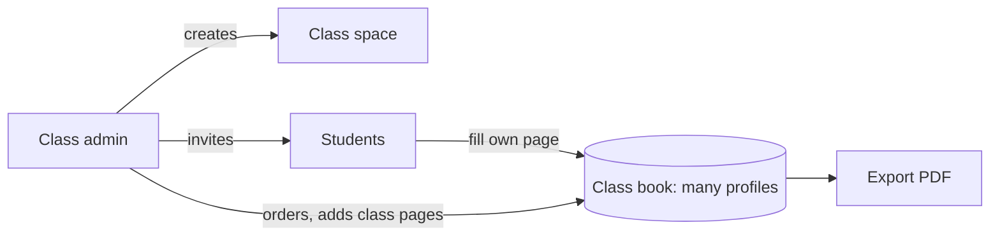

# E07 — Class yearbook

**Status:** planned   **Milestone(s):** M3   **Owner decisions:** D-01, D-03, Q-002 / D-11 (README §4)

## Problem and users
The headline use case: a class makes one yearbook together. A teacher or class monitor (admin) creates the class space, invites students, and each
student fills in their own page; the admin assembles and exports one book. Today this is done by one overworked person collecting everything by hand.

## Goal and non-goals
- Goal: a class admin creates a class yearbook, invites students, students contribute their profile pages and photos, the admin orders the pages and exports one PDF.
- Non-goals until decided: under-18 students (D-01 keeps owners 18+; a school pilot would need its own consent work), in-app printing, payments.

## User stories
- As a class admin I create a class space and invite students by link.
- As a student I fill in my own page and cannot edit other pages.
- As a class admin I order the pages, add class-level pages (intro, teachers, events, superlatives) and export the book.

## Scope and requirements
- Functional: classes, memberships and roles (admin, student); invites; many profiles per book; class pages and templates; assembly and export.
- Non-functional: a full privacy review before any build (many students' personal data, photos); roles enforced on every endpoint; export budget scales to 120 pages.
- Constraints: builds on E03, E04, E05; starts only after E06 (go-live first, D-11).

## Flow and data

## Risks and open questions
- Can a student be a profile without an account? (owner question when this epic starts)
- Who may see whose photos and notes inside a class? Needs a written permission matrix.
- Whether minors can take part, and the consent model if so (D-01 revisit trigger).

## Exit criteria ("stable" for this epic)
- A class of at least 30 students produces one exported book from a staging environment; the permission matrix is tested; the privacy review is signed off by the owner.

## Task index
Specs live next to this file; **status lives only on the board** (`L list`), never here, so it cannot drift.
| Task | Spec file | Depends on |
|---|---|---|
| T-026 Class yearbook: classes, memberships, roles and invites | `01-class-yearbook-classes-memberships-roles-and.md` | — |
| T-027 Class book assembly: many profiles per book, class pages and templates | `02-class-book-assembly-many-profiles-per-book.md` | — |
