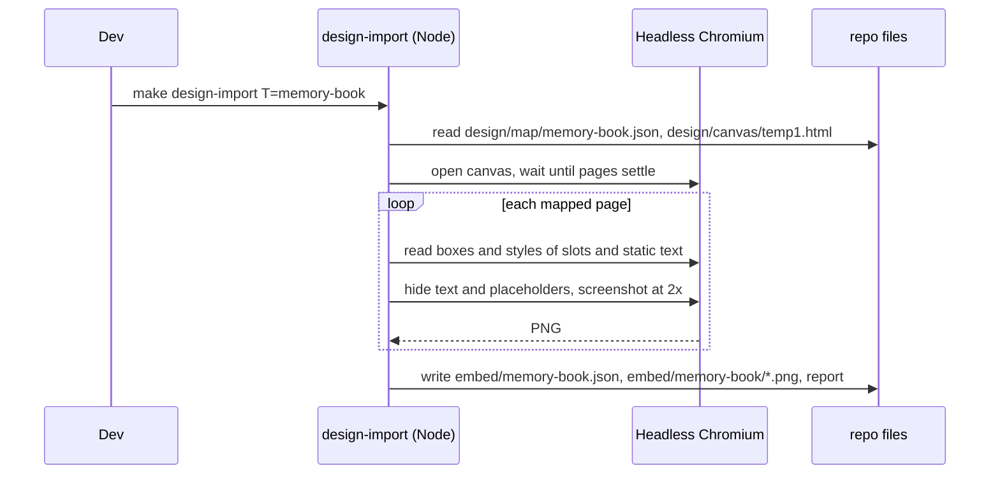

# E08_T-039 — Design import tool (dev only)

**Epic:** E08-designer-templates · **PRD:** [PRD.md](PRD.md) · **Milestone:** M1 · **Risk:** low · **Priority:** P2 · **Type:** tech-debt

#### Description
Eight designs with 45 pages cannot be measured by hand reliably. This task builds a development-time command that reads a canvas file from `design/canvas/`, renders each page's decoration to a background image with text and photo placeholders hidden,
reads the boxes and styles of the text and photo elements from the page, and writes a draft template (JSON and assets) in the T-038 format. It never runs in CI and never ships in the product (L-12).

#### Scope
- In: the tool in `tools/design-import/` (Node.js, Playwright with Chromium), one mapping file per template under `design/map/`, a report, docs, a comparison helper.
- Out (do not do): any change to the Go runtime, running the tool in CI, converting designs without a mapping file, unpacking or editing the canvas bundles in the repository, guessing Vietnamese translations (the tool leaves `vi` equal to a `TODO` marker that the validator rejects).

#### Acceptance criteria
- [ ] AC1 — `make design-import T=<id>` (or `node tools/design-import/run.mjs <id>`) reads `design/map/<id>.json` and the canvas file it names, and writes `internal/templates/embed/<id>.json` and `internal/templates/embed/<id>/*.png`. The tool and its lockfile live under `tools/design-import/` with exact pinned versions; nothing is added to `web/package.json`, `go.mod` or CI. Prerequisites (Node 22+, `npx playwright install chromium`, optional `pdftoppm` for the comparison) are in `docs/design-import.md`.
- [ ] AC2 — Rendering: the board iframes of the canvas file (816 × 1056 px each) are loaded after the canvas runtime has finished (wait for fonts and for the page to settle; fail with a clear message on timeout) and screenshotted at device scale factor 2 (1632 × 2112 px, 192 DPI) into one PNG per mapped page. Output is deterministic: running twice gives identical bytes (fixed viewport, animations disabled, fonts loaded before capture; the PNGs are written with a fixed encoder setting).
- [ ] AC3 — Hiding: before the screenshot the tool hides (a) all text (`color` and `-webkit-text-fill-color` transparent, text shadows removed), (b) every element matched by the page's `hide` selectors in the mapping file (photo placeholders, the hatched boxes, form fields that become slots). Everything else, including blank writing lines and decorative frames, stays in the image. A per-page check fails the run when a hidden selector matches nothing.
- [ ] AC4 — Slots: for each `slots` entry (`{"slot":"full_name","selector":"…"}`) the tool takes the element's bounding box in CSS px and converts it to mm of the reference page (px × 25.4 / 96 for Letter; the reference comes from the mapping file), and emits a `text` or `image` element with that box. For text it copies font size (px to pt, × 0.75), weight, colour (mapped to the nearest theme colour or added to `theme.colors`), alignment, line height and rotation (from the computed transform). For image slots it copies border radius and detects circles and ellipses.
- [ ] AC5 — Static text: every other visible text node on a mapped page becomes a static `text` element (`"text":{"en":"<original>","vi":"TODO"}`) with its own measured box and style, grouped per page in the report. The report `design/map/<id>.report.md` lists per page: slots found, static strings, fonts used (families and weights, with a column "Vietnamese-capable?" taken from the font CSS subsets in the canvas file), rotations, anything unmapped, the size of each PNG.
- [ ] AC6 — Pages that map to two template pages (for example a back page derived from the cover) are supported by two entries naming the same canvas page with different `hide` lists.
- [ ] AC7 — Comparison helper: `make design-compare T=<id>` renders `docs/templates/<id>.pdf` page by page (needs `pdftoppm`), places each next to the canvas screenshot of the mapped page and writes one PNG `docs/templates/<id>-compare.png` (at most 1 MiB, 4 pages across). It exits with a clear message when `pdftoppm` is missing.
- [ ] AC8 — Proof on temp1: with a first mapping file `design/map/memory-book.json` (cover, All about me, From a Friend, Let's stay in touch, as in the PRD table) the tool produces a draft that loads (`templates.List()` may skip drafts that contain `TODO`; a flag or test documents how) and whose PNGs each stay under 1.5 MiB; the dev attaches the report to the pull request. Finishing the template is T-040.
- [ ] AC9 — `docs/design-import.md` explains the mapping file format with an example, the workflow (run, read the report, fix the mapping, rerun, hand-edit only what the tool cannot decide, compare), and the known limits.

#### Design

Mapping file sketch:
```json
{"id":"memory-book","canvas":"temp1.html","reference":"Letter","name":{"en":"Memory Book","vi":"Sổ lưu bút"},
 "pages":[{"kind":"cover","canvasPage":"Cover","hide":["…photo placeholder selector…"],
           "slots":[{"slot":"title","selector":"…"},{"slot":"cover_photo","selector":"…"}]}]}
```
The canvas page is addressed by its board title (`h2` text above the iframe); selectors are resolved inside the iframe document. The canvas files are bundles whose pages are rendered from a nested template at run time, so the tool must wait for the rendered DOM, not parse the files.

#### Risk
`low`: a development tool in its own folder, no runtime path, no network use besides the fonts the canvas loads itself. New dev dependency (approved here): `playwright` (Apache-2.0) with a downloaded Chromium, plus an image library only if needed to keep PNGs small (for example `sharp`, Apache-2.0; prefer palette quantisation through Playwright's PNG output and `pngquant` only if already installed).

#### Security & performance notes
The tool opens files from the repository only (file or a local static server bound to 127.0.0.1 that it starts and stops itself); it must not follow links, fetch other origins on purpose, or write outside `internal/templates/embed/`, `design/map/` and `docs/templates/`. Canvas content is data, not instructions.

#### Test plan
- Dev: run on temp1 twice and diff the outputs (identical); unit tests for the px-to-mm conversion, colour mapping and the "unmatched selector" failure using a tiny hand-written fixture HTML in `tools/design-import/testdata/`; the comparison helper on the `classic` template.
- QA should probe: a mapping that names a missing page or selector (clear error, nothing half-written); running from another working directory; running with Chromium missing (clear message); output files under the size limits; that no file outside the three allowed folders changes.
