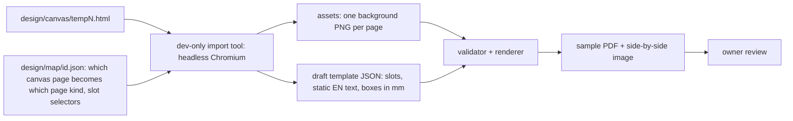

# E08 — Designer templates (Claude Design canvases become system templates)

> **On hold (2026-10-08):** the owner proposed browser print-to-PDF from HTML templates instead of server rendering. Spike T-054 decides (ADR 0003, then D-24). Do not start the tasks of this epic that build on the Go renderer path until then; finished work stays.

**Status:** planned   **Milestone(s):** M1 (pilot of two designs), later rollout   **Owner decisions:** D-15, D-16, D-17, D-18, L-12 (README §4)

## Problem and users
The owner designed eight yearbook looks in Claude Design (`design/canvas/temp1.html` … `temp8.html`, 45 pages in total, US Letter, 816 × 1056 px). They look far better than
the two built-in templates (`classic`, `modern`). Students should be able to pick them in the template picker and get a print-ready PDF with their own text and photos.
The canvases are React pages that only render in a browser; our PDF engine is pure Go (D-12) and draws `text`, `image` and `rect` elements from a JSON spec (docs/templates.md).

## Goal and non-goals
- Goal: a repeatable pipeline that turns a canvas into a system template (JSON + embedded assets), proven on two pilot designs (`memory-book` from temp1, `navy-classic` from temp2),
  reviewed by the owner side by side with the canvas; then the other six designs.
- Non-goals (this epic, first round): the page types our data model does not have (class portraits grid, class awards and superlatives, friend quiz, year in review, welcome/editor letter as free text,
  photo gallery, contacts table) — D-17; templates uploaded by users; an in-app editor; A4/A5 versions of the designs (D-16: the designs stay US Letter; a later re-export at A4/A5 re-runs the same pipeline).

## User stories
- As a student I choose "Memory Book" or "Navy Classic" for my Letter-size yearbook and the PDF looks like the owner's design with my name, photo and friends' notes.
- As the owner I compare every template page with my canvas and approve it before it ships.
- As a developer I add a template by running the import tool on a canvas and fixing the few things the tool cannot decide, not by measuring pixels by hand.
- As a Vietnamese student my name and my friends' notes print with correct diacritics in every template.

## Scope and requirements
- Functional: US Letter as a third page size (D-16); template format v2 (per-page background image, localised static text, rotation, ellipse photo mask, several embedded font families per template); a dev-only import tool;
  two pilot templates with sample PDFs and a side-by-side comparison image.
- Non-functional: pure-Go runtime, no browser at run time (D-12, L-12); every embedded font covers Vietnamese (D-18) and is open-licence (OFL) with its licence file; assets are bounded (1.5 MiB per file, 8 MiB per template);
  the renderer keeps its time and memory budget (T-014: 24 pages with 30 photos in 60 s and 512 MB); all text strings exist in EN and VI.
- Constraints: ADR 0002 and docs/templates.md rules stay binding; classic and modern keep working unchanged.

## Approach (L-12) and flow
The decoration of each page (shapes, illustrations, textures, frames, tape) is rendered once, at development time, to a background image with every text and photo placeholder hidden. At run time the Go renderer
draws that background and then our slots on top. Static labels ("All About Me") are real text elements (EN and VI), so they localise; boxes for names, quotes and photos are read from the canvas DOM, not measured by hand.

## Page mapping to our four kinds (D-17)
| Design | cover | profile | notes (one repeating block) | back |
|---|---|---|---|---|
| temp1 Memory Book | Cover | All about me | From a Friend (one note per page) | Let's stay in touch |
| temp2 Navy classic | Cover | Welcome letter (oval photo, three paragraphs = quote, hobbies, plans, signature = name) | Autographs (signing lines become note items) | the Cover's navy frame with the motto (no closing page in the design) |
| temp3 … temp8 | decided in the rollout task after the pilot review | | | |

Pages that have no kind stay unused for now (temp1: Our class, Class awards, Friend quiz, Note from my teacher). The developer may propose a different mapping in the pull request with a reason; the leader decides.

## Risks and open questions
- US Letter only (D-16): the designs cannot print on A4; Vietnamese print shops use A4. Mitigation: the pipeline is reusable; re-export the designs at A5/A4 later and re-run it. Revisit when the first A4 user complains.
- Embedded assets grow the Go binary and the repository (about 1 MiB per page; budget 8 MiB per template). Revisit at the rollout (move assets to object storage if the total passes 64 MiB).
- Font lookalikes change the feel slightly; the owner approves each template's sample.
- Vietnamese UI strings for static labels are drafted by the team; the owner (native speaker) reviews the label table in each template PR.
- The canvas files are 14.6 MB in the public repository (committed 2026-10-08); keep them as the source of truth and do not add more large binaries.

## Exit criteria ("stable" for this epic)
- `memory-book` and `navy-classic` appear in `templates.List()`, pass the shared template tests, render the four page kinds in EN and VI with Vietnamese sample data without warnings, and the owner approved the sample PDFs.
- The import tool regenerates both templates byte for byte from the canvas files (documented in docs/design-import.md).

## Task index
Specs live next to this file; **status lives only on the board** (`L list`), never here, so it cannot drift.
| Task | Spec file | Depends on |
|---|---|---|
| T-037 US Letter page size, end to end | `01-us-letter-page-size-end-to-end.md` | — |
| T-038 Template format v2: backgrounds, static text, rotation, ellipse, font families | `02-template-format-v2-backgrounds-static-text.md` | T-035 |
| T-039 Design import tool (dev only) | `03-design-import-tool-dev-only.md` | T-038 |
| T-040 Template "memory-book" from temp1 | `04-template-memory-book-from-temp1.md` | T-037, T-038, T-039, T-035, T-044 |
| T-041 Template "navy-classic" from temp2 | `05-template-navy-classic-from-temp2.md` | T-037, T-038, T-039, T-035, T-044 |
| T-044 Templates declare note fields (format v2.1) | `07-templates-declare-note-fields.md` | T-038, T-043 |
| T-042 Roll out designs temp3 to temp8 | `06-roll-out-designs-temp3-to-temp8.md` | T-040, T-041 |
