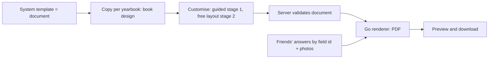

# E09 — Customisation and design editor (Canva-style, staged)

**Status:** planned (sketch; tasks are specified when each stage starts)   **Milestone(s):** M1b (guided customisation), M4 (free-layout editor)   **Owner decisions:** D-19, D-20, D-21 (README §4)

## Problem and users
Students want their yearbook to look like theirs: move a photo, resize a title, remove a block, add a sticker, replace an image. The owner asked (2026-10-08) for a Canva-like experience: the site provides templates, gathers friends' submissions,
inserts them into the template, each template has its own fields, and the yearbook owner edits the design on the web page: add, remove, resize and replace any component.
Printing and ordering stay outside the app (D-04).

## Goal and non-goals
- Goal (staged, D-19): (1) templates drive the forms and students make guided customisations; (2) after go-live, a free-layout editor on the same document model.
- Non-goals: users publishing templates to other users or a template gallery (D-20), real-time collaboration, native apps, video, AI layout, ordering prints.

## Stages
| Stage | Milestone | What the student can do | Main pieces |
|---|---|---|---|
| 0 | M1 (now) | Pick a system template (E05, E08); friends' forms are template-driven (D-21: T-043, T-034, T-044) | field catalogue, answers by field id, templates declare fields |
| 1 Guided customisation | M1b (after M1 is stable) | Per book: colour and font sets from the template's allowed choices, show/hide/reorder pages, edit titles and static text, swap photos and backgrounds, choose which note fields print | `book_designs` (one design copy per yearbook), customise screen with a PDF preview, validator for design copies |
| 2 Free-layout editor | M4 (own milestone after go-live M2; order against M3 class decided at the M2 retrospective) | Add, remove, move, resize, rotate, replace elements; add text, shapes, stickers and frames from an asset library; layers; undo and redo; snapping and safe margins | canvas editor, asset library, document limits and sanitising, render-parity tests, autosave and versions |

## The document model (the key decision)
The design document of a book is a copy of the template JSON (format v2/v2.1, docs/templates.md), resolved with the student's changes: pages, elements with a box in mm, a slot or fixed text, rotation, fonts and colours from allowed sets.
One format serves all three stages: system templates are documents, a student's book design is a document, the editor edits a document, and the Go renderer (L-12) draws a document into the PDF. The editor may therefore only offer what the renderer can draw.
Slots stay the binding between a document and the data (profile fields, photos, note answers); a student can move or resize a slot element but not invent a data source.

## Scope and requirements (outline, to be specified per stage)
- Stage 1: `book_designs` table (yearbook id, document JSON, template id and version, updated_at; one row per book); API to read, patch and reset a design; server-side validation against the template's allowed choices and global limits (pages, elements, bytes); preview as the real PDF (server render, pdf.js); changing template keeps the answers and photos and starts a fresh design.
- Stage 2: an editor library spike first (MIT-licensed Konva or Fabric.js versus paid SDKs such as Polotno or CE.SDK; paid services need an owner decision, licences to verify at that time); text editing through a DOM text field laid over the canvas (Vietnamese input methods Telex and VNI are the known failure point of canvas editors);
  fonts shipped to the browser from the same files the PDF uses (Vietnamese-capable only, D-18); element palette and property panel; layers; undo and redo; snapping and guides; safe-margin overlay; asset library with licensed, curated stickers and frames (OFL/CC0 or owner-made, licence file per asset); strict validation of every document and asset on the server (limits, allowed asset ids only, SVG not accepted unless sanitised); autosave with versions; parity tests proving that the editor's text fitting and the PDF agree; mobile strategy (phone view-and-light-edit first, full editing on larger screens).
- Non-functional: the export budget of T-014 holds for edited documents; a document never references data the student does not own; accessibility basics (keyboard moves, labels, contrast).

## Flow

## Risks and open questions
- Screen and PDF can disagree (text wrapping and shrinking). Mitigation: preview is the server-rendered PDF in stage 1; stage 2 shares the layout rules and has parity tests; limit editor effects to what the renderer supports.
- Vietnamese input in canvas editors (stage 2 spike must prove it).
- Phones: canvas editing on small screens is hard; decide the level of support in the stage 2 spec.
- Asset licensing and storage size; user-uploaded images follow the T-009 pipeline.
- Cost: stage 2 is about 20 or more tasks. Owner questions to raise at stage 2 start: editor SDK versus building on Konva/Fabric (cost, licence), mobile support level, asset library source, version retention, and whether M4 goes before the class yearbook (M3).
- D-12 stays (pure-Go PDF). Revisit only if the editor needs effects the renderer cannot draw (then a headless-browser renderer would need its own decision: memory, sandboxing, cost).

## Exit criteria ("stable" for this epic)
- Stage 1: a student customises colours, fonts, page order and visibility of their book, sees the PDF preview, resets to the template, and the export matches the preview; existing notes and photos survive a template change.
- Stage 2: a student adds, removes, moves, resizes and replaces elements in the browser on desktop and tablet, types Vietnamese correctly, undoes and redoes, and the exported PDF matches the editor in an automated parity test.

## Task index
No board tasks yet. The foundation tasks of this direction are in other epics: T-043 (field catalogue), T-034 (answers by field id), T-044 (templates declare fields), T-038 (format v2). Stage 1 and stage 2 tasks are specified when their milestone becomes "Now" (README §2).
