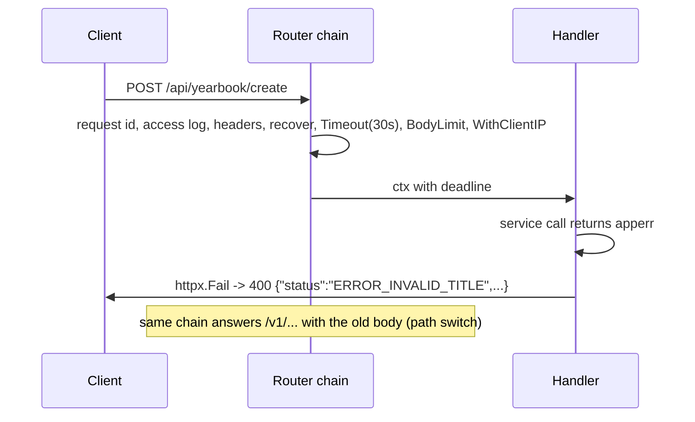

# E10_T-063 — E10 foundation: apperr, v2 response helpers, request timeout and client-IP middleware, contract lint

**Epic:** E10-skills-alignment · **PRD:** [PRD.md](PRD.md) · **Milestone:** M1 · **Risk:** low · **Priority:** P1 · **Type:** infra
**Read first:** `docs/api-contract.md`, `docs/go-conventions.md`, `.agents/skills/be-golang/SKILL.md` and `references/code-quality.md`, `.agents/skills/be-api-design/SKILL.md` (main checkout).

#### Description
Everything the later E10 tasks share, added **without changing any existing endpoint**: a typed error package, the v2 envelope helpers, the path-based envelope switch that lets domains move one at a time, a request-timeout and a client-IP middleware, a test that enforces the contract documentation, and the web client shim.

#### Scope
- In: new `internal/apperr`; `internal/httpx` (helpers, switch, middleware); `internal/auth` only to delegate `ClientIP`; `web/src/api/client.ts` (+ tests) and `web/vite.config.ts`; the contract lint test; `.golangci.yml` is NOT changed here (T-072 enables the linters).
- Out (do not do): moving any endpoint, touching migrations, converting existing `fmt.Errorf` uses, the metrics middleware (T-073).

#### Requirements (SHALL)
1. The system SHALL answer every `/api/...` request with the v2 envelope, including 404, 405, 413, 429, panics and `RequireUser` rejections, and every other path with the old envelope, unchanged.
2. A handler SHALL be able to return an error with one call and get the right HTTP status and `ERROR_*` code.
3. A request SHALL be cancelled by a deadline (default 30 s) unless its route sets another.
4. An operation in `api/openapi.yaml` under `/api/` SHALL fail the build if it lacks a summary, description, `x-auth`, `x-error-codes`, property descriptions or a response example.

#### Acceptance criteria
- [ ] AC1 — `internal/apperr`: `type Code struct{Name string; HTTP int}` (no `net/http` import: HTTP is an int); `apperr.NewCode(name string, http int) Code`; predefined `Internal` (`ERROR_INTERNAL`, 500), `Unauthorized` (401), `Forbidden` (403), `Param` (`ERROR_PARAM`, 400), `NotFound` (404), `Conflict` (409), `RateLimited` (429), `TooLarge` (413), `Unavailable` (503), `BadGateway` (502). `New(code, msg)`, `Wrap(code, err, msg)`, `WithCode(code, err)`, `CodeOf(err) Code` (unknown errors are `Internal`; `context.Canceled` stays Internal), `Is(err, code)`. The error type has `Unwrap`, so `errors.Is/As` keep working; `Error()` text never contains the wrapped cause twice. Table-driven unit tests, 100% of the package.
- [ ] AC2 — `httpx.OK(w, r, data)` writes HTTP 200 `{"status":"OK","data":...}` (nil data -> `{}`); `httpx.Fail(w, r, err)` writes `{"status":<code.Name>,"error_message":<English text>,"request_id":...}` with `code.HTTP`; for `Internal`, `Unavailable` and `BadGateway` it first logs at ERROR with `request_id` and the full wrapped error (never the request body), the message to the client is generic ("internal server error"); other codes log nothing. `httpx.Page[T]{Items []T "items"; NextID string "next_id"}` and `httpx.ParseLimit(r, def, max) (int, error)` (`ERROR_PARAM` when out of range).
- [ ] AC3 — The switch: `WriteError` (old signature `WriteError(w, r, status, code, msg)` kept) emits the v2 body when `r.URL.Path` starts with `/api/`, mapping the old snake code to `ERROR_`+UPPER (`internal_error` -> `ERROR_INTERNAL`, `invalid_body`/`unknown_field` -> `ERROR_PARAM`, `not_found`, `method_not_allowed` -> `ERROR_METHOD_NOT_ALLOWED`, `payload_too_large` -> `ERROR_TOO_LARGE`, `unauthenticated` -> `ERROR_UNAUTHORIZED`); otherwise the old body. `DecodeJSON` uses the same rule. `Recover`, `BodyLimit` and the router fallback therefore need no further change. Document the rule in a comment marked `TRANSITION(E10): delete in T-072`.
- [ ] AC4 — `httpx.Timeout(d time.Duration) func(http.Handler) http.Handler` sets `context.WithTimeout` on the request; a route can wrap its handler with `httpx.WithTimeout(d, h)` to use another value (uploads). Config `SMEM_HTTP_REQUEST_TIMEOUT` (default 30s, min 1s) wired in `main.go`, added to the chain after `Recover`. A handler that returns after the deadline writes nothing extra; a handler blocked in the store gets a cancelled `ctx` (test with a store stub that waits on `ctx.Done()`).
- [ ] AC5 — `httpx.ClientIP(r)` and the middleware `httpx.WithClientIP(trustProxy bool)` own the logic that is now in `auth.Handler.clientIP` (same behaviour: `RemoteAddr` host; with trust, the last hop of the last `X-Forwarded-For` header when it parses as an IP). `auth.Handler.ClientIP` delegates; existing auth tests pass unchanged.
- [ ] AC6 — Contract lint: a Go test (build tag none, runs in `make test`) parses `api/openapi.yaml` (test-only dependency `gopkg.in/yaml.v3`, approved by the leader) and, for every operation whose path starts with `/api/`, asserts the rules in `docs/api-contract.md` section 7: `summary`, `description`, `operationId`, `x-auth` in {required, public, optional}, `x-error-codes` present (list of `{code, description}`; codes match `^ERROR_[A-Z0-9_]+$` and are not `ERROR_INTERNAL`/`ERROR_UNAUTHORIZED`/`ERROR_PARAM`), every request/response schema property has a non-empty `description`, a `200` response with at least one `examples` entry, properties named `*_at` are `integer`/`int64` and say "Unix ms", list responses use `items` and `next_id`. It passes now because no `/api/` operation exists yet; add one throw-away fixture under `testdata/` that violates each rule and assert the test reports it (so the linter is itself tested).
- [ ] AC7 — Web: `request()` and `apiErrorFrom()` accept both shapes. v2 success `{status:"OK",data}` returns `data`; v2 error `{status,error_message,request_id}` becomes `ApiError` whose `code` is the **lower-snake legacy spelling** (`ERROR_INVALID_TITLE` -> `invalid_title`, `ERROR_INTERNAL` -> `internal_error`, `ERROR_UNAUTHORIZED` -> `unauthenticated`, `ERROR_PARAM` -> `invalid_body`) so the locale files and every screen keep working; old shapes behave as before. The XHR upload helper uses the same functions. Vitest cases for both shapes, 401/429 with `Retry-After`, a body that is not JSON.
- [ ] AC8 — `web/vite.config.ts`: only the prefix `/api/v1` is rewritten to `/v1`; any other `/api/...` path is proxied unchanged. Update the comment (L-07 note).
- [ ] AC9 — `docs/go-conventions.md` and `docs/api-contract.md` are linked from `README.md` (engineering section); nothing under `.team/` is changed in the PR.

#### Design

`apperr.Error{code Code; msg string; err error}`; `Wrap` keeps the cause for `Unwrap` but `Error()` returns `msg: cause`.

#### Security & performance notes
`Fail` must never echo the wrapped cause to the client for 5xx (only the generic message). The timeout middleware adds one `context.WithTimeout` per request (negligible). The client-IP move must not change rate-limit keys: the auth integration tests cover it.

#### Test plan
- Dev: unit tests listed in the ACs; `make test`, `make lint`, `make test-integration` green; web `npm test`.
- QA should probe: `/api/nope` (404 v2), `PUT /api/x` on a GET-only route (405 + `Allow`), a 2 MiB body to `/api/...` (413 v2) and to `/v1/...` (413 old), a handler panic under `/api/` (500 v2, no stack in the body), `X-Forwarded-For` spoof with and without trust, a deadline firing mid-query, v2 error code mapping for every predefined code, the lint test against the bad fixture.
