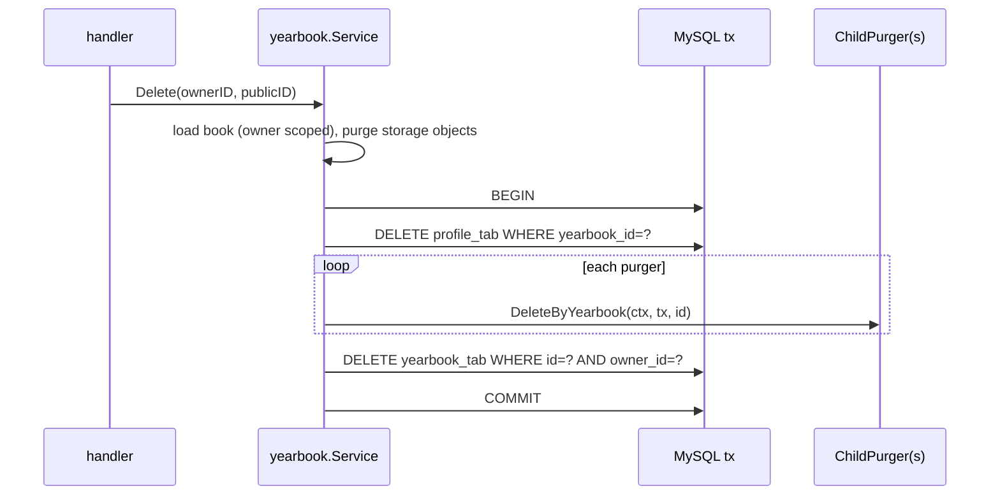

# E10_T-064 — DB conventions: yearbook and profile tables

**Epic:** E10-skills-alignment · **PRD:** [PRD.md](PRD.md) · **Milestone:** M1 · **Risk:** high (migration that changes existing data) · **Priority:** P1 · **Type:** tech-debt
**Read first:** `docs/db-conventions.md` (all of it), `.agents/skills/be-rldb/SKILL.md`, `.agents/skills/be-golang/references/data-store.md`.
**Depends on:** T-063, and T-034, T-048, T-052, T-057 (they hold numbered migrations; from this task on every new migration is timestamp-named).

#### Description
Convert `yearbooks` and `profiles` to the new conventions and move yearbook integrity out of SQL into the yearbook code. The HTTP API is **not** changed here (paths, envelope and JSON shape stay; times are still rendered as RFC 3339 by converting the stored ms).

#### Scope
- In: one timestamp-named migration (`{YYYYMMDDHHMMSS}_yearbook_tab_conventions.sql`, Up and Down), `internal/yearbook` store/service, the media-reference hooks, test helpers (`internal/db/dbtest` table lists), integration tests for the changed SQL.
- Out: the media, notes and auth tables (T-065..T-067), any API change (T-070), a user-deletion feature.

#### Requirements (SHALL)
1. `yearbooks` SHALL become `yearbook_tab` and `profiles` `profile_tab` with data preserved.
2. Timestamps SHALL be BIGINT Unix ms; `profile_tab` SHALL gain `created_at` and `updated_at` (copied from its book).
3. There SHALL be no foreign key on either table; `owner_id`, `yearbook_id`, `cover_media_id`, `photo_media_id` SHALL be indexed.
4. `language`, `page_size` SHALL be `VARCHAR(8)` validated in Go against constants; `is_owner` SHALL be `TINYINT UNSIGNED`.
5. A yearbook read SHALL not join: yearbook row, then profile row (`WHERE yearbook_id IN (...)`), then the media public ids (`WHERE id IN (...)`), a constant number of queries per request regardless of page size.
6. Deleting a yearbook SHALL delete its profiles and call every registered child in one transaction; creating or updating a cover/photo reference SHALL verify that the media belongs to the same yearbook.

#### Acceptance criteria
- [ ] AC1 — Migration Up: rename tables; for each timestamp column add a BIGINT column, backfill with `TIMESTAMPDIFF(MICROSECOND, '1970-01-01 00:00:00', old) DIV 1000`, drop the old, rename; `profile_tab.created_at/updated_at` backfilled from the book; drop `fk_yearbooks_owner`, `fk_yearbooks_cover_media`, `fk_profiles_yearbook`, `fk_profiles_photo_media`; ENUMs -> VARCHAR (values copied); the generated `owner_flag` unique key (one owner profile per book) is kept with the new column types; indexes renamed `idx_...` / `uq_...`; column names checked against `information_schema.KEYWORDS`. Down restores the previous schema and values.
- [ ] AC2 — A migration test (integration tag) migrates a scratch database to the previous version, inserts books and profiles including: a `DATETIME(6)` value with microseconds, a value before 1970-01-02, one on 2038-01-19 and 2106-02-07, a book with cover and photo references, a book without; applies Up and compares every value to the expected ms; applies Down and compares to the original rows.
- [ ] AC3 — The store returns domain structs holding ms (`CreatedAt int64`); the handler still renders RFC 3339 so the JSON, openapi and web are unchanged; all existing yearbook integration tests pass with only table/column-name changes in their SQL.
- [ ] AC4 — Service rules that used to be foreign keys or a join: the 20-book limit keeps its locked check; `yearbook.Service.Delete` runs inside one transaction: `DELETE profile_tab`, then every registered `ChildPurger.DeleteByYearbook(ctx, tx, yearbookID)` (interface declared in `internal/yearbook`, none registered yet; T-065 and T-066 register theirs), then `DELETE yearbook_tab`; storage objects are purged before the transaction as today (502 `storage_error` leaves everything in place).
- [ ] AC5 — Media references: `yearbook.Store` exposes `ClearMediaRefs(ctx, tx, mediaID)` (sets `cover_media_id` and `photo_media_id` to NULL); `media.Service.Delete` calls it through an interface declared in `internal/media` in the same transaction as its own row delete (it used to rely on `ON DELETE SET NULL`). Setting a cover or photo verifies the media row exists **and** has the same `yearbook_id` (`ERROR_INVALID_MEDIA` / current `invalid_media`).
- [ ] AC6 — Query count test: with 50 books the list endpoint issues at most 3 queries (use a counting `driver.Connector` wrapper in the test) and `get` at most 3.
- [ ] AC7 — `docs/db-conventions.md` checklist ticked in the PR description; `README.md` schema notes updated if they mention the old names.

#### Design

The service is where the 20-book limit, default `page_size`, ULID creation and the ownership scoping live after T-070; in this task keep the handler as it is and put only the new delete/reference logic into a `Service` type so T-070 extends it.

#### Lock order (added after QA round 1, 2026-10-10)
`Service.Delete` and `Store.modify` must take locks in the same order or MySQL deadlocks (error 1213, QA measured 75 of 125 requests failing with 5xx under 1 DELETE + 2 PATCH + 2 PUT profile in parallel; develop had 0). Rule from `docs/db-conventions.md`: parent first. `Delete` locks the owner's `yearbook_tab` row `FOR UPDATE` (owner-scoped), then deletes `profile_tab`, runs the child purgers, deletes the book; `modify` already goes yearbook then profile. Document the order in a comment on both methods. The same applies to `media` delete clearing cover/photo references (`ClearMediaRefs`): lock the yearbook row first (QA saw a deadlock when a photo is deleted while being set as cover). QA's test `internal/yearbook/race_integration_test.go` (commit 37c79af) must pass: 0 5xx in 25 rounds.

#### Risk
`high`: it rewrites live data (conversion) and moves integrity from the database to code. The owner approves the merge.

#### Security & performance notes
Owner scoping stays in every query (`owner_id = ?`). Dropping the FKs removes the cascade safety net: the zero-rows test in T-066 covers the whole book, this task's own test must cover profile and the purger hook with a fake child. Conversion on a large table would lock it; there is no production data, so one `ALTER` per table is fine (note it in the PR).

#### Test plan
- Dev: AC2 migration test, AC6 query-count test, `make test-integration`, `make lint`.
- QA should probe: Down then Up again, a book with a NULL graduation year/birthday, concurrent create at the limit, delete with a failing child purger (rollback leaves profile and book), deleting a media row while it is the cover, setting a cover to another book's media, `EXPLAIN` of the list query uses `idx_owner_updated`.
