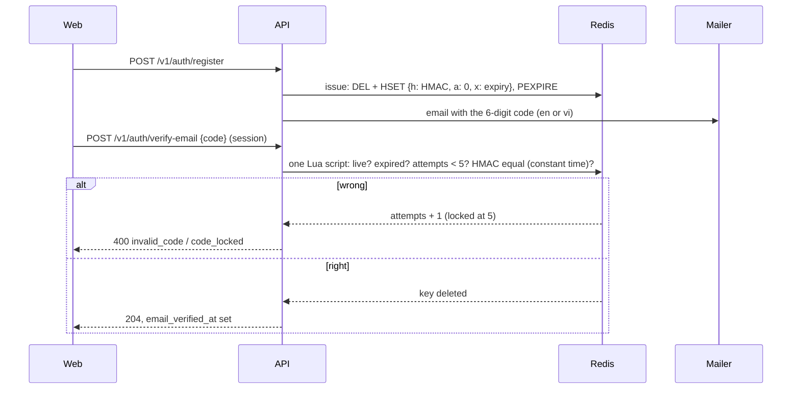

# Email one-time codes (T-048, D-22, D-23)

Email verification and password reset use a 6-digit code the student types; there are no links and no tokens in URLs.

## Flows

Reset: `POST /v1/auth/forgot-password {email}` always answers `202` (5 per hour per IP, 3 per hour per address) and, for an existing
account, sends a reset code in the background. `POST /v1/auth/reset-password {email, code, password}` checks, in this order: the
address format, the 20 attempts per hour per IP, the password rules (`weak_password`, the code is untouched, so the answer cannot
confirm a code), then the code. Unknown address, wrong code and no live code all answer `400 invalid_code`; for an unknown address
the API runs the same Redis script on a key that never exists, so the work is the same. Success: new password stored, all sessions
of the user deleted, the code consumed.

## Storage

Key `smem:<env>:otp:<purpose>:<user id>` (`purpose` is `verify` or `reset`), a hash:

| Field | Meaning |
|---|---|
| `h` | hex `HMAC-SHA256(SMEM_OTP_KEY, purpose \| user id \| code)`; the code itself is never stored |
| `a` | wrong attempts so far |
| `x` | logical expiry, unix ms (verify 30 minutes, reset 15) |

One live code per (user, purpose): issuing overwrites the key and resets the attempts. The Redis expiry is the logical lifetime plus
one hour, only so a late guess hears `code_expired` instead of `invalid_code`; the script rejects an expired code regardless of
the Redis expiry. No cleanup job is needed. A locked code (5 wrong attempts) stays until it expires so that further tries keep
answering `code_locked`; the student asks for a new code (`verify-email/resend`, `forgot-password`).

Verification and the attempt counter are one Lua script, so parallel guesses can never exceed 5 counted attempts. When Redis is
unavailable, verify, resend and reset answer `503 code_store_unavailable` (fail closed); `forgot-password` still answers `202` and
logs the failure.

## Brute-force calculation

A code has 10^6 values. One code allows 5 wrong guesses, and `resend` / `forgot-password` give at most 3 new codes per hour, so an
attacker gets 15 guesses per hour per account: a chance of about 1.5 x 10^-5 per hour to hit the code. On top of that verify attempts
are limited to 20 per hour per user and reset attempts to 20 per hour per IP (in-memory limiter until T-053 moves it to Redis).
Codes are drawn with `crypto/rand` (uniform, leading zeros kept), compared as HMACs in constant time, and never logged.

## Configuration

- `SMEM_OTP_KEY`: at least 32 random bytes; required unless `SMEM_ENV` is `dev` or `test` (a fixed development key is used there).
- `SMEM_DEV_FIXED_OTP`: dev-only fixed code, see [dev-shortcuts.md](dev-shortcuts.md).

## Known limits

- The reset code is consumed before the password is hashed; if hashing then answers `503 busy`, the student asks for a new code.
- Rate limits are per process until T-053.
